實在一直想寫徹愛的上學期小紀錄(還有徹哥的12歲小壽) 怎奈家裡電腦, 網路太慢 沒法順意編輯照片 只好敲著鍵盤 繼續寫我們那個不知不覺也快過二個月的日本行

旅行第四天 星期二 我們離開下榻了三晚的飯店  移動到小人們期待很久的迪士尼 接下來二天 是這趟旅行中最"硬"的鐵腿日 但圓了我們帶小學生來屬於小人的迪士尼夢想! 雖然玩的有限 走的也不夠透 但我相信迪士尼的歡樂有在每個小學生心裏灑下不知名為什麼的小種子... [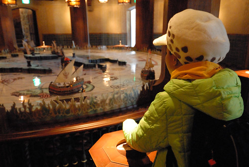](http://flickr.com/photos/33703965@N00/16566594422)

趕著海洋樂園十點的開園  早上八點我們便吃完早餐出發去 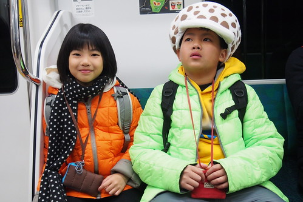 經過前三天的練習 大人小孩都已習慣東京地鐵的擠與急 也越來越有背包客的職業水準 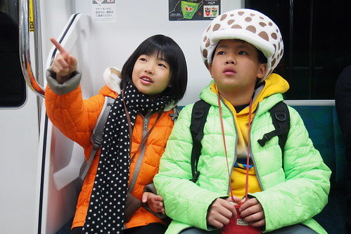 怎奈迎賓中心的寄放行李人潮與程序太出乎想像 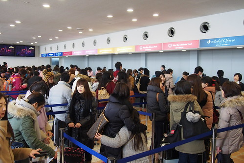 我們只能眼睜睜看著隨開園時間到來一窩窩湧進的人潮而乾瞪眼 [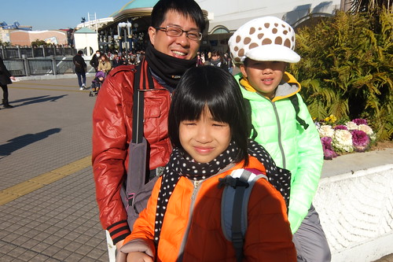](http://flickr.com/photos/33703965@N00/16566464962) 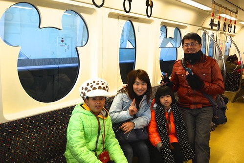 開園半小時 我們總算也抵達海洋樂園門口 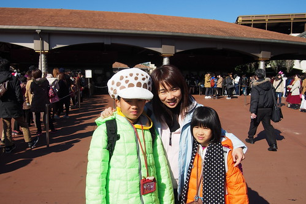 行前一直有密切注意樂園網站上的入園人數預測表 明明寫著今日海洋1萬人 為舒適的遊樂環境 可今日態勢卻好像不是這麼回事...  (雖然心中很急 還是要先在地球儀前來個誓師大合照 )  我們快馬加鞭的往據說最熱門  徹哥最感興趣的玩具總動員前進 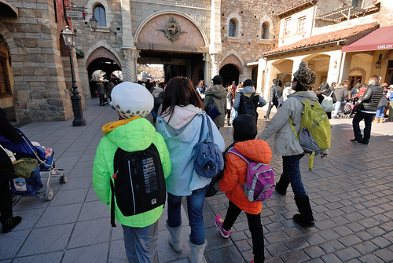  [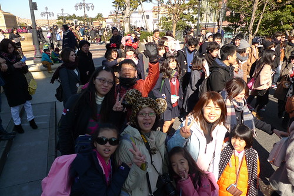](http://flickr.com/photos/33703965@N00/16566538622) 可是遠遠的這排隊人潮怎麼一回事? 也太嚇人了! [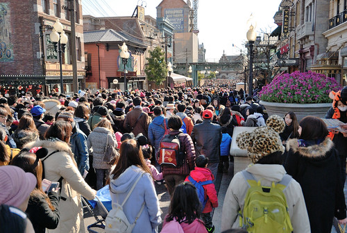](http://flickr.com/photos/33703965@N00/16567642115) 原來 人潮是要排隊抽玩具總動員的FP! 有沒有這麼厲害的遊樂設施阿?! 而人潮也在開園不到1小時便散去 因為FP發光啦~~~ 我們只能小小期待晚上閉園前 是否有機會可以不用花太多時間現場排到了 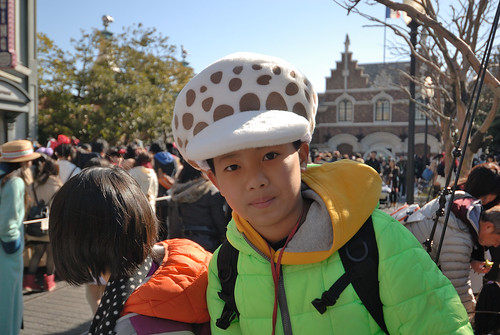 幸好我們驚嚇的同時阿姨有去順利抽到驚魂古塔的FP 雖然也抽到晚上6點後了 然後我們決定既然今日很難玩到熱門遊樂設施了  那起碼好好看一場秀 於是我們花了一個多小時排隊等候看第一場的百老匯歌舞劇表演 [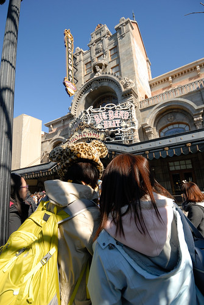](http://flickr.com/photos/33703965@N00/16379964898) 女生排隊的同時 徹爸領著好奇的徹哥逛逛去 [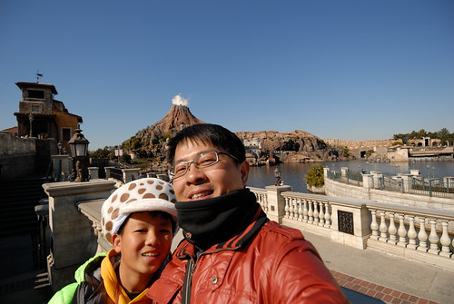](http://flickr.com/photos/33703965@N00/16380004258) 這早的天氣真的很好 天空藍的好漂亮 真是很適合拍照的好日子 [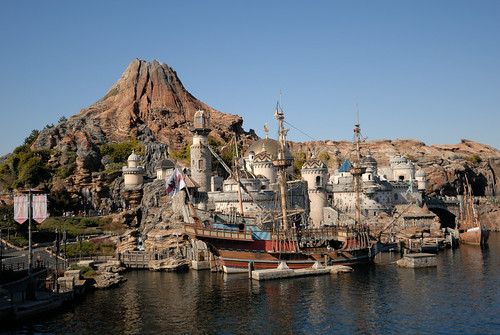](http://flickr.com/photos/33703965@N00/16381753257) 也更襯的海洋樂園的異國風情與氛圍  [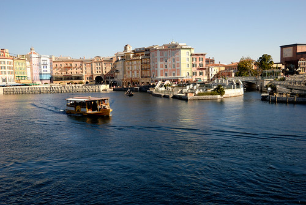](http://flickr.com/photos/33703965@N00/16566645792) 一小時的時間裡 徹爸父子走遍大半園區 [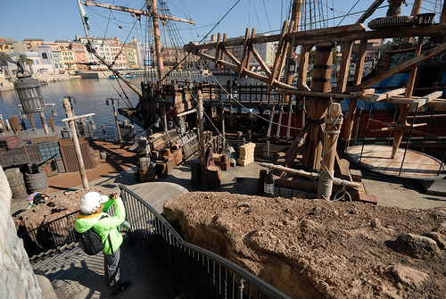](http://flickr.com/photos/33703965@N00/16381798987) 單純的看風景 看新鮮 看好奇 [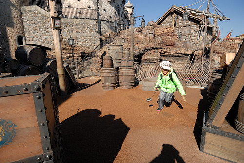](http://flickr.com/photos/33703965@N00/16380112498) [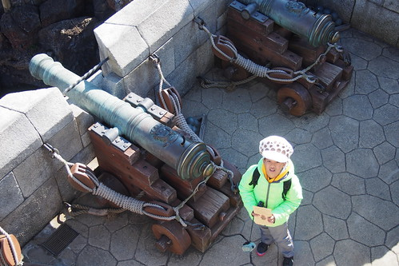](http://flickr.com/photos/33703965@N00/15945225784)  [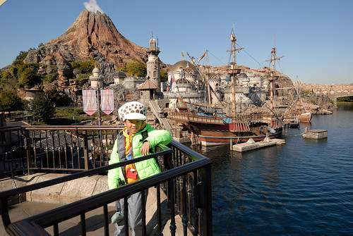 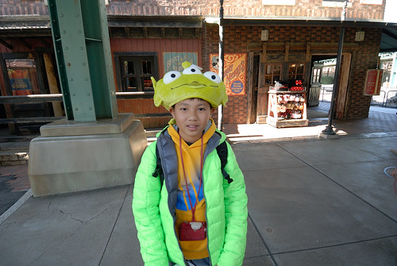](http://flickr.com/photos/33703965@N00/16380204770)或許因為看見這樣美麗的風景 徹哥喜歡海洋多過樂園一些 [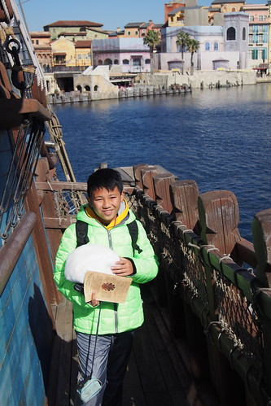](http://flickr.com/photos/33703965@N00/16566710532) 而對於恐懼再來迪士尼的徹爸 這樣美麗的巡禮或許也是讓他突破心房 接下來二天超有行動力的原因吧 [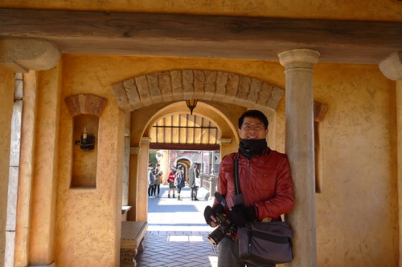](http://flickr.com/photos/33703965@N00/16381437869) 動感大樂團表演果然應驗阿姨說的 來迪士尼只要看一場經典秀就值得了 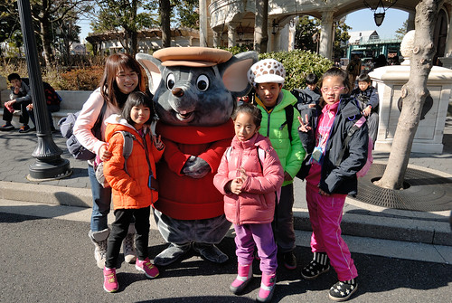 而如果再逮到迪士尼明星人物合照一張 那就不虛此行了 [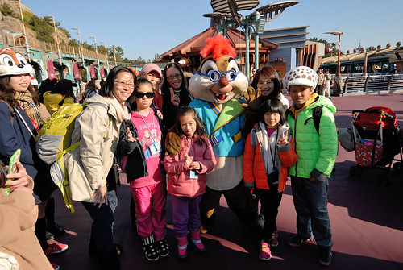](http://flickr.com/photos/33703965@N00/16566200851) 今天人潮很多 每樣大型遊樂設施都要排隊等候100分鐘以上 半放棄的我們 打算從好好吃頓中餐後再開始隨遇而安  發現十年內第三次來迪士尼的我們 出手越來越闊綽了 而隨著願意花敢花的改變 也越發覺得迪士尼裡頭的東西實值相符 還不錯 [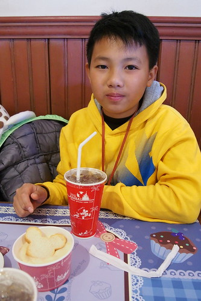](http://flickr.com/photos/33703965@N00/15947641593) 飯後我們散步似的邊走邊看 看到有等候時間只要20分鐘想也不想的就進去了 [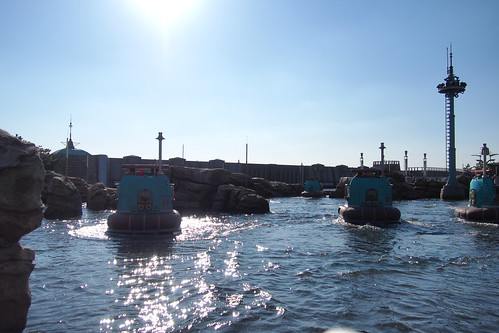](http://flickr.com/photos/33703965@N00/15945276024) 雖然這樣的遊樂實在小但還是有美 [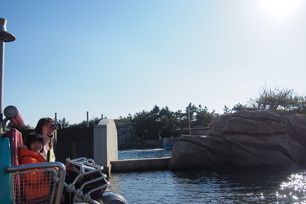](http://flickr.com/photos/33703965@N00/16566186161) [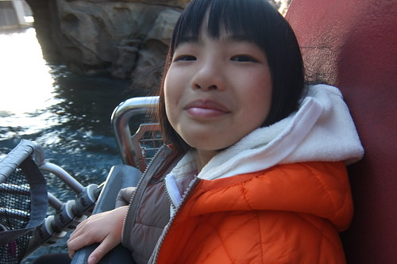](http://flickr.com/photos/33703965@N00/16541842916) 不用等很久的搭船遊河 [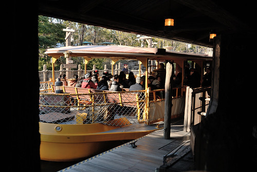](http://flickr.com/photos/33703965@N00/16380415420) 當然我們也去了 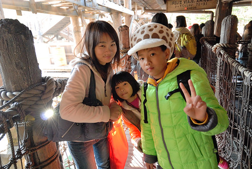坐在船裡看風景 其實真的挺愜意 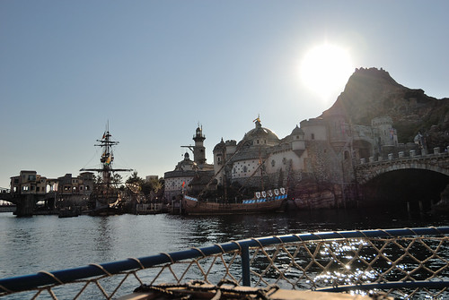 搭著船來到園區的另一邊 徹父子津津樂道說著他們早上有來過 [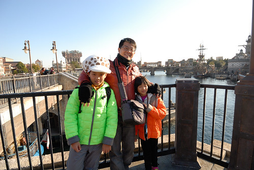](http://flickr.com/photos/33703965@N00/15945331504) 說這裡照相的風景很美 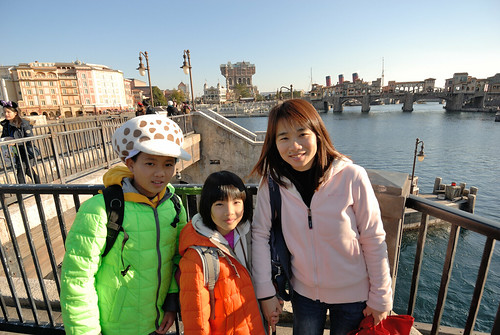鬱金香也開的又大又美麗~ 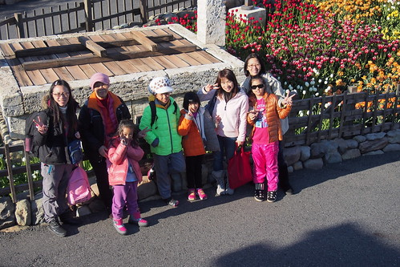 繼續走阿走看到小人感興趣的小雲霄飛車 嗯~ 排隊40分鐘  應該還可以... 於是我們掉進明明一小時還多的排隊黑洞裡 明明這個雲霄飛車坐1分鐘就沒了 雖然對小人來說是很剛好的刺激 [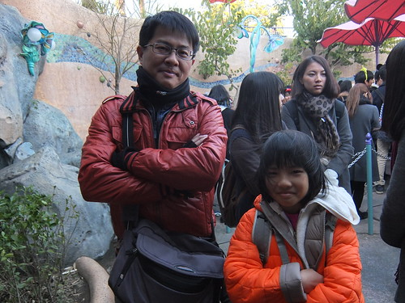](http://flickr.com/photos/33703965@N00/16380251458) 期間徹爸排隊排到臉很臭 只好派出他的天命真女來調合情緒 也只有寶貝愛女可以這樣模仿他爸的鐵青臉 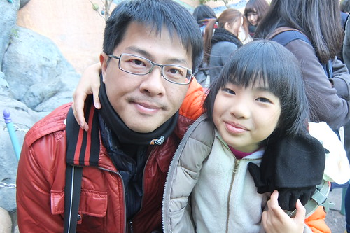 (其實徹爸骨子很可愛也很孝子的 只是真的很不愛排隊阿)  花很多時間坐了小雲霄飛車後 我們更是鐵心隨性走走看看就好 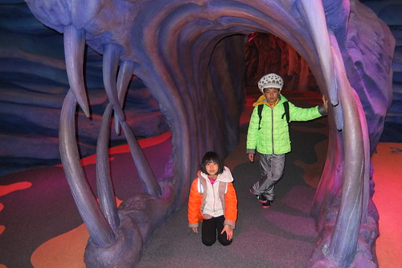  [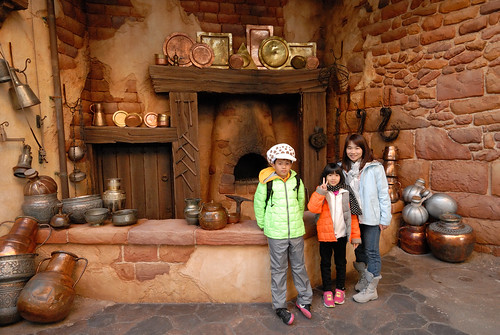](http://flickr.com/photos/33703965@N00/16382017587) [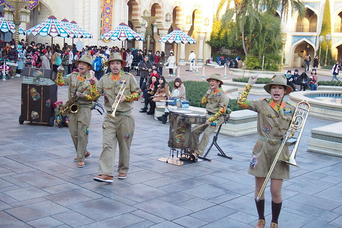](http://flickr.com/photos/33703965@N00/16380266538)除非再有只要10分鐘排隊的設施 例如這阿拉伯飛天魔毯 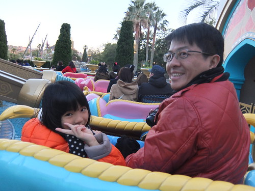   話說我們一家子光飛高高轉圈圈就好開心 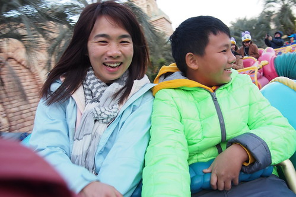 我們開心的轉大半時間後 才發現別人的魔毯怎麼上上下下 起起伏伏的 而我們卻只是維持同樣高度轉著 懷疑難道我們搭到故障的機器 搞半天才發現是我們傻傻不知可以操縱搖桿 白白浪費可以更多的刺激 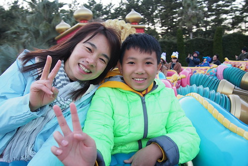 

觀察與思考一整天後 愛也總算決定要買野餐盒造型的爆米花筒(要用紀念品coda買所以很慎重) 迪士尼的爆米花真的好吃的沒話說! [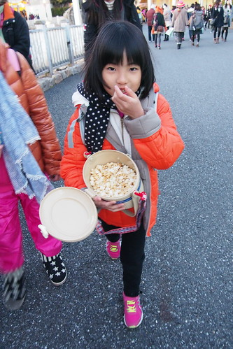](http://flickr.com/photos/33703965@N00/16380305538) 不知不覺天漸漸的黑  臨海的風景一片祥和寧靜 [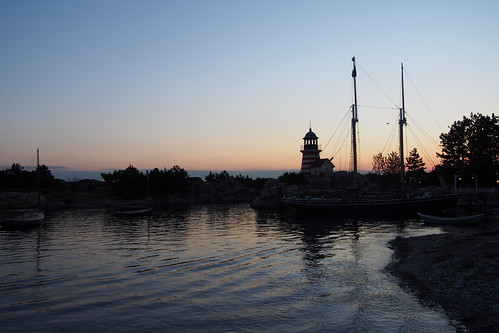](http://flickr.com/photos/33703965@N00/16566853242) 但園區各處還是熱鬧萬分 [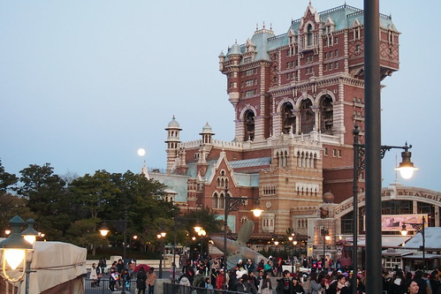](http://flickr.com/photos/33703965@N00/16380312498)  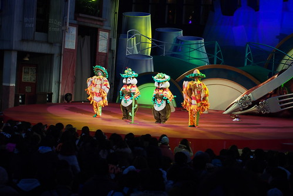 除了徹哥堅持不玩肯定很恐怖的驚魂古塔 以及陪著徹哥的我以及黃媽媽外 其餘人不明就理 跟著素以大膽著稱的阿姨勇闖古塔 [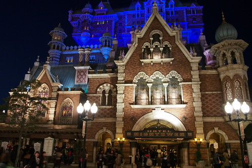](http://flickr.com/photos/33703965@N00/16381698469) 據說真的!真的!很驚魂!!! 以前以阿姨為目標 以為自己很大膽 以當帥氣女生為目標的愛愛 被這麼驚魂後不再想當大膽帥氣女生 而日後每當再提起迪士尼 開頭總先來一句"那個古塔真的好恐怖喔!" 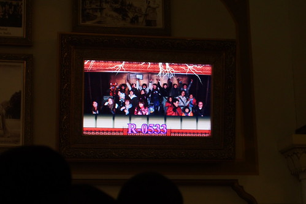 接近七點的閉園時間 我們來到一早不得其門而入的玩具總動員 想要碰碰運氣 看是否可以如人家說的晚上過後都不用什麼排隊 沒想到還是萬頭竄動阿! 排隊時間依然需要120分鐘!!! 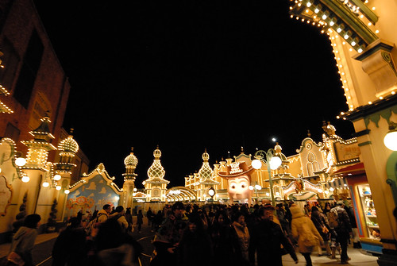 無緣啦~ 只能到此一遊照以滋紀念了 [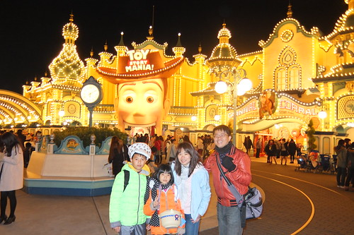](http://flickr.com/photos/33703965@N00/16381728109)不過最後在港口進行的幸福滿夜空節目精采 絢爛 令人驚奇  非常有海洋冒險精神的一場show!  雖然一日下來 能說成戰利的遊樂設施玩沒幾樣 但開始與最後的美好節目 以及好天氣下的隨遇而安還是讓我們玩的開心難忘  而揹著爆米花筒的小學生更是著實留下來過迪士尼的美好記憶! 

今天海洋樂園的閉門時間閉的早 我們樂得輕鬆早點去吃晚餐 回飯店休息 不過一行老幼婦孺也沒力氣再離開舞濱去覓食 索幸在迎賓中心找家店解決  (徹哥說到做到的戴了一整天蘑菇帽)  話說日本的兒童餐真的很大方 今晚的豬排店還把一籃玩具索性放著讓小人盡情挑  餐點也一樣的誠意十足 讓愛愛每餐都吃光光 吃的臉圓呼呼  而向來排斥日式豬排飯的徹爸也難得的點對炸過再焗煮的美味豬排 硬是吃了二大碗飯  大家玩的盡力 吃的賣力 再回飯店睡飽飽 再戰明日更艱辛的樂園~ (握拳) 
