前一天在海洋樂園的無為後 當天晚餐時 一行人便熱烈的討論及擬定隔日樂園的作戰計畫 雖然隔天一早 同行小朋友的突然發燒以及最不會出錯的導遊阿姨竟然坐錯站 讓我們捏了冷汗 所幸老天爺真的有眷顧 讓我們一早就如願玩了"怪獸電力公司"還拿到"巴斯光年"的FP 而且好位置看到"一個人的夢想II之魔法長青"以及遊行觀賞 第三次來迪士尼樂園的我們 總算真的值回票價 走斷雙腿也無悔~  

雖說對於樂園的人潮早有心理準備 但開園前半小時來到門口 看到等著入園人潮的盛況 我們還是嚇很大 [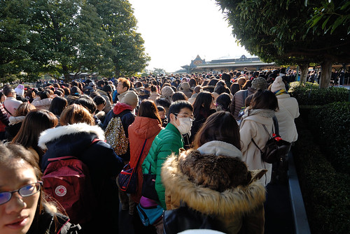](http://flickr.com/photos/33703965@N00/16569247695)九點一到 大門開啟的那一刻 大家如難民逃難般的東竄西逃 這樣的形容真是一點也不誇張! 我們兵分二路 由阿姨帶著三個小女生去抽巴斯光年的FP (因為小孩子抽完FB再插隊回我們現場排隊隊伍比較不會被青) 其餘我們則直衝怪獸電力公司現場排隊 原打的如意算盤是利用40分鐘左右時間讓二路人馬同時抽到FB與現場排隊 沒想到現場排隊的我們竟然只需20分鐘的排隊 時間短的反倒讓我們有些措手不及 急Call導遊阿姨該如何是好 阿姨好樣的臨危不亂 拿著園區地圖指導三個小女生如何走到我們排隊處 留她繼續等著排隊一個人抽九張FB 雖然二處地點相距不會太遠  但今天的遊客密度實在很讓等候的我們捏冷汗 我們邊跟著排隊隊伍前進 邊墊高腳尖望著 期待著應該要竄出來的三個小女生 時間一分一秒的過去 十分鐘彷彿三十分鐘那樣久 總算在我們離門口10公尺處三個小女生出現了 幾個大人鬆了好大一口氣 大讚"妳們好棒阿!" 幾分鐘後 最後一段入場路徑上 阿姨也總算喘吁吁的出現 看來她是用著跑百米的拼勁趕來的  於是我們超級幸運的在開園半小時玩到熱門的"怪獸電力公司" 而一開始的作戰計畫成功也讓我們接下來充滿好心情與戰鬥力  玩完第一樣怪獸電力公司到巴斯光年FP抽到的時間間 我們剛好花點時間排隊等著看"一個人的夢想II之魔法長青"  其實位置很多 會來看第一場表演的觀眾也不是那麼多 (第一場以外要用抽的) 之所以要排隊 為的就是求個好位置  一個讓人覺得台上的米尼視線就落在自己身上的好位置  相較於海洋  樂園的表演多了許多公主 sweet的很 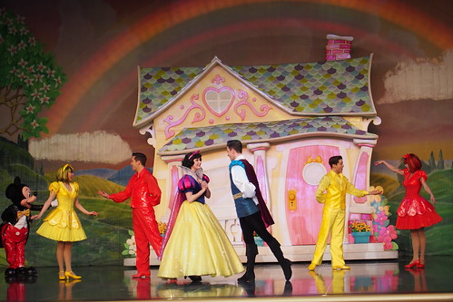 所有迪士尼人物的大陣仗也讓人看的目不暇給  每次看完表演 愛愛總是張大嘴 口水快流下來似的佩服著"表演真是太好看了" 相較於幾分鐘就玩完的遊樂設施 其實迪士尼的表演更值得花時間等待與期待  看完表演 我們接著趕在巴斯光年FP時間內來報到 一陣亂槍掃射還意猶未竟 遊戲便已結束 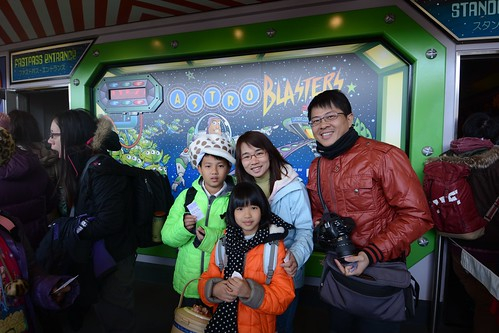 一早便成功收入二枚熱門遊戲  徹哥滿意至極  我與徹爸的"孝道"也可交差了 不過興頭上的一家子熱血沸騰的繼續戰鬥著 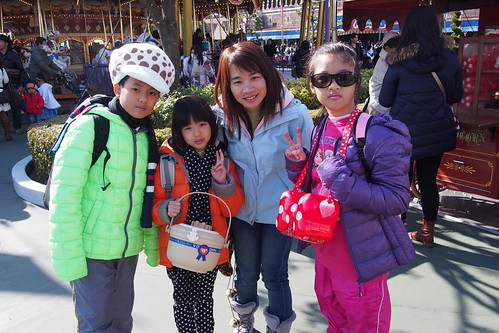 我們走遍大半園區尋找地圖上搬家了的巧克力與咖哩口味爆米花 而今日樂園人潮多到每個爆米花攤都需排隊等候數十分鐘 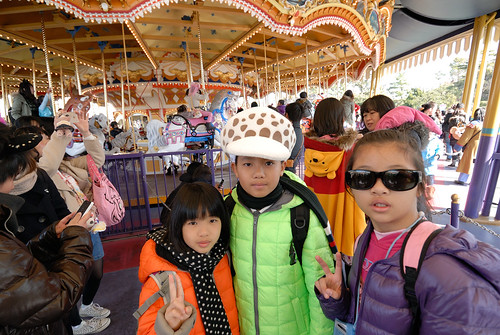 我排隊等候爆米花的時間都足夠讓小人坐了一趟旋轉木馬 雖然大小孩的徹愛對於旋轉木馬已難滿足 但加減浪漫一下嚕 我們又接著去玩不小心就輕易抽到FP的"星際旅行:冒險續航" 震撼力十足且驚險萬分的3D影像 讓徹爸父子大喊過癮 只是苦了體質很容易暈車的愛愛 果然在4分多鐘的影片內暈眩難過到流淚... 玩完這樣徹哥真是完全心滿意足 大喊"我想玩的都玩到了! 真是太過癮!" 而我們也才拖著興奮但其實已疲憊的雙腳去與等候遊行的其他人會合 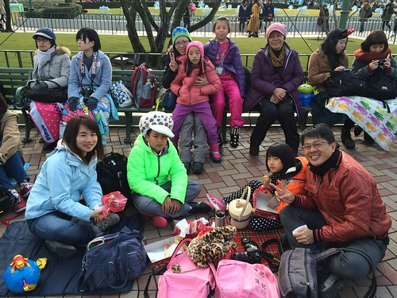 阿姨們卡了個絕佳觀賞遊行地點 我們如野餐般邊休息邊吃著我們的中餐 烤雞腿一隻與今天肯定要嗑到開心的爆米花 二點時分才吃到這樣不像午餐的午餐 忍不住自嘲來迪士尼玩就是要這麼拼是唄 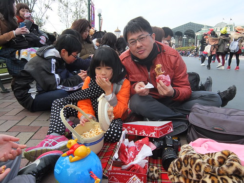下午的遊行 真是我覺得迪士尼最歡樂 最讓人不可錯過的經典 [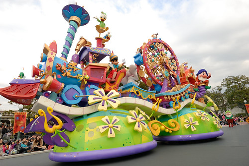](http://flickr.com/photos/33703965@N00/16543141216)[ 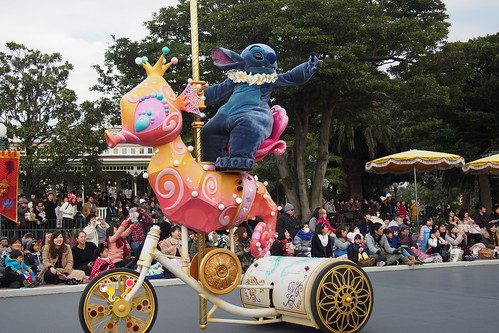](http://flickr.com/photos/33703965@N00/16381680050)  [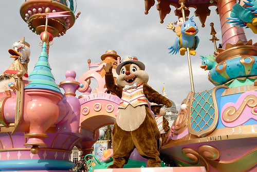](http://flickr.com/photos/33703965@N00/16381444848) [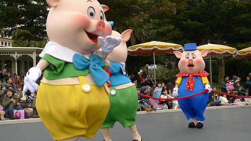](http://flickr.com/photos/33703965@N00/16381298230) 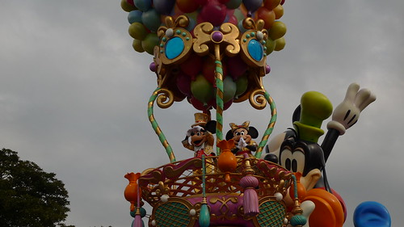 不止在於迪士尼明星一幕幕的熱鬧登場 每個角色 每個團隊都是戲精上身似的完全融入與投入 所以遊行不止是遊行 更像是一幕幕精采絕倫的表演秀 [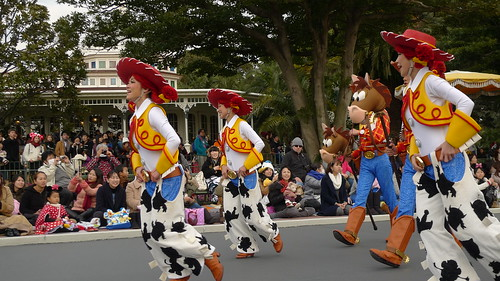](http://flickr.com/photos/33703965@N00/16542786316)[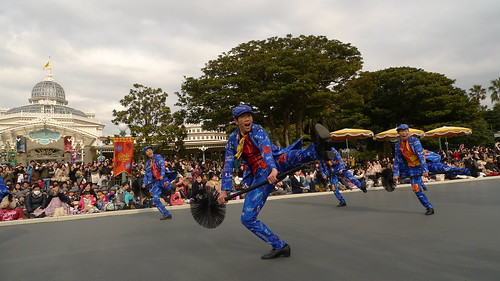](http://flickr.com/photos/33703965@N00/15948836443) 而最最最享受的更在於表演者與觀眾間的互動  個性害羞如我們  也是忍不住伸出手 揮個不停 這樣的歡樂情境讓人忘我的好滿足~ 看完遊行後 趕緊捉住天黑前到處拍照 (天氣已經大不如早上了)  雖然這張照片沒頭(城堡)沒尾(我們的腳) 被我與阿姨嫌唸照不好 但喜歡徹爸抓住的這感覺 笑容裡 有我們還在大學的彷彿 真高興! 認識20 我總算有機會跟著玟姿一起趴趴走! [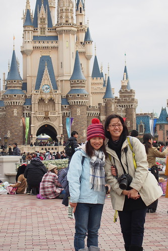](http://flickr.com/photos/33703965@N00/16569083525) 跟導遊阿姨一起旅行還有個最大好處是 我們多了個專業攝影師幫我們拍全家福 所以即使老婆懶得拿相機 小孩也玩到忘了拍照這回事 徹爸這次旅行還是留下許多身影 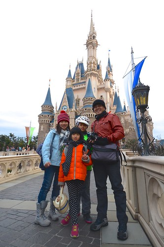 而二人之間的較勁與切磋 更讓大家樂得留下許多美好照片  同時 雖說城堡實在是老梗 我們還是忍不住到此一遊照拍個不停阿~ [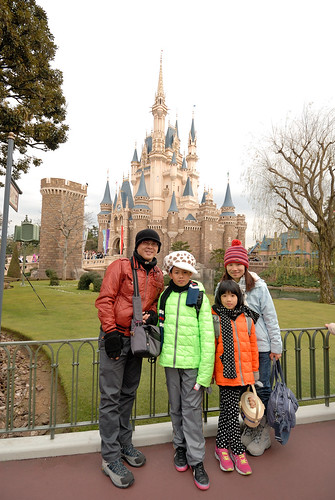](http://flickr.com/photos/33703965@N00/16543009246)

接著我們與阿姨分開行動 我們家邊逛邊看來到卡通城  幸運遇到放風的明星們 經過二天迪士尼的洗禮  個性拘謹的愛愛總算也能不忸妞地與明星拍照  卡通城是很好拍照的地方  許多有趣又鮮豔的場景 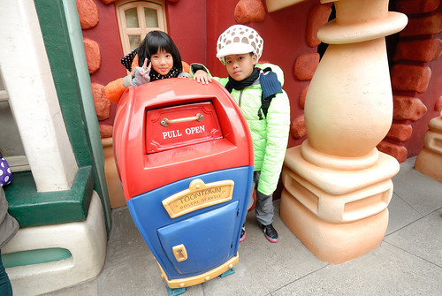 徹哥愛妹 主動要求拍了好多 [ 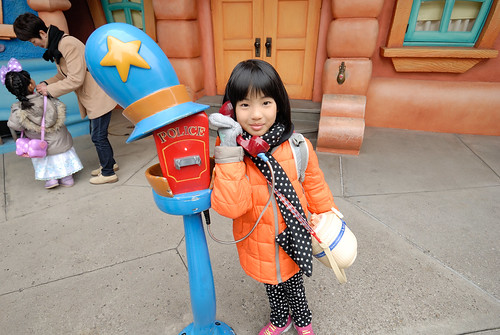](http://flickr.com/photos/33703965@N00/16569015755)走過大半園區 我們繼續來到西部園區  這裡有著湯姆歷險記裡的西部鄉村風情 [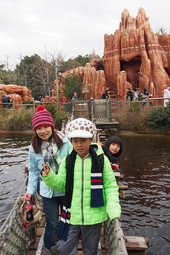](http://flickr.com/photos/33703965@N00/15948771733) 豪華馬克吐溫號的身歷其境  以及從小就羨慕擁有的哈克樹屋  而近傍晚的光暈下 園區更顯以前年代的祥和美麗  最近很迷航海王的徹哥 當然很喜歡這裡的風景  又主動要求照了好多既帥又酷的照片!  散步的心情走逛迪士尼園區很美好 只是遍尋不著咖哩口味爆米花也讓人更是飢腸轆轆 只靠著中午的一隻雞腿與怎樣也吃不飽的爆米花  讓奮戰大白日的我們肚子真的餓了 索性趁著晚餐時間(人潮)前 先找家餐廳吃頓午晚餐也讓滿漲(脹)的情緒與雙腿好好歇一會 UCC餐點讓一家子都滿足  只是這麼一歇後我與徹爸的戰鬥力也頓時全消了  飯畢天已黑  明日世界更是滿滿等待餐廳與購物的人潮  同時間 熱門設施還是一樣維持著100分鐘的排隊人潮 [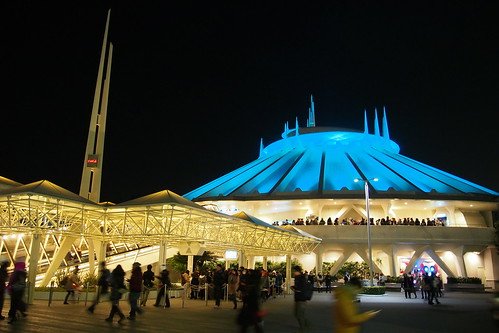](http://flickr.com/photos/33703965@N00/16542890526) 已經沒戰鬥力的我們 全心的尋找自己喜歡的小紀念品 以及買明信片(找好久) 並窩在小郵筒前克難的寫  寄出可以被蓋上迪士尼紀念章的明信片  徹爸笑我們真是越來越像導遊阿姨 很愛寄 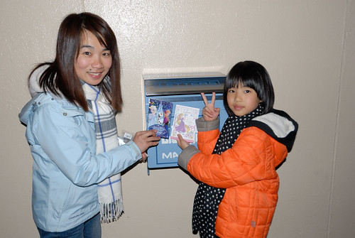 等我們都買好也寄好明信片時  偶然才看見夜間遊行的隊伍 我也才想起 對喔! 都忘了還有夜間遊行可以看 搞錯"童話之夜"觀賞席位入場時間的我  讓一家子急沖沖 很早的就到座位席乾等待 [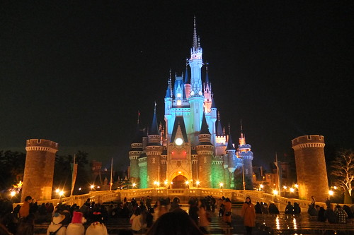](http://flickr.com/photos/33703965@N00/16567757462) 除了冷了點外  愜意的享受眼前炫目但平和的氛圍 實在也不賴 [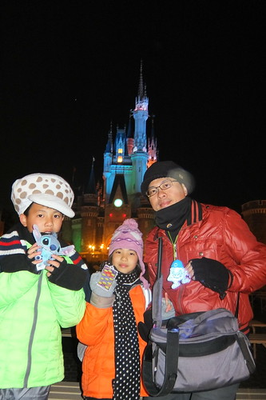](http://flickr.com/photos/33703965@N00/16542873406) 同時 手裏把玩著各自紀念品 心裡更是滿意今日的迪士尼 [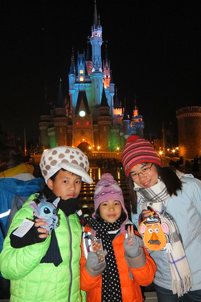](http://flickr.com/photos/33703965@N00/16542871256) "童話之夜"一樣精彩的讓人嘖嘖稱奇 目不轉睛  尤其一幕幕動畫影像往事如歷的出現 我們重擁好久不見的童心  而最後Ending的煙火真的太璀璨 [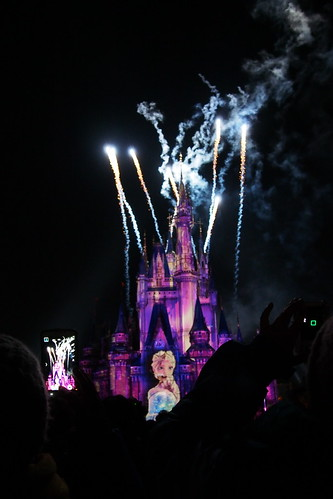](http://flickr.com/photos/33703965@N00/16381173628) 一整個讓人絕對難忘的迪士尼童話之夜! 太幸福的回憶~  今天的最後 當然得要看完煙火才能離去 雖然短短十分鐘 但襯著明月的迪士尼煙火小巧可愛卻也果然好精采  今天奮戰了12個小時  我與徹爸不可思議我們可以拼這麼久 我想是一家子總算貨真價實 共同經歷這些美好 太煽動人心  而陪著 看著小人享受著屬於他們的歡樂 也讓二老無願無悔 [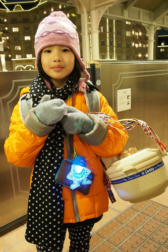](http://flickr.com/photos/33703965@N00/16567699682) 離開華麗的迪士尼 就如灰姑娘12點一到變回原形一樣 [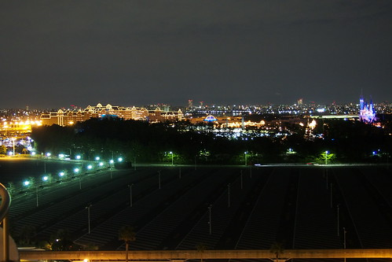](http://flickr.com/photos/33703965@N00/16382881147) 我們做了二天的迪士尼美夢 這不是小人成長絕對需要的養分 只是我們行有餘力想給的好 也是自己滿足小時候夢想的轉移 只要徹愛長大後記得 曾經我們一家人在迪士尼玩的這樣開心~

後記: 回來後在FB有下面這些對話 玟姿: 經過旅行中和徹哥的深談，我才知道這是他第3次去迪士尼了， 所以我真的不知道，為什麼你們還要去迪士尼？ 本來以為我九年內去3次已經很瘋狂了，想不到你們更瘋狂， 不過徹哥在小學六年級的這個年紀，就能去迪士尼3次，真的也是很幸福的！ 我說:前二次分別是徹哥二歲跟五歲(愛二歲)的時候, 講真的回憶是留在相本還有爸媽心中! 七年後,徹愛都是小學生, 更別說徹哥都即將念國中了, 媽媽認為這回才是他們第一次在迪士尼"玩", 真正擁有屬於他們的迪士尼回憶! 話說, 阿姨或就可理解為什麼徹爸一開始這麼抗拒第一版行程了! 因為又有東京又有迪士尼!
