一直想寫愛妹上學期 徹哥過去一年的學校學習紀錄 只是每次坐到書桌前 打開檔案想寫些什麼的時候總是大半晚過去一字也沒寫 因為一寫就要赤裸裸面對,陳述很多事 而且肯定又會字很多上身 光想就累了 而基於愧疚感 連遊記就也沒動了... 這樣膠著著實在也揪心 就還是先繼續寫開心的遊記吧! (就等徹哥畢業 一口氣寫一年半的紀錄) 尤其旅行來到最讓人難忘的大雪紛飛富士五湖區阿! [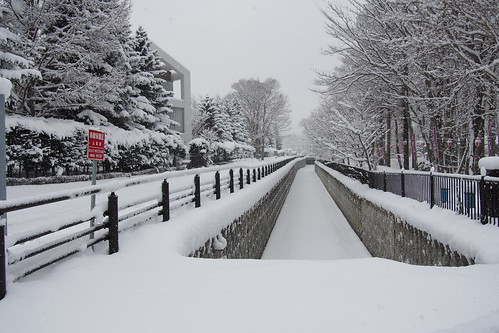](http://flickr.com/photos/33703965@N00/16689189045) 

旅行走到第六天 尤其經過很操的迪士尼二日後 愛愛更是極度發揮她上車睡覺的本事 從舞濱到新宿的電車上 坐著坐著就打盹充電了 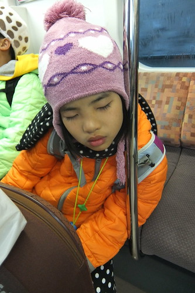 行前我們預約了往富士五湖的新宿高速巴士 我們只要在預約的巴士時刻前拿著自己列印出的乘車劵即可搭乘 可以省卻等候與當地購票語言上的隔閡 不過那早在東京站與新宿站的轉乘對拖著行李的老小卻有些折騰 [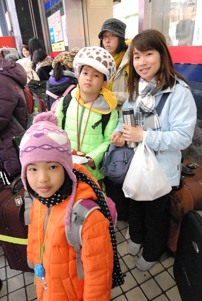](http://flickr.com/photos/33703965@N00/16501632298) 我們說我們真的很幸運 在東京沒冷到 還天天大晴的讓我們玩得盡興 而就在我們要離開東京 要往最好下雪的地方去時  東京開始下雨 [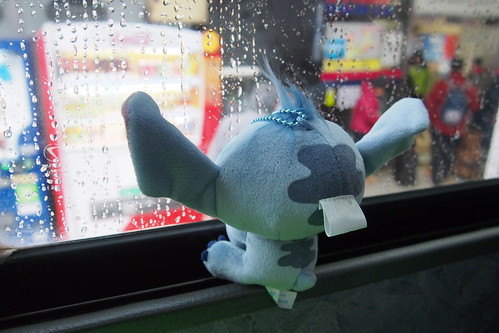](http://flickr.com/photos/33703965@N00/16481943027) 飄起似有若無的雪絲 [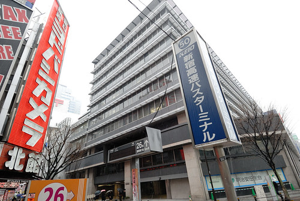](http://flickr.com/photos/33703965@N00/16069265513) 二小時的車行時間剛好讓一行人休息 儲備再玩三天的電力 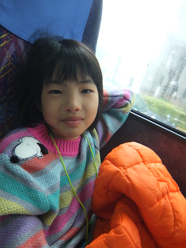 尤其是真的很能在車上睡的愛愛 足足從上車睡到下車的前二刻 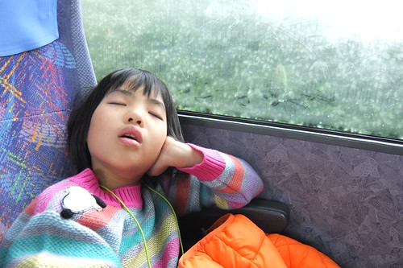 一覺醒來後 看見車子往山裡的方向駛去 無誤 而窗外雪白一片 則是太振奮我們的心了 真的! 有沒有這麼LUCKY阿~~~ 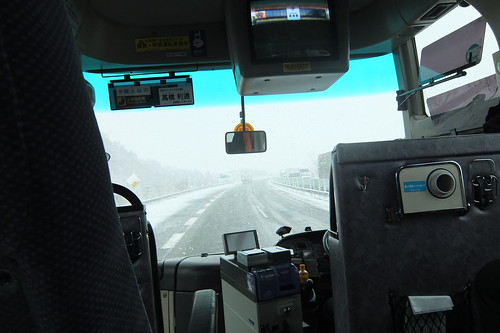 只是進入五湖區後 就開始感受到下雪所帶來的交通不便 車速減慢 還偶要跟著推雪車後緩慢的開 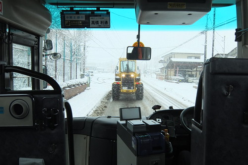 而到站下車後 雪地中拖著行李找民宿更是大挑戰 [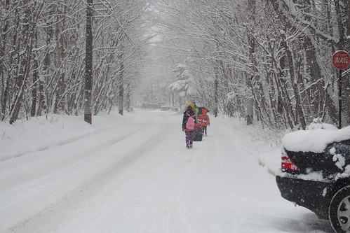](http://flickr.com/photos/33703965@N00/16069257243) 雖然走在雪地裡 真的好美 好浪漫 [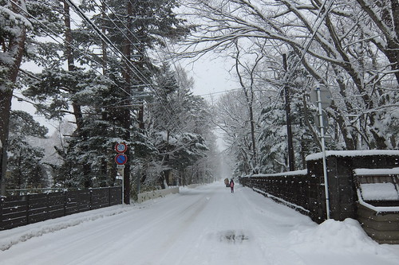](http://flickr.com/photos/33703965@N00/16066885024) 但同時也辛苦的讓人肯定一輩子難忘 [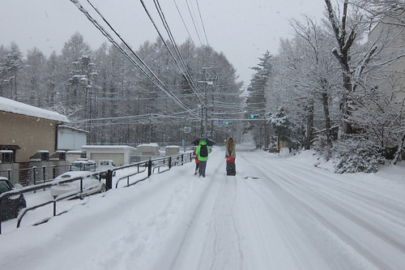](http://flickr.com/photos/33703965@N00/16069257923) 晴天時只要十分鐘的路程 我們走了三十分 甚至好像更久 [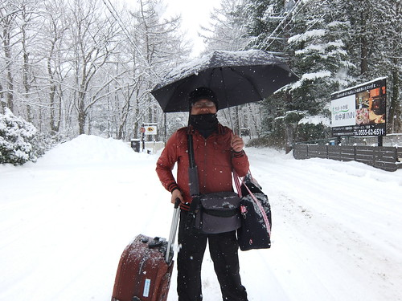](http://flickr.com/photos/33703965@N00/16066884394) 除了因為雪地中的行李真的太難拖 彷若加掛了二三倍重的鉛塊 更因為小人的貪玩雪 還有我與徹爸的貪圖美景 [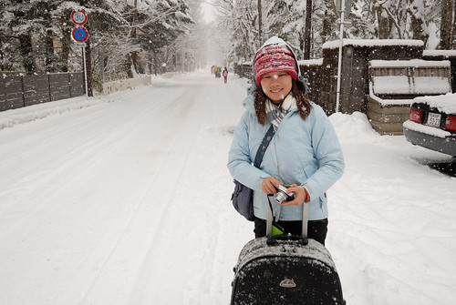](http://flickr.com/photos/33703965@N00/16689215005) 意外中的下雪天  讓一直不想來東京只想去北海道看雪的徹爸驚喜到不行 不可思議的臉直問著"你怎麼沒說會下雪" 我說 我知道這裡有機會下雪 附近山區也有滑雪場 但我沒有看到任何網友寫的遊記是像這樣的一片白 真的就像隔天我們遇到的日本人跟我們說 我們真是幸運遇到這場雪 我們真的幸運又幸福! [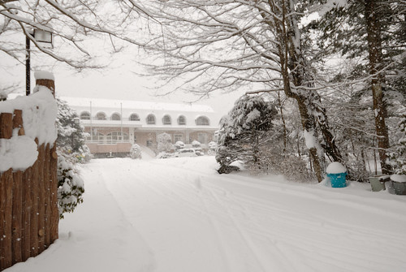](http://flickr.com/photos/33703965@N00/16689216065) 總算我們找到 走到了今天的民宿  下大雪 哪都不能去玩的我們只能厚著臉皮 早早就入住民宿(感冒了的阿姨看起來真的有破病) [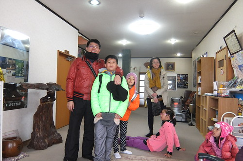](http://flickr.com/photos/33703965@N00/16481934437) 難為了民宿老奶奶急忙著招呼我們 準備讓我們入房休息 [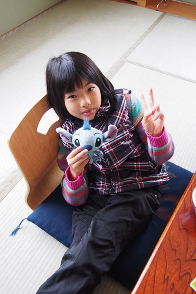](http://flickr.com/photos/33703965@N00/16688175922) 二面開窗的房間視野真的很好 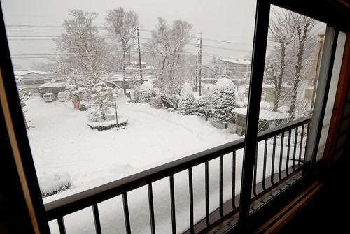  [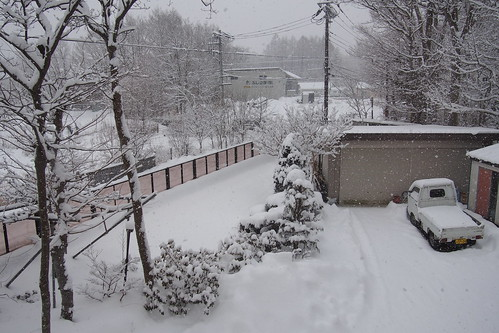](http://flickr.com/photos/33703965@N00/16501811700) 尤其是讓我們陶醉不已的雪白世界 [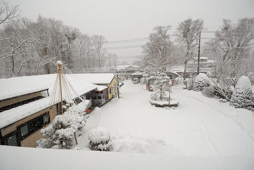](http://flickr.com/photos/33703965@N00/16687875071) 難得見雪的我們 完全沉浸在下雪天的詩情畫意中 [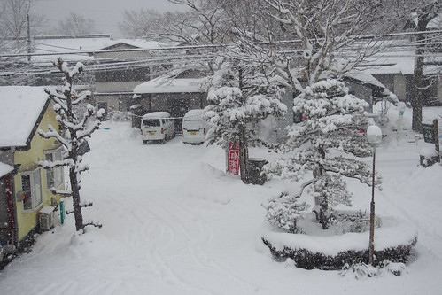](http://flickr.com/photos/33703965@N00/16069250863) 直到下午一二點肚子餓了 才意識到下雪天可能的覓食不易 而除了顧肚子外 也得替意外的玩雪天準備防水功能 可大玩特玩的手套 (本以為去滑雪場才有機會玩雪 再租整套就好) 拍下民宿繪製的鄰近地圖 我們出門奮鬥去 [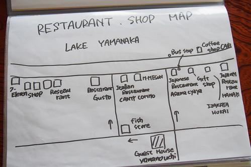](http://flickr.com/photos/33703965@N00/16687871171) 走出民宿 剛好遇見年輕主人在掃除門前積雪 這樣難得的機會 好奇爸爸忍不住央求主人讓他試試(自由行讓徹爸的臉皮增厚不少) 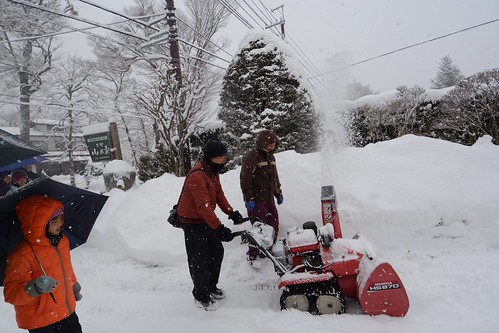 然後我們依然沉醉不已的走進如夢如畫的雪地中 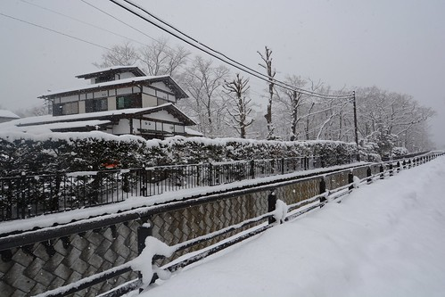 開心覓食去 [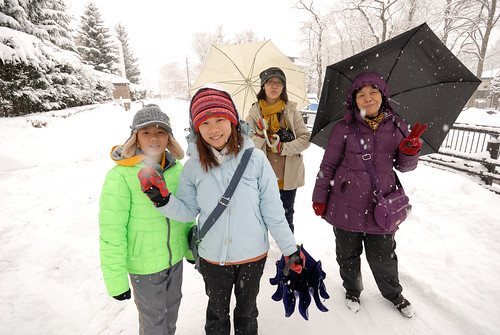](http://flickr.com/photos/33703965@N00/16689204115) 幸好 離民宿不遠的路口處有家茶屋有營業 [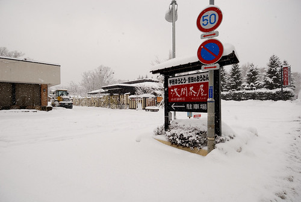](http://flickr.com/photos/33703965@N00/16069231063) 大雪天裡完全沒人的路上與店裡 就讓我們給包了 [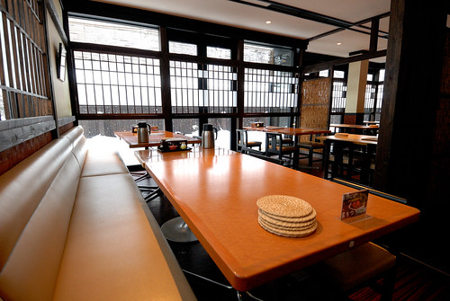](http://flickr.com/photos/33703965@N00/16687971841) 坐在暖呼呼的店內 看著窗外十足美麗又愜意 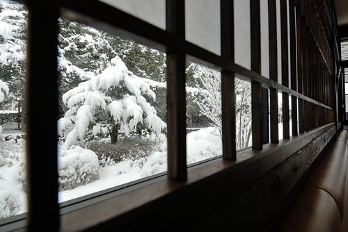 風景美 大家的心情也美  邊玩邊說等候暖呼呼餐點的上桌 [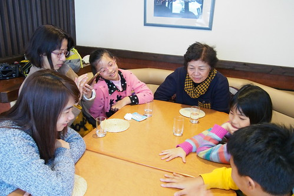](http://flickr.com/photos/33703965@N00/16501798870) 富士五湖區最有名的就是這樣一鍋有許多蔬菜燉煮 寬扁麵條 味增調味的鄉土料理[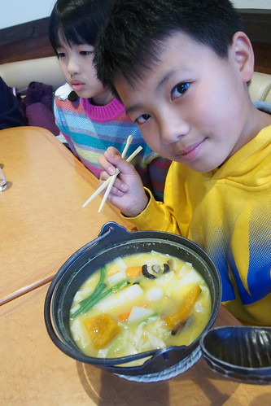](http://flickr.com/photos/33703965@N00/16689195495) 濃郁的蔬菜湯頭的大鍋麵 又熱又豐富 很得我們家喜歡  怕愛愛吃不了這樣太豐富的一鍋 加上她超愛吃豆皮 於是幫她點了一碗最簡單的豆皮烏龍麵 只是最後端上桌的這碗麵 "大"的讓每個人都發出好大驚嘆聲 不只碗 連那片豆皮都比愛愛的臉還大阿!!! 很努力吃掉大半碗的愛愛 事後這麼形容: 從吃了這碗麵後 之後幾天她的肚子一直是飽的感覺... [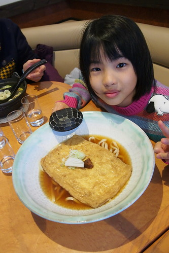](http://flickr.com/photos/33703965@N00/16481914437) 用完餐 甫踏出餐廳門口  眼前雪地又美的讓人忍不住踩下去 [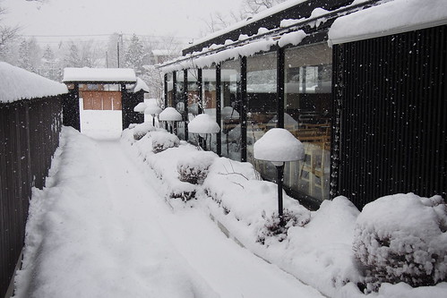](http://flickr.com/photos/33703965@N00/16663254016) 而徹哥一個不小心 差點跌了個大跤 讓這幕美景又更生動了 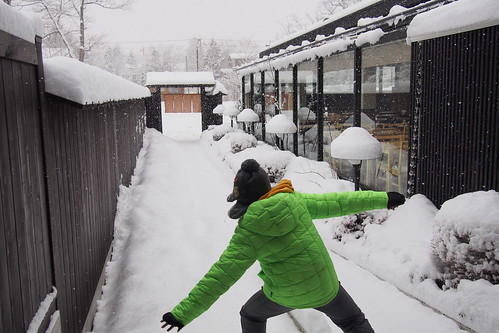 我們踏著凡走過必留下的痕跡 繼續我們的雪地探險 [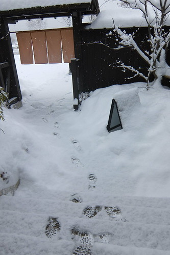](http://flickr.com/photos/33703965@N00/16501602538) 下著雪的雪地 軟絨絨 踩起來 輕飄飄 小人盡往雪深的地方的去 [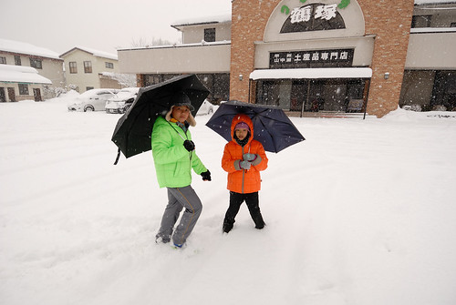](http://flickr.com/photos/33703965@N00/16481912897) 完全的沒在怕 [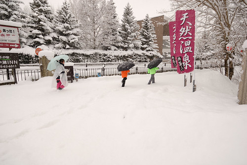](http://flickr.com/photos/33703965@N00/16501791300) 沿途對我們來說也是一幕幕不斷的美景 [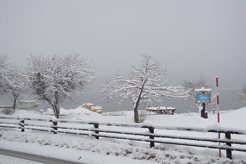](http://flickr.com/photos/33703965@N00/16689186595) 只是帶著一直貪玩雪的三個小人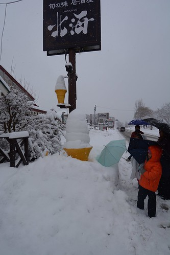 我們要找到seven可能天都黑了 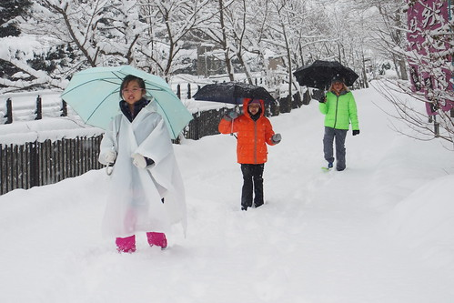 而且車來車往的泥濘雪地 小人走來並不易 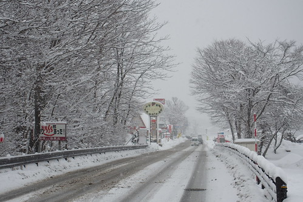 於是我們兵分二路 由阿姨帶著小人先回民宿 而我與徹爸二人繼續往不知道要走多遠的seven去 沿圖 我們依然鄉巴佬似的拍個不停 [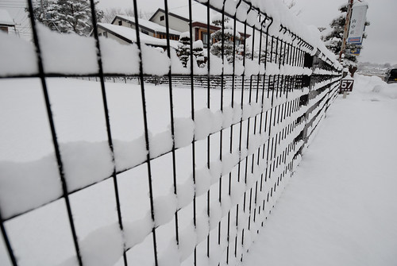](http://flickr.com/photos/33703965@N00/16501589768) [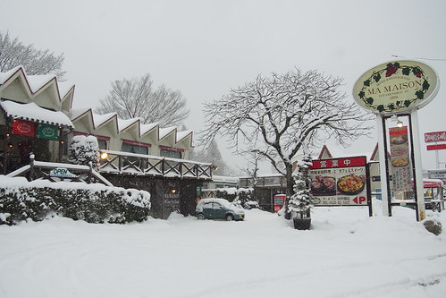](http://flickr.com/photos/33703965@N00/16066856214) [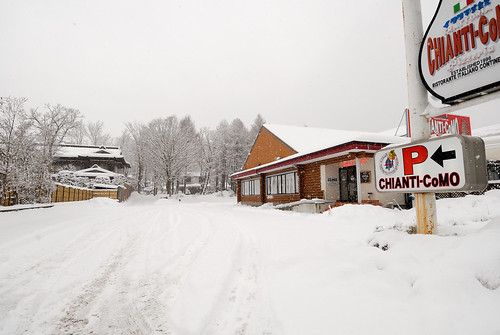](http://flickr.com/photos/33703965@N00/16689184265)[ 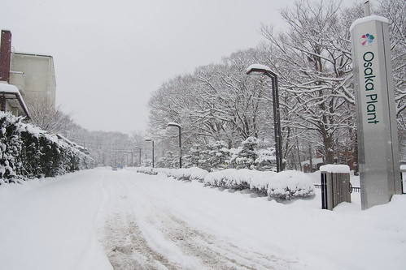](http://flickr.com/photos/33703965@N00/16501594138)[ 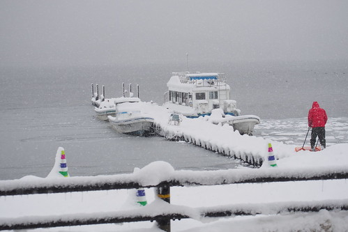](http://flickr.com/photos/33703965@N00/16481904997)[ 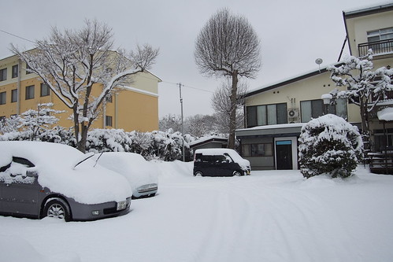](http://flickr.com/photos/33703965@N00/16687844671)其實沒說出口的是 這樣一段路也是我與徹爸難得有一回的雪地約會 臉凍的很冰 但心裏好暖~ 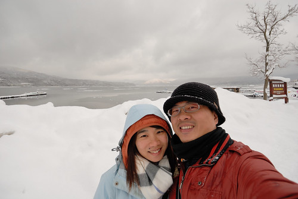 

地圖上看起來很近的seven  還真的如徹爸忍不住進銀行問的30分鐘路程(這之前已經走10多分) 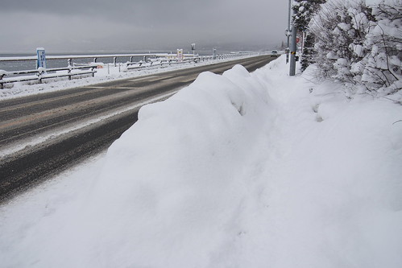 我們走到雪都停 遠方山頭也露出來了  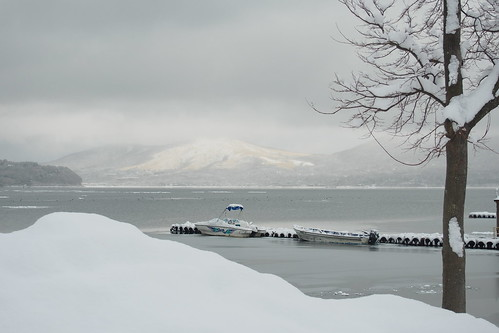 總算在問過時間之後的30多分鐘看見了眼熟的招牌 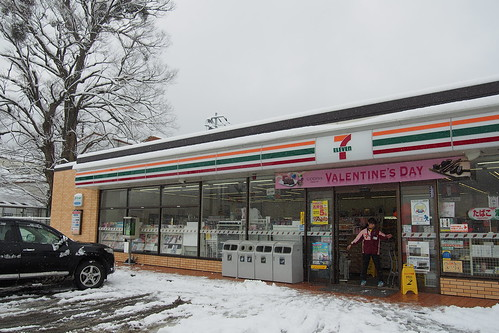 走來不易的seven 讓我卯起來買了香蕉 布丁 冰淇淋 豆皮壽司 零食 還有很重要防水手套 提滿手才甘願的打道回民宿  話說那個沒人走的雪地真的很美 不過車來車往的大馬路卻泥濘的很糟  我們轉進岔路 試著走人少的小路回民宿  轉個彎 果然風景又不同  同時 我們也繞了一些路的順道去郵便局買郵票 (徹愛受阿姨影響的 一起很愛寄阿)  至此 總算圓滿達成任務  徹爸看到雪的興奮感與玩性 完全的不輸徹愛  看到圍牆的積雪 手癢的拿著雨傘一路掃過去 好不得意  雪 真的有魔力吧! 千變萬化~  雪完全的停了  各式鏟雪車也都出動到馬路上進行  感覺是有縝密規劃的機動指揮  這一幕幕鏟雪作業一樣的又讓鄉巴佬我們大開眼界 嘖嘖稱奇了! 我跟徹爸走回到民宿後 才赫然發現我們竟然不小心在外晃盪了好些鐘頭 天都快黑了  雖然同時間 徹愛他們也玩的可能也忘了找爸媽 只是為難了破病中的阿姨 得陪著他們 提醒他們進屋暖暖手腳才能再出去玩        回到民宿後 徹爸馬上就加入徹愛玩雪的行列  三人大玩雪仗 不亦樂呼  就說 徹爸真是最愛玩雪的那個人阿!  除了玩雪 小人跟阿姨也堆雪人 號稱堆了個雪寶  人生第一個雪人 徹愛滿意又滿足  一家子意外走進雪的世界 擁有這樣美麗的雪地回憶 真的很棒~  我們眷戀的待在民宿院子裡  看著夜幕低垂  享受今晚過後可能不一樣的街景  徹爸還到民宿對面馬路上的販賣機買了瓶可樂 慶祝今日的開心  天黑後 一夥人繼續窩在民宿大廳的暖爐前暖腳暖身子 吃點心 真是自在的很不客氣  再出門吃過晚餐 飯後泡了民宿內很棒的溫泉 鋪好被窩  我們結束這驚喜又驚奇的一天  (床是愛愛在徹爸父子泡湯時 同我ㄧ起鋪的 作為能幹小幫手 愛愛很是滿意)  在雪寶的陪伴下 這晚我們一夜好眠~~~ 

