富士五湖 一開始純粹是為了讓阿姨少安排東京都內景點而脫口說出的 而之所以如此順口 大概是因為很愛看日劇所以很是好奇日本人心中永恆的聖山 敲行程時就做足功課的阿姨 很厲害的安排二晚分別住在山中湖與河口湖 讓我們三天內走三湖 見識許多不同風貌的富士山! 後來我在逛書局時買了"富士山小旅行"一書  看過之後我更是嚮往書中的每一幅富士山美景 作者寫 "如果問我, 什麼季節去富士山最好?  怕冷的我,答案竟是冬天" "因為雪富士像張白紙, 沒有櫻花, 紅葉大拼圖陪襯, 從起點到終點都是雪, 可以讀到山與雪的層次"... "在五湖中日本攝影師最愛山中湖, 因為從這裡觀看富士山的形狀最美" 我 除了因前一日大風雪後的感動 也因為真的距離好近好清晰 最是難忘在長池親水公園見到的富士山~ [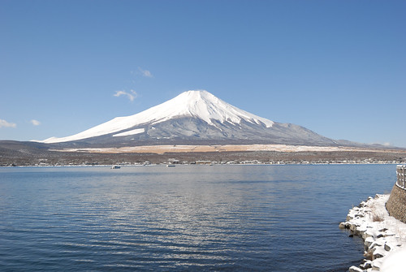](http://flickr.com/photos/33703965@N00/16688122561)

前一日才踏著雪來吃中餐的茶屋  一夜過後只剩一堆堆堆高的殘雪 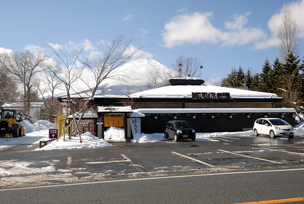 我們不知道這雪來的急不急 但可以明白的是雪消逝的卻是很快  我們努力感受這一幕幕雪景  深深絡印在我們心中 看著前方富士山  徹爸父子倆較勁誰的雪球丟的遠  果然雪球不比棒球 老子沒佔半點上風 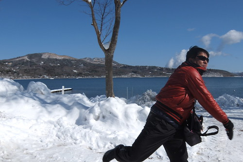 一日十班車左右的環湖巴士(還得考量順逆不同方向的路線) 到站時間很準時 老實說沒有自己交通工具 要好好把山中湖的景點都深入走一遭是有很大困難度的 而且山中湖巴士路線相較繞山 在我們錯排行程 而多此一舉多個親水公園間的往返 一小時的環湖路線坐下來無不坐的昏昏欲睡 [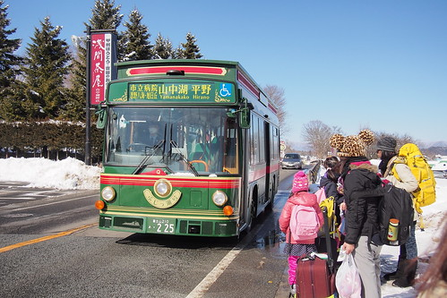](http://flickr.com/photos/33703965@N00/16482147587) 不過幸好我們有把握離開山中湖前的時間 專程來到長池親水公園前  下車後 映入眼的這一幕 讓我們驚嘆不已 大呼不虛此行  這富士山假的就像日曆上的風景照阿!  美景當前 我們當然要照個夠 留下永生難忘的這一刻這一幕  謝謝阿姨 許了我這樣美麗的富士山  大人們相機喀不停 小人們則按耐不住玩起腳下綿綿細雪  拍照時還硬要自己製造特殊效果  富士山前 小人開心玩雪一幕幕 幸福的讓人百看不厭  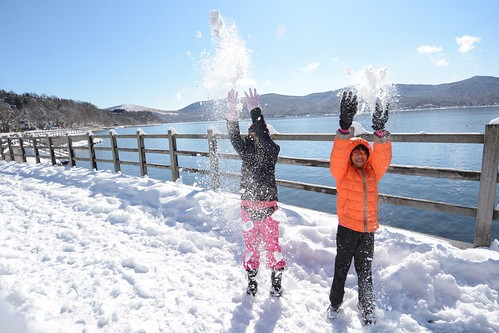  小人自High還不夠 轉而攻擊大人 打起雪仗   [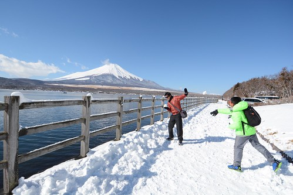](http://flickr.com/photos/33703965@N00/16482170077) 徹爸父子的搞笑版螺旋丸對決  二人戰的難分軒輊 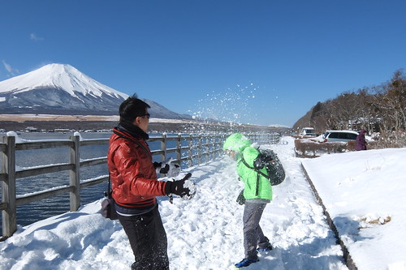 徹哥玩的滿身是雪  滿頭是汗 給他有點誇張...  不過綿綿細雪的確很誘人  讓第一次盡情玩雪的我們玩的非常開心  徹爸們還躺在雪地上 想刷出自己的雪天使 [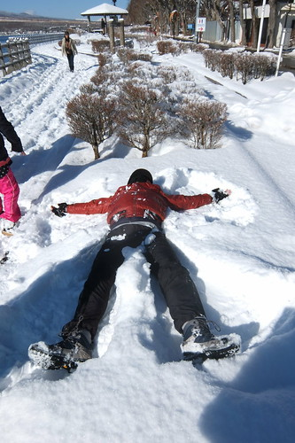](http://flickr.com/photos/33703965@N00/16688433032) 雪天使成不成功是其次 能在這樣大景前這樣狂野 就是最大的滿足 [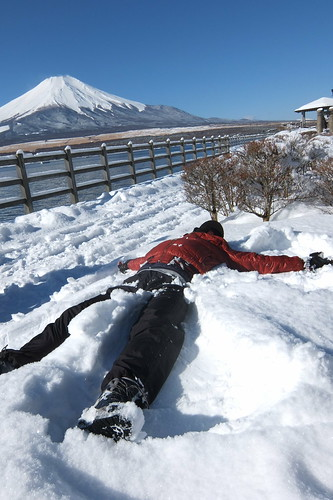](http://flickr.com/photos/33703965@N00/16482182627) 而果然 雪天使真的不是太好做美麗滴 右半身都殘了...  徹哥刷的雪天使  有樣多 但卻好像比較像撒旦...  愛妹也躍躍欲試的躺在路邊樹叢積雪上刷自己的雪天使 [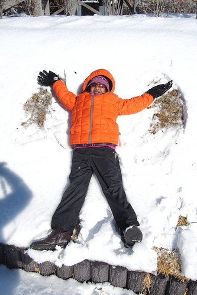](http://flickr.com/photos/33703965@N00/16503314549) 天使的翅膀很開朗 可惜愛愛記得手卻忘了腳... [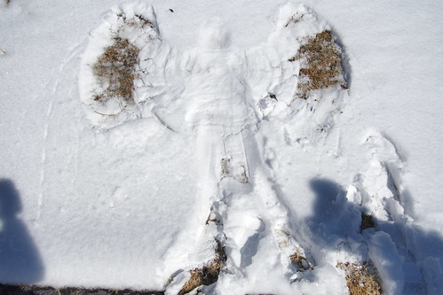](http://flickr.com/photos/33703965@N00/16689456935)

山與雪層次分明的雪富士一直不動的立著 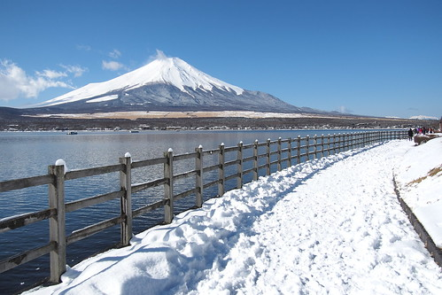 但因著大大小小雲朵的來來去去   或陪襯或喧賓奪主 [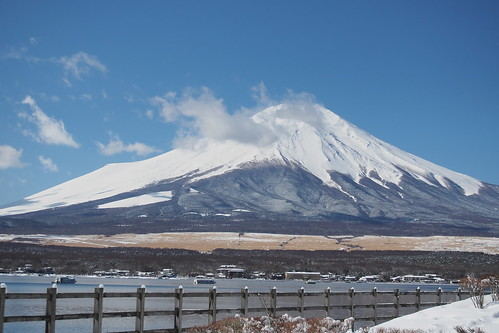](http://flickr.com/photos/33703965@N00/16067114574) 眼睛看見 相機拍下的每一幕富士山都不一樣 [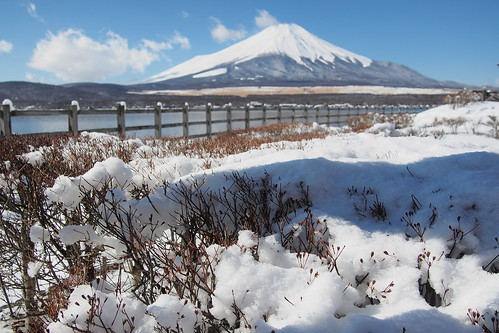](http://flickr.com/photos/33703965@N00/16663497386) 而要看到分明的富士山 真的只能靠運氣! 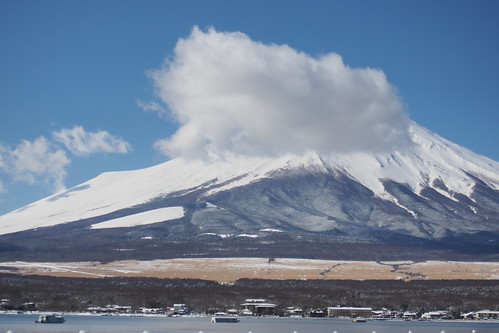超級幸運的我們 帶著滿滿滿足與幸福 離開山中湖  繼續往下一個可以看見不一樣富士山的地方去~ [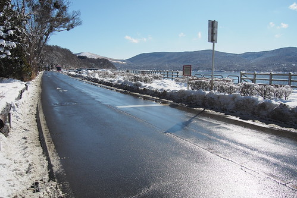](http://flickr.com/photos/33703965@N00/16067115224) 而話說 白雪裝點的小村子真的隨便怎麼看就怎麼美  
