下大雪的五湖區的確讓人又驚且喜 但同時卻也讓我們有些擔心 這下子還看的見富士山嗎 行前我與玟姿蒐集討論五湖區行程時 二人對於富士山的美嚮往不已但也明白這一切只能聽天命 完全不是我們能掌握的天氣是關鍵! 而當我們在下雪日的一夜醒來後 看見富士山清晰的近在咫尺 天阿!!! 我們會不會真的太幸運啦! 我喜歡山中湖村 這個富士山腳下的寧靜小村  讓我們經歷大雪與大晴 [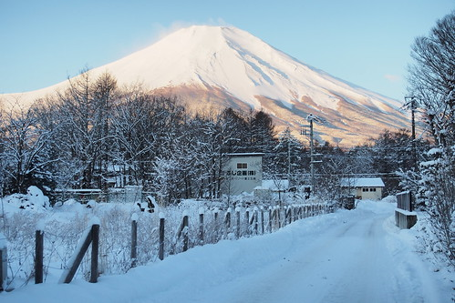](http://flickr.com/photos/33703965@N00/16067164964)

早上六點多醒來看見窗外陽光普照 迫不及待想看富士山的我趕緊叫醒徹爸 而徹愛也醒來同我們一起去外頭 出了民宿大門 我ㄧ古腦要往湖的方向走 徹愛們喚著我"不是要看富士山? 富士山在這頭阿!" 我轉身 看見民宿旁小路盡頭的山 "天阿! 富士山怎麼這麼小! 這真的是富士山嗎? 可是形狀又真的很像阿!" [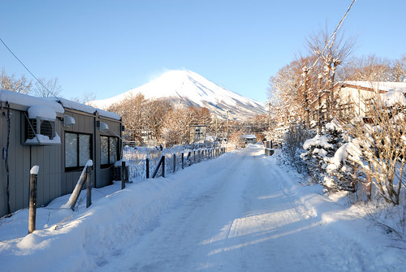](http://flickr.com/photos/33703965@N00/16688141561) 這樣的富士山 沒有距離感的讓我熊熊很難接受 尤其在腦袋還沒醒來的清早  於是我還是往湖的方向走去  試著尋著其他富士山的可能  湖邊大馬路上的冰雪都已融化 [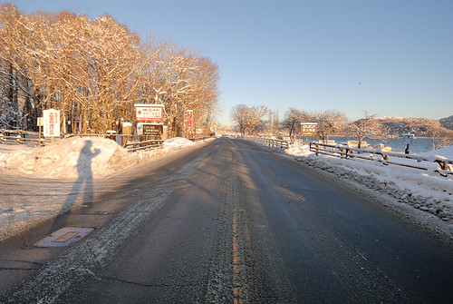](http://flickr.com/photos/33703965@N00/16069532883) 我們心裡佩服著前一日鏟雪作業的成功 讓天氣轉晴的今日一早就能恢復交通的順暢 [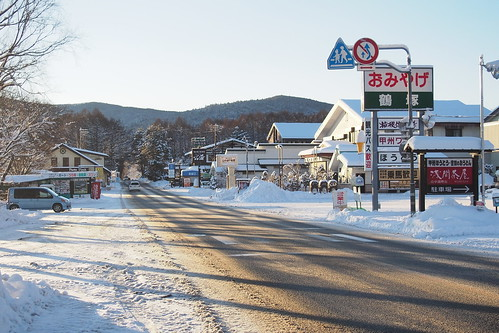](http://flickr.com/photos/33703965@N00/16482205427) 我們走下湖邊  近距離觀看湖面的積雪與結冰 [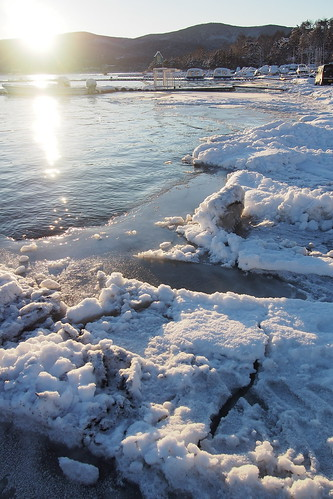](http://flickr.com/photos/33703965@N00/16482208317) 欣賞前方的旭日高升 [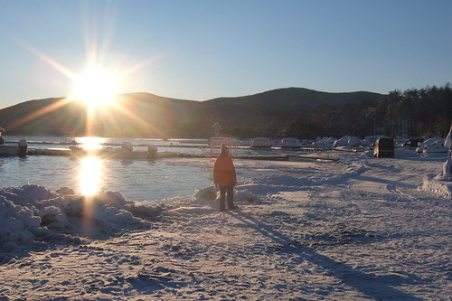](http://flickr.com/photos/33703965@N00/16067156144) 同時我也證實 明白 剛剛看見的富士山真的是富士山  雖然這與我ㄧ直以為的映著湖面的富士山風景照畫面很不同 我也更是驚訝原來我們來到離富士山這麼近的地方了!  

晴日下的雪景 藍與白 色彩分明  雪停之後的雪跡也更顯清楚與有趣  很清新 舒服的一個雪地早晨  山中湖相對是五湖區中較不熱鬧的地方  尤其在沒有櫻花 秋楓 或夏季登富士山以外的冬季  我們是如此幸運的走進這樣雪白風情的山中湖村 更是感受到這裡的靜與境 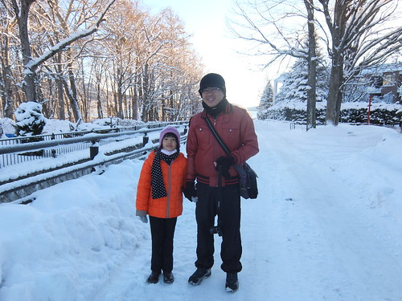雪地裏 許多事物都引起我們的興趣 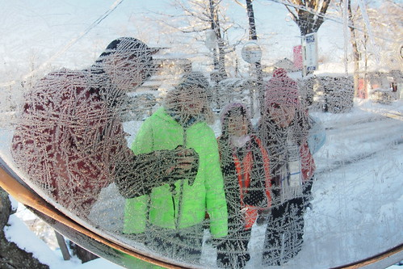 路旁反照鏡上的冰雪花  徹愛大呼美麗的同時 也忍不住作起畫 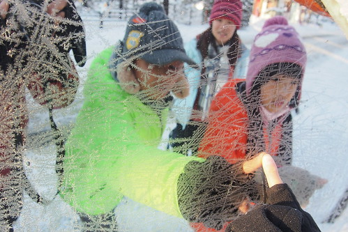 鏡上結冰的融雪  徹忍不住摘下品嚐  他說好像吃冰棒 真好吃  連清早冷到鼻子過敏的愛愛也捱不住誘惑的試嚐一口 二人越吃越有樣... 我與徹爸再仔細觀賞 討論著富士山 我印象中很威嵷氣派的富士山 這"鄰家"模樣真的讓我有些小失望 我們甚至懷疑爬富士山 其實並不是件難事.... (登富士山在心裡小小萌芽) 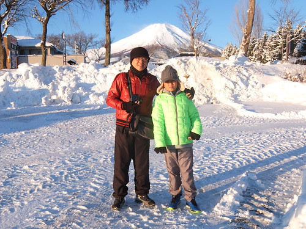 結束散步回到民宿  徹哥修整著因陽光照射而略融的雪人 [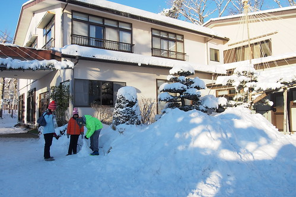](http://flickr.com/photos/33703965@N00/16688139771)我們把握雪人最後的美麗時分 將相機放在雪堆上自拍全家福 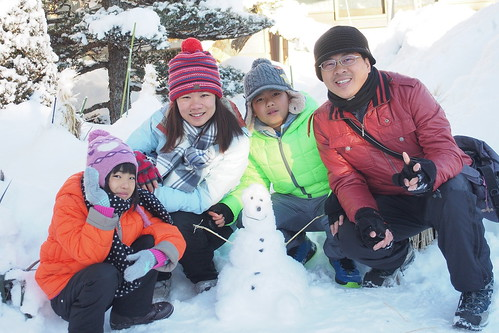 早起的我們結束散步後並沒有再躲回被窩去 反而又坐在大門口川堂休息 暖腳 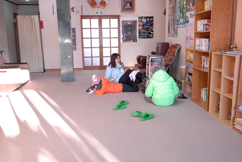 同時 徹爸研究著立體地圖上的富士山  總算解了心中對富士山地形的疑惑 話說 我們真的在富士山山腳下阿!!! 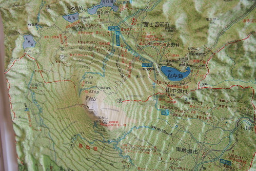 徹愛則發揮看漫畫的熱情  即使文字不通也看的津津有味 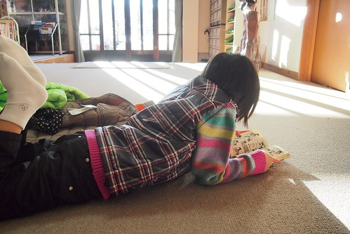 我們享受著寧靜又溫暖的這一刻  八點鐘 民宿老奶奶準備好早餐 喚著大家可以吃早餐嚕 [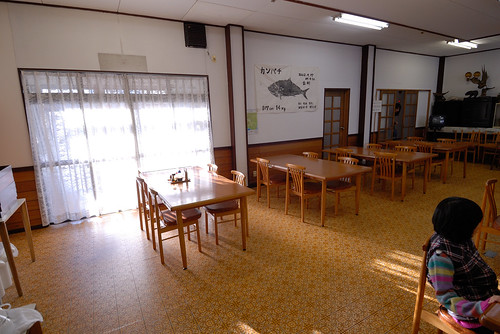](http://flickr.com/photos/33703965@N00/16502070750) 走進餐廳的我們 不止驚訝於餐廳的好空間 更驚嚇且驚喜於滿桌的食物  除了每人好多盤的有生菜 有香腸 薯餅 蛋還有南瓜麵包外 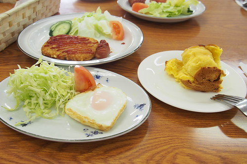 桌上二大藍的麵包以及後續端上桌的玉米濃湯 小人的牛奶 大人的咖啡... 這頓早餐真的太豐盛~ 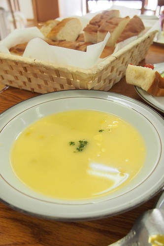 深深感動也佩服老奶奶的好手藝! (民宿還有經營一個小麵包店舖 做的麵包非常好吃也難怪這麼不怕吃)  

吃完早餐 礙於要趕定時的環湖巴士去其他景點 我們回房趕緊收拾行李  雖然我們能做到的有限 還是努力還給留有好印象的房間模樣  徹看著窗外的這一幕很有FU  我想他一定很喜歡這裡的雪地 溫泉 還有老奶奶 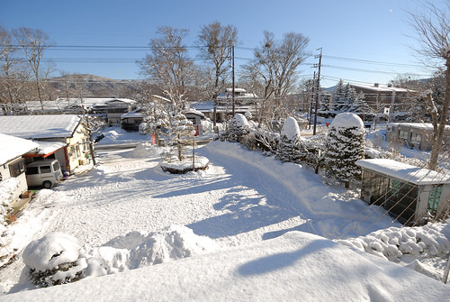最後離去時 徹把握可以玩的每一分鐘 [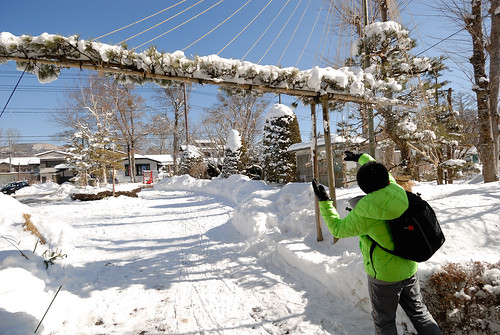](http://flickr.com/photos/33703965@N00/16501842558)  我們在山中湖村 山乃家 留下一輩子肯定難忘的美好回憶~ 
