有電車抵達家門口的河口湖 相對照山中湖 商業繁華 而湖居生活的悠閒自在以及許多像歐洲小鎮的角落 更讓河口湖是為觀光客的最愛 來到河口湖 我們似要彌補前一日因大雪哪都沒去的遺憾 也是不想錯過好天氣可以有的好視野 連午餐都省去的接著搭天上山纜車 觀光船遊湖 以及適逢的富士山雪祭 盡收河口湖美景與冬日盛事~ 

搭著山中湖村環湖巴士 我們回到起點的富士山駛 從富士山駛轉搭電車到河口湖站 河口湖站背對著富士山 復古又優雅的座落著 從車站對面的不動茶屋可以將車站與富士山一同入鏡 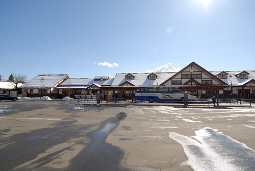 理應先將大行李寄放在車站或今晚下榻的飯店 但阿姨很認真的買了巴士,纜車,遊湖的全套票 於是大伙賣命的拉著大行李上山下湖去 [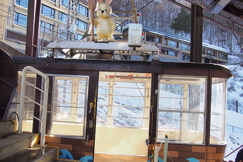](http://flickr.com/photos/33703965@N00/16502010060) 乘纜車而上天上山公園 河口湖全景盡收眼底 [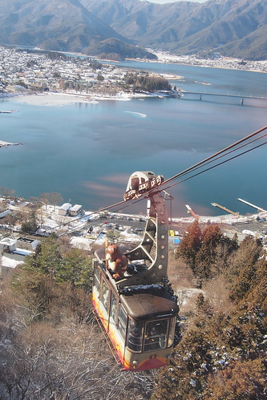](http://flickr.com/photos/33703965@N00/16688378092) 更可見河口湖的繁華熱鬧 [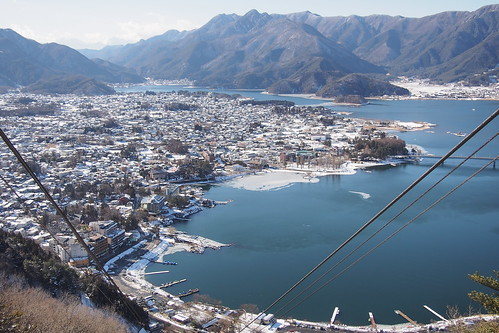](http://flickr.com/photos/33703965@N00/16689410535) 纜車到站後也因登高而盡收180度全平面展開的富士山美景  我們在山頂看山 也看物 富士急樂園的大雲霄飛車清晰可見 遠遠看便感受其驚恐威力  公園內最有名的就是這心型造型的天上之鐘 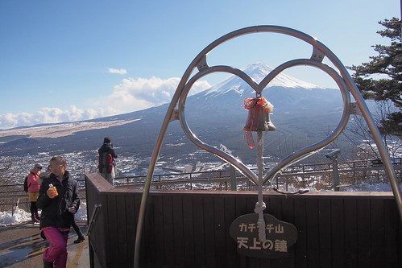 據說情侶一起敲鐘 可以祈福愛情 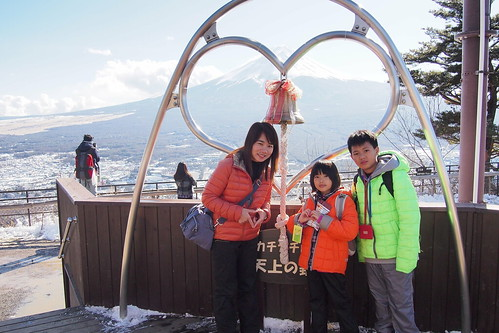 而我們只是單純的每次看到心型造型就開心大喊"愛 你的愛心耶~" 不過當然要在這留下一家子的見證  [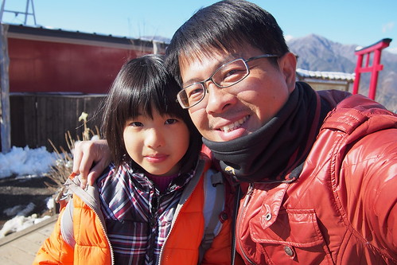](http://flickr.com/photos/33703965@N00/16503274959) 公園並不大 但有間可愛的小茶屋 [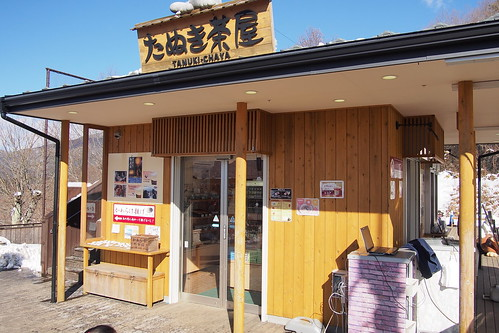](http://flickr.com/photos/33703965@N00/16688394012) 沒吃中餐的我們當然要解饞也解餓的來串有人氣的醬油烤丸子 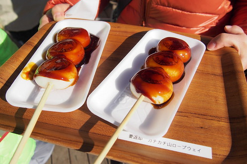 丸子QQ的還不錯 只是那個醬油給他有點誇張 而且還是家裡的醬油膏比較好吃  天上山公園內的視野真的很好 尤其在這樣的好天氣  這裡有個狸貓與兔子的童話故事流傳著 園內處處可見這主角的可愛身影 [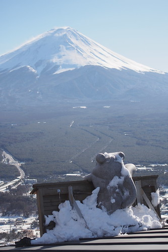](http://flickr.com/photos/33703965@N00/16663465276) 或是看著富士山 或是背對著富士山發愁  我們有樣學樣 故作善感 (現在再看照片才發現兄妹倆還真演) 雖然眼裡看見的富士山明亮又漂亮  但礙於逆光卻很難同時將山與人漂亮入境 阿姨與徹爸二人常為了這一試再試 難有佳作 三個大人傷腦筋還是剛好的發呆模樣 不小心被徹哥的相機給拍下 後來才發現這是此行唯一張三個大學同學的合照阿! 

離開天上山公園 我們接著到纜車口對向搭觀光船 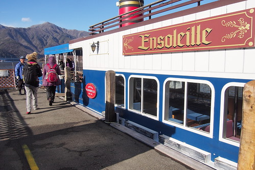 既然是搭船遊湖當然選擇上層的露天雅座  急匆匆上船的我們其實並沒有意識到遊湖的同時也是在賞富士山 [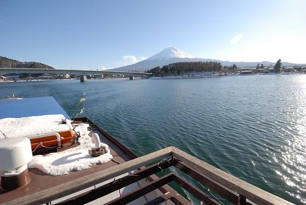](http://flickr.com/photos/33703965@N00/16689396635) 以為就只是欣賞湖光水色  [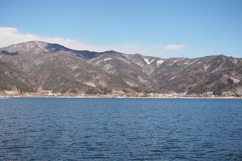](http://flickr.com/photos/33703965@N00/16069434543) 直到解說阿杯熱烈的用手比著與船行進反方向的那頭  我才發現到原來富士山一直都在  這是今天看到的第三種"型態"富士山  徹爸笑"到哪都有富士山 都快看到膩了" 不過能一口氣看到這樣多風貌且清晰的富士山 真的是大福氣阿  我們倚著船靜看眼前美景   珍惜享受這樣的午後時光 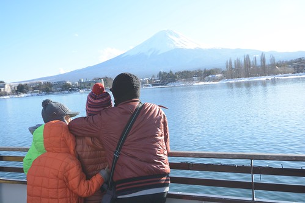 

纜車跟船都搭了 算是沒辜負海陸空全包的套票 我們拉著行李 等著巴士到我們今晚下榻的飯店  飯店的VIEW實在無敵霹靂好 只是我們只享受片刻便又趕起身 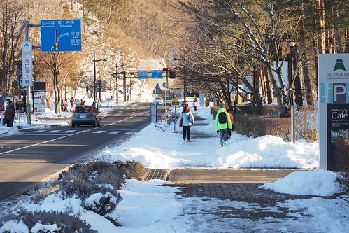 把握天黑前的時光到鄰近的雪季會場  出發前幾天上網查天氣時才發現的雪祭訊息 讓我們興奮不已 [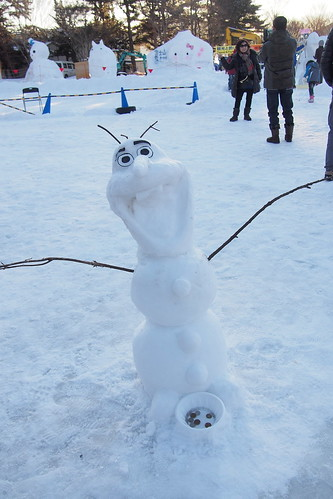](http://flickr.com/photos/33703965@N00/16663437576) 我們來雪祭看Pro級的雪人也為了來趟雪盆初體驗 [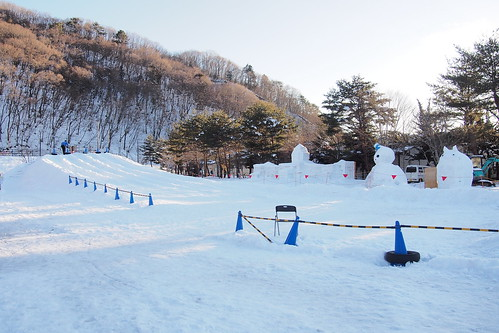](http://flickr.com/photos/33703965@N00/16688319372) 雖然雪道坡度與長度都比預想的看來小兒科多 實際上場後才真的體會 哇! 還真不是太簡單的事阿!  每個人的第一趟幾乎都摔倒在半途 好不狼狽 [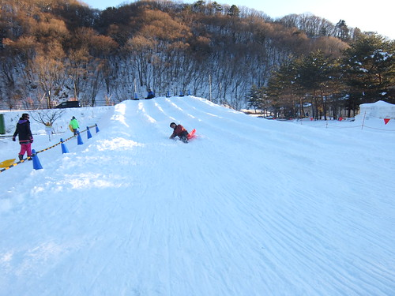](http://flickr.com/photos/33703965@N00/16501790008) 不過卻真的好玩 燃起大家的鬥志  雖然常有險象環生的狀況發生  但大家滑到底的次數越來越多  越來越成功的我們好得意 好開心 [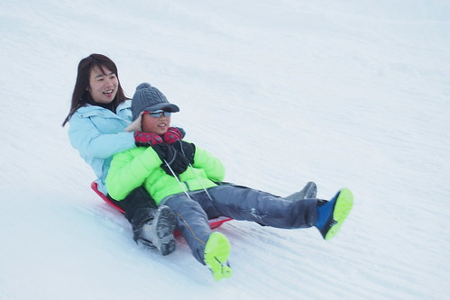](http://flickr.com/photos/33703965@N00/16067048404) 近天黑的時段讓我們不太需要排隊的一趟接一趟滑著 而不到一小時的滑下走上就也夠讓我們滿足到流汗

會場裡還有些可愛的雪雕作品  雪屋 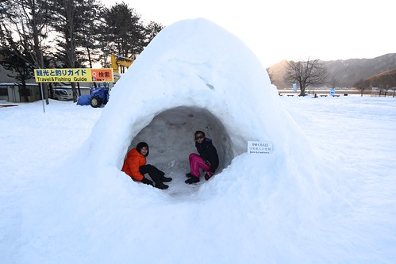 雪祭小而美 讓我們這趟冬日旅行更加回憶滿載 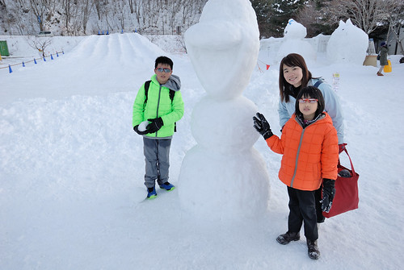 (徹哥玩到臉通紅 滿頭汗 很是賣力與盡興阿) 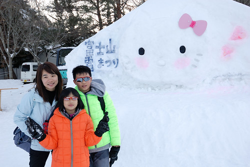 最後離去前 我們嘴饞(也真的好餓阿)買烤玉米吃  也買了真的在富士山買的不知道是不是真的的富士蘋果  今天的我們很觀光客 走了很多景點  但真的很滿足 我知道徹爸的笑容不是假的~~ [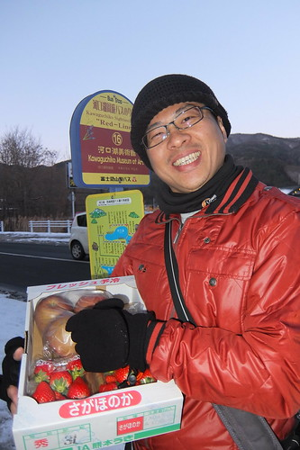](http://flickr.com/photos/33703965@N00/16689370545)
