看著富士山泡溫泉 是看日劇多年 嚮往很久的一幕 來到河口湖 我們當然不能放過這機會 擁有完整富士山視野的房間 美味又愉悅的和食晚餐  清早難得見的逆富士風景 代價雖高 但一切美好難忘的很是值得~ 

雖然河口湖四面都有飯店座落 但唯有北岸才擁有面富士山的完整景觀 飯店當然也是導遊阿姨做了好多功課後選訂的 而且還非此家不可 [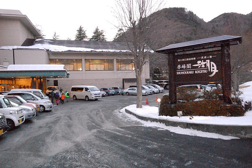](http://flickr.com/photos/33703965@N00/16688034111) 一路玩的克勤克儉的我們 難得入住高檔飯店 心情之期待與高亢不可言喻 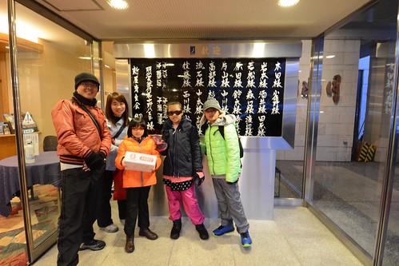 每個房間內最經典的設計(佈置)就是這片180度 無死角展開的富士山景觀  二個偽貴婦就是衝著這份奢華美麗而來的 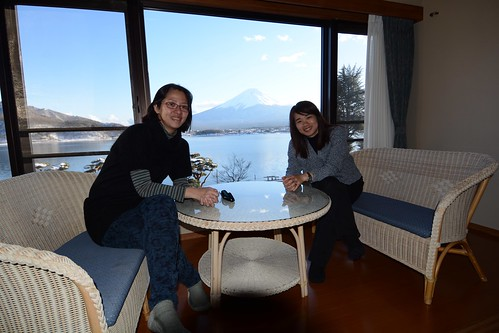 謝謝阿姨許這趟旅行不只滿足小人夢想 也圓了大人我的富士山美夢 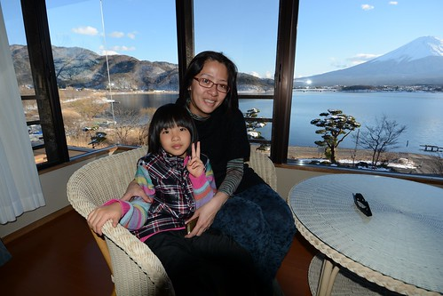  

晚餐前 我們當然去了大眾浴池看富士山泡溫泉 洗暖暖 泡個舒服後  我們穿著浴衣開心吃晚餐去  一行九個人的我們被安排一起在包廂裡用晚餐  第一次(有意識)吃日式會席料理的小人看到排滿滿看來美麗又美味的料理 [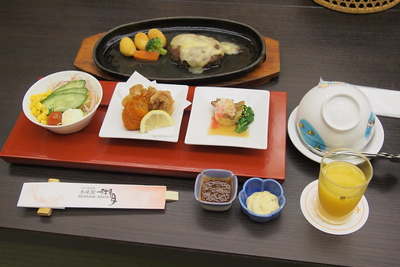](http://flickr.com/photos/33703965@N00/16501775128) 瞠目結舌+滿心期待  愛愛好認真努力的把眼前專屬他的兒童餐吃光光(除了漢堡肉靠父兄幫忙解決)  沒想到剛那些還只是前菜  第二輪端上的才是主食 富士山造型的咖哩飯 可愛的讓愛愛還是好賣力的吃 [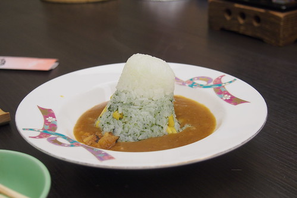](http://flickr.com/photos/33703965@N00/16069405313) 吃到這 我們感受的出小鳥胃的愛愛珍惜食物的拼勁 只是當女將再端上滿滿一盤甜點 水果 冰淇淋時 我也從愛愛的神情裡感受到些許的懊惱 似乎OS著早知道前面就不要吃那麼多 讓向來自豪甜點胃與飯胃是不一樣的她 只能淺嚐幾口後忍痛分享給我們 [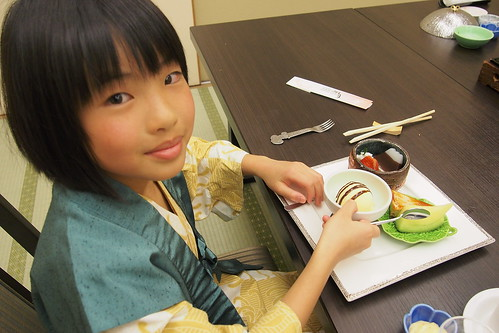](http://flickr.com/photos/33703965@N00/16501770628) (無所不在的富士山 實在有夠可愛的)  同時 我們大人吃全套的會席餐而徹哥則是介於兒童餐與全餐之間的餐點內容 (選擇不同兒童餐費用是不同的)  一張列的滿滿的菜單  一樣樣端上桌 每份感覺都沒什麼(多)  [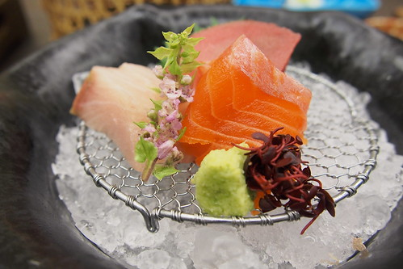](http://flickr.com/photos/33703965@N00/16688335482)  但一道道吃下來 吃完 天阿! 好飽!!! 尤其甜點之前最後上的那個白飯跟味噌湯 到底是怕誰餓著了阿....  全場只剩徹哥自告奮勇要吃阿姨完全不想動了的那碗飯 還吃得津津有味  雖然我們沒有喝酒 但茶水就很助興 [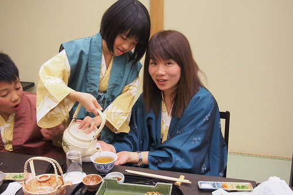](http://flickr.com/photos/33703965@N00/16663413386) 加上每次女將上菜時 都被我們比手畫腳加有講但應該沒聽懂的破英文 還非要每樣菜都問清楚而搞的話題不斷 爆笑連連 謝謝我們美麗又溫婉的女將這一晚的招待 很棒的晚餐! [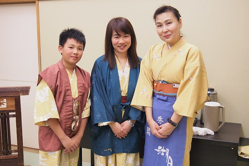](http://flickr.com/photos/33703965@N00/16663410256)

晚餐後回到房間 我們的床被已經鋪好 溫暖的等著我們 枕頭上還放著一束乾燥薰衣草 祝我們一夜好眠  我們拿出帶了好多天 總算派上用場的腳架拍全家福 全員就緒前 測光先 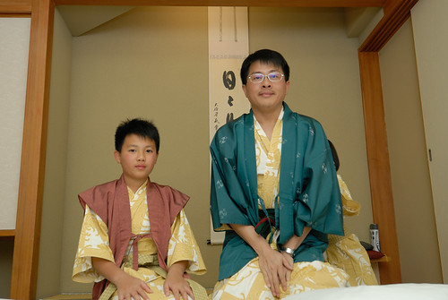 還是可愛小女生的畫面 測試效果佳 呵呵  全家福正式開拍 [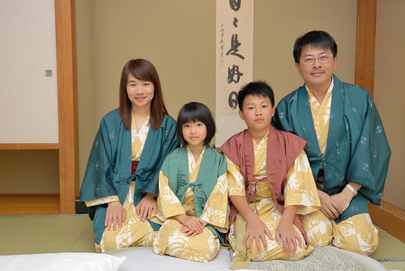](http://flickr.com/photos/33703965@N00/16069397433) 笑容可以多一些 尤其男生們 [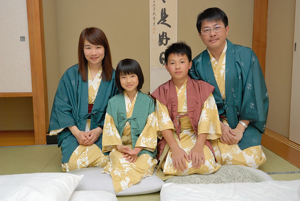](http://flickr.com/photos/33703965@N00/16501960930) 大家都笑了 [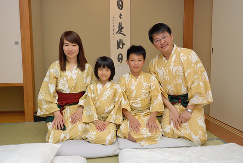](http://flickr.com/photos/33703965@N00/16689355045) 大家笑開點  可是只有小女生的笑容最棒 既真且甜  愛愛超喜歡自己穿浴衣的模樣 直嚷著要買一套浴衣回家 可惜我們的shopping行程太少 無緣買到  這一晚 我們吃飽也睡好 不過被窩再暖 也要記得五六點大清早起身看看窗外的富士山  富士山180度對稱的映在湖面上 是為"逆富士"  這是入住河口湖景觀飯店最是期待的一幕美景 [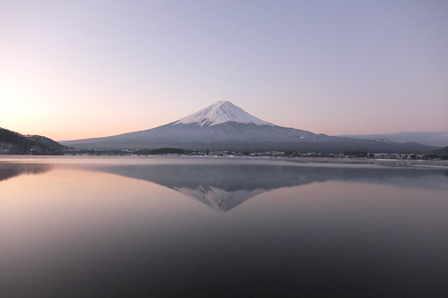](http://flickr.com/photos/33703965@N00/16068348904) 不滿足於房間視野被棵樹小小破壞 我拉著徹爸穿上厚外套 戴上帽子手套 去飯店外尋找更棒的觀賞地點 [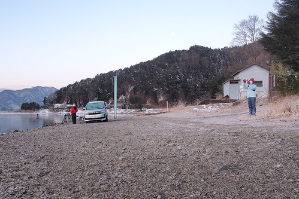](http://flickr.com/photos/33703965@N00/16068344884) 站在湖邊 順著湖面望去的富士山  簡單 清楚 卻威聳  畫面靜止的像幅畫 [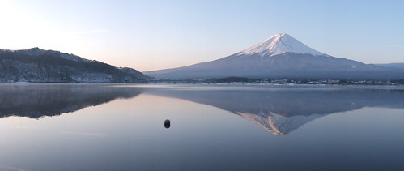](http://flickr.com/photos/33703965@N00/16503270200) 美在富士山 也美在清晨的寧靜 [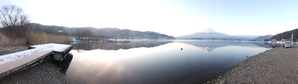](http://flickr.com/photos/33703965@N00/16503077598) 唯一偶而打擾這片寧靜的是從湖面左邊游到右邊的水鳥(鴨?)  像是調皮小鬼惡作劇在畫上畫上二條黑線 [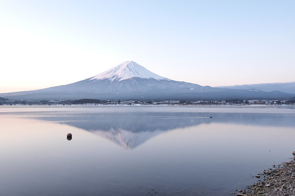](http://flickr.com/photos/33703965@N00/16689634382)  可惜我們沒有大腳架 可以完整完好拍下這難得的美景 不過這一幕應該永遠印在我與徹爸的心中  隨著天亮 湖面漸起漣漪  逆富士也漸漸模糊褪去 我與徹爸也才心滿意足牽手走回飯店 這清晨是我們二人獨享的浪漫約會! [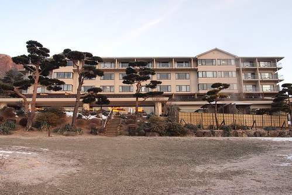](http://flickr.com/photos/33703965@N00/16503271180) 回到房間後 徹爸換了長鏡頭 對著富士山又拍個不停 [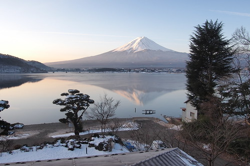](http://flickr.com/photos/33703965@N00/16689627892) 透過長鏡頭 富士山更清晰可見  也更多分不一樣的味道 [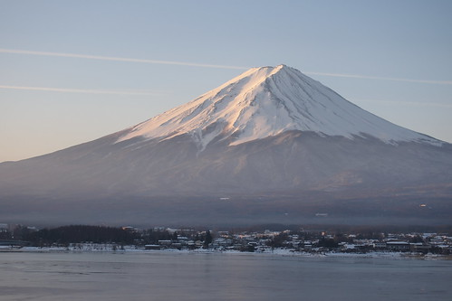](http://flickr.com/photos/33703965@N00/16664716006) 一切顯得詩情又畫意 [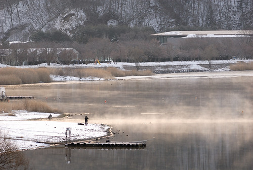](http://flickr.com/photos/33703965@N00/16689626312) [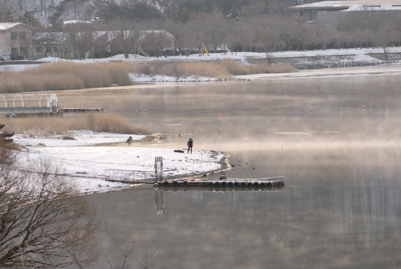](http://flickr.com/photos/33703965@N00/16504519729)  我們一家子又去泡了個舒服的溫泉後才吃豐盛的早餐 充分把握與享受溫泉飯店的美好  吃完早餐 我同阿徹散步到湖邊  想要與他分享這樣近距離觀賞富士山的感動  逆富士已模糊 反倒湖面上的結冰讓徹哥好奇的踩踩看 摸摸看  同時間 愛妹跟徹爸則在飯店後院休憩  愛妹依舊難抵雪魅力的踩雪 [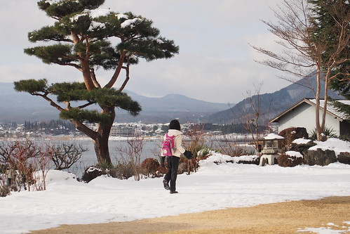](http://flickr.com/photos/33703965@N00/16690644635) 摸雪  能夠有機會入住一切這樣美好的日本溫泉飯店是很幸福的 雖然自助行沒法像跟團旅行一樣每天吃好住好 我們擁有這一晚也夠了且值得 而且我相信這樣的寧靜與愜意是扎實屬於我們的方式與肯定一輩子難忘~

歹戲拖棚的寫了很久的遊記總算寫到只剩下一篇 (握拳) 期待最終回~~~
