在富士五湖區的第三天我們來到西湖いやしの里根場 據說這裏很療癒 剛好作為我們富士山行也是這次旅行的美麗句點! [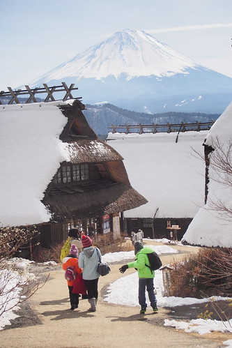](http://flickr.com/photos/33703965@N00/16068290894)

搭乘飯店接駁車到河口湖車站 並寄放了行李後 我們轉搭往西湖的周遊巴士 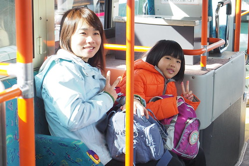 西湖いやしの里根場 有些迢遙 從河口湖車站過來約莫4-50分鐘的車程 [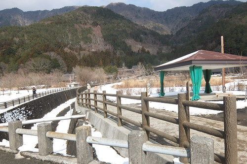](http://flickr.com/photos/33703965@N00/16503249380) 再加上回程時間的考量 我們往返的交通時間其實比待的時間還要久 [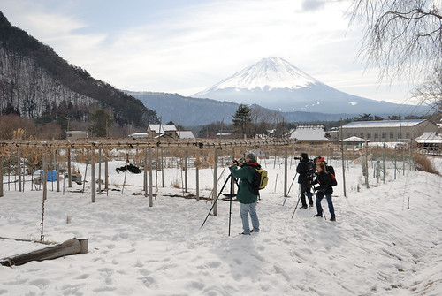](http://flickr.com/photos/33703965@N00/16070687073) 不過這裡是個值得來的美麗村落 [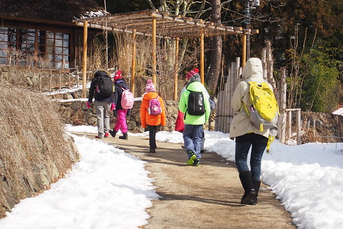](http://flickr.com/photos/33703965@N00/16503052608) 不止在於我們又再看見的富士山美景 [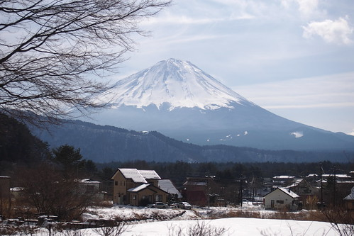](http://flickr.com/photos/33703965@N00/16070635053) 更因這裡曾是有很多茅屋的聚落 [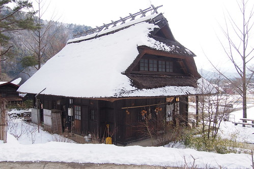](http://flickr.com/photos/33703965@N00/16483365917) 但是1966年一場颱風過後發生的山崩土石流讓一切消失殆盡 直到四十多年後因城鎮合併才開啟重建的契機 讓茅草屋群與富士山又重現人們眼前 [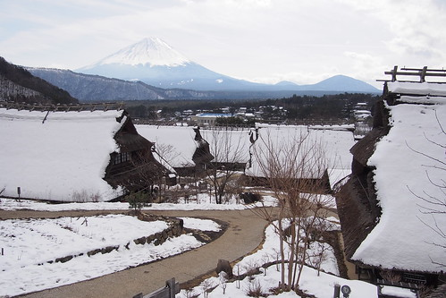](http://flickr.com/photos/33703965@N00/16504482549) 這裡同有名的合掌村 都位處山谷地形 [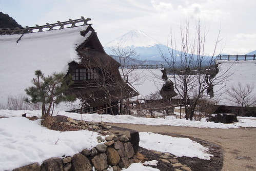](http://flickr.com/photos/33703965@N00/16483315127) 而古人也都為了讓屋頂可以承受積雪壓力而建造屋頂斜度大的建築 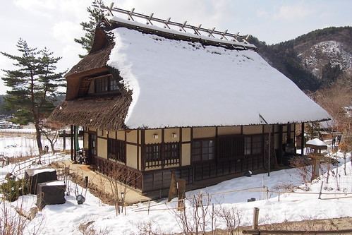 厚厚的茅草屋頂 有份量的讓人感覺安心 [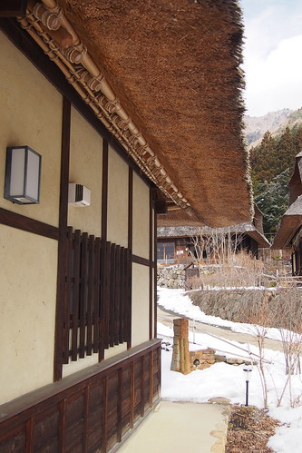](http://flickr.com/photos/33703965@N00/16503246010) 這裡每間茅草屋都有不同功能的開放 [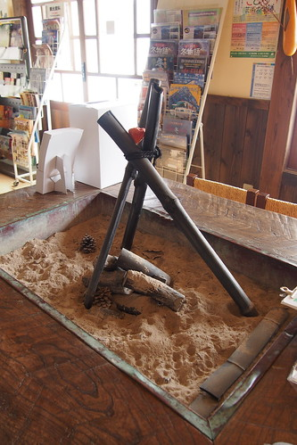](http://flickr.com/photos/33703965@N00/16690635955) 或是工藝品展覽 [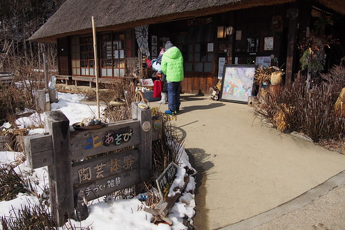](http://flickr.com/photos/33703965@N00/16689284881) 或是土物產店 [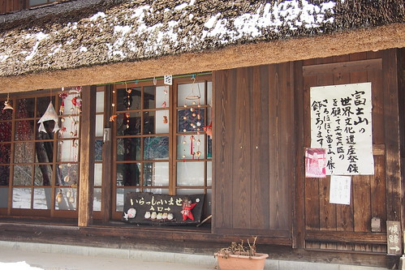](http://flickr.com/photos/33703965@N00/16689284171) 或是記錄資料館 [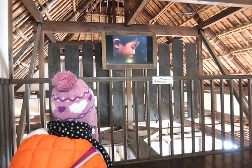](http://flickr.com/photos/33703965@N00/16068304434) 其實光房子本身就很值得入內細細看 [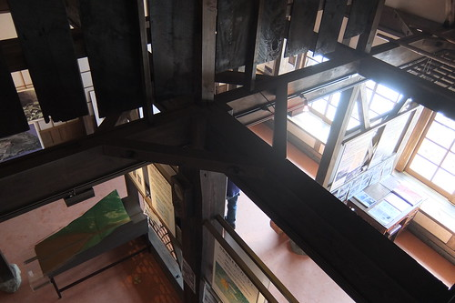](http://flickr.com/photos/33703965@N00/16664682516) 一樣是重建 日本人就把古味保留重現的很剛好 [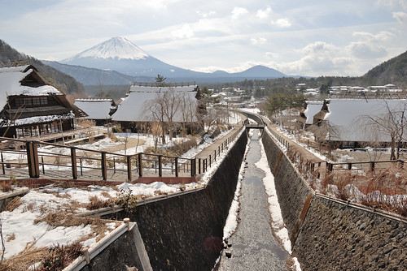](http://flickr.com/photos/33703965@N00/16690625585)

富士山與茅屋群構成的畫面很經典 [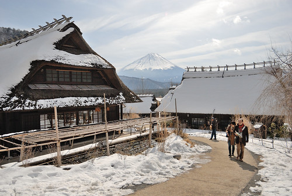](http://flickr.com/photos/33703965@N00/16689301101) 我們拼命的想以這畫面為照片背景  只是要同時把富士山與人都清楚漂亮的入鏡實在需要技巧與運氣 [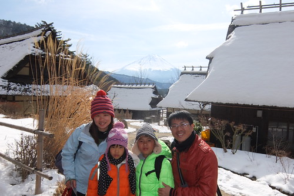](http://flickr.com/photos/33703965@N00/16070682273) 徹爸與阿姨兩人研究大半天 至於誰的技術好就不便比較了.... [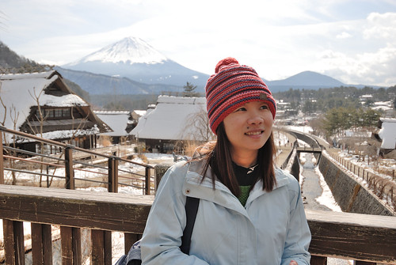](http://flickr.com/photos/33703965@N00/16483351807)  [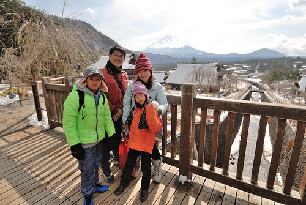](http://flickr.com/photos/33703965@N00/16503232080) 慢慢走 細細看 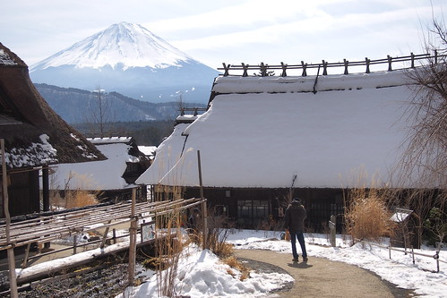 映入眼 美的像一幅幅畫 [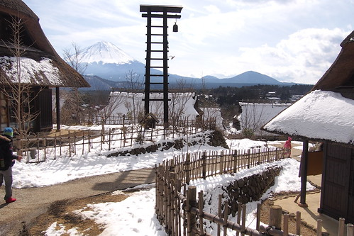](http://flickr.com/photos/33703965@N00/16689295491) 也處處可見可愛的 [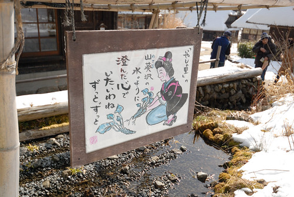](http://flickr.com/photos/33703965@N00/16690627825) 或別具巧思的小物 [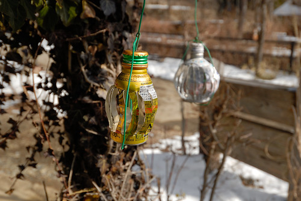](http://flickr.com/photos/33703965@N00/16690622525) 可惜我們礙於回程巴士的時間只能不到二小時的停留 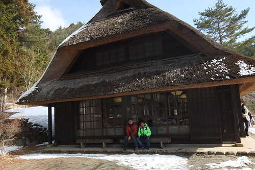 無法十足愜意 坐到開心才起身... [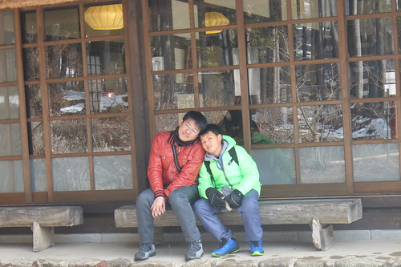](http://flickr.com/photos/33703965@N00/16070670703)

這裡最好的視野在至高點的見晴屋 [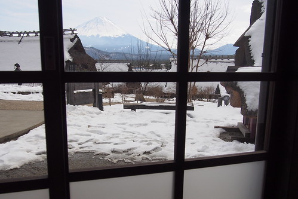](http://flickr.com/photos/33703965@N00/16070665493) 從茅屋二樓窗台望去 [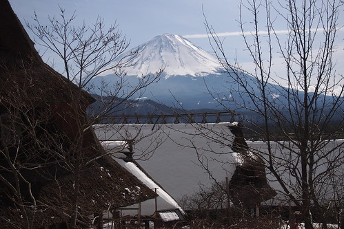](http://flickr.com/photos/33703965@N00/16503237160) 一片心曠神怡 [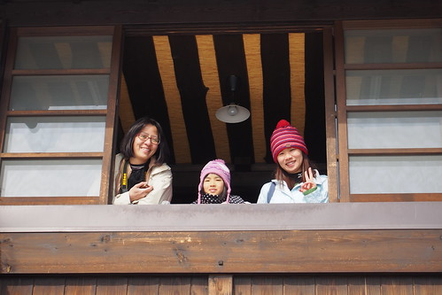](http://flickr.com/photos/33703965@N00/16483348287) 可惜照片又很難把人跟山同時漂亮捕捉! [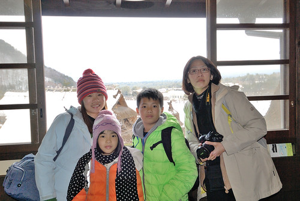](http://flickr.com/photos/33703965@N00/16503228220) 見晴屋一樓有片留言區 徹哥秉持一貫凡走過必留下痕跡的精神 [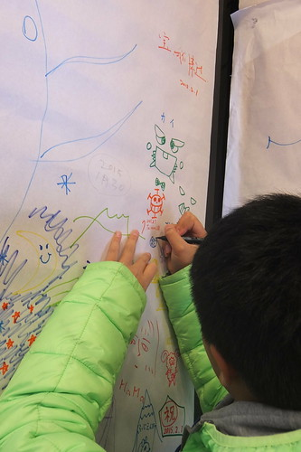](http://flickr.com/photos/33703965@N00/16068296234) 留下來自台灣的徹 [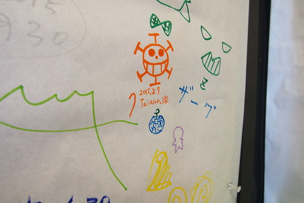](http://flickr.com/photos/33703965@N00/16504480509) 還畫下他在富士山下最棒的溫泉感動 [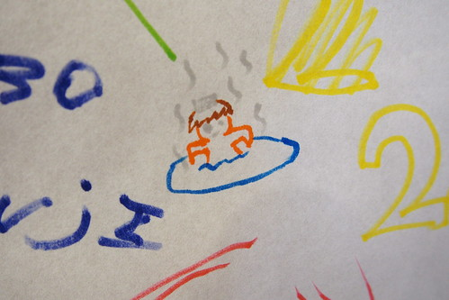](http://flickr.com/photos/33703965@N00/16068295694) 是滴~ 富士山的美景與溫泉真的很棒 很難忘~ [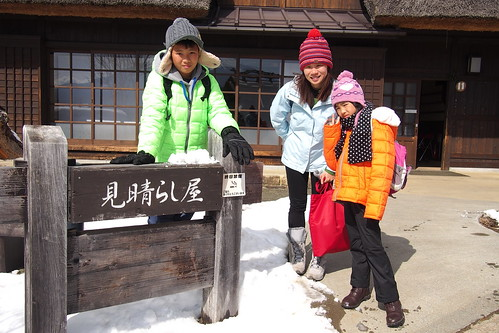](http://flickr.com/photos/33703965@N00/16690616395)

答應讓徹愛再吃冰淇淋的承諾 在離開西湖前也總算兌現 [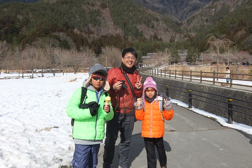](http://flickr.com/photos/33703965@N00/16483338277) 吃剩下的甜筒紙 兩人捨不得丟 戴在史迪奇頭上後意外顯得剛好 [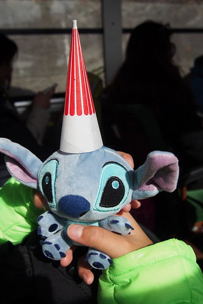](http://flickr.com/photos/33703965@N00/16504469669) 玩性大發的徹哥又讓史迪奇戴上他的太陽眼鏡  史迪奇酷樣十足 [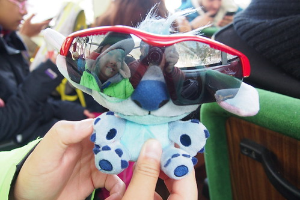](http://flickr.com/photos/33703965@N00/16070655823) 帶著那麼些的依依不捨 我們離開西湖 [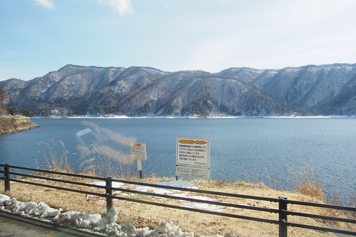](http://flickr.com/photos/33703965@N00/16070654033) 往河口湖 以及即將的回程前進 [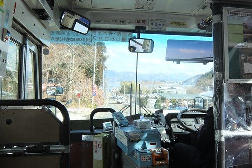](http://flickr.com/photos/33703965@N00/16690606955) 回到河口湖車站 預定的巴士時間前剛好足夠讓我們到車站對面的不動茶屋吃中餐 [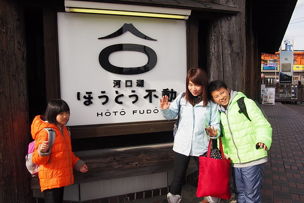](http://flickr.com/photos/33703965@N00/16689568862) (我們入境隨俗的"不動"一下) [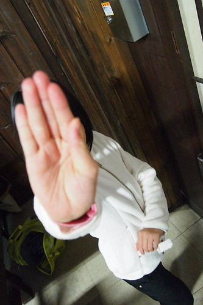](http://flickr.com/photos/33703965@N00/16503210820) 不動茶屋是河口湖有名的鄉土料理店 共有四家分店每家店面據說都別有特色 非吃不可的是用鐵鍋裝盛的野菜味增烏龍麵 十足份量又濃郁的"大"鍋麵 果然來個二鍋加二份豆皮壽司就讓我們一家四口清空的剛好也飽的剛好 [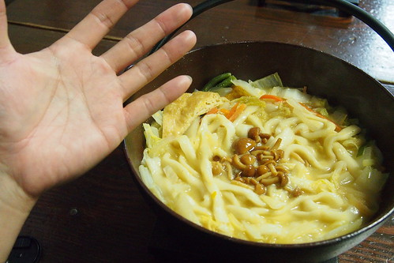](http://flickr.com/photos/33703965@N00/16664662936) 吃飽休息等候搭車時間前 我們正好收拾心情分別寫下我們這趟旅行的心情 [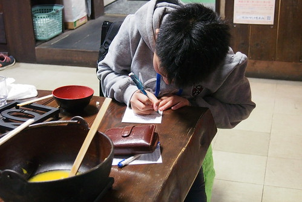](http://flickr.com/photos/33703965@N00/16664660826) 寫在代表我們現在(今)在富士山的明信片上 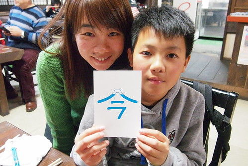 寄回我們的回憶也寄回給一家子的祝福 [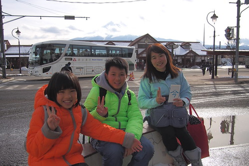](http://flickr.com/photos/33703965@N00/16690600445) 告別富士山 搭上往東京的巴士 心若有所失.... 我們的旅行就快結束了.... 突然間也發現 阿!我的保溫瓶留在不動茶屋的桌上了!!! [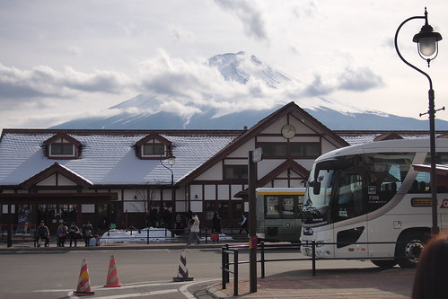](http://flickr.com/photos/33703965@N00/16070648623)

巴士往返富士山的路程 我們很幸運都一路順暢 沒塞到車 只是要回品川飯店的電車竟大夥一起恍神的搭到橫濱去了 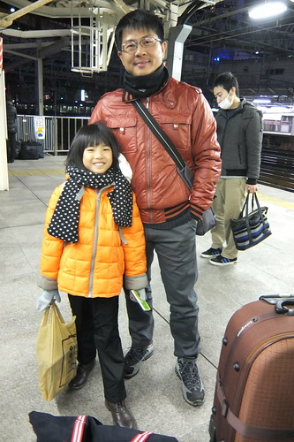 山裡回來的放鬆加上旅行最後的無欲 迷路的大家不以為意還有些老神在在 [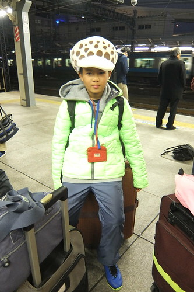](http://flickr.com/photos/33703965@N00/16689270431) 而回到東京 愛愛的靜電力又大爆發 怒髮衝冠 [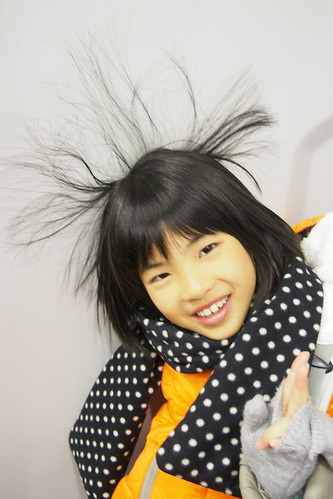](http://flickr.com/photos/33703965@N00/16690596065) 東京的最後一晚我們也總算有購物行程 來到台場  只是阿..除了去藥裝店買些胃藥 OK蹦 我們還真的不知道有什麼特別好買(日本很好買這模式完全不套用我們) 除了大長排的扭蛋機讓小人張大嘴 巴不得每個都來一顆  看完廣場當日最後一場原型鋼彈聲光秀  也是鋼彈迷的徹哥更是不虛此次東京行 大開很多眼界  離開台場 我們的東京行也真的結束了  真的很HAPPY的一趟旅行 充滿幸運與幸福 謝謝神力女超人阿姨的相伴+導遊 有你真好! 還有總算見識到你身為背包客的本事 真的太強 太令小人崇拜的五體投地了!!! 
