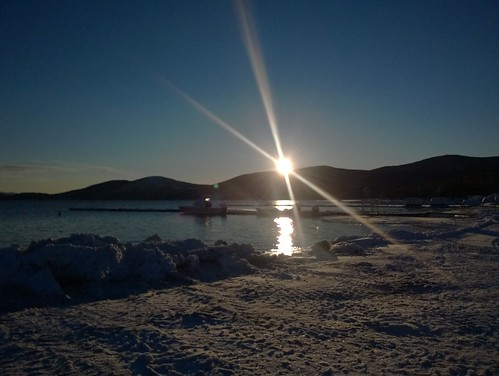
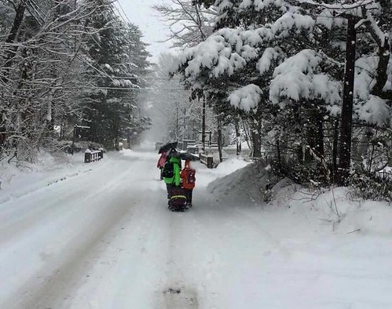
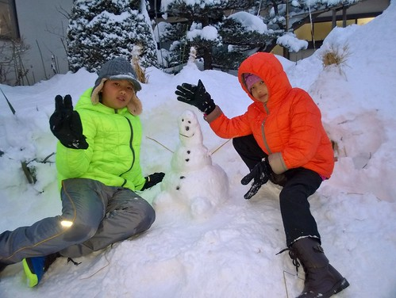
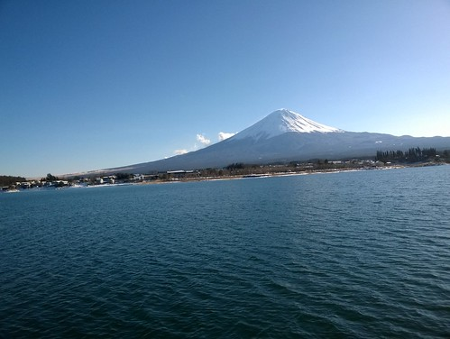
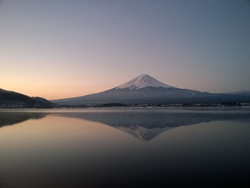

相隔七年 總算我們突破經濟與心防再次出國旅行 除了因為不知在幾年前曾經跟玟姿的"如果出迪士尼團, 我一定跟"的約定 也是自己在四十歲前夕想送給自己的一份禮物!

因為一直想在徹哥青春前 而愛愛也正懂事可愛的小學時期帶兄妹到屬於小人的迪士尼 也因為一直有個尚未跟走遍天下的玟姿一起當背包客的遺憾 在家裡整修最如火如荼 我與徹爸未來工作不明確的十月 我硬是決定了這次的旅行 尤其還是從沒有過經驗的自助行...

很幸運有玟姿這個老手幫忙打理機票,訂房,行程安排等大小瑣碎事 所以其實我們的自助只能算一半 很不出意外的果然在旅行的第二天 從頭就很抗拒自助行的徹爸與我起了好些口角 但幸好我們都有調整心態而就此真的享受我們的旅行

雖然徹爸沒把喜歡掛嘴上講 但我明白我們家跨出了自助旅行這一步 雖然環境依舊拮据 出國不是件容易的事 但我知道憧憬已在我(們)心中萌芽~~~

一開始的行程安排挺折騰 除了本來對於合掌村點燈的奢望期待外 因公或私來過日本四回的徹爸 對於每次都有東京實在很沒興致 但我還是硬著頭讓玟姿開始訂機票 訂房  直到公事家事稍可喘氣的一二個月後才認真安排適合我們的點 總算在給徹爸看了卡通灌籃高手裡的鐵路平交道場景還有日劇流星裡有好多水母的水族館後 徹爸開始有些期待我們的旅行 同時也糾結考驗的是我隱瞞徹愛三個月 直到徹愛考完期末考才告知 真的! 媽媽的心機很重也很能忍阿!!!

在最多讓徹爸請一週假的原則下 玟姿發揮極致的安排了九天的旅行 扣掉前後二天的搭機 包含了一天我們家自己的鎌倉 一天的荒川都電沿途玩 二天的迪士尼 還有三天的富士五湖區 除了迪士尼外 我們盡量的往人少,悠閒的地方與市郊去 雖然我們果然見識到自助行的舟車勞頓  但因走過而留下的足跡讓我們津津樂道 而突破找路 找吃的徬徨無助心魔後 更是體會明白自助旅行之所以動人就在這樣的城市探索與體驗

我們的旅行充滿著幸運 從一開始省很多的訂到廉航機票 到在東京應該有的好天氣  在富士五湖最好有的下雪天與一夜過後的大轉晴  所以我們很幸福的在迪士尼沒有凍著  在富士五湖 體驗到人生難得有一回的風雪中拉著行李走半小時路到民宿  不亦樂乎的玩雪趣  還有看的過癮的各種風情富士山  清楚又美麗的富士山讓人怦然不已   我想徹爸應該同我最是享受在富士五湖二清早的靜看富士山  我們的旅行因著費心思的安排 老天保佑的好天氣 一切平安又感恩 謝謝玟姿的帶領 指導與陪伴 許了徹家這樣美好的旅行! 不知道下一次會不會又是七年之後 但我相信人因夢想而築夢踏實~ 
