去過台江 開始讀點台灣史的書後 才總算能明白台南人身為台南人的驕傲與不同 不同於台北與高雄的擁擠,緊湊 也不若其他縣市那樣的荒蕪緩慢 台南有自己的生活方式與步調 人氣虱目魚粥與牛肉湯讓清早就充滿活力幹勁 但日落後不過六點時分 大半商家卻已關門休息又彷彿寧靜小鎮 雖然我們依然吃不太習慣台南偏甜的料理方式 但不得不說台南美味小吃還真不少 而古城也值得我們更多的探訪走入~這一晚入住安平的作夥去海邊民宿 二個大女生經營管理的民宿  溫馨又親切 而詳細的美食與景點介紹以及桌遊遊戲 讓我們在安平的日夜很盡興

帶著旅遊地圖 我們從安平豆花還有對面人氣水煎包開始到台南一定要的吃吃喝喝  [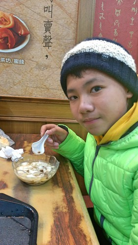](http://flickr.com/photos/33703965@N00/24467187654) 葬五臟廟後 再開始古蹟巡禮 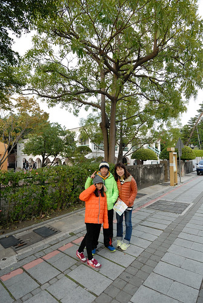 來到德記洋行 老實講以前學的台灣歷史幾乎都沒記得 有印象的就只有紅毛城 打狗館 德記洋行...這些外國人蓋的建築 [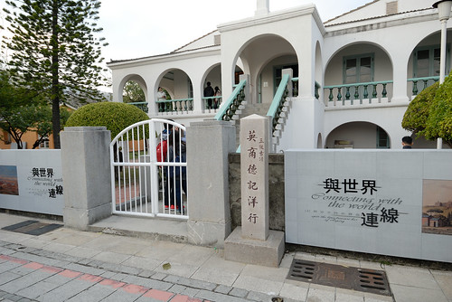](http://flickr.com/photos/33703965@N00/25071594516) 反倒上了年紀後 才對歷史漸漸感到興趣 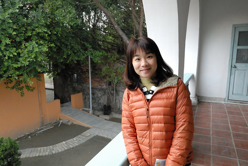 只是古蹟 老房子常被整修的太漂亮  真真假假難捉摩  不過多看多聽   總是能長些知識  緊鄰德記洋行的是安平樹屋  連綿相連的大榕樹 聲勢浩大  很是壯觀[ 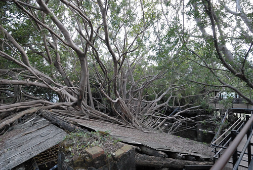](http://flickr.com/photos/33703965@N00/25097925955)看的我們嘖嘖稱奇 [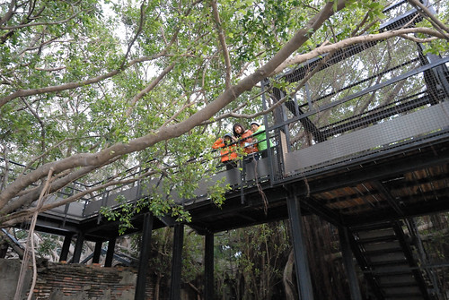](http://flickr.com/photos/33703965@N00/24471057023) 只是隔天聽在地人說樹屋早已不是以前的模樣  有點唏噓 我想這是很多在地人(老人家)對於古蹟修復或農村再造 常有的感嘆 [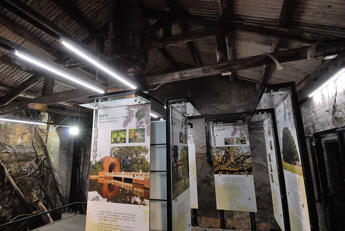](http://flickr.com/photos/33703965@N00/25004623631) 樹屋觀景台延伸接到底的瞭望台  雖然有些突兀 但的確有著好視野 [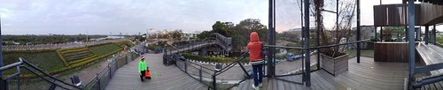](http://flickr.com/photos/33703965@N00/24467236124) 眼底盡收樹屋全貌  不愛歷史的愛走的有些臉臭臭  但看到可以體驗的踩水車 活力與笑容就又來了  夜幕低垂 在這踩水車反倒是我們這下午最歡樂的時候 [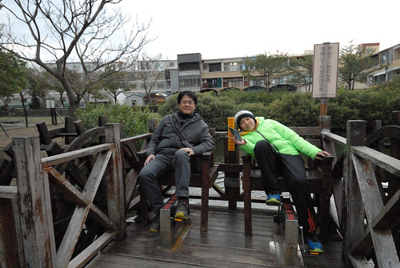](http://flickr.com/photos/33703965@N00/24730256599) [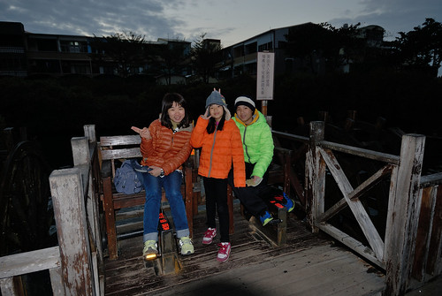](http://flickr.com/photos/33703965@N00/24979745042) 

雖然民宿主人有交代 安平的店家很早就關 但沒想到 不過六點初老街上的店家果然都在關門了 沒買氣也沒看頭  我們撲空了老街 [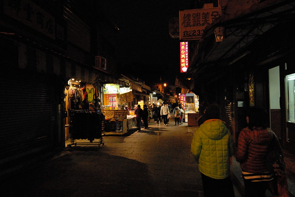](http://flickr.com/photos/33703965@N00/24467232364) 晚餐我們選擇了我們家很喜歡的火鍋   去吃人氣沙茶火鍋 雖然吃得很飽 但我們卻沒很喜歡有濃濃花生醬與蝦米扁魚味的招牌沙茶醬 沒照相 也完全忘了店家的名稱  還真是吃過水無痕阿!

可能台南的早餐太豐盛  以致大部分的民宿都沒有附早餐 最推薦的早餐選擇不是虱目魚粥 便是牛肉湯 我真的蠻難想像 也蠻難接受一大早十點就吃牛肉湯 也完全難以想像文章牛肉湯甫開店就滿座排隊的盛況 我們天真的以為先吃個虱目魚粥當早餐 散個步後再去吃牛肉湯剛剛好 開店時間一過  晚到的我們只能看著人潮選擇放棄 [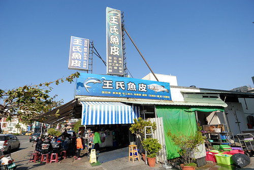](http://flickr.com/photos/33703965@N00/24730256159) 也幸好有先吃鮮美的虱目魚早餐阿 [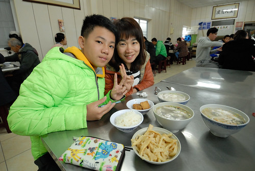](http://flickr.com/photos/33703965@N00/24730255919) 等候牛肉湯店開門也等候蜜餞店開門的時間  我們散步在安平路  昨天沒在老街古宅看著的劍獅  今早卻到處見到大劍獅  「劍獅」是台南安平民宅特有的避邪物 從清朝到日據時代 安平家家戶戶都有劍獅 只是隨著時代演變 只剩幾處古宅還保留著 不過如今劍獅卻也像是安平的觀光吉祥物  極冷了好多天   能在烈陽下散步讓我們感覺極幸福 不過還是羨慕一旁狗兒那樣大辣辣 極奢侈的日光浴模樣 [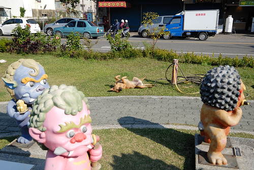](http://flickr.com/photos/33703965@N00/24979743312) 我們沿著運河散步著  不若台北高雄河濱林立的高樓豪宅  台南運河的城市高度讓人舒服  人行道 簡單但寬敞的保留給行人  沿途每戶房子看來都好幸福 尤其越老越有味道  其實散步之外 我們的目的地是前一日民宿主人提起在運河博物館旁的龍貓公車  運河博物館到了但整修未開放 同時龍貓巴士也不知去向...  不過這裡有個小小河底隧道 可以走到另一頭的安平港  難得可見的河底地下道 走來很有趣 也可見台南人對於這運河的整治與清潔有多麼大的信心阿 小小可惜的是地下道的玻璃鏡面有些霧霧 讓河底景觀打了折 [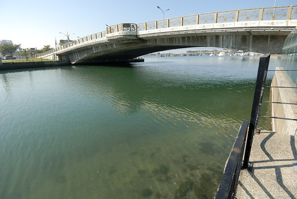](http://flickr.com/photos/33703965@N00/25004563151) 徹爸上網查龍貓巴士到底在何方 原來幾個月前搬遷了 我們依著google map繞了一圈找到了  才發現原來不過就在原址不遠處的運河旁阿 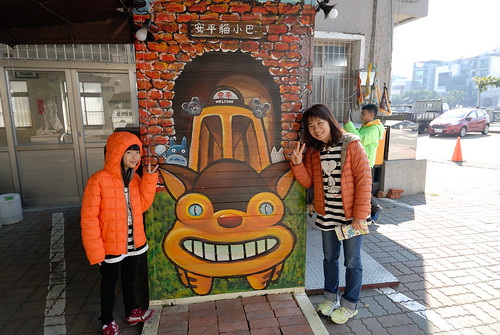 原來龍貓巴士是家小冰淇淋店 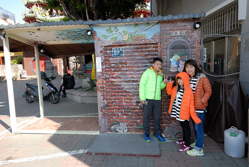 可惜今天未營業  不過一旁曬太陽聊天的媽媽們熱心又可愛 告訴我們 甚至還下場示範怎麼拍照最好看 就像真的坐在公車亭等巴士  我們散步的時間等到漢方蜜餞店的開門 但過了文章牛肉湯開店時間 不過半小時店內早已高朋滿座還一列排隊人潮 這也開了我們眼界 幸好天開始熱 我們還是吃布丁吃涼就滿足了    吃完布丁也總算買到正港的蜜餞 以及隨意找但也好吃的牛肉湯中餐後 我們離開台南 繼續往下一個高雄前進~
