台11線的景點 過往我們甚少停留  直到去年暑假的台東成功到花蓮石梯坪段 這個寒假我們再往台11的東河成功 也順道從東河走台23線到海岸山脈的另一邊 富里 花東旅行 真的很多的舟車勞頓 但我們花東旅行的樂趣就也在這許多的移動過程中 

延續去年暑假的花蓮段 這次寒假繼續補上台東段的芭樂景點 台東小野柳  對於剛走過阿朗壹的我們來說 小野柳真的太小巫  少了對於奇景的新鮮感  我們就像下車拍張照就走的觀光客  父女倆延續旅行中的比一比 繼續比下去 [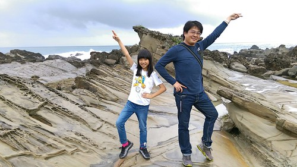](http://flickr.com/photos/33703965@N00/25097879785) 而一旁的徹哥依然是青少年的尷尬樣  往北走 我們第一次停留金樽咖啡 金樽咖啡跟印象中 以為的咖啡車完全不同  金樽咖啡原來已是有規模的遊憩區 [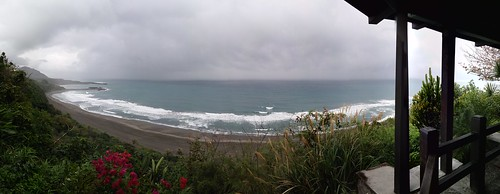](http://flickr.com/photos/33703965@N00/24979722982) 雖然天灰濛濛 但無損金樽海岸線的美麗  這裡不愧是有著好視野的露天咖啡店阿 [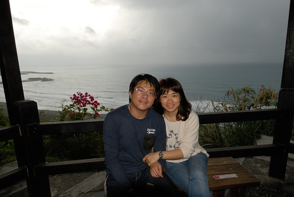](http://flickr.com/photos/33703965@N00/24471032723) 等餐的空檔 兄妹倆總是很認真地看著漫畫 旅行在外無法隨時看漫畫 這樣的空檔對兄妹彌足可貴 [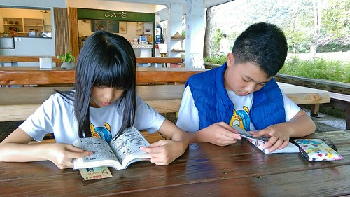](http://flickr.com/photos/33703965@N00/24467186114) 這回環島 從阿里山咖啡王子的咖啡到金樽咖啡 徹哥喜歡上了咖啡的香濃  我們吃著鬆餅 喝著咖啡 各自看著漫畫 滑著手機 旅行該有這樣的愜意 [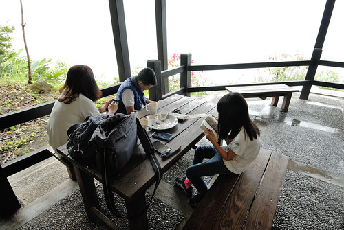](http://flickr.com/photos/33703965@N00/24467207594)

往北走繼續來到東河  幾年前吃過大馬路上的東河包子 我們並不是很喜歡 這回爬文時 才發現原來東河另有一家舊街包子才是老店且好口碑  小小店面 買包的人潮竟也不少 這家的包子 我跟徹爸就有愛了  鹹的肉包或甜包子都很好吃 而且徹爸對於店裡的漂亮店員小妹念念不忘 [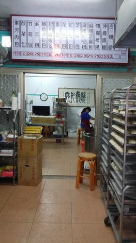](http://flickr.com/photos/33703965@N00/24979722502) 越晚 越往北  雨下得也越大了 一番找不到民宿的困惑後  我們總算找到成功的六號交響曲民宿 這是原先執念想找東河民宿不成後 無意間發現靠近東河的成功鎮民宿 [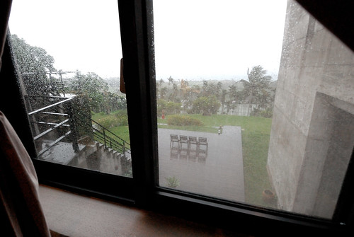](http://flickr.com/photos/33703965@N00/25071568306) 雨持續的落(話說這回是我們這十年來天氣最不好的一次旅行阿) 那都不想去的我們 窩在房間裡 [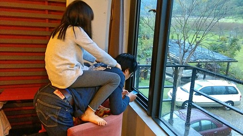](http://flickr.com/photos/33703965@N00/24730209099) 我說這是這回旅行住的最舒適  享受的一晚 [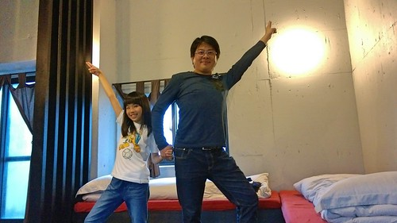](http://flickr.com/photos/33703965@N00/24979698042) 更要好好享受這份愜意  蜷在沙發裡發呆也好  窩在徹愛喜歡不得了的臥舖上遊戲也好 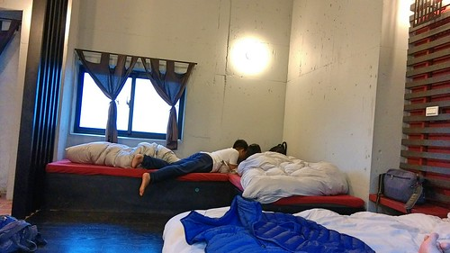 這一晚休息的徹底 舒服晚餐 我們就近到東河街上簡單解決(才開車要去吃晚餐 雨就又斗大的下著)    帶著二個小小孩 年輕夫妻開的小廚房 簡單但不失美味的餐點 誠意十足的讓我們吃進心坎裡 [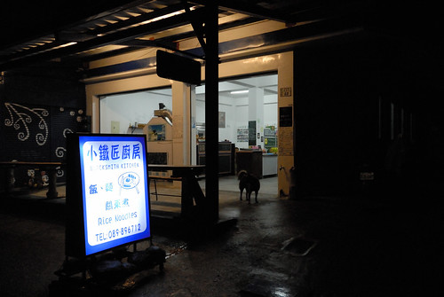](http://flickr.com/photos/33703965@N00/24979720742) 不太有夜生活的我們 漫漫長夜最常的娛樂與打發就是玩鋪克牌  大老二 排七 撿紅點  九九  甚至抽鬼牌 或心臟病 要滿足四個人的玩下來  不知不覺就會玩到睡覺時間 甚至欲罷不能(當然都是徹愛停不了) 是罵聲 笑聲交雜著的全家歡樂夜晚 

隔天早上 雨總算停了 民宿管家準備的早餐 也是這回旅行難得可以享受的民宿早餐  早餐過後 我們走走看看民宿建築與風景 [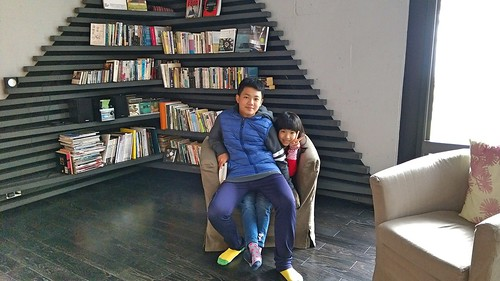](http://flickr.com/photos/33703965@N00/24730208729) 六號交響曲是設計花蓮沙漠風情 阿朵避等知名民宿的陳冠華建築師在花東蓋的第六間房子 (現在爬文才又發現 原來這建築赫赫有名阿)  裸露的水泥建築 看似粗糙但有接受太平洋十七級風的能耐  開闊的好視野 讓人心境坦然 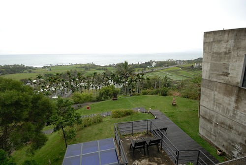 民宿四個房間有著各自獨立的樓梯入口 而每個樓梯又連接著不同的平台 是很有趣又有深度的建築設計  在這悠閒的看完我的小說 退房時間到後我們才繼續出發上路 

今天要從東河走台 23 所以我們再來到東河  也經過前一天撲空的麵包與巧克力倉庫 [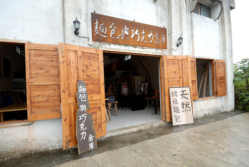](http://flickr.com/photos/33703965@N00/24979719802) 酸種麵包湯盅  好大好結實  只是徹爸跟愛只喜愛台式軟麵包  只剩我跟徹哥二人努力地吃... 吃到好撐還是有剩下  真是對不住 而吃少的人也得忍住餓 直到晚餐了  台23的入口 就在東河橋風景區 [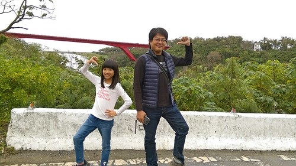](http://flickr.com/photos/33703965@N00/24471016173) 日據時代建築的舊東河橋 獨特的橋墩設計

[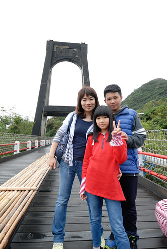](http://flickr.com/photos/33703965@N00/24467205854) 與出海口的紅色新東河橋 形成強烈對比 [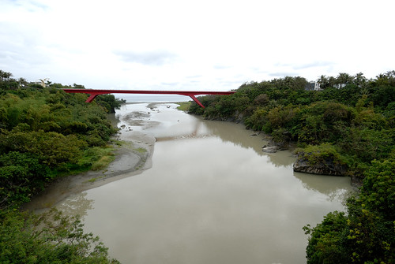](http://flickr.com/photos/33703965@N00/25097899195) 而河谷裡的大白雲巨石也蔚為奇景 [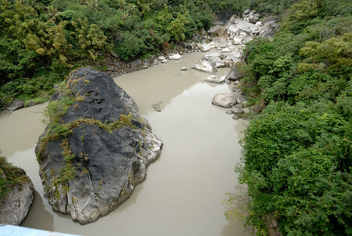](http://flickr.com/photos/33703965@N00/25004557311) 很開心的我們 全家福自拍來一張 [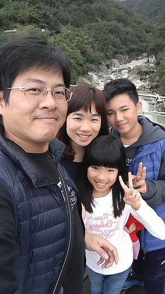](http://flickr.com/photos/33703965@N00/24471030233) 橋上飛飛 拍一張  續著台23 來到登仙橋 真的好多台灣獼猴阿!!!  而且完全不怕人 還怡然自然  其實台灣獼猴數量的增加到底是復育有成 還是人為餵食所造成實在很難釐清 只是當我們看到很多民眾還是不顧告示牌的禁止 依然餵食台灣獼猴 一家子忍不住一起碎念起來  很多的好玩有趣真的不可取  接下來的路程 再沒有特殊的景點  但沿途的靜謐  與好view 讓我與徹爸讚不絕口 忍不住幻想著 會是很棒的單車路線  不過從東河進入富里後的山路比較崎嶇 路面也較窄 [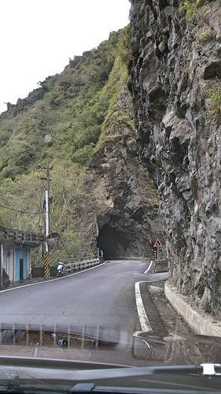](http://flickr.com/photos/33703965@N00/24471007273) 不過經過小天祥之稱的山洞後  就切換到海岸山脈另一邊的縱谷風景了 [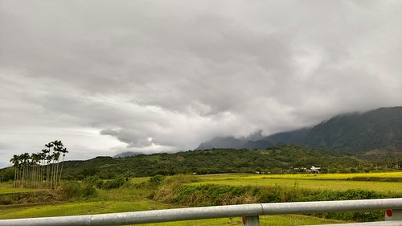](http://flickr.com/photos/33703965@N00/24979696392) 沿途的小村落 看來也都極乾淨 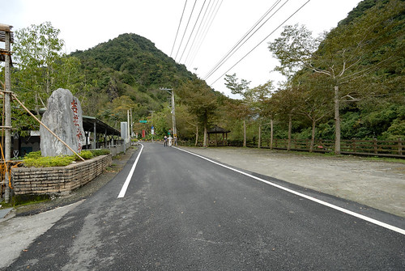   走完台23全線的45公里  我們從台平洋彼端的東河來到中央山脈下的富里 花東幾條橫切海岸山脈的公路  各個都美麗 且讓人更便利的穿梭在山海之間 走一條這樣的公路 也是我們旅行的風景之一 發現台灣也有這樣美麗的鄉間,村落 很棒~

遊記總算走到花蓮 暑假到來的最後二天 應該可以(好像想盡辦法也要)從花蓮殺回台北了!
