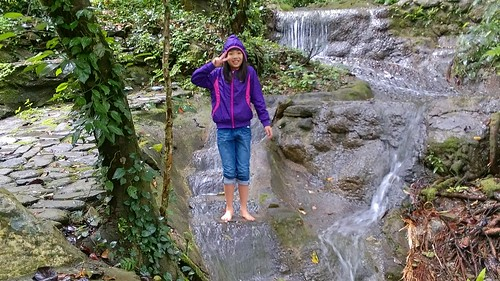

雖然暑假到來已將倒數　我還是繼續把我們的寒假環島走完.... 走完旭海阿朗壹　總算我們來到台東了! 相隔很多年 我們再度夜宿知本溫泉 雖然湧入的陸客果然很掃興 但入夜前早餐過後的知本其實還是很清幽~ 

這回我們住在知本最裡面 森林遊樂區對面的名泉山莊 朋友介紹 我難得會選擇的低價位溫泉山莊 早早check-in後的 包場溫泉果然很棒 只是夜深後被大量陸客包圍的吵雜就很讓人無奈了  在知本 我們才意識到我們好像沒進去過知本的森林遊樂區...なに...  早餐過後 當然無視徹愛的不想再爬山 風雨也無阻的 進森林遊樂區走走看看 其實森林遊樂區的遊客真的很少.... 陸客們是不太有時間可以這樣走的  園區寬敞好走 林間也有不少裝置引起小人興致  愛愛耍賴似的 天真的要玩水  剩下三個人也只能一旁陪著 等著她甘願  作為交換  我們選了榕蔭步道接著走一走  雨毛毛下著  一人一把小傘撐著走倒也愜意  越走越高 偶而從林間清晰可見知本溪與林立的溫泉飯店  沿途也見許多根枝繁盛的白榕樹    步道比預期的陡升許多  走的大家喘吁吁  好不容易走完榕蔭步道的2公里  開心著剛剛一直陡升之後的輕鬆了  沒想到320公尺階梯長的好漢坡  其實一直下階梯也不是件太輕鬆的事  不只我與徹爸老化膝蓋不易走  濕滑的木棧道也讓愛愛一個不小心跌倒 蹬了大屁股  不過好漢坡下山的視野很寬闊  回到倘大的遊客中心 我們洗臉喝水嗑點心  走過必留下痕跡 走過森林遊樂區後  我們對於知本多了些不同感受 除了溫泉之外 

這幾年只要在台東市附近 我們幾乎一定就是往原生植物園吃野菜鍋 年底前在台北吃了二次原生園火鍋後 總算我們在台東的午餐選擇可以盡情多些選擇 愛愛一票不敵我們其他三票 健行過後我們來到台東市人氣速食店吃炸雞  藍蜻蜓之於台東人 應該就像丹丹漢堡之於高雄人 在地的美味店家  一隻雞 以各種不同型態炸上桌 真的蠻美味 不過也真的有濃濃菜市場風味  是台灣人的炸雞無誤~ 而話說 流汗過後的餐點真的特別好吃阿... 
