台江是我前幾年才聽說的地方 而且還是徹哥說我才知道是台灣的第八座國家公園 其實很是好奇高速公路開車就能到達的西南沿海區域到底什麼樣的緣由足以成立一座國家公園 後來又聽說了四草綠色隧道 猶如台灣版的亞馬遜河 這次想一探四草 搜尋後才了解 四草就在台江國家公園內 而原來台江是第一個兼具人文歷史 生態保育與經濟產業的國家公園 歷史在於這是昔日漢人登台的重要航道與登陸紀念地 也見證荷,鄭,清數百年以來的台灣開發歷史 近代的養殖漁業與鹽業發展及特殊的海岸地形 也讓這成為每年秋冬候鳥南下過境的重要濕地 當中最為津津樂道便是每年全球過半數的黑面琵鷺來這過冬 於是我們剛好以四草, 安平作為我們第一次府城旅行的試金石~

預定的搭膠筏時間前 我們先到安順鹽場(鹽田生態園區) 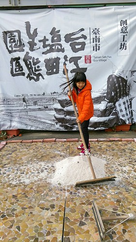 非假日大多的園區(展館)未開放  我們只能在服務中心(還是販賣部)前推推小鹽山 [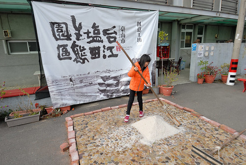](http://flickr.com/photos/33703965@N00/25097935765) 買焗鹽蛋 吃鹽冰棒 留下一點蛛絲足跡 [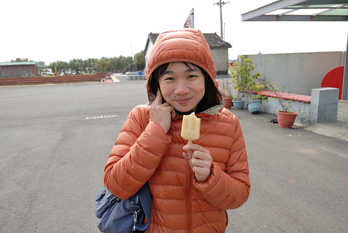](http://flickr.com/photos/33703965@N00/24467242004) 台江內海是台灣製鹽的發源地 起於鄭成功時期 日據時期的品質精緻 產鹽有95%外銷日本5%銷往韓國 園區內還設有運鹽碼頭  場務所 鹽場辦公室等... 可見曾如九份金瓜石那樣的鼎盛 風華絕代 [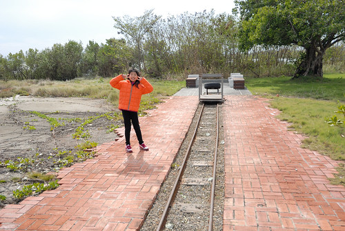](http://flickr.com/photos/33703965@N00/24802323250) 我們散步往更裏頭的舊眷舍區 [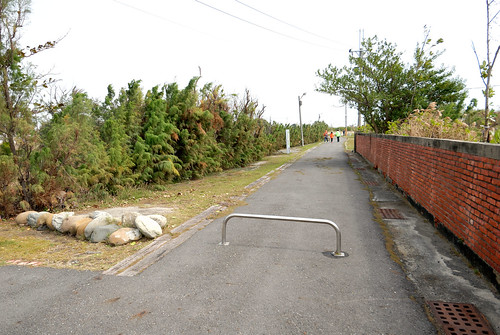](http://flickr.com/photos/33703965@N00/24979754682) 真的什麼門都沒開.... [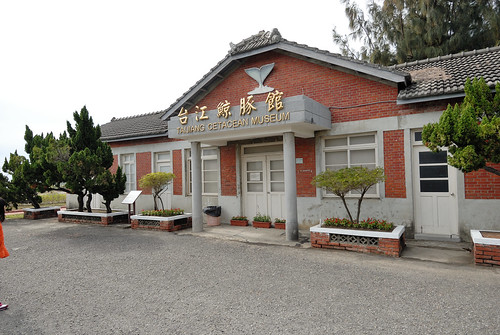](http://flickr.com/photos/33703965@N00/24730265669)  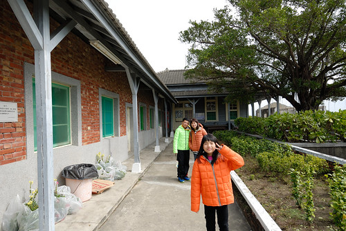 不過乾淨又安靜  適合懷舊追思的心情 [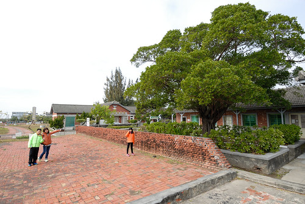](http://flickr.com/photos/33703965@N00/24471064423)  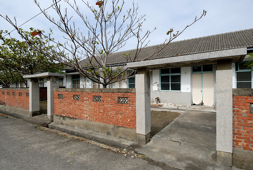 一家子都知道阿母超夢想擁有這樣的房子阿~ [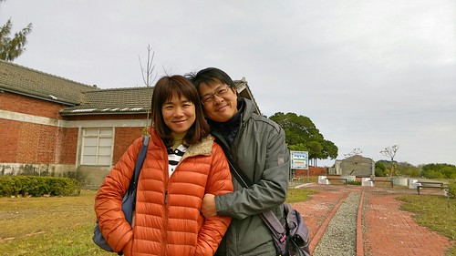](http://flickr.com/photos/33703965@N00/25071548376)

 [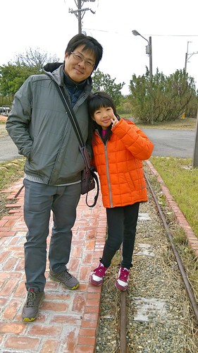](http://flickr.com/photos/33703965@N00/24802270790)徹哥很喜歡上歷史課 他歸功於旅行走過看過很多地方與社會 而這回還真的很配合徹哥國中教材的台灣史 而我對台灣歷史的了解與興趣卻才漸漸打開 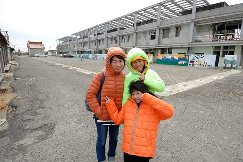 搭船的時間還沒到 我們繼續打發時間也走訪歷史 來到鹿耳門天后宮 [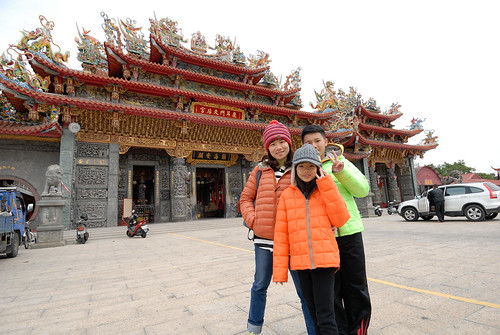](http://flickr.com/photos/33703965@N00/24467240654) 到底這個宮是不是最原始的天后宮 我們不介意 但這天后宮的精緻富麗 讓很少走廟的我們看得深感佩服 [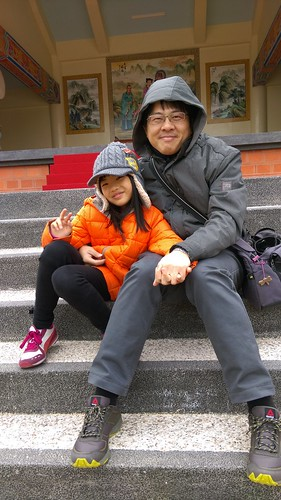](http://flickr.com/photos/33703965@N00/25004566591) 國中生繼續用他相機 他的眼 他的心 記下鹿耳門天后宮 [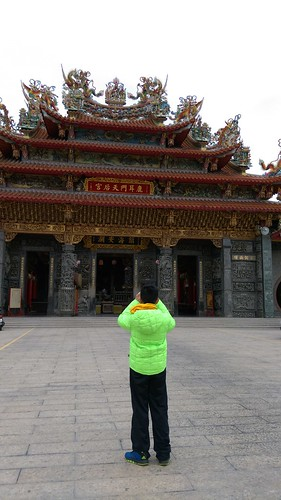](http://flickr.com/photos/33703965@N00/24802324420)

四草的生態旅遊 網路上最多人介紹也最被人驚豔的便是大眾廟後方的綠色隧道 短短30分鐘船程便能感受台版亞馬遜河 貪心的我既想看紅樹林也想更深入了解台江 選擇的是民宿網站詳細介紹與推薦的台江漁樂園搭膠筏遊台江 [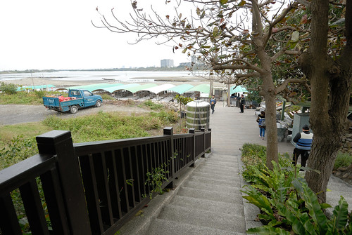](http://flickr.com/photos/33703965@N00/24802321360) [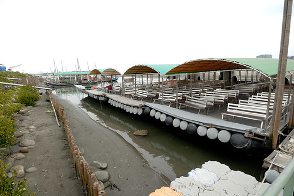](http://flickr.com/photos/33703965@N00/24467237274) 約莫二小時的活動 包含有濕地賞鳥 紅樹林 河海魚類生態以及當地撈捕方法介紹 [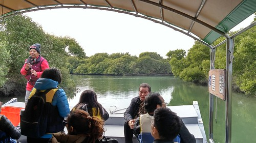](http://flickr.com/photos/33703965@N00/25071599496) 台江內海是當初鄭荷大戰的攻防戰地  當然也免不了也有對於古稱大員這裡的歷史介紹 [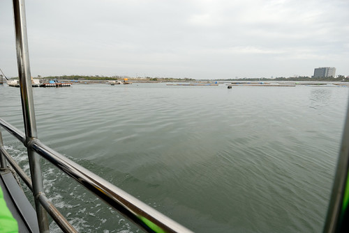](http://flickr.com/photos/33703965@N00/24979752122) 雖然冷風颼颼 但出航的沿途便能見沙洲上停憩的候鳥 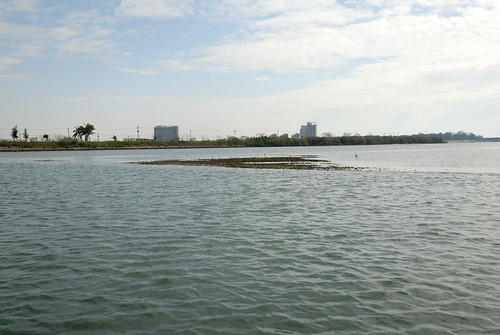 阿嬤級解說員的口條很好 [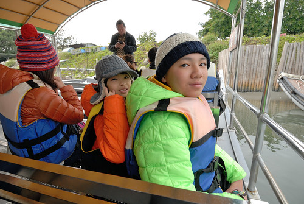](http://flickr.com/photos/33703965@N00/24802321170) 只是本以為很在地的體驗活動 沒想到卻併到了大陸團 老實講 活動的寧靜與雅緻被打了許多折 [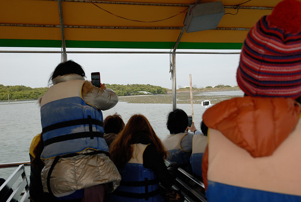](http://flickr.com/photos/33703965@N00/25071598626) 這時節最令人期待的便是賞黑面琵鷺 [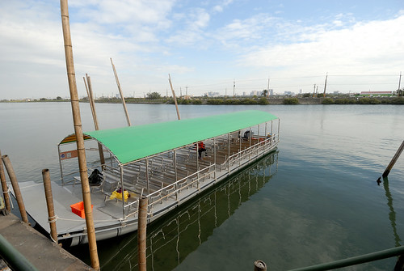](http://flickr.com/photos/33703965@N00/24467238894) 我們搭著船來到賞鳥亭 這兒還有大砲可讓我們清楚的觀賞到黑面琵鷺 [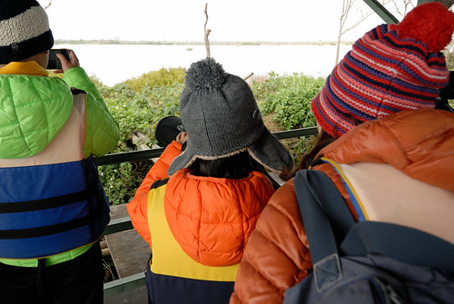](http://flickr.com/photos/33703965@N00/24730199959) 二十歲的年輕船長 幫忙著用手機透過大砲拍下我們第一次看見的黑面琵鷺 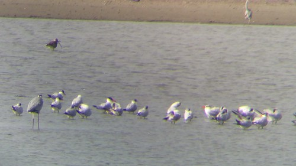  [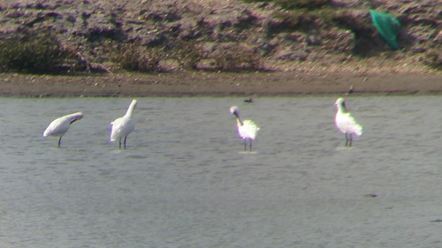](http://flickr.com/photos/33703965@N00/25071535036) 看見這些可愛的嬌客 今日活動好像就算是成功了 [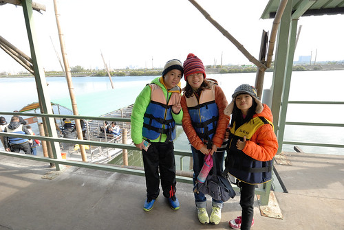](http://flickr.com/photos/33703965@N00/24979688142) 內海沿岸可見一群群候鳥休憩著 雖然隨著解說員的介紹與一陣陣驚呼過後我們還是不識這些客人 但鳥兒的姿態的確可愛又迷人 很有意思 [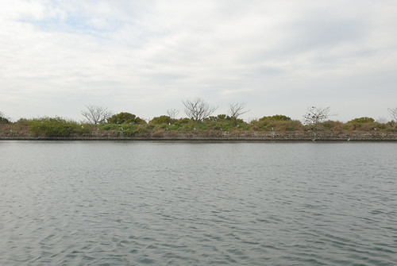](http://flickr.com/photos/33703965@N00/25097931905) 接著來到紅樹林區 這就有點出乎我意外的 原來不是以為的綠色隧道 [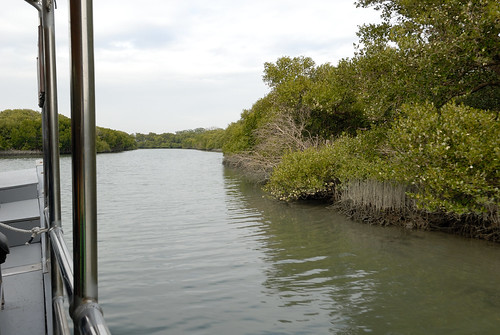](http://flickr.com/photos/33703965@N00/24979750772) 雖然這裡的樹種很豐富 風景也別有一番秘境 [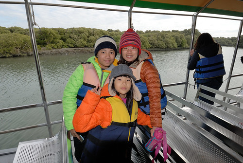](http://flickr.com/photos/33703965@N00/24979750402) 但紅樹林間可見的大型垃圾或塑膠桶 有些令我們失望 [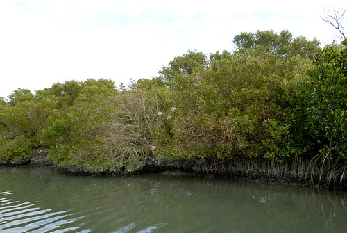](http://flickr.com/photos/33703965@N00/25004626991) 或許因為這裡仍是漁民的養殖地 但既然是為國家公園了 在環境保護的執行與落實上也是應相對的高標準 而不單只是靠歷史與口碑支撐而已 [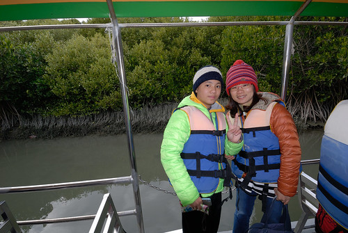](http://flickr.com/photos/33703965@N00/25004565271) 離開紅樹林的歸途 是一連串古早漁具的介紹 網笱 [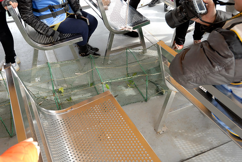](http://flickr.com/photos/33703965@N00/25004626771) 吊罾 [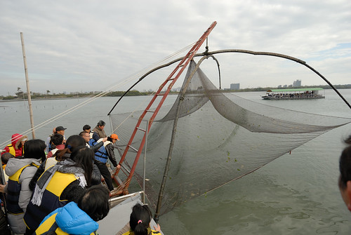](http://flickr.com/photos/33703965@N00/24730260949) 一臉孩子氣的船長撒網那一刻很瀟灑很帥啊 也真的捕到一隻肥美的大魚 [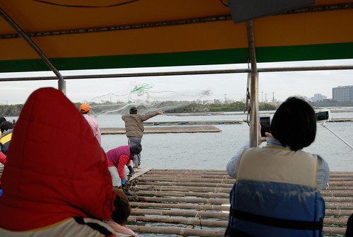](http://flickr.com/photos/33703965@N00/24802318260) 雖然因阿陸仔的吵鬧與爭先讓我們有些無奈 也連帶影響對活動的參與喜好 但能走進台江 曾經的歷史現場  現在的候鳥冬棲息地 對於國中生來講還是很值得走一遭的戶外教學 (至於那個小學生因為對台灣歷史還無感沒太多感受) [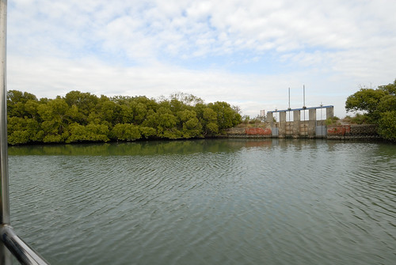](http://flickr.com/photos/33703965@N00/24979749802)
