旭海 每每查詢墾丁國家公園網站時總會被吸引的景點(旭海大草原) 這幾年更因為阿朗壹古道而聲名大噪 總算來到旭海 除了驚覺這裡的小也更深刻體會這裡的天之涯海之角 [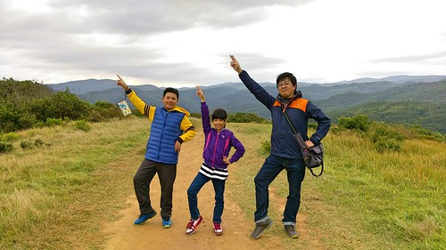](http://flickr.com/photos/33703965@N00/24979703062)

緊接著台南安平後 我們來到高雄的科學工藝館 這是國中生行前規劃時提出的景點 雖然科工館因為地博顯得有些物稀 但對於好奇心旺盛的國中生來說 即使走馬看花還是很有趣 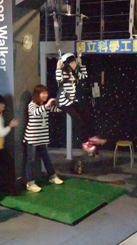  [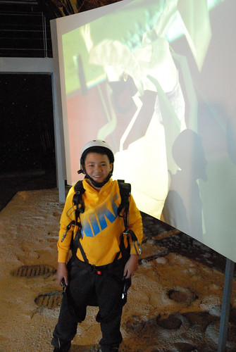](http://flickr.com/photos/33703965@N00/24467229014) [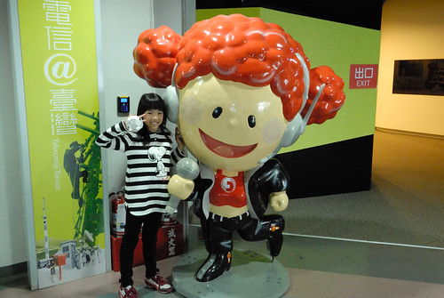](http://flickr.com/photos/33703965@N00/24467228714) [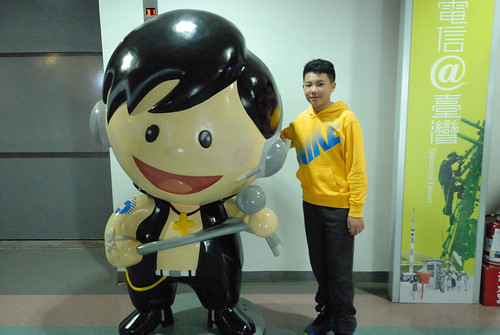](http://flickr.com/photos/33703965@N00/24467228554) 一整個下午的時間 讓國中生盡興的走看館內各展館 也一起看了3D電影"小動物大世界"  小小鼠的驚奇勇敢讓人看得捏冷汗也叫好 (台北天文館105年4月到明年四年有放映) 而最後在夕陽餘暉下 享受意外發現的春一枝冰棒 [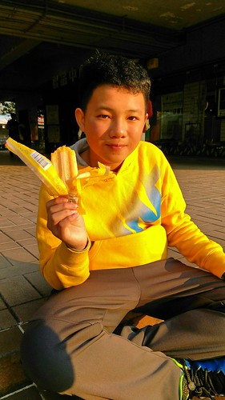](http://flickr.com/photos/33703965@N00/25071549216) 高雄除了科工館外 唯一安排的就是愛河之心 老實講我也實在不清楚這個愛河之心要怎麼"玩" 除了將住宿地安排在地圖上看起來離愛河之心比較近的康橋商旅後譯九如店外 打著隨興的如意算盤 以為從旅店散步往愛河之心的路上既可看到美景也可以填飽肚子 [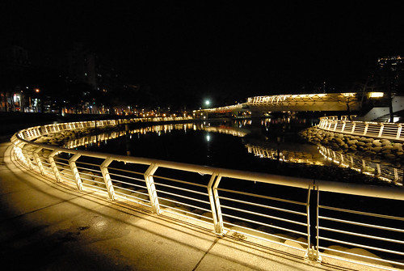](http://flickr.com/photos/33703965@N00/25071587576) 沒想到二三公里的路程上完全不見義大利麵店  讓人肚子餓到也沒雅致欣賞愛河夜景 不過我想我們應該也是不擅於欣賞這樣的城市景觀 [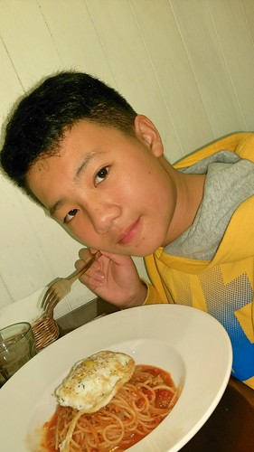](http://flickr.com/photos/33703965@N00/24979702252) 走了一小時的路總算吃到義大利麵 一家人一致認為這真是得來不易的晚餐(莫非到高雄不逛夜市就很難吃嗎) 而吃飽飯後我們沒興致再走一樣遠的路  幸好可以搭二站捷運回去 [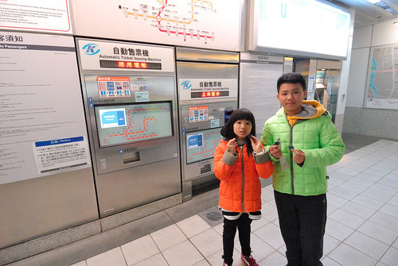](http://flickr.com/photos/33703965@N00/24471050613) 只是走在陌生的高雄車站  我們好些困惑也花了好些時間才從前站走回後站的商旅 新奇的感覺其實挺像在日本的旅行 雖然台灣這麼小 但每個城市其實都很不一樣 而這些都是要自己來過走過才能體會 [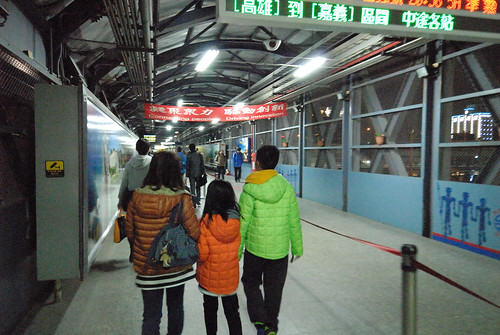](http://flickr.com/photos/33703965@N00/24802254770) 旅行難得住商旅 愛愛對於商旅的舒適與專業讚不絕口 臨走前 非要留上這樣一張留言表達她的滿意 [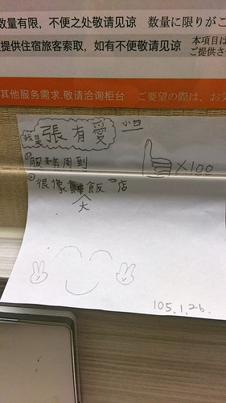](http://flickr.com/photos/33703965@N00/24979702302)

離開高雄 開往屏東  進入南迴 旅行第五天 我們才總算有離開人群  往心嚮往的東部去 南迴轉縣199往旭海的路很小但很靜謐 美麗的讓我第一次動念想單車大環島 繞過屏東經過旭海 [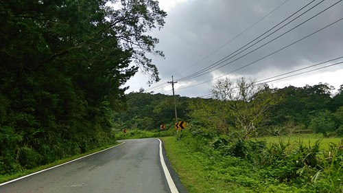](http://flickr.com/photos/33703965@N00/25071549456) 旭海比預期(其實也沒預期 應該說可以想像的)的小村莊還要小 且絲毫沒有觀光景點跡象 唯一的路上來回二趟 遍尋不到可以休憩 可以吃中餐的地方 只能往港口探機會 [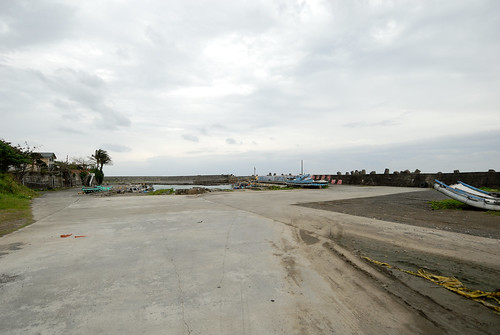](http://flickr.com/photos/33703965@N00/24467224744) 幸好有家紅牌海產店營業著 [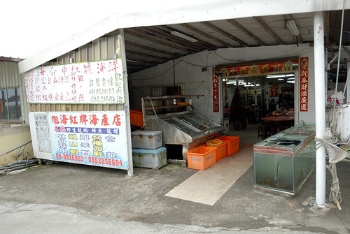](http://flickr.com/photos/33703965@N00/24979737612) 原只想簡單圖個飽的中餐 到底捱不住老闆的鼓吹 點了據說是特產 許多人專程來這吃的野生龍蝦 [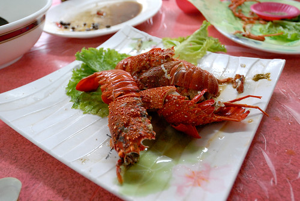](http://flickr.com/photos/33703965@N00/25097917935) 龍蝦雖小 要價不斐 而簡單清蒸的料理方式 完全凸顯野生龍蝦的鮮Q彈 最有口福也最懂得龍蝦鮮味的徹哥吃的意猶未竟  這半年常嚷著那個野生龍蝦好好吃 好想再吃 而阿母說那個幾口下肚的代價就高過一家子吃過最貴的海鮮大餐  人生有嚐過一次就足夠已 [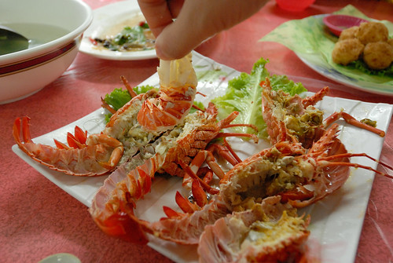](http://flickr.com/photos/33703965@N00/25004615441) 飯後 我們散步在港口內 [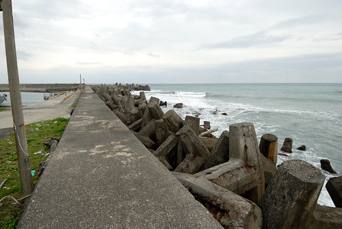](http://flickr.com/photos/33703965@N00/25004614961) 走到不遠沙灘處 [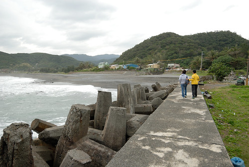](http://flickr.com/photos/33703965@N00/24802306900) 這裡應是暑假旅遊旺季時當地生態旅行熱鬧活動的港口 冬天裡一片蕭然 [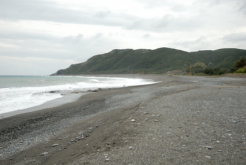](http://flickr.com/photos/33703965@N00/25071582416)  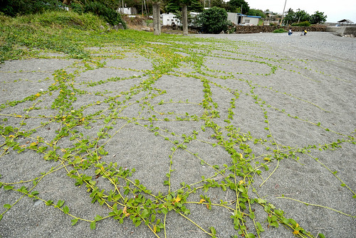 我們就石而坐 [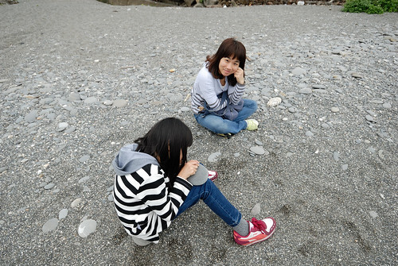](http://flickr.com/photos/33703965@N00/24802306080) 看海也玩石[ 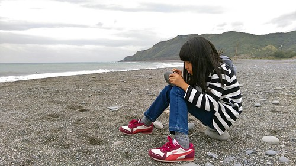](http://flickr.com/photos/33703965@N00/25097882315)[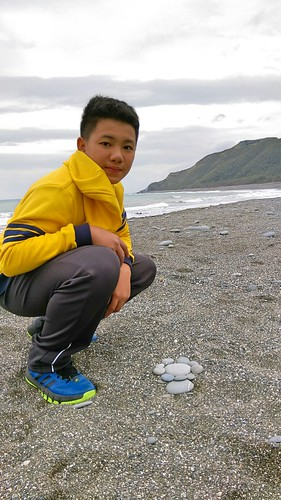](http://flickr.com/photos/33703965@N00/24730213859) [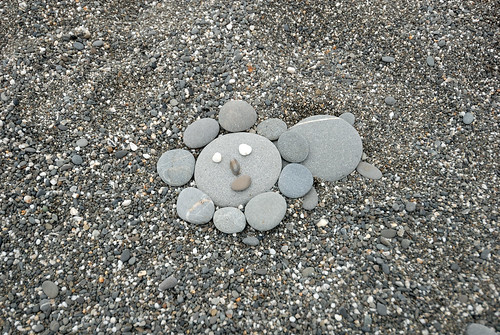](http://flickr.com/photos/33703965@N00/24730247869)

下午接著來到旭海大草原 這裡真的離墾丁好遠 實在佩服那些專程從墾丁來這看大草原的遊客們 [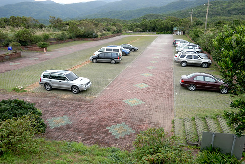](http://flickr.com/photos/33703965@N00/25071581166) 停車場很大 遊客中心外觀也看似新穎 不過不知是冬日疏管理或真是年久失休  入口意象並不是太好 [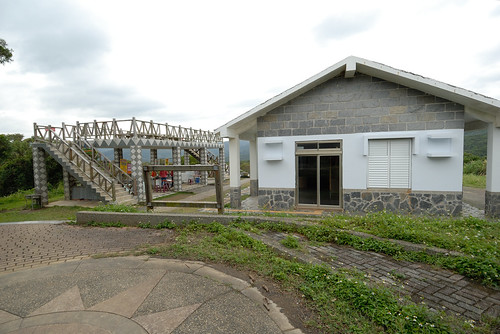](http://flickr.com/photos/33703965@N00/25004612191) 不過阿母還是滿懷期待地領著一家子要去大草原上找牛 [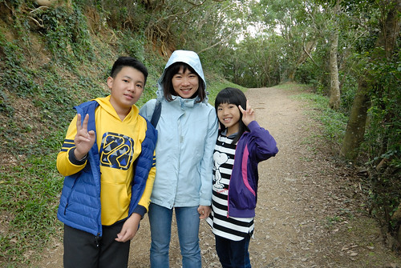](http://flickr.com/photos/33703965@N00/24979734422) 牛, 沒有想像的容易見得先走段步道 [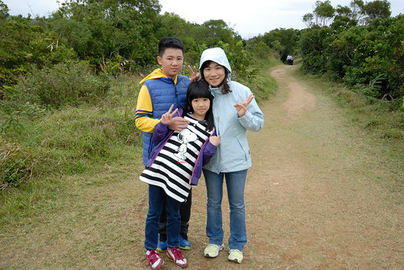](http://flickr.com/photos/33703965@N00/24979734012) 草原呢? 牛呢? 徹愛邊走邊一直問著 [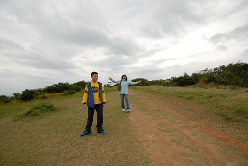](http://flickr.com/photos/33703965@N00/25097914145) 看著光禿禿的地 雖然心裡有譜但阿母也很難接受這樣的大草原 [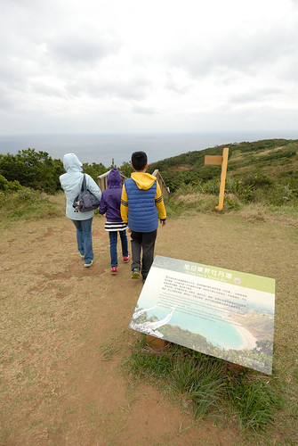](http://flickr.com/photos/33703965@N00/25097913755) 不過阿母還是不死心的 順著步道繼續走下去找牛  牛到底都沒有覓著 但旭海海之涯的氣魄卻體驗到了 [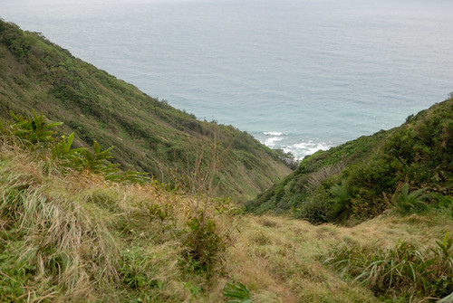](http://flickr.com/photos/33703965@N00/24802303170) 很美的連綿海灣線阿 [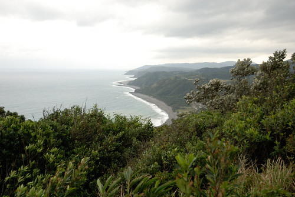](http://flickr.com/photos/33703965@N00/25097912935) 如果不是原先的期望太高 其實這兒也夠美麗,值得走一圈 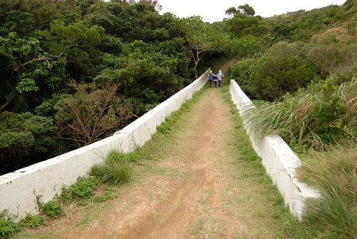 連綿高原讓人心曠神怡  回程最後路段 愛妹喊累發懶 徹哥自告發勇 很寵妹的揹起妹妹 [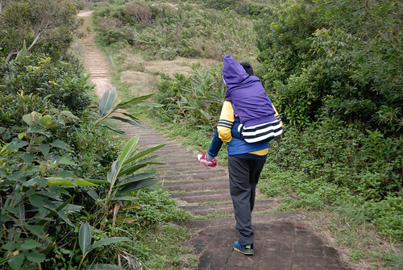](http://flickr.com/photos/33703965@N00/25004611051) 曾幾何時 我們家的哥哥已經長大到可以揹著妹妹還健步如飛[ 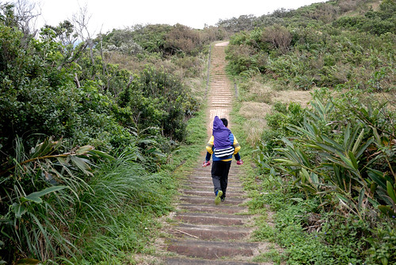](http://flickr.com/photos/33703965@N00/25097913095)這回旅行中 我們好多的感觸 好多的今昔對比湧上心頭 [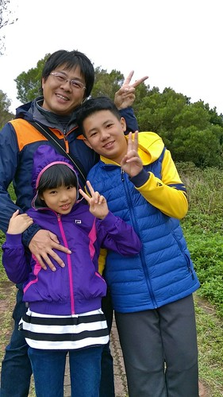](http://flickr.com/photos/33703965@N00/25004581191) 在哪次的旅行中  徹愛才那麼的小 徹愛跟著我們趴趴早 一晃眼已十年過去 歲月真的如梭 幸好我們對一家子這樣的旅行還能樂在其中 彌足珍惜 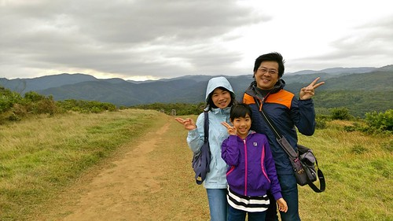 尤其大家隨遇而安的功力越來越強 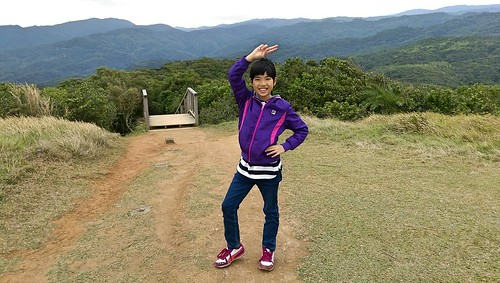 我們在這裝模作樣 [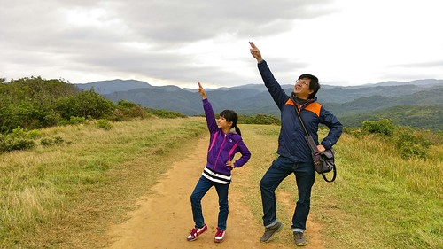](http://flickr.com/photos/33703965@N00/25071549986) 越比越high  眼前的景色也越看越是壯麗舒坦[ 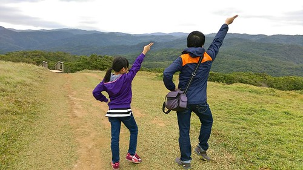](http://flickr.com/photos/33703965@N00/25071550076)開心到連很ㄍㄧㄥ的國中生也忍不住稍微放開矜持 [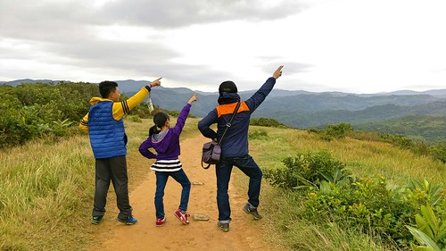](http://flickr.com/photos/33703965@N00/25097882705) 這麼多張照下來 也更明確清楚誰是我們家最有明星架式的 [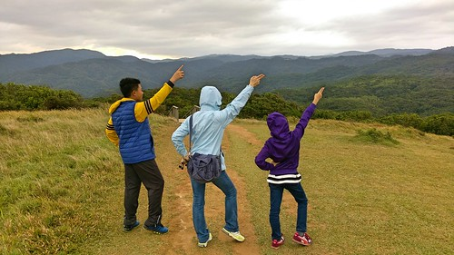](http://flickr.com/photos/33703965@N00/24730214559) 這一晚我們住在左岸民宿 也去泡了根本就是村子公共澡堂的旭海溫泉 而那個溫泉真的好啊~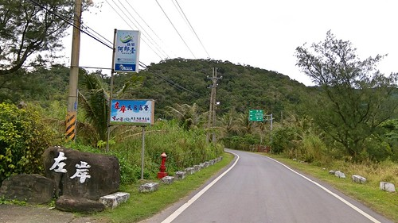 後記: 隔天走阿朗壹與解說老師問起旭海大草原 老師說本來真的有私人牧牛在旭海大草原 但後來當局考量牛糞有礙觀瞻而禁止 只是牛走了  草原也就不像草原了
