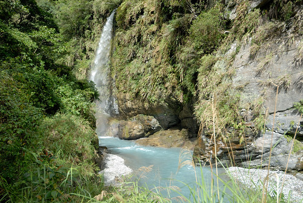

來賓 請掌聲鼓勵!  我在暑假前拚完寒假的環島啦! 果然有心就會有時間(寫)!!! 哈哈哈 最後一天 帶著森林浴後的清爽以及美食過後的滿足 我們要從花蓮殺回台北了  結束本來難以想像的九天環島旅行 九天 說長不長 說短卻也很長能走的地方其實也不多 但這回補足了許多過往沒去過的地方  算是圓滿了自己十年來的花東旅行! 口袋好像暫時沒有新名單 剛結束旅行的當下 我也心中暗誓要多嘗試些花東以外的旅行 只是暑假還沒到  我與徹爸忍不住又念起 好想去台東阿.... 好吧! 就算沒有新名單 當作回故鄉也是很棒的.............. 

台東到台北 真的路迢遙... 可以的話在花蓮住一晚是比較愜意些 很喜歡安排瑞穗作旅途的第一或最後一晚 為了綠精靈牛奶鍋也為了這兒的溫泉 原先訂了市區有規模的溫泉民宿 一樣意外間的發現瑞源 蝴蝶谷外的江佳民宿  下午四點多我們來到民宿 大門沒鎖 主人出門採買不在家 電話中要我們別客氣 自己休息 直到我們晚餐過後回來才見著主人  民宿就在蝴蝶谷入口外  民宿真的與蝴蝶谷有著交情 報上民宿名號 泡湯入門券可以打八折(的樣子) 據說六星級的度假村  溫泉SPA 其實比我們想像的弱  幸好我們向來就不是也走不起高價路線 不過旅行最後一晚可以享受溫泉 還是很棒低 泡完溫泉回到民宿  主人泡著茶招待今晚入宿的客人 我們吃著主人前陣子採收的玉米  聊著主人從台北退休後回到故鄉經營民宿的點滴與事蹟... 這又是另一種的民宿型態   濃濃人情味與就像"到鄉下住一晚"的樂趣  當初訂房時選擇的是以人頭計費的通鋪房間 費用不包含早餐 爬文時看到網友寫 民宿早餐有著自家雞蛋與青菜的上桌  好想吃啊 詢問主人是否可以加費用 留在民宿吃早餐 感謝主人的答應 而且還慷慨不收費!  在在感受真的是民宿的人情味  客人分批食用早餐  等候時我們在院子裡玩射箭  據說 跟賽德克巴萊一樣的箭  導演魏聖德認證過主人教我們射箭的技巧  看似容易 但不好射阿...  我們完全無法預測 出手的箭的終點在哪裡  沒想到 我們嚷著太難 不可能射中的10分 竟然suddenly射到了 是誰? 這麼好狗運  在下 家母是也! 雖然父子倆難以置信的嘲笑我是矇到的 但我就是射中了 是事實! 就算真的只是運氣好 我還是很樂~哇哈哈  一家子輪流射箭 玩得不亦樂乎  有住 有吃 有玩 最後還有伴手米可拿 真的是讓人難忘的超值民宿  離開民宿後 我們拿著前一晚SPA的入門票繼續再入蝴蝶谷 走富源國家森林公園的步道  或許BOT的經營可以讓園區更有特色與品質 但老實講也抹去了許多原始  我們的旅行就要結束了 還偏偏到最後的第九天天氣才大好 我說更要好好大口呼吸  最後多吸收點芬多精阿  電影院的蝴蝶谷廣告實在打太兇 我們對這裡的湍流溪谷與吊橋 相當有印象  所以剛好以廣告中 小孩奔跑的那座吊橋為我們今早健行的目標  回溫的天氣 讓徹愛走得有些小嘟嚷  但也明白苦中作樂 好好享受這段健行才是王道  所以父女倆繼續比一比 延續高亢的情緒   依著溪流的步道 很好行  溪流裡的巨石也壯麗的不輸慕谷慕魚  只是我還是不懂為什麼這樣的自然景觀要BOT阿? (我對BOT案真的很沒好感)  接下來要往那座最老 最長的吊橋 需要辛苦點爬階了  這就是廣告中 有小孩奔跑著的古吊橋  我們光是站在橋中央 看下溪谷就忍不住發抖 要奔跑 真的太難也太危險捏  完成健行目標  讓人神清氣爽  也可以說破天荒在台灣環了九天  讓我們屁股翹了起來我們踏著輕快的步伐往回程走  也開心討論著要上哪好好吃旅行的最後一頓飯  我們選擇了鳳林 三立冰淇淋對面的三立餐廳 每回來吃冰淇淋就很好奇的三立餐廳  出乎我們意外 雅致且有質感的一家店  平民的價格 但上桌的每份餐點都擺盤的不馬虎  味道也非常的好   而最後的甜點也是老闆從對面端過來的三立冰淇淋 (連原本要吃冰的錢都省了) 更是深得我們心 以後到花東又多了一處喜歡的吃飯地了 真棒! 
