感覺不久前我們才剛從花東環島回來 怎麼又要去環島了... 其實不就是我們又想去花東玩 只是不知不覺往花東的路漸漸變成一圈圈的環島 還越來越習慣這樣的長途 不過以往環島的目的都只在花東 其餘都只是經過 這回總算貨真價實的 一路從嘉義,台南,高雄,屏東玩到台東,花蓮 所以九天其實不算長 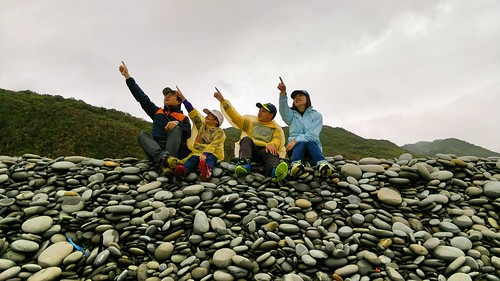

1/23 (六) 嘉義阿里山 特富野步道 -> 宿達邦 給巴娜民宿 宿阿里山救國團青年活動中心 1/24 (日) 特富野古道(台18線 96.5K) -> 宿嘉義阿公家  奮起湖 1/25 (一) 台南台江漁樂園搭膠筏 -> 安平樹屋, 德記洋行 -> 宿作夥憩海邊 1/26 (二) 安平運河 -> 高雄科工館 -> 愛河之心 -> 宿康橋飯店後譯九如館 1/27 (三) 屏東旭海大草原 -> 宿旭海左岸民宿 1/28 (四) 阿朗壹步道 -> 宿知本名泉溫泉 1/29 (五) 知本國家森林遊樂區 ->台東市藍蜻蜓中餐 -> 小野柳 -> 金樽咖啡 -> 宿成功六號交響曲 1/30 (六) 隆昌麵包與巧克力 -> 東河橋 泰源幽谷 -> 台23至富里  -> 宿瑞穗江佳民宿 1/31 (日) 富源蝴蝶谷 -> 鳳林三立小館 -> 回家

其實我們例行性的旅行只能算七天 往前延伸的二天是順道與玟姿及燕華來個阿里山特富野古道之旅 怎奈遇上百年難見的大寒流 斷了往達邦民宿的路也亂了我們的行程 我們決定往更高的阿里山青年活動中心住一晚 滿心期待一夜醒來的白了山頭 怎耐雪在我們下山之後才開始下 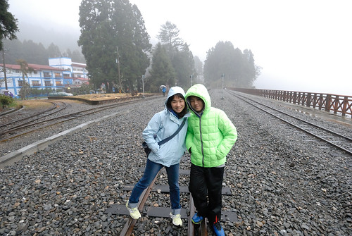 但意外的多留宿一晚在奮起湖 還是讓我們第一次在台灣看見飄雪 (沒想到北台灣的雪下的更是亂七八糟 讓徹哥大嘆早知留在台北看雪就好) 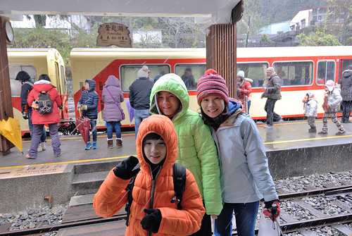 第三天回到嘉義阿公家再出發往台南時 我笑說我們的環島才正開始呢 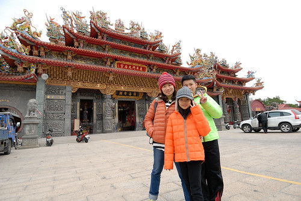 徹哥國中歷史課本上教的鄭荷大戰 愛妹社會課本上提的安平古堡 趁著這回我們第一次來到台南的安平 上一代教很少 這一代教很多的台灣史  來到這躍然紙上 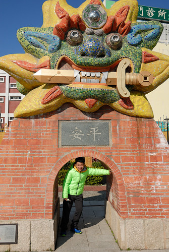 第四天 我們繼續到高雄 徹哥指名想去的高雄科工館  這回總算走了所有展館也看了一場全家公認看過最好看的博物館3D電影 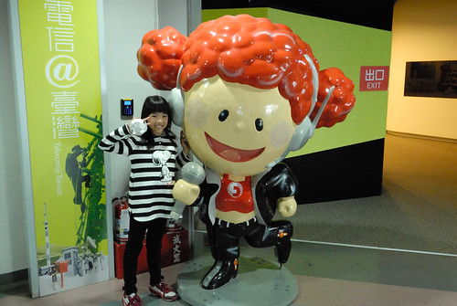 夜訪據說超級美麗的愛河之心  感受高雄的繁榮進步 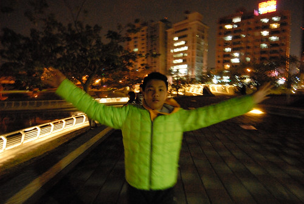 第五天 來到屏東的旭海 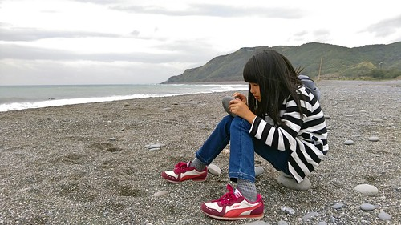 嚮往很久的旭海大草原 卻看不見草原的大與牛 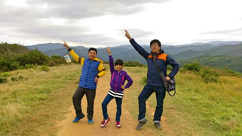 阿朗壹 天候不佳沒有夏日那樣的蔚藍美麗 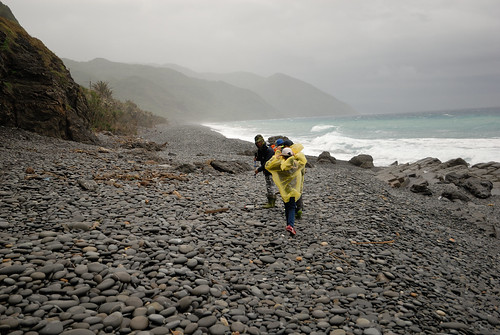 但還是徹愛很喜歡的地質與生態教育探險 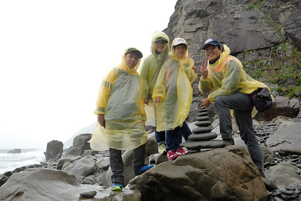 第六天 我們總算來到台東 感覺這回到台東的路好久 好遠 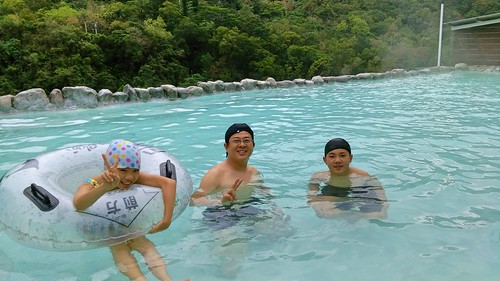 雖然知本是很芭樂的景點  但這兒的溫泉與我們第一次到的森林遊樂區真的還不錯 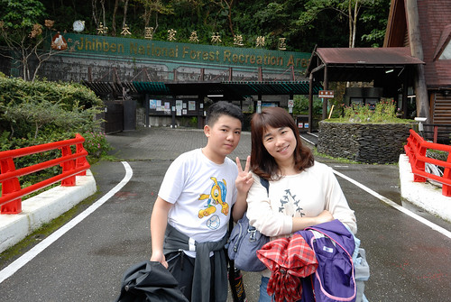 花東 這回反到成了我們的經過 不過也還是可以慢慢開 同時補足一些我們沒去過的地方 第七天 台東市在地的藍蜻蜓炸雞店 小野柳 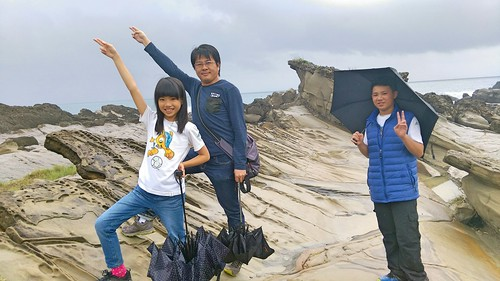 金樽咖啡 才發現這的海岸線好漂亮 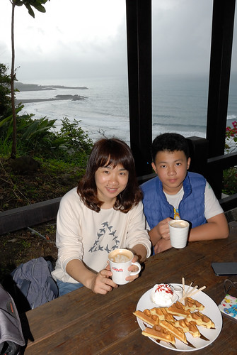 想住的東河訂不到合意的民宿 卻意外找到成功的六號交響曲 這回住宿預算控制得比以往低很多 我說這今晚是這回住的最享受最愜意的 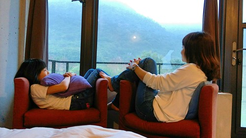 第八天 我們到舊東河橋 泰源幽谷 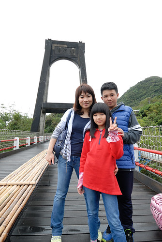 我們花東旅行拼圖中 唯一一直覺得缺著的這塊總算拼上了 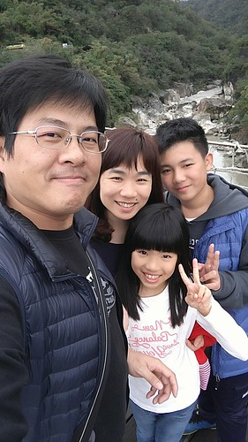 從東河 我們走台23線穿到縱谷的花蓮富里 然後到這晚預訂的瑞穗 一來是縮短最後一天回家的路程 再來也是想念瑞穗 綠精靈的牛奶鍋阿 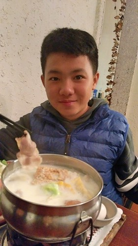 這晚我們住在瑞穗 瑞源村富源蝴蝶谷...外的江佳民宿 (BOT的蝴蝶谷villa實在不是普通人家住得起) 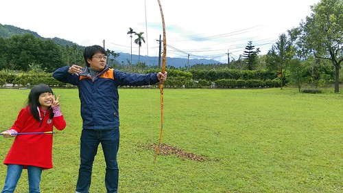 江佳又是截然不同的民宿風格 挺有意思 而話說這對父女真的一天比一天搞笑 儼然以搞笑二人組為樂 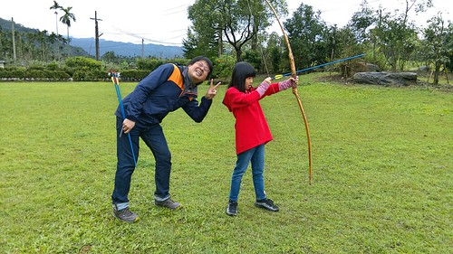 最近去電影院看電影總會看到蝴蝶谷渡假村的廣告 雖然住不起 但來泡了這兒的溫泉SPA 走了富源國家森林公園的步道 愛妹忍不住直好奇&嘀咕這就是六星? 原來是這樣... 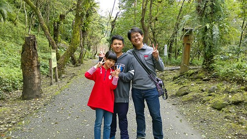 第九天 總算我們要回家了 感覺前幾天去的地方好像是很久前的事了 可是又感覺我們才玩沒幾天 怎麼又到旅行結束的時候了 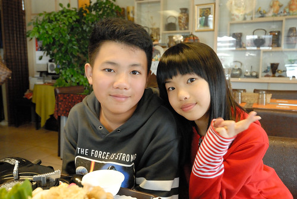 十年來不下二十次的花東旅行 第一次(總算)讓我在即將結束之際沒有對於下ㄧ次的想法 這回之後徹家的花東瘋算是暫告個段落 同時隨著徹愛一個個長大轉青春 心境不同或是現實的限制 我們的旅行方式是將進入另一階段了 怎麼變化 還不曉得  不過所謂有夢最美 築夢踏實~ 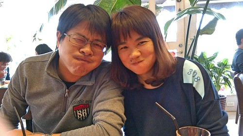 不免俗的要謝謝老爺一開始傻傻答應請五天假 隨便我安排 然後無怨無悔跟著真的安排了九天的老婆出門 傻傻地開車上山下海 盡興的吃胖胖還每天搞笑 真不愧是我們的一家之主阿!!!
