雖然阿朗壹古道在2015年10月起以安全因素暫時封閉臨海路段而沒法走全程, 很美中不足 也知道夏日的阿朗壹海岸才最蔚藍美麗, 冬日得看老天的臉色 但莫名的渴望 就想在這次的環島旅行中踏上聞名很久的阿朗壹 而已過了申請期限的一個月內還可以透過民宿安排到 我願意相信這就是冥冥中有安排...

最後我們的阿朗壹之行 果然老天不賞臉而天灰灰 還因風雨太大 連最原先預期的終(中)點也沒能走到 幸好我們出門在外, 向來安全為重也不怎麼執著 反倒享受了一趟豐富自在的生態教育旅行 更甚挑戰古道的成就

前一晚的大雨讓我們擔心這下怎麼走阿朗壹阿 但連住宿的套裝行程  也只能冒著風雨走一步是一步 謝謝導覽員(鐘明芳老師)載著我們直驅到步道口   從這裡開始徒步進入旭海觀音鼻自然保留區 是的! 要申請與有管制的是觀音鼻自然保護區而不是耳熟的阿朗壹古道  出發前 老師拿出他的開山刀讓愛愛擺出如勇士出征般的POSE照相 [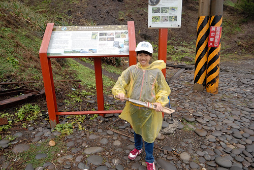](http://flickr.com/photos/33703965@N00/25004610181) 然後跟著老師的腳步 進入嚮往很久的阿朗壹 [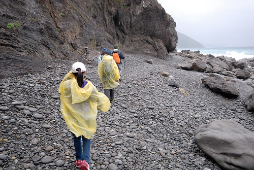](http://flickr.com/photos/33703965@N00/25071578416) 同之前看過的照片 一樣的礫石灘   一樣的連綿海岸線  但灰濛的天空添了些神祕  連接台東達仁鄉南田村與屏東牡丹鄉旭海村的阿朗壹 是環台灣公路唯一斷掉的一段 曾經政府要在這開通台26縣道 引起環保團體的抗議後 部分路段納入觀音鼻自然保留區 開發與環境保護之間的爭議一直仍存在著 但這裡保留了完整的海岸原始森林與地質景觀 [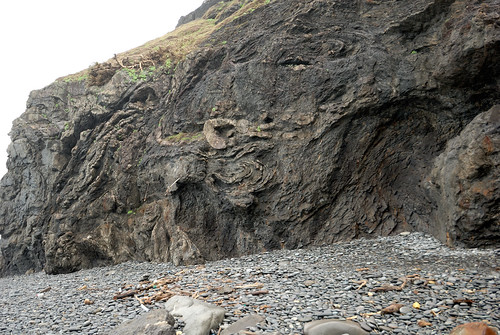](http://flickr.com/photos/33703965@N00/24979731252) 是連國外學者都讚嘆不已的大自然教室 [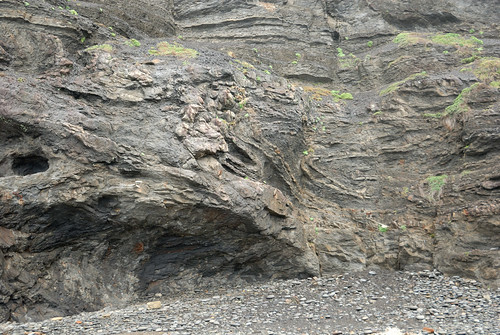](http://flickr.com/photos/33703965@N00/24802300610) 好一陣子的壞天氣 讓許多垃圾被海浪拍打上岸 [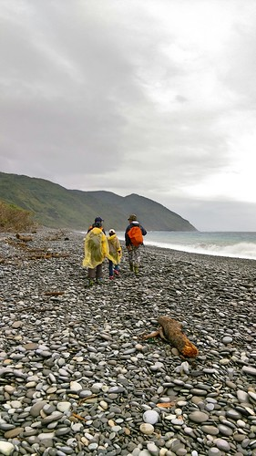](http://flickr.com/photos/33703965@N00/25071550556) 許許多多來自大陸 日本 甚至韓國的寶特瓶  讓人震撼垃圾的無遠佛屆 [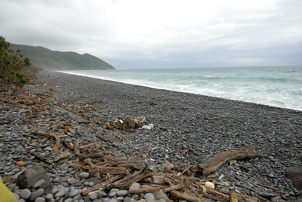](http://flickr.com/photos/33703965@N00/24730242589) 漂的久一點的垃圾竟也成了海洋生物寄生的依賴 [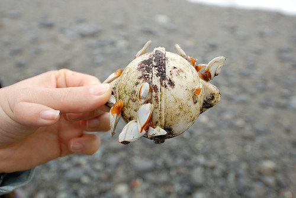](http://flickr.com/photos/33703965@N00/24467169464) 再看到岸上奄奄一息的小海龜   真的覺得人類對於環境的破壞遠遠超過所獲得  古道的基石早已不可考  路也不是唯一的走法 或臨海的礫石灘或走進林間的小徑  隨導覽員引領串連著只是天雨泥地不好行  我們只好走其實也不好走的礫石灘  南田石很美 [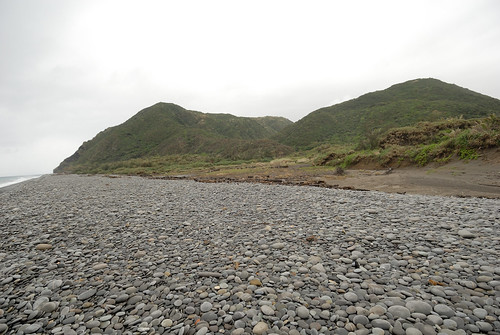](http://flickr.com/photos/33703965@N00/25071576976) 走在上頭 喀喀作響  南田石也圓潤的讓我們讚嘆不已  要經過怎樣的琢磨才能成就一顆顆的雞蛋貌  也經歷多大的風浪才能堆疊出這樣的石頭壩  鐘老師指導我們坐在這 留下難得的回憶 [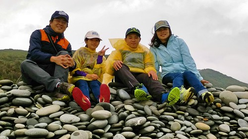](http://flickr.com/photos/33703965@N00/24467189894) 天空不作美 但這裡還是好美 [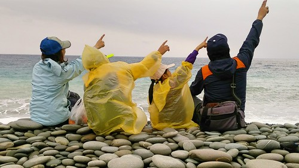](http://flickr.com/photos/33703965@N00/24467191944)

風雨隨著我們的行程與心情一起進入高潮 [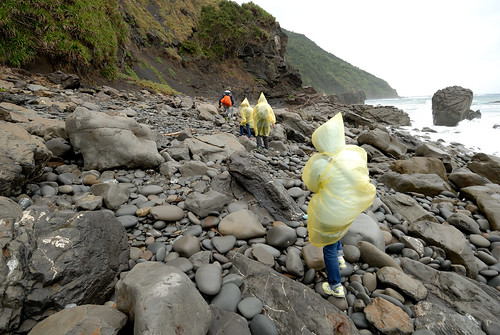](http://flickr.com/photos/33703965@N00/24467216134) 不好行  但我們跟著老師腳步盡可能地走[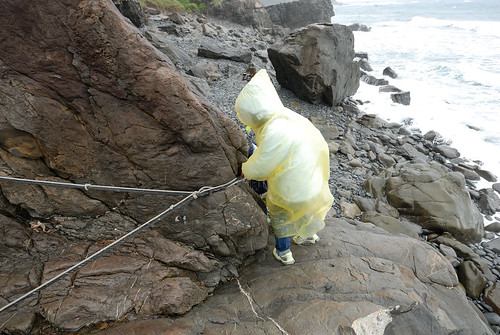](http://flickr.com/photos/33703965@N00/24471039623) 景觀真的很美  只是浪也越拍越猛   安全考量  我們不得不就此打住 休息吃點民宿準備的點心後就返程  [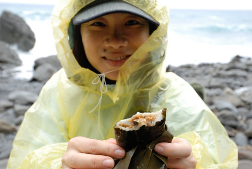](http://flickr.com/photos/33703965@N00/25004606431) 休息時間 我們又把玩起石頭  真的很像雞蛋阿... [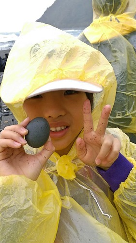](http://flickr.com/photos/33703965@N00/25071552236) 鐘老師也熱情回應 解說我們提的各式奇奇怪怪問題  也繼續指導他明顯疼愛的愛愛擺各式照相姿勢  [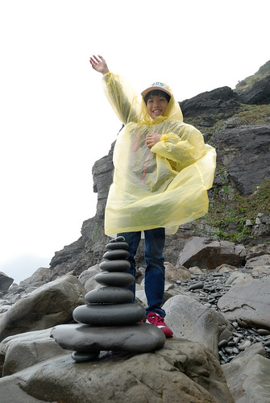](http://flickr.com/photos/33703965@N00/24730239179) [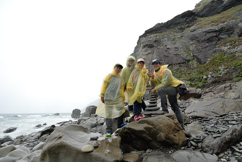](http://flickr.com/photos/33703965@N00/24730238779) 回程風雨漸歇  走來更愜意  映入眼的海岸線又是不一樣的風情 [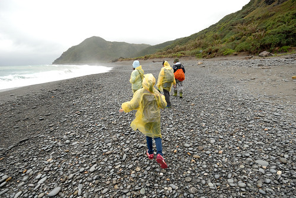](http://flickr.com/photos/33703965@N00/24730238279) 延續昨天在旭海大草原的架式  在這最美麗的海岸線當然也要來一PO  謝謝解說員,鐘老師的帶領 幫我們上了一堂豐富的自然課 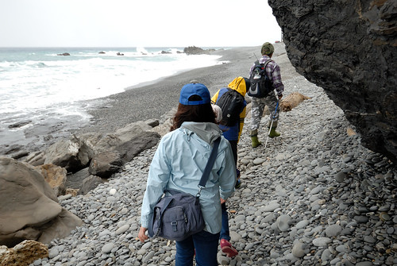 我一如往常的不貪心  只期望小種子有撒在徹愛的心田裡 [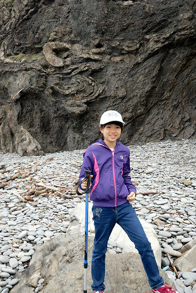](http://flickr.com/photos/33703965@N00/25004604071) 雖然我們的阿朗壹不只沒有全段 連中段的制高點也沒能走到 但我們很開心...  而不管有沒有達陣 一定要在英雄榜前來個讚  留下個到此一遊照嚕 [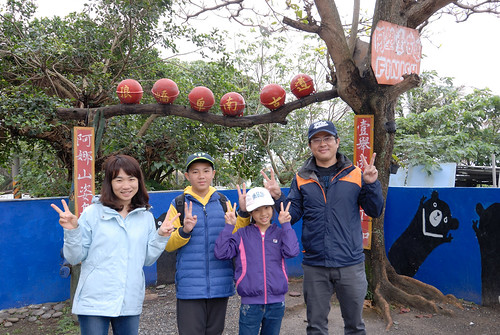](http://flickr.com/photos/33703965@N00/25097904795) 話說 有機會我們好天氣的季節再來走完阿朗壹吧~
