所謂計劃比不上變化  這回旅行的大冷連雨讓我們第一次嘗到苦頭 吃了好些閉門羹 但伴隨著變化就也容易有出乎預期的驚喜發現 我們進不了達邦也走不成特富野古道的阿里山行 顯得超級無為 但一家子難得瘋狂的臨時起意多停留奮起湖一晚 雖然沒見滿山靄靄白雪 但飄雪那刻的驚喜與滿足就夠讓我們津津樂道一輩子了 [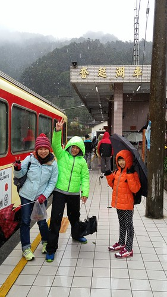](http://flickr.com/photos/33703965@N00/24471069283)

跟玟姿,燕華 三個大學同學說好久的旅行 總算在這個寒假再成行 還大大出乎我意外的 燕華答應拉一家子出遠門到嘉義阿里山上 三個同學三個家庭 一行16人在第一天會合在石棹達官現炒吃中餐 吃完中餐 連綿下雨天 老老少少沒人想走步道 只能轉移陣地到鄒族園喝咖啡王子的咖啡  我跟徹爸每每上隙頂生力農場買茶時 總會被招待好喝的農場咖啡 對於阿里山的咖啡深具信心 [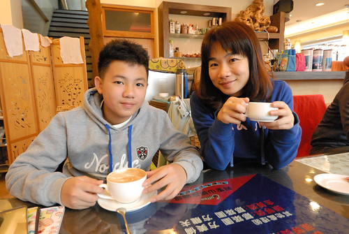](http://flickr.com/photos/33703965@N00/25071608456) 咖啡王子很有名聲的冠軍咖啡 讓第一次嘗試喝咖啡的徹哥愛不釋口 喜歡上好咖啡的香醇順口  喝完咖啡 一行人打算早早下榻今晚在達邦的民宿 怎奈唯一(好走)的聯外169公路因為連日大雨而有路段落石滾滾 雖然電話中醉茫茫的民宿主人鼓勵我們就趁空檔衝過來 但...出門真的平安最重要阿! 一行人在路邊掙扎 討論許久 最後決定既然不想就此下山那就往更高的救國團青年活動中心挺進吧 那兒下雪的機率應該更大...  青年活動中心所在的二萬坪 白茫茫一片 很冷 很濕  大家滿心期待溫度一度一度的降低   [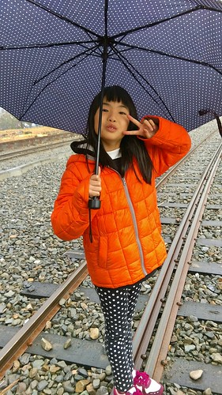](http://flickr.com/photos/33703965@N00/25071548126)  趁著天黑前 撐著傘走走鐵道 [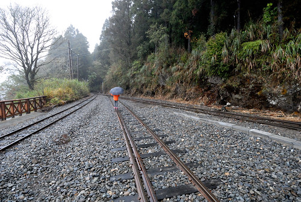](http://flickr.com/photos/33703965@N00/24730202759) 還有很短很短的二萬坪黑森林步道 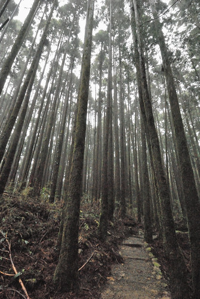 不是坐車就是吃東西的一日 總算稍微活動了  雪沒有如我們預期的飄下來  即使一夜過後  而我們只有冷的窩在房裡 玩牌打發時間  (好快~ 小姑娘們都長大了)  第二日早餐過後 臨時宣布的雪地交管逼的我們不敢往園區(古道)挺進 怕上的去下不來 只好認賠似的 摸摸鼻子趕下山 只是不甘願這樣就下山  還是在中途繞進奮起湖 [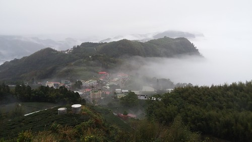](http://flickr.com/photos/33703965@N00/25004636531) 奮起湖 有湖嗎? 我們認真討論著 原來奮起湖古名畚箕湖 是一個被三面山環繞的聚落 而僅在西南方有出口(沒有山)的盆地就像一個畚箕 所以奮起湖是看不見湖滴 只是這天的雲海漂亮的很厲害... [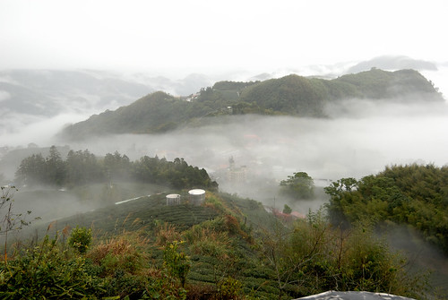](http://flickr.com/photos/33703965@N00/24802328030) 我們曾經來過奮起湖車站 但還真忘了什麼時候來 來這裡做了什麼 只記得是連鐵路便當都沒吃的走馬看花吧  是打發時間也是難得的機會  我們走過老街 走到好像很有名氣的甜甜圈店 | 來到幾米的星空小屋 [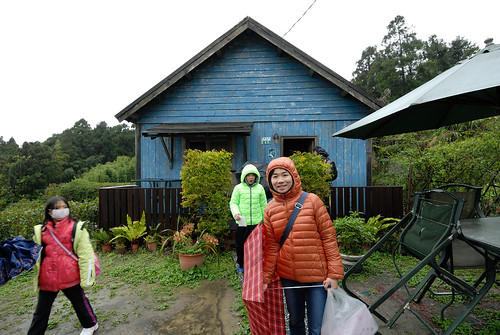](http://flickr.com/photos/33703965@N00/25097938925) 媽媽怎樣也要跟步道沾一下邊的梢楠母樹林 [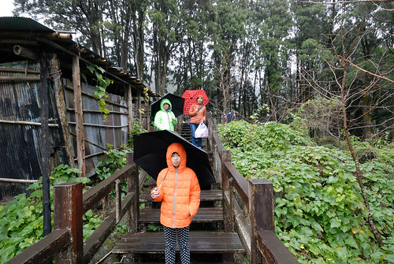](http://flickr.com/photos/33703965@N00/25097869975) 而中午散會前 當然一定要來顆經典奮起湖便當 [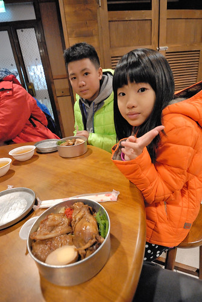](http://flickr.com/photos/33703965@N00/24471069223) 吃完便當與燕華一家再會後 還留在老街上晃蕩的我們 買愛愛要喝的山粉圓時跟老闆娘抬槓著奮起湖幾十年前曾經下雪 老闆娘說 照已經接近零度的態勢下去 奮起湖再下雪的機率非常大 徹爸跟徹哥一整個被撩起興頭的想親睹這場盛會 然後我們尋到老闆娘介紹的老街上旅店 問到可接受的房價與老闆分享的以前雪景美照 吼~ 好像不留在奮起湖等雪實在太了然 [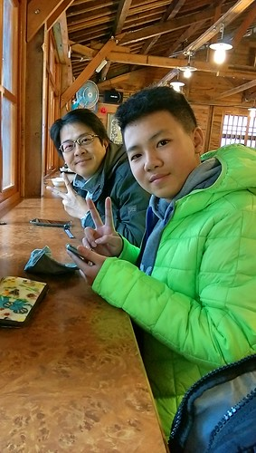](http://flickr.com/photos/33703965@N00/25004578171) 於是我們訂了房間  然後窩在老街上的茶樓休息喝茶等下午的入房  阿里山茶很好喝 暖手暖身 [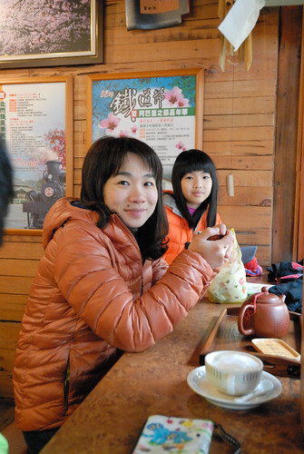](http://flickr.com/photos/33703965@N00/24802326480) 而一家子難得的瘋狂(這樣的決定對習慣先計畫的我們來說真是不可思議) 讓我們雀躍  沒想到在茶樓 還沒等到可以入房卻看見窗外開始飄起絲絲細雪 以及聽見老街上遊客的驚呼聲 [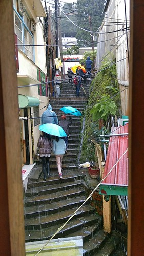](http://flickr.com/photos/33703965@N00/24471011933) 雪 真的讓我們等到了!  我們往車站尋熱鬧去 [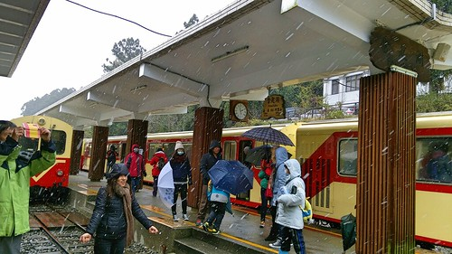](http://flickr.com/photos/33703965@N00/25071548146) 果然每個遊客都好開心

 第一次在台灣看見雪的我們 興奮阿~  雖然這場雪下了半小時後就停了 而且絕無僅有了 有點枉費我們這多留宿的一晚  但若沒有中午決定的留宿其實我們就下山也看不見這場雪了 而其實去年才在日本意外大玩雪的我們 這場雪留在我們心頭的是曾經我們一家人瘋狂在奮起湖等雪...  停留在奮起湖一日一夜 很多時間我們是窩在房間內等待越夜越冷越下雪 很多遊客也抱著這樣期待的心留在奮起湖 讓據說向來入夜後冷清的老街 那一夜好不熱鬧  (好冷也是真) 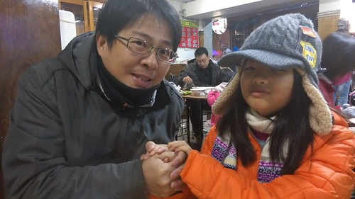 隔天一早醒來 我們第一件事就是拉開窗簾看 恩~ 這天氣會不會變得太好了...  雖然徹愛挺失落 我說換來好天氣展開我們的環島行不也很棒~ 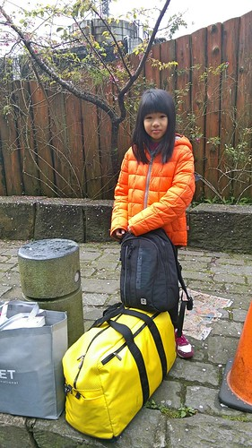 度過最冷的前二日  拋下最厚的衣物在嘉義阿嬤家 我們繼續帶著四季衣服環島下去~~~
