寫完上一篇澎湖那天 還沒更新進度的徹哥問我: 你還在澎湖喔! 什麼時候才回台灣阿?

呵呵~ BLOG的澎湖真的玩好久...

阿母要繼續寫回台灣甚至寫到新加坡, 還真的挺考驗

去年七月玩了一趟澎湖

也趁著徹爸剛好轉換工作的空檔 月底回嘉義時順道追加寒假沒走到阿里山特富野古道以及東埔溫泉! 雖然是周日 但暑假中要臨時訂房也不是件容易的事(也得承認我們對住房有一定的要求)

隙頂 阿里山想訂的都訂不到, 最後住在石棹的民宿 

傍晚前抵達石棹 剛好可以來個茶園小散步暖暖身 

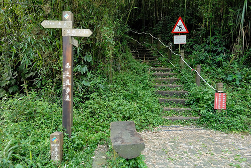

山上天氣涼爽  非常舒適舒服

很是適合愛放空的我們 隨意走隨意看 不想走也沒關係... 

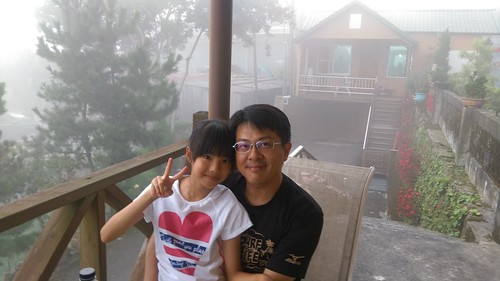

石棹一夜好眠  第二天早餐過後出發往阿里山特富野古道 

山下36的高溫  山上的我們卻冷到需要長袖長褲  有來避暑的小幸福 

我們並未打算走完古道全程  預計就是半途大部分遊客休憩返頭的地方

時間優裕 我們就邊聊邊走 邊走邊拍照 

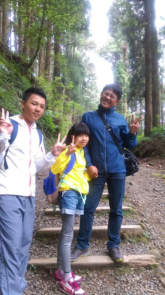

特富野古道的林間加鐵道 真的很美很好拍

尤其是大手牽小手的畫面 特讓人感動 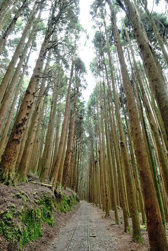

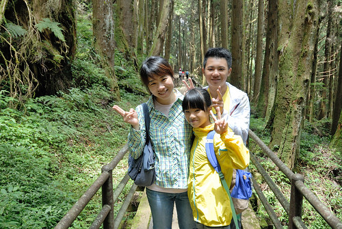

雖然我們有準備了御飯糰來這午餐  看到別人的泡麵還是很羨慕... 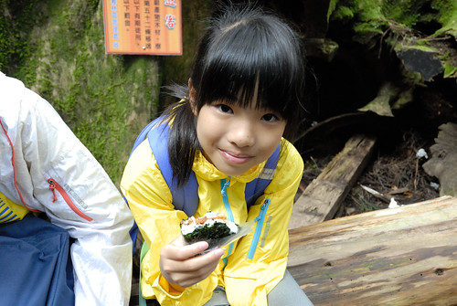

我們花了三~四小時走古道  下午一點多順著阿里山新中橫公路往南投東埔溫泉

沿路大霧白茫茫一片 完全沒視野的走完新中橫

到達東埔後  東埔溫泉街的冷清落寞也讓我們大驚訝 

雖然一家子都怕高 我說這吊橋不走就不知道東埔還能去哪走走看看了 

雖然印象中東埔溫泉曾因颱風而沒落 但真的完全沒想到如此之蕭條 

景點太弱 於是更想好好吃個晚餐

努力上網找 幸運的訂到一家熾手可熱民宿餐廳的烤雞(是的! 難的是臨時要訂到雞)

好大 好香 好金黃的烤雞 

好大的雞加上每盤也都好大的菜  厲害的我們家還是一如既往地吃光光 

起碼有這頓豐盛的晚餐 安慰我們在東埔的空虛 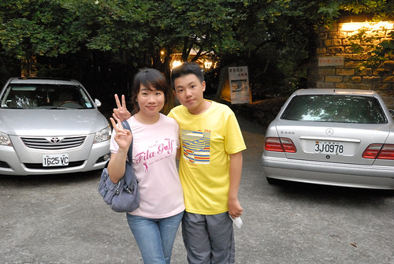

不過其實東埔是爬山的聖地 是八通關古道西段的入口

既然知道了這裡的山這樣厲害  隔天早上當然要來去古道沾沾汗水 

越往高走越能感受群山環繞的壯闊與靜謐 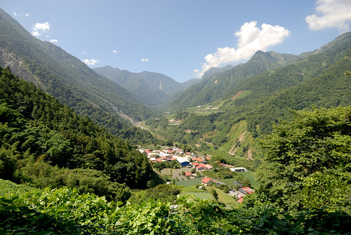

只是不在安排內的健走 加上天氣熱讓愛妹妹很抗議 

有名的親不知子斷崖 小落石持續滾滾而下 

不佳的路況 更讓愛愛走的澳嘟嘟 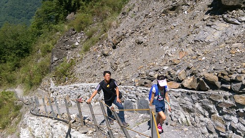

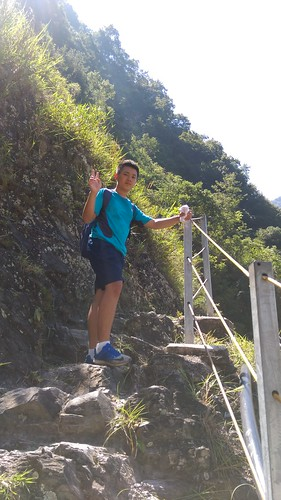

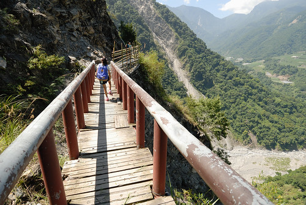

如果有心理準備 如果天氣沒那麼熱  這段古道其實好美 很值得再多走一些的 

走到預定的折返點  兄妹倆怎樣都不肯再被我們坳再繼續走

要返程的兄妹也總算笑了 

本來哄著徹愛來走古道是這裡有山友們大推的好吃愛玉冰

可惜今日休息  殘念~ 

不到中午我們便離開東埔往山下開

捨不得這麼早回家 捨不得結束旅行  捨不得這個暑假的玩樂就要畫上句點

我們往國道的方向開去  然後突然就岔往日月潭

上次來日月潭已經是十年前 愛愛二歲左右的事了

日月潭建設得更多 更熱鬧了!

(順道回味一下以前: [https://hmchen1975.tian.yam.com/posts/14102714](https://hmchen1975.tian.yam.com/posts/14102714) [https://hmchen1975.tian.yam.com/posts/14114011](https://hmchen1975.tian.yam.com/posts/14114011) 有張阿徹的經典照片 呵呵 )

正中午 我們剛好先到水社遊客中心吃MOS 參觀紙箱王 

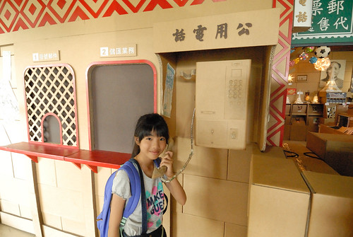

我們臨時想來日月潭 其實是為了慕名很久的日月潭環潭車道 

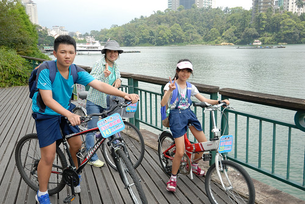

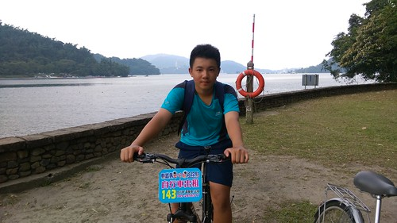

雖然車道沒有預期的那樣完整 完備

風景也沒有 我回憶中超美的湖光山色那樣

但一家子騎的是熱血  (哈哈)

話說日月潭的幾個遊客中心都蓋的好氣魄 漂亮啊 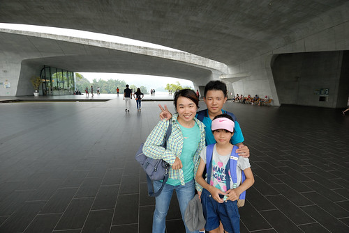

去年夏天  我們下海又上山

因為徹哥下一個夏天徹哥就是準考生了

我們有一種過了這個夏天恐沒下個暑假的心情 特別熱血 特別珍惜|

雖然事實證明 小孩長大就是變得不愛跟 不愛走  跟是不是考生根本無關

很是慶幸小孩還小時 我們曾經一起走過台灣這麼多地方

留下這麼多共同的回憶

讓我們每每開車經過曾經走過的地方時 總有這麼多的回憶可以一起回憶~ 
