想去澎湖很多年了 因為這裡是我跟徹爸大學畢旅的地方 只是聽說澎湖的夏天很熱鬧  加上愛愛連坐公車都能暈車的體質 我們遲遲沒有行動... 今年五月中  總算下定決心來去澎湖吧! [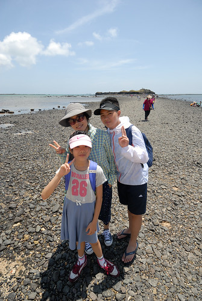](http://flickr.com/photos/33703965@N00/28123368780)

趕緊上網訂機票 果然訂機票是去澎湖旅行最難的一件事 免強訂到還可以接受的來回機票 接下來就每隔一段時間的查民宿 訂民宿 以及最後的活動預訂 功課沒有做很足  抱著隨遇而安的心情我們出發了!

星期三傍晚六點半飛馬公的飛機 就如第一晚民宿主人形容得很奇怪的飛澎湖時間 沒辦法! 總總考量四個人的工作,暑假活動時間後  星期四是最佳的出發時間 可惜週四完全沒票 那我們就在周三都忙完後的傍晚出發吧 雖然到澎湖天早黑 只能回民宿睡覺了 但起碼一覺醒來就是嶄新一天的開始!

我們第一次拖著行李搭捷運到松山機場  加上很久沒聞的機場氛圍讓人有仿如踏出國門的興奮感 [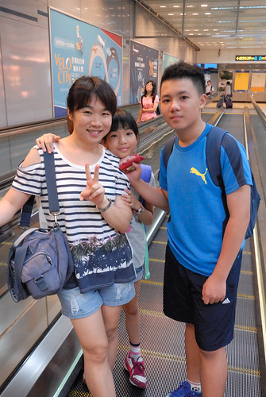](http://flickr.com/photos/33703965@N00/28372900016) 徹爸三不五時拿出相機拍 好像真的出國觀光似   連晚餐吃MOS也拍.... ^ ^" 

班機比預定時間延誤一個鐘頭 [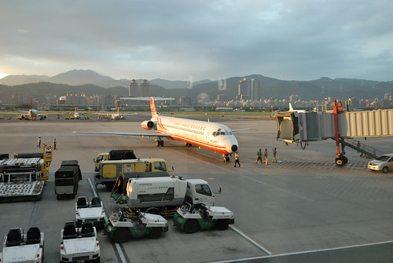](http://flickr.com/photos/33703965@N00/28123261060) 在候機室的我們只能看著飛機來 飛機整理...  等著我們什麼時候可以上機飛去澎湖...  飛機起飛時 天黑了! 到達馬公走出機場 晚上八點半了!! 在民宿主人的協助下 租了機車  騎回民宿已是九點半!!! 果然我們飛來澎湖的時間真的很奇怪.... 哈

不過隔天早 在澎湖的陽光下醒來 [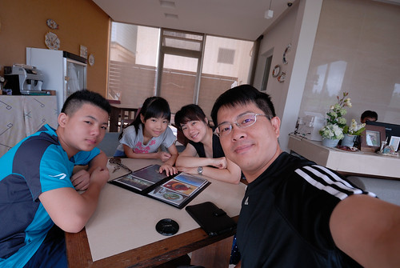](http://flickr.com/photos/33703965@N00/28301682382) 在民宿的悠閒早餐過後開始我們的澎湖行 真的很好啊!  尤其第一餐就是濃濃海味的海鮮粥  元氣滿點 [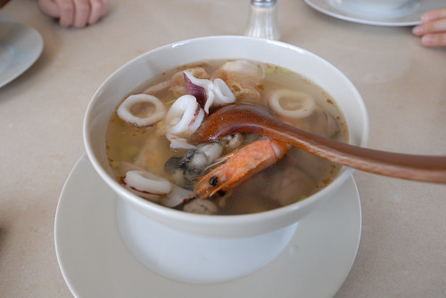](http://flickr.com/photos/33703965@N00/27789385324) 早餐過後 我們出發往第一個景點 奎壁山的摩西分海 配合每日潮汐時間 我們謹遵民宿主人交代在上午十點前到達 大學畢旅時還不曾聽過的地方 沒想到竟是熱門大景點 (徹爸說從沒看過停的這麼整齊的機車) [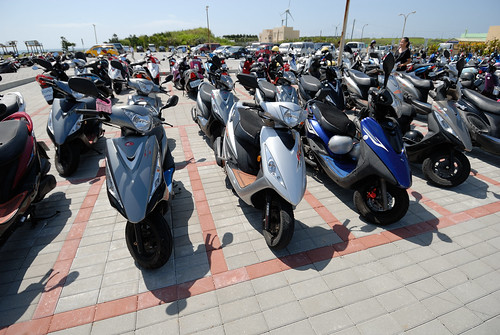](http://flickr.com/photos/33703965@N00/28372934116) 海漸漸地分開了!  可是人潮密度遠遠高過分海的速度 看不清漸漸裸露的S型玄武岩步道 倒是人潮行進隊伍的S型清晰可見  加上日頭赤炎炎  完全不能如原先預想的閒情逸致 坐在一處靜看海的變化 [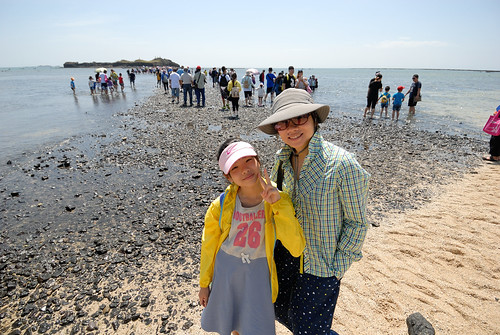](http://flickr.com/photos/33703965@N00/27789407584) 只有徹哥不怕曬的穿著夾腳拖 看到海 毫不顧忌的就往海裡走  還大喊"好涼 好舒服的水阿"  [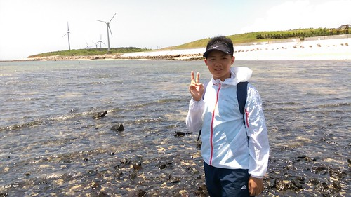](http://flickr.com/photos/33703965@N00/28301785902) 讓愛妹好生羨慕 懊惱 嘀咕著我沒跟她說今天可以玩水  我們順著人潮往赤嶼行  雖然人潮吵雜 但沿途的風景還是令人心曠神怡 [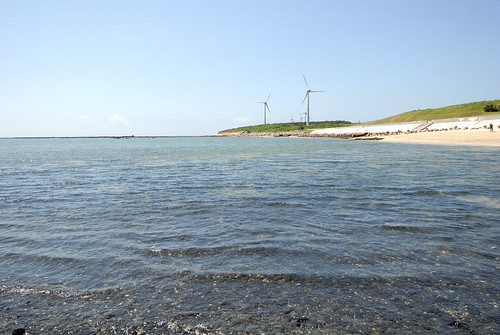](http://flickr.com/photos/33703965@N00/28406357805) 藍天大海果然療癒[ 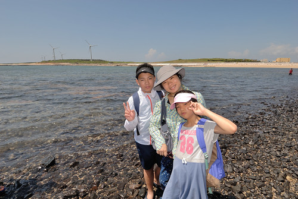](http://flickr.com/photos/33703965@N00/28123297400)[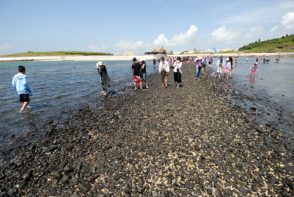](http://flickr.com/photos/33703965@N00/27789418564) 走到赤嶼  因退潮裸露的踏浪步道已如馬路般寬度 [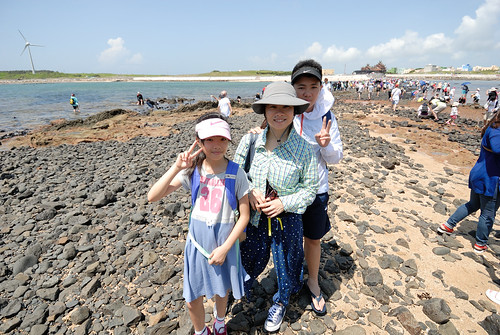](http://flickr.com/photos/33703965@N00/28372972556) 有人認真在這找潮間帶生物  有人跟著摩西走過分海 [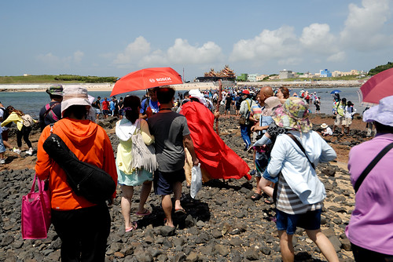](http://flickr.com/photos/33703965@N00/27790437363) 我們走到步道旁  人潮較少的地方  讓徹愛尋找海裡生物 徹哥哥很友愛的把他的夾腳拖借給妹妹穿 自己忍著痛踩在潮間帶上 [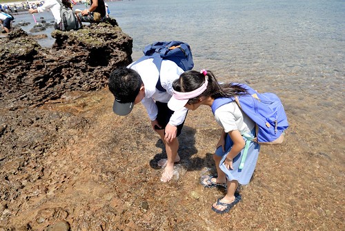](http://flickr.com/photos/33703965@N00/27790440503) 徹哥發現了保護色做很好的螃蟹  指著給眼花花的我們看 (澎湖的海水 出乎我們預期的清澈) [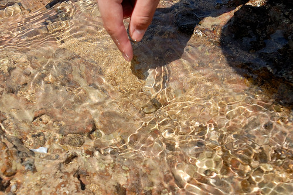](http://flickr.com/photos/33703965@N00/28372981976) (這張純粹是徹爸帥照 不放可惜 而話說徹爸的防曬措施是四人當中做最好的 從頭包到腳) 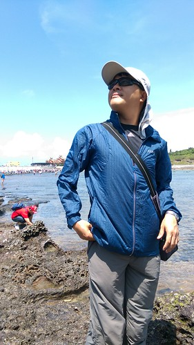 滿足愛愛踩踩海水的渴望後  我們爬上赤嶼 [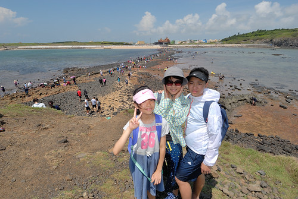](http://flickr.com/photos/33703965@N00/28301759902) 360度的視野 美不勝收 [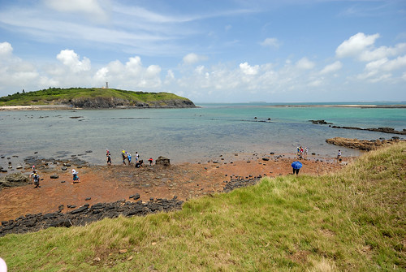](http://flickr.com/photos/33703965@N00/27790476503) (每次旅行中看到愛心型相關地景 我總忍不住喊 "愛 有愛心耶") [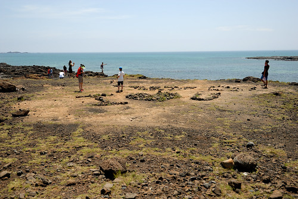](http://flickr.com/photos/33703965@N00/28301770042) 藍天白雲大海  無敵強的背景 照片怎麼照都好看  [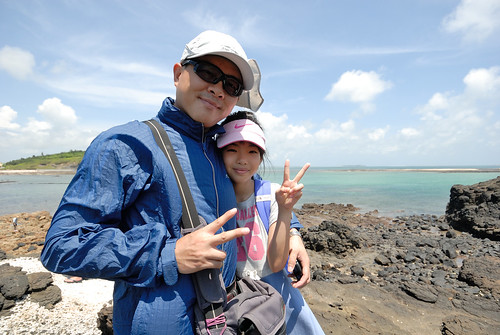](http://flickr.com/photos/33703965@N00/28301776362) 停留一個小時 回程的路又更寬且乾了 [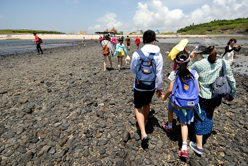](http://flickr.com/photos/33703965@N00/28123358120)  奎壁山應該已是澎湖旅行的標準 經典行程 如菜市場般的熱鬧吵雜 但還是有趣又漂亮的地方!  做好防曬 戴上安全帽  日頭赤炎炎 我們騎著機車繼續往南環去 [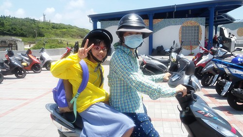](http://flickr.com/photos/33703965@N00/28123373870) 來到鎖港找中餐  看到二座大石塔  隨意進入的小吃店 意外撞見出外景休息中的號角響起 阿母傻傻不識人 比較在意小卷麵線好不好吃  吃完中餐 三票對一票的想要回民宿休息 待三點過後再出門玩耍 不過因為接下來行程不會再到南環  徹爸的堅持下我們挺進到山水沙灘 [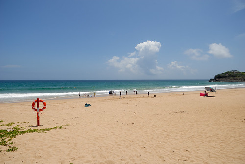](http://flickr.com/photos/33703965@N00/28301799062) 很漂亮的沙灘  不枉日正當中來到這 [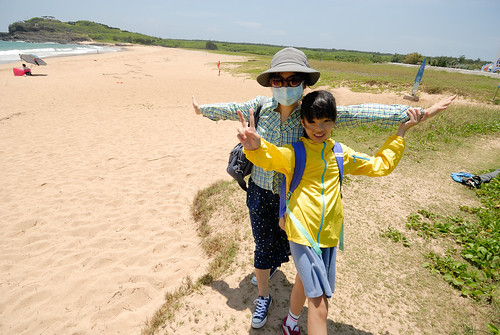](http://flickr.com/photos/33703965@N00/28327531391) 沙灘旁也矗立好些漂亮的民宿會館  我們想這裡肯定是個美麗又熱鬧的沙灘  很熱! 真的很熱! [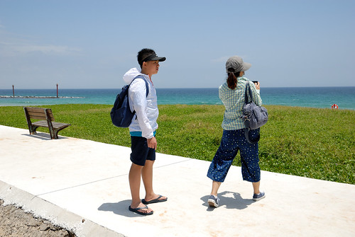](http://flickr.com/photos/33703965@N00/28327536391) 但這片海的藍讓人想多看幾眼!  不過海很美的代價是才一個上午 徹哥的夾腳拖就曬出來了 還是趕緊回民宿躲太陽才是王道! 
