澎湖行最大的目的與重點在曾經我與徹爸一起抓螃蟹的望安小島 在馬公本島 並沒有太多的動力跑所謂的熱門或經典景點 除了奎壁山以及西嶼外 半日不到的西嶼果然很不夠 也因為突來的大雨淋成落湯雞且更delay原預定的行程 西嶼濱海公路遙遙不及 在沙灘看夕陽的願望也沒達成... 有機會我除了想再去望安 我也想走到西嶼最裡 台灣最古老的燈塔下看夕陽 

午睡過後 我們從民宿的白沙鄉鎮海灣再出發 沿著白沙鄉濱海公路吹風看海一路騎到澎湖跨海大橋  大學畢旅時全班同學在這的紀念照影像一直深深烙印在心底 所以就算這裡遊客如熾 拍照要搶時機搶位 我堅持非要來張全家福 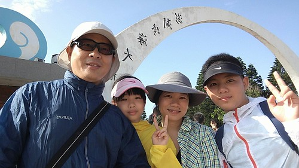 跨過真的好長好長的跨海大橋後 我們來到小門嶼 還沒看到有名的地質景觀鯨魚洞 我們卻是先是喜歡了這乾淨的小漁港景色  而且大雨將至前的雲與光  好漂亮   我們沒吃跨海大橋的易家仙人掌冰  直到小門才讓徹哥吃到嚮往很久的仙人掌冰 搭配著哈密瓜冰淇淋的仙人掌冰特別又美味 可惜我們永遠吃完才想起沒拍照

鯨魚洞 遠遠 遠遠 很難認別 [ 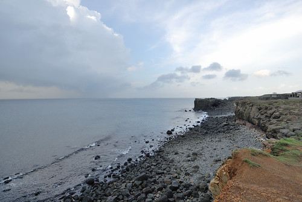](http://flickr.com/photos/33703965@N00/28123400000)看過北海岸象鼻岩的徹愛 完全沒有動力近近去看遠遠看來實在看不出所以然的鯨魚 [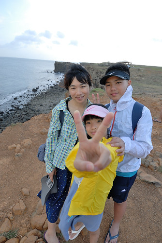](http://flickr.com/photos/33703965@N00/27789532584) 我們反倒對一旁的小門地質館很好奇  地質館建物與園區很漂亮 [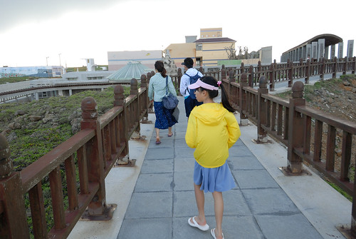](http://flickr.com/photos/33703965@N00/28406468615) 尤其從門口延伸出去的走廊線條  我們在地質館蓋章 看澎湖的地質介紹 [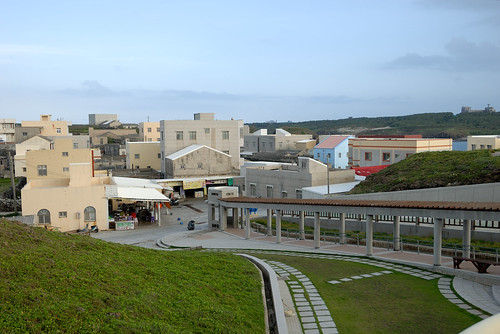](http://flickr.com/photos/33703965@N00/27789540394) 沒想到短短十幾分鐘後  我們走在走廊的半路上 突然下起大雨 而這長長走廊是沒有屋頂的! 我們躲在走廊盡頭的店家  我們一來就買仙人掌冰的店家 再來一杯仙人掌冰  吸允好久好久沒吃的燒酒螺....  覺得雨停之後 我們搶黃昏前 繼續騎著機車北環 結果路上還是又被下一場大雨淋成落湯雞 走走停停 乾乾又濕濕  總算我們到了二崁聚落 [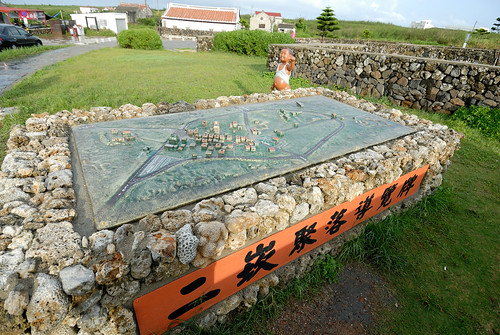](http://flickr.com/photos/33703965@N00/27790572013) 二崁聚落是國內第一個傳統聚落保存區  還保有著從前以咾咕石與玄武岩砌牆的建築與菜圍  這一天看到咾咕石菜圍 愛愛總興奮的說社會課本上說....  烤小卷的香氣 讓我們忍不住買二支嚐鮮 沒夜釣小卷 起碼我們有吃烤小卷  雖然二崁聚落仍保存著聚落室內外動線的縱橫交錯 但還是有些覺得建物整修得太"新" 抹去了許多歲月的痕跡 老實講我覺得若沒有從以前就刻意保留或是持續一直有人居住使用 光只是仿古複刻為美麗的展示館  光華永遠不復在 [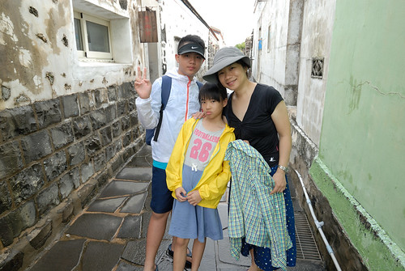](http://flickr.com/photos/33703965@N00/28123436710) 二崁草原上的牛群 反倒是我覺得最美的二崁風景 [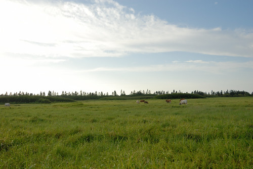](http://flickr.com/photos/33703965@N00/27790595373) 而在澎湖很少看到狗  卻常見可愛的貓 [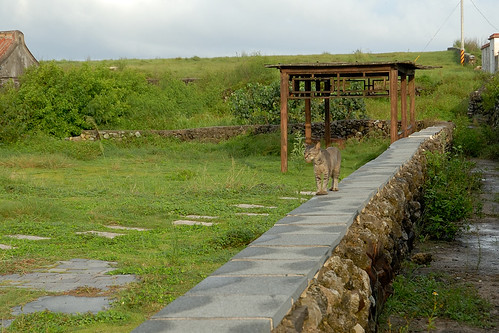](http://flickr.com/photos/33703965@N00/28406498975)

在本島 最想做的三件事就是吃仙人掌冰, 看岩瀑還有在西嶼的沙灘看夕陽 搶天黑前  我們就近去池西柱狀玄武岩區 [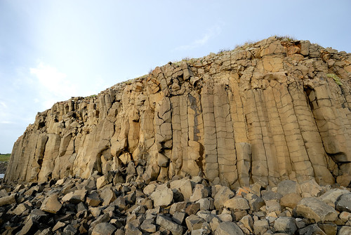](http://flickr.com/photos/33703965@N00/28301905802) 哥哥說 生物老師有交代 澎湖玄武岩要趕緊去看 再沒幾年就會風化 崩落不見了... [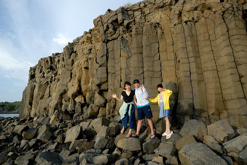](http://flickr.com/photos/33703965@N00/28123444180) 看到這片玄武岩 國中生很是欣慰不枉有來澎湖 [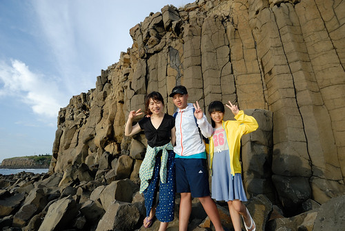](http://flickr.com/photos/33703965@N00/28301900102) 我堅持要只有我與徹爸二人的合照 想要復刻曾經的青春 無奈照片還是遮掩不住 我們已經是爸媽的歲月痕跡.... (淚奔) 

來不及去西嶼燈塔看夕陽  我們再就近的去夢幻沙灘看夕陽 可是現場怎麼沒有沙灘  不是叫夢幻沙灘嗎?  雖然這回到澎湖已深深明白漲退潮的差異之大 但...這完全沒有丁點沙的夢幻沙灘也太太太...名不符實了 尤其這個下午一家子還都穿了夾腳拖出門  盤算著黃昏時的玩沙踩浪說...  眼看太陽就快落下 也趕不及再去別的沙灘 只能享受當前美景 [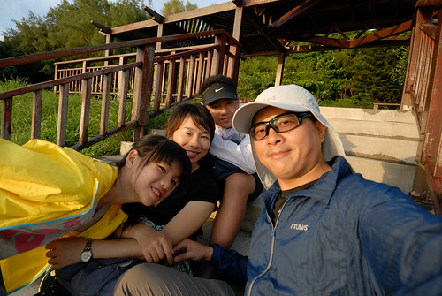](http://flickr.com/photos/33703965@N00/28301926822) [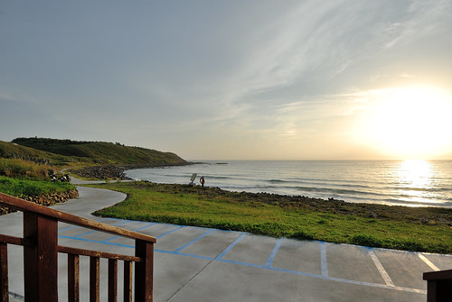](http://flickr.com/photos/33703965@N00/28373140046) 徹爸提議拍剪影 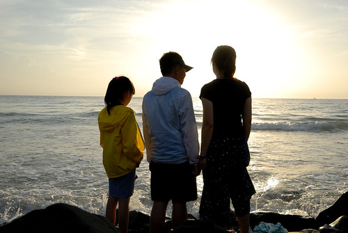 搞FU  搞浪漫來著 [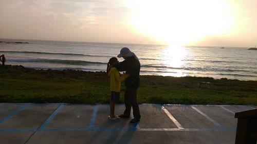](http://flickr.com/photos/33703965@N00/28301928052)  [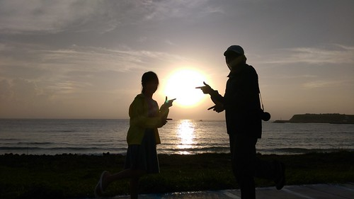](http://flickr.com/photos/33703965@N00/27789589894) (羞)二人親的好猴阿 [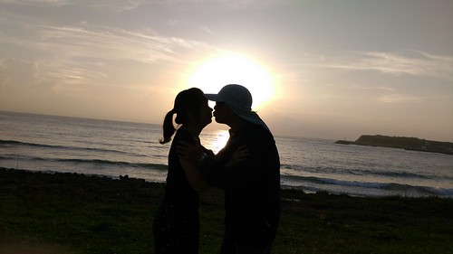](http://flickr.com/photos/33703965@N00/28301930932)

最後一刻 終究還是沒能看到火紅太陽落入大海 殘念~ [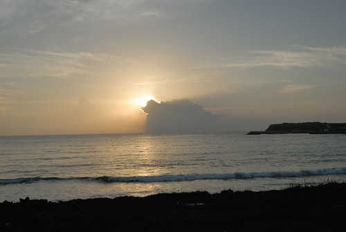](http://flickr.com/photos/33703965@N00/28301932592) 沒玩到沙又沒看到夕陽的愛愛嘟嚷嚷 我說接下來二三天 肯定肯定讓你玩個過癮  我也相信還會有機會再看到夕陽的! [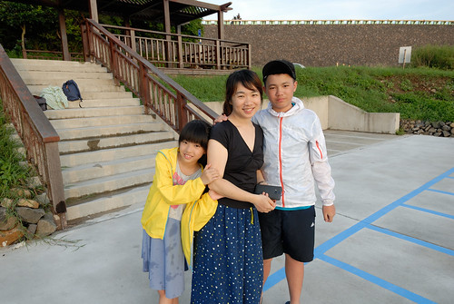](http://flickr.com/photos/33703965@N00/27789602254) 趁著天還沒完全黑 我們離開西嶼往回程 走過長長跨海大橋後來到通樑的漁人小館  是民宿主人推薦的漁家料理店 料好實在 而且價格平實 還很合我們家的口味 (就連涼拌豆腐因醬料特別也超好吃) [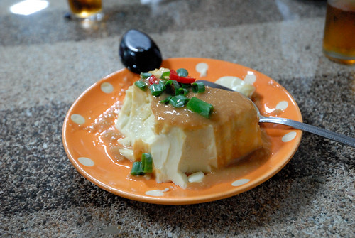](http://flickr.com/photos/33703965@N00/28327639871) 只是見吃演開的我們 每每總在清盤後才懊惱沒拍照 "鹽酥紅新娘" 特別的一定要拍張照 只是貪吃的我們照的好隨便阿...  而沒想到   後來這一晚竟然成了我們澎湖海鮮大餐的絕響!
