決定到澎湖玩後 才確切體認到澎湖觀光之發達 民宿業者不下五六百家 各式類型 各種價錢都有 網上看得眼花撩亂 完全不知怎麼下手 乾脆省事地完全參考"沿著菊島旅行"的景點與民宿資訊 喜歡北環白沙鄉與西嶼鄉的鄉間好風情 於是選擇白沙鄉鎮海的鎮海灣民宿作為前二晚落腳處 一來往返西嶼方便些 再者民宿獨特提供的SUP教學體驗活動, 阿母想徹哥應該會喜歡吧! 民宿的設備 服務與SUP體驗果然有口碑 也深得徹愛喜歡~ [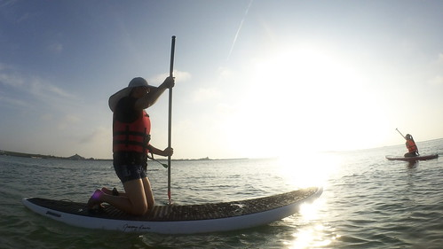](http://flickr.com/photos/33703965@N00/28327648761)

隱於鎮海村裡的鎮海灣民宿 獨棟黃色建物  漂亮卻又不過分氣派奢華  因為不想到熱門的吉貝 北海玩水上活動 民宿提供的房客專屬SUP體驗  適合怕熱鬧的我們 (只是價錢也不是便宜就是...) [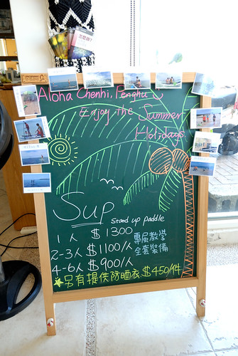](http://flickr.com/photos/33703965@N00/28406605765) 從沒玩過板類運動 也不了解SUP的我們 很難想像也有些擔心 自己是否可以像照片這樣划板航向大海... [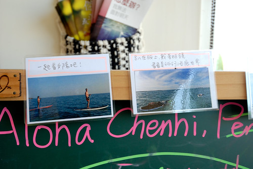](http://flickr.com/photos/33703965@N00/28301985622) SUP在滿潮時分玩較佳 而七月的滿潮時間為清晨或傍晚時 我們預訂在睡二晚過後的清早時分體驗  約定的六點鐘前  全家完全不賴床的完成著裝 蓄勢待發... 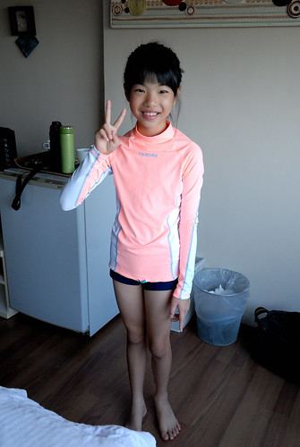 民宿主人也是教練  用機車拖載著三塊板子 而我們緩慢散步約三五分鐘時間來到鎮海灣 看到鎮海灣的第一眼 我有種相見恨晚的遺憾  早知道昨天傍晚來這就好... [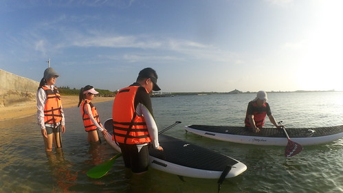](http://flickr.com/photos/33703965@N00/28123501510) 民宿官網上介紹SUP: SUP是Stand Up Paddle的縮寫，翻譯過來就是站著划槳的意思 它是所有水上板類運動中，最容易學習、娛樂性最高、適合年齡層最廣的一項活動  教練講解完上板 划槳 以及落水自救上板方法後 爸爸 徹哥與我輪流先是學著跪划  愛愛也牛刀小試的在近處小試   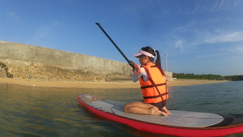 承認 我是最沒天分的那一個 完全不得方向控制要領 還有勞教練出動救援越漂越遠的我 跪划之後 接著便要嘗試站著划  除了較好使力外  教練說站著划向大海的視野與感動肯定一輩子難忘  徹哥不愧是青春少年 沒在驚的很快上手 [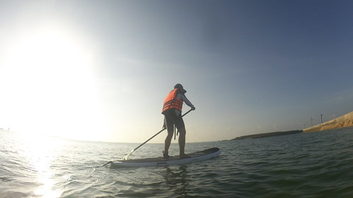](http://flickr.com/photos/33703965@N00/28301965372) 相較之下 阿母是大肉腳 翻了二次板 雖然有穿救身衣 板子也有繩子練在腳環  但翻船後的惶恐讓我費盡九牛二虎之力才能再上板 而第二次翻板之後 我再也不敢挑戰自己的平衡感了 [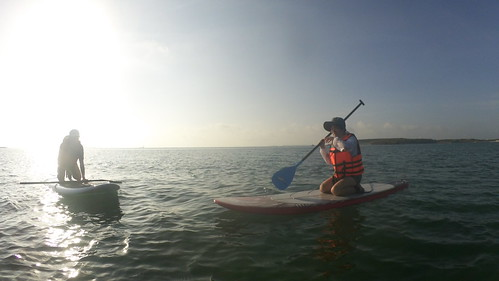](http://flickr.com/photos/33703965@N00/27790676303) 愛愛遠遠看著徹哥的輕鬆自在 與阿母的笨拙狼狽 想必五味雜陳... [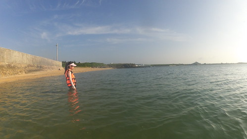](http://flickr.com/photos/33703965@N00/28123503900) 徹爸與徹哥都很上手後 教練領著我們 一共三塊板航向起碼五百公尺遠以外目標地燈塔 教練說經過練習 誰是乘客應該顯而易見了 沒錯! 阿母在海上必須完全的靠兒子 [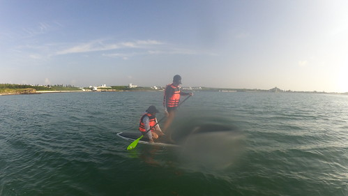](http://flickr.com/photos/33703965@N00/27790678283) 愛愛則乘爸爸的板 命交給爸爸顧比較安心  航向大海 此生沒有過的經驗 的確很酷啊  但肉腳阿母被一個沒在驚的青春少年載 也真的還是很怕阿  到達目的地燈塔處後 教練拿出有備而來的釣竿 讓我們試著甩竿釣魚 體驗他說的在一塊板子上可以做很多事的悠閒 徹哥也小小爬上燈塔階梯  嘗試一躍而下的快意(結果只有倉皇緊張) [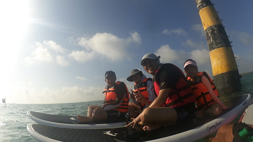](http://flickr.com/photos/33703965@N00/28327665581) 回程比去程費力費力許多  浪不好使 就在徹哥要從跪划改採較好使力的站划時  翻板了 是的! 阿母一個清早就落海三次 而第三次落海果然就熟 不會緊張了 再上板後 教練體恤徹哥在惡劣風浪下還要載個阿母實在不易 於是讓我轉搭教練的板  讓徹哥自己划回岸邊 看著徹哥好像越划越遠 但霎那間卻又趕上遙遙在前的徹爸 真的不得不說在海上的徹哥比我們優秀許多 而轉搭教練板的我  其實就像坐賽車手開的快車 雖然知道不用怕但就像搭雲霄飛車 心臟也是要夠大顆阿!  好不容易全家平安返回岸邊後  讓愛愛小試站划 [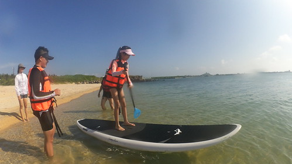](http://flickr.com/photos/33703965@N00/28123519390) 我們今早的體驗活動也到此結束 [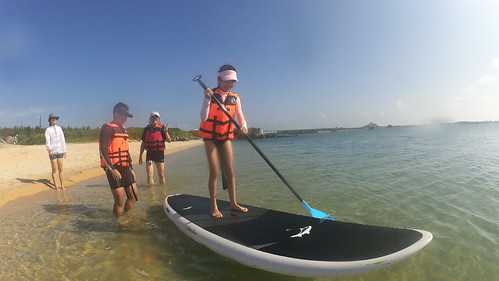](http://flickr.com/photos/33703965@N00/28123520780) 雖然是清早 但約莫二個半小時的活動還是讓人曬出二截腿了 [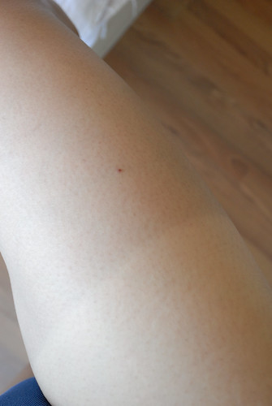](http://flickr.com/photos/33703965@N00/28123526410)

盥洗過後 清爽的在民宿大廳等待享用早餐     不同於前一天早餐的海鮮粥 今天的早餐是海菜鮮蚵拌麵線 都是很有澎湖特色的鮮味早餐! [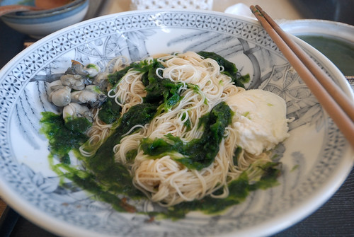](http://flickr.com/photos/33703965@N00/27790727693) 一早只有SUP體驗活動的安排   於是早餐過後我們愜意地在民宿內度時間 [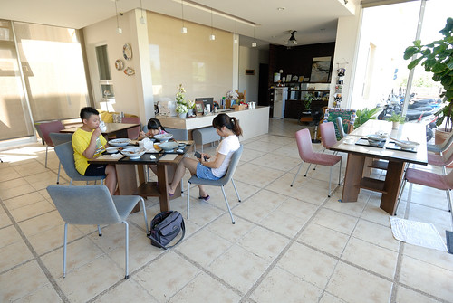](http://flickr.com/photos/33703965@N00/27789700224) [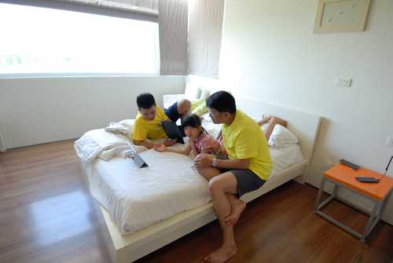](http://flickr.com/photos/33703965@N00/28327696791) [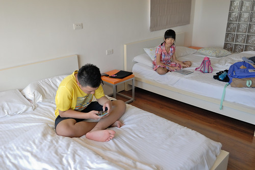](http://flickr.com/photos/33703965@N00/27790702183) 如果有機會再到澎湖 再到白沙鄉 值得停留更多時間在鎮海村  鎮海灣 鎮海灣民宿的~ [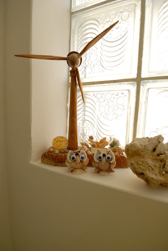](http://flickr.com/photos/33703965@N00/28301999482) 十一點退房時間前  我們包裹好全身再啟程繼續我們的澎湖行 今日最重要行程的就是要搭下午二點半往望安的船 捨棄早上公船沒搭(只有一班次)  我們一定一定得搭上下午這班船 所以搭船前我們沒有目標  隨興的來到澎湖生活博物館 (躲太陽吹冷氣是重點)  生活館內有許多圖片 文物 縮景模型的展示 呈現澎湖歷史文化與生活情景 [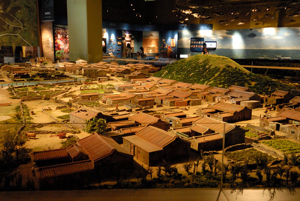](http://flickr.com/photos/33703965@N00/28406648745) 其中尤以30:1製作的望安花宅古聚落模型 最令人嘆為觀止 [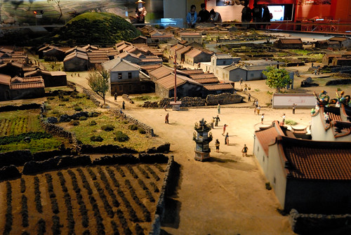](http://flickr.com/photos/33703965@N00/28123566950) 不論近看或是從更上一樓俯瞰 都可感受其精細精巧  這是不同於戶外玄武岩走訪的另一個認識澎湖的好地方 尤其大熱天裡...  午餐我們來到頗富盛名的傻愛莊 除了因為這裡的特色餐點在網上頗多推薦  已有百年歷史的建物更是大有來頭 [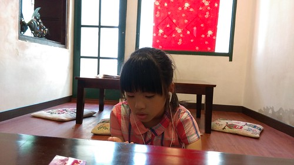](http://flickr.com/photos/33703965@N00/28302035252) 房子好不好看 東西好不好吃  就各自評價嚕 [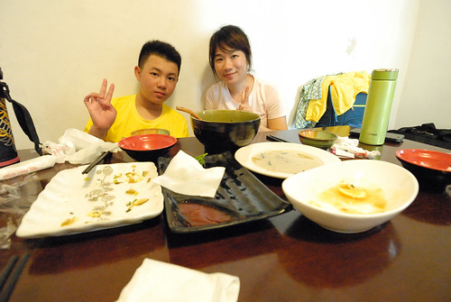](http://flickr.com/photos/33703965@N00/27789720764) 不過澎湖的青菜真的很少 而炒空心菜似乎都會拌炒著豆芽菜   挺妙的組合  帶著吃飽飽的肚子 我們就要搭船去望安嚕 懷念了快二十年的望安~~~
