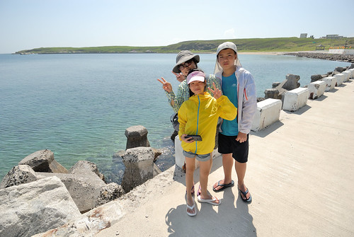

在鎮海住了二晚後的第二個白日 我們出發往最期待的望安 其實對於大學畢旅時的望安印象很模糊了 只記得夜間潮間帶抓螃蟹時不知不覺與徹爸二人脫隊了 然後大家抓到的螃蟹都好小 但還是煮來吃了(二十年前的生態環保意識與現在差很多) 除此之外 僅剩一幕初抵望安時大伙在沙灘上的開心大合照!

行前徹愛問我望安有什麼好玩的 我說 那裏什麼都沒有 連便利商店也好像沒有... 不過就在沙灘旁的民宿 可以讓你們玩沙玩得過癮 果然徹愛沒在怕的下午二點過後就要去泡海水... 除了曬黑外  沒什麼人的望安沙灘真的好靜 好美 好自在](http://flickr.com/photos/33703965@N00/28302163602)

大部份遊客都是參加跳島行程  一天內走過好幾座小島 跳島之外 就是搭每日上午一班的公船海南之星或是下午一班的(私船)光正號到望安 我貪圖上午在鎮海SUP的安排(很得意行程安排之充實)  選擇網路與民宿主人評價都還不差的光正號去望安 我們謹遵民宿主人交代下午二點前到碼頭買船票 沒有招牌 沒有售票亭 現場只有一位阿桑掛著包包賣著票 我們來不及瞭解搭船規則 也沒得選擇的 只能如逃難般的搶購有限的船票  一點也不誇張的心情...  雖然滿腹懷疑 但這個下午我們真的得搭這樣的小船去望安 (聽說平常都是大船的這幾日剛好大船有事 於是小船代航) 原定開船時間的半小時前我們買好了票 進到船艙中   我們母子三人的臉都綠了! 沒有座位劃分的船艙  位子不是被貨物或包包給佔位 就是一人帶包的坐在明明可以坐二人的長椅上 原本就容易暈車暈船的愛愛 我完全不敢想像開航後的慘烈  幸好一對返鄉的母子讓了一排位子給我與愛愛 幸好這個下午風平浪靜   航行也只需七十分鐘 在悶熱的船艙中愛愛睡著了  我們一路平安抵達望安 (徹爸則是窩在船艙外 一路曬著太陽 看著大海到望安 )  到達望安碼頭後 與民宿主人接了頭 取了機車 我們迫不及待先吃碗剉冰  鎮鎮驚  離島民宿品質不若本島 但比我們預期好很多 而最值得的當然是民宿走出去就到的 望安最美沙灘之稱的網垵口沙灘  完全沒有搭船不適的兄妹倆  才到民宿就嚷著什麼時候去玩沙阿  尤其是那個張小愛...  連哄帶威脅的才讓二老休息到太陽稍微弱點的四點  網垵的貝殼砂 很細 很乾淨  遊客也三三二二  很是寧靜  玩沙前徹哥賣力地用嘴巴充飽游泳圈  我們笑他泳圈在沙灘能做什麼阿 沒想到徹哥是這樣拿來坐  坐在泳圈上 隨著潮來浪打  愛妹愛死哥哥的玩意  兄妹倆輪流享受著漂浮的愜意與刺激    看著大海藍天 還有美麗沙灘上開心玩著的兄妹倆 到望安 路途再顛波 都值得啦!  

有了二年前在墾丁的浮潛初體驗後　難得來到離島當然一定要再浮潛 委託民宿安排的浮潛活動 在得搭渡船過去的將軍嶼上  如果說馬公是一級離島  望安為二級離島  那麼將軍嶼就是三級離島了 要到將軍嶼 除了每天下午從馬公到望安的光正號(就是我們搭的那班船)會在抵達望安前停留將軍嶼外 都得從望安搭渡船才能到將軍嶼 循著民宿老闆給的渡船阿山伯電話 與阿山伯約好搭船時間 隨時往來望安與將軍嶼之間很是方便  第一次這樣搭渡船的我們感到很新鮮 可以隨招隨搭 還包船 好像台北的計程車十分鐘的航程 短短的 坐在船尾享受乘風破浪剛剛好  我說其實台灣(尤其離島)有好多地方的生活方式 是截然不同於生活在台北的我們 而這樣體驗的樂趣完全不亞於在日本當背包客... (徹愛不說話 徹爸OS還是差很多好嗎...) 

行前查望安景點時 就查到將軍嶼上有位青年阿弘返鄉將軍嶼打拼推廣深度生態旅遊 是澎湖有名的潛水教練 而將軍嶼曾是珊瑚盛產地 繁榮熱鬧 有小香港之稱 以為將軍嶼應該比望安有看頭的我們 比預定浮潛時間還早一個多小時的來到將軍嶼 結果 這兒沒有商店沒有餐廳(望安只有三家小吃店 我們還幻想將軍嶼這有好料吃) 連想租摩拓車也只有一民家兼營的幾台舊摩拓車  老闆還很驚訝為什麼我們要租摩拓車 問老闆建議的環島路線  老闆說就一條路 一直騎下去...  而真的就是臨海的水泥道路一直騎下去  不用徬徨 不用擔心迷路  近一個小時的環島中 我們真的只遇到二台機車 是前一晚住這兒的遊客(為什麼知道 因為前一天跟我們一起搭公正號到將軍嶼)  其他時間有如包島環島  太陽很曬  但海好漂亮  清澈見底  天也藍的好漂亮  藍藍的海接著藍藍的天 非常舒服的視野   騎了大半圈總算看見將軍嶼最有名的景點帆船石 (好像墾丁 小蘭嶼也都有帆船石 帆船石好像菜市場名)  礙於時間有限 加上真的很曬 我們只有遠遠遙望帆船石 然後繼續我們的環島  機車環島 是每一個台灣離島很芭樂但很經典的旅行方式 沿途真的沒有什麼 但臨著海 吹著風 慢慢騎 慢慢看一邊是海一邊是石(山) 然後每每驚艷於 一個轉彎 一個往海延伸去的盡頭  就是非常非常的舒暢 開心!

環島結束後 我們就去報到浮潛 挺緊湊的換裝 騎機車到浮淺點 然後下海 第二次浮潛 徹哥依然是最優游的那個  愛妹不若我們擔心的不好  最不能放鬆的反倒是阿母自己 我們比較著墾丁萬里桐那次的浮潛  徹爸說魚好像不多  我說可是這裡的珊瑚好多 好漂亮 雖然過程中完全沒有任何的照相紀錄 但是趟不錯的浮潛再體驗! 只是浮潛完12點多  肚子好餓卻只能餓著肚子搭船回望安後才有食物吃 以後再到將軍嶼找阿弘浮潛 記得預約浮潛同時也要先預約餐點才有飯吃

在澎湖吃飯的湯品選擇常常只有蛤蠣湯或海菜湯 很愛喝海菜蛋花湯的徹哥喝得不亦樂乎  一早上經過很曬的環島 加上其實曬得最恐怖的浮潛後 回到民宿開冷氣睡午覺是最涼爽的休息 只是才吹涼而已 愛愛就一直問著幾點可以去玩沙... 孩子 你不累嗎...  傳來大聲的'不會啊'  阿母輸你了...  也為了今天的傍晚阿母一定要上天台山看夕陽 往前回推洗澡盥洗以及要玩得過癮的時間 日頭正豔的下午二時許 母子三人沙灘去...  而且阿母這個下午 非常非常難得罕見的換上泳衣同徹愛一起下海 兄妹倆好開心 滔滔不絕地教如何享受浪來潮退 也完全慷慨地讓阿母使用泳圈 當我的船夫以及保護員 躺在泳圈上 真的好舒服 好好玩!!! 我們好玩到  午覺睡醒到沙灘找我們的徹爸  遠遠看著我們後又默默回到房間換了泳褲 下海跟我我們一同同樂  在水裡比爸媽行的徹愛 更是調皮的作弄爸爸   我們沒去過沖繩 去長灘島...那些有名的國外沙灘 但我覺得澎湖望安的沙灘就好美 好棒    不怕曬 不怕累 盡情把自己丟到藍天大海中  留下美好回憶就是美麗沙灘  當然 愜意是必要的元素 不要跳島 多些時間停留 愜意到看著中庭裡曬著 風吹盪著的自己衣服也會有種幸福的感覺.... 
