要補齊一年的空白不是件容易的事

掙扎很久到底要從哪裡寫起.... 到底還是想把澎湖寫完...

所以就延續那個很愉快的望安美麗沙灘 繼續走下去

只是相隔一年真的太久,很多記憶已不可考

那就多貼圖 多看照...

天台山據說是望安的制高點 果然這兒360度好視野讓我們很驚艷 很心曠神怡 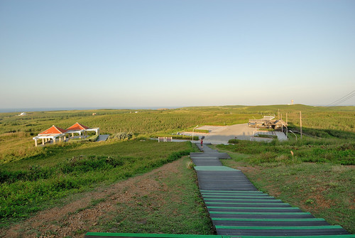

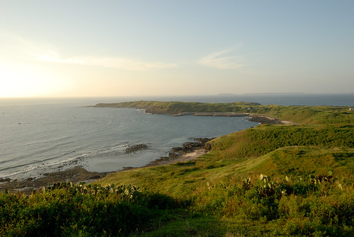

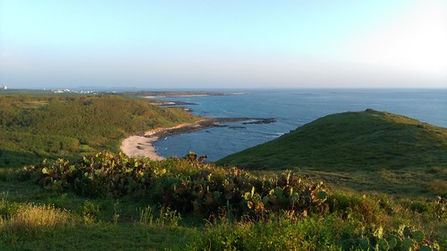

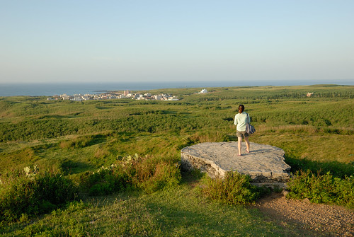

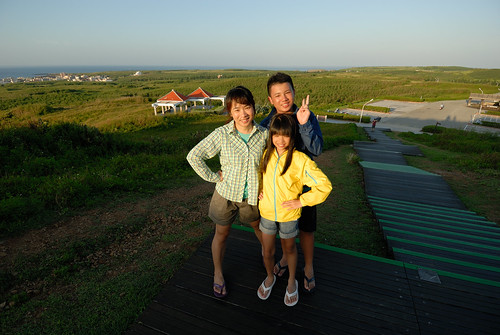

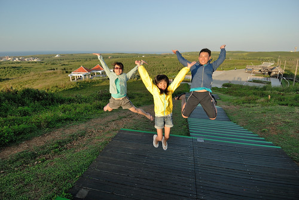

我們在這裡等著太陽西下 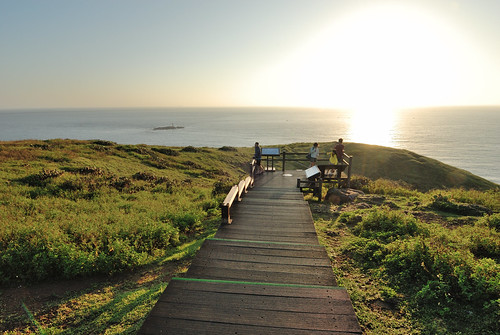

很棒的風景 很棒的風 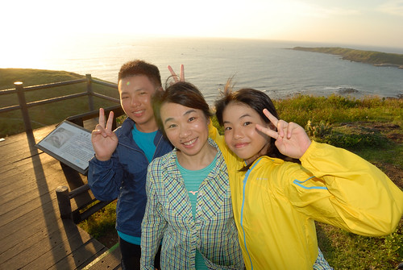

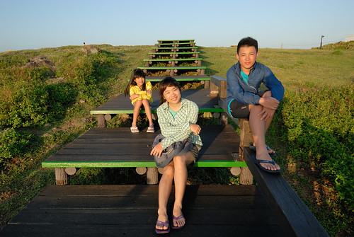

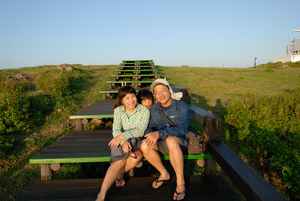

據說當年鄭成功船行經過這裡 形容這片海"望之而心安"  所以自此叫做望安 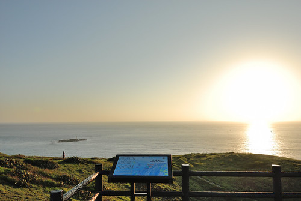

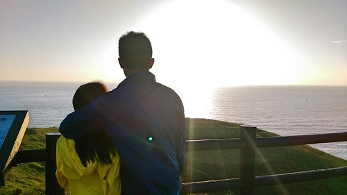

望之而心安

大海真的很療癒 這些年我才越來越懂得  也因此越來越不怕盛暑往海邊去 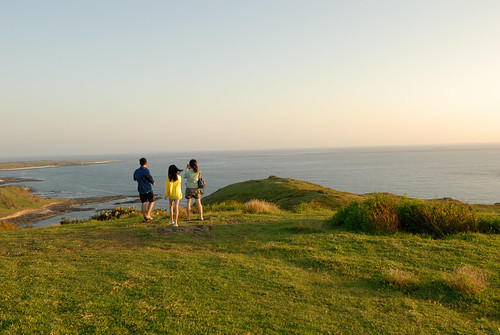

等著太陽西下的我們心情很平靜很high 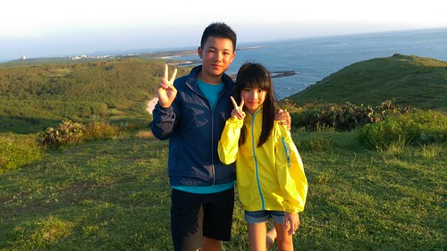

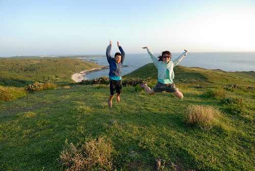

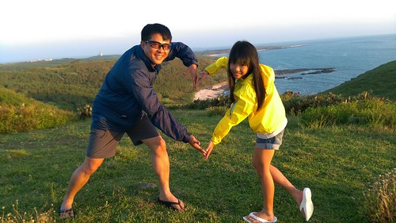

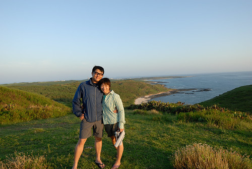

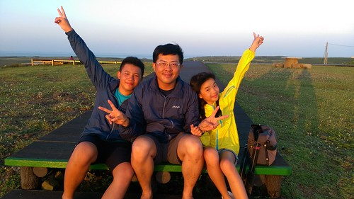

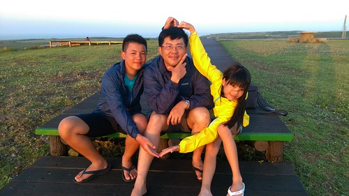

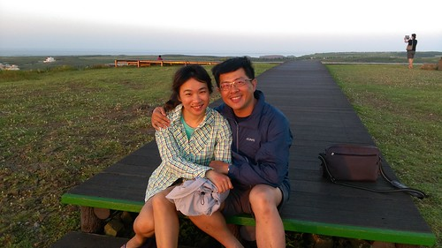

能夠跟國中生這樣並肩坐著聊著天等著遠方太陽西下  心裏真的蠻欣慰的

即使青春叛逆  即使衝突難免 但到底還是(其實真的蠻像)自己養大的孩子 哈哈!!! 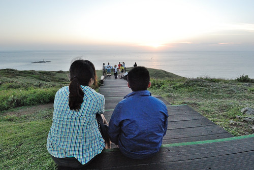

盛夏的白日 日頭真的很烈 但傍晚時分的微風溫度真的很棒

而且夕陽無限好~ 

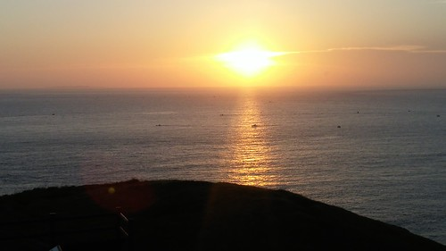

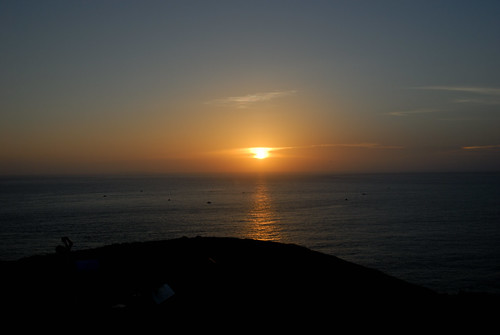

看完夕陽 我們回到民宿夜烤

看著月娘聽著海浪聲  烤肉

很熱但很夏夜阿~  夏夜 夜夜夜 多麼美~ 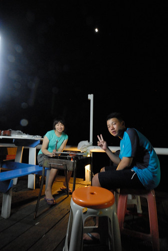

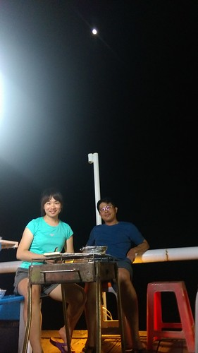

望安住了二晚  第三天下午的船班回馬公

望安很重要的花宅聚落  安排在離開前的這早上 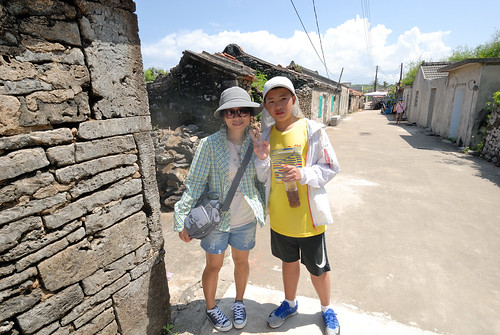

搭船來望安前 在馬公的生活博物館看過花宅聚落的介紹

這裡還保留很多傳統的古厝建築 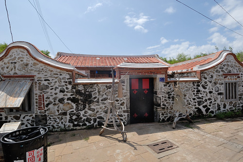

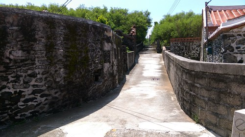

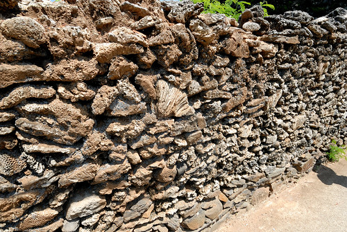

其實一開始還真走馬看花  (這裡還真是花宅) 不知從何看起

吸引我們的反倒是紅澄澄的新鮮仙人掌果實 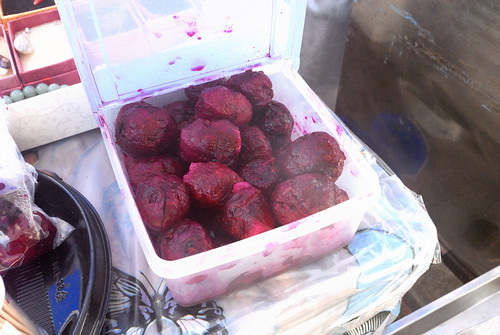

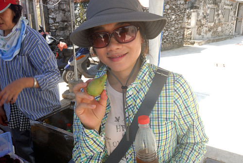

直到經過島嶼情結文創小舍  被獨樹一幟的自製明信片給吸引 

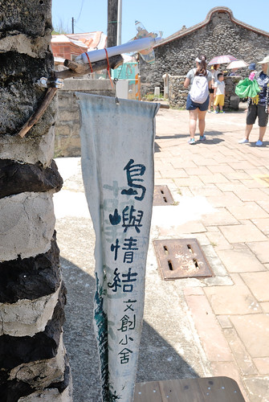

讓徹愛挑了喜歡的明信片  好好地蓋章寫明信片 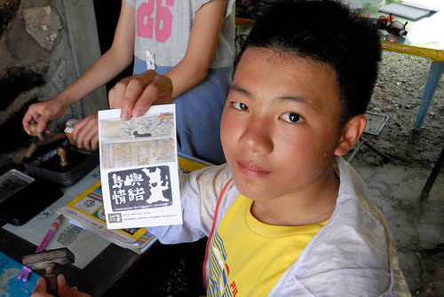

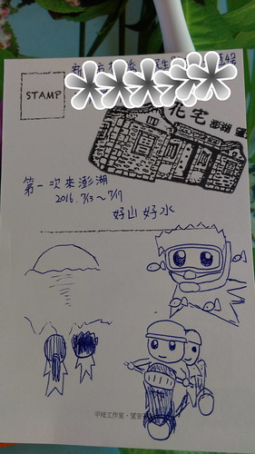

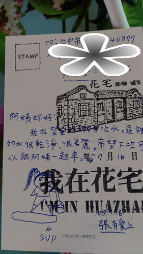

等候的同時 看了這兒的介紹 老闆娘也熱心地與我們介紹了許多

多些了解 旅行的感動便也不同了

喜歡這樣旅行中與當地人的互動 每每總是讓我感動台灣有這樣好的風景與人情 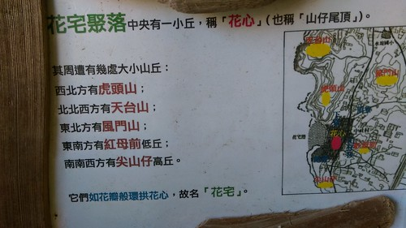

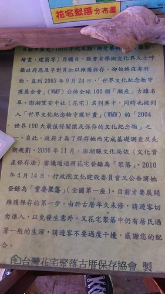

而對當地多些了解之後 再看建物風景也會更有不同視野 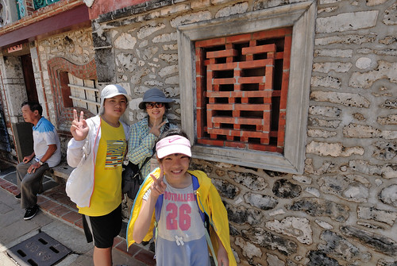

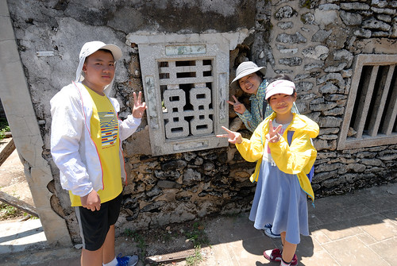

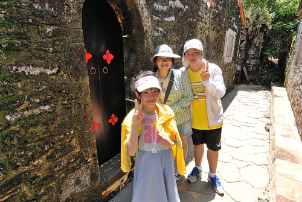

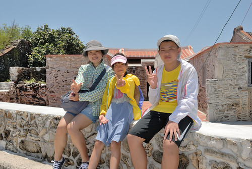

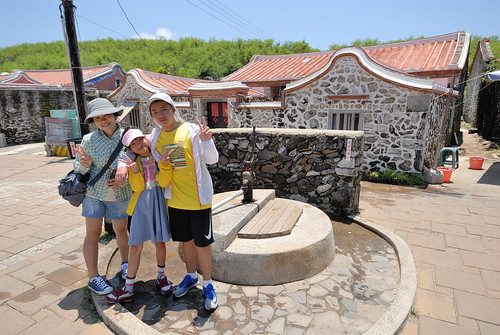

(很愛演母女 明明根本沒碰到) 

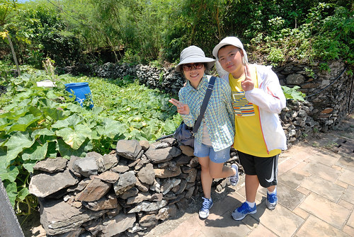

石頭堆砌的菜園是愛愛從社會課本上了解 對於澎湖的第一印象

親眼看到這樣菜園 愛愛興奮不已 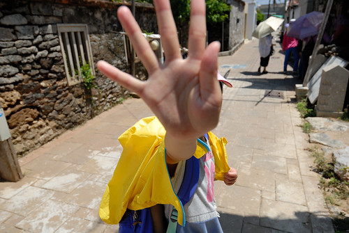

雖然太陽真的很曬...但其實沒那麼難耐

聚落裡隨意地慢慢散步慢慢看 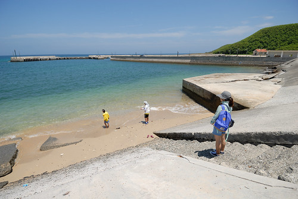

看到海 愛愛嚷著要去踩水涼快下 就也下去唄 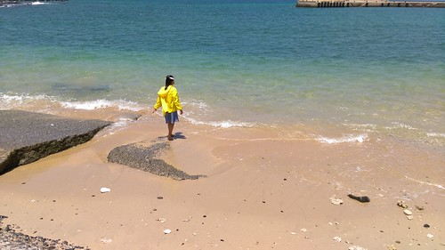

雖然實在喜歡望安這個地方 但我也不知道下次再到澎湖會不會又是20年後.... 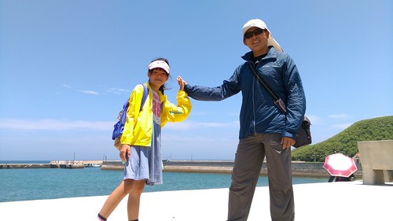

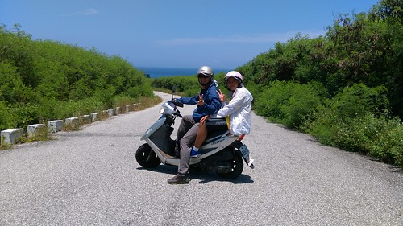

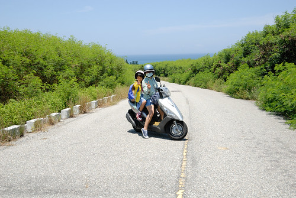

望安的三天我們把島上僅有的三四家小吃店都吃過一輪  印象中都還不錯吃

雖然沒有預期中的海鮮餐廳 但在這樣小島或許簡單吃反倒適合

(話說望安最熱鬧的地方就屬碼頭旁的全家便利商店 尤其白日擠滿在裏頭吹冷氣的跳島遊客) 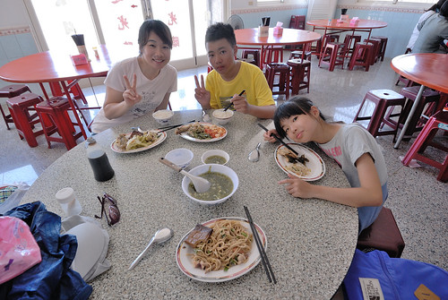

吃過中餐 等候下午船班的空檔

我們總算才來到望安最氣派建築的綠蠵龜保育中心 

在這遇到當地工作人員 聽聞他口中 以及手機裡的好多美麗的望安風景

有些小遺憾  我們看到的望安風景原來只有這麼一點點

(或許以後旅行到當地第一件該做的事就是去遊客中心阿! )

但最後還能聽見這些美麗故事  其實也已經很幸運! 
