其實已經忘了大學畢業旅行時澎湖的樣子

隔二十年再訪的澎湖對我們來說完全是個新地方

還蠻喜歡澎湖的  藍天大海超級美外 乾淨的街道與剛好的熱鬧也都挺好

不過澎湖的民宿竟然也像花蓮一樣多到嚇人 且各式風格各種價格都有阿

最後一晚選擇馬公市區內的民宿

價格略高但可接受  重點是房間寬敞而且市中心到哪都方便 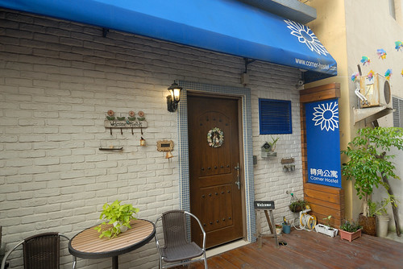

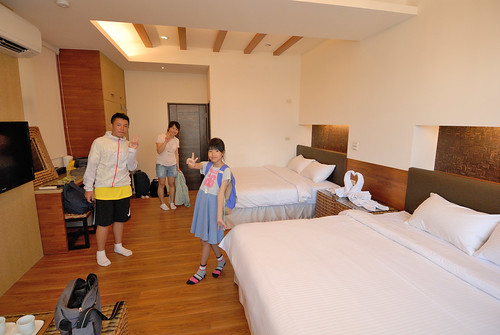

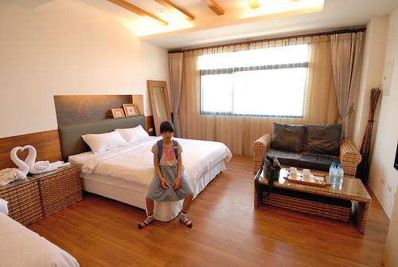

以民宿為出發點 我們用徒步的方式走訪馬公的人氣美食與景點

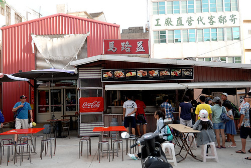

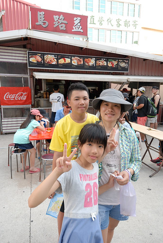

(老闆夫婦非常有個性的一家店阿 但海鮮粥超好吃)

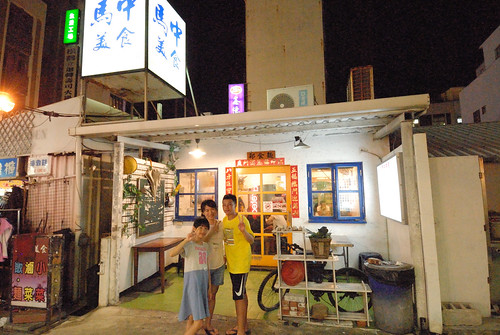

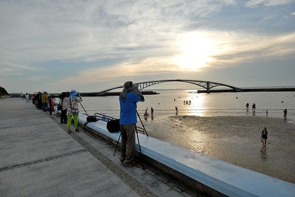

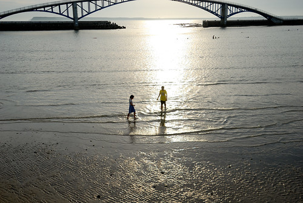

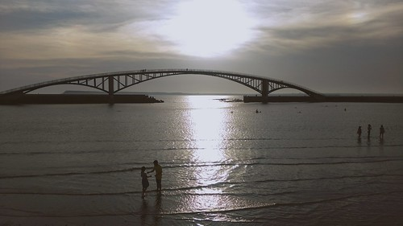

這天雲層有些厚 不見夕陽彩霞 但舒服愜意 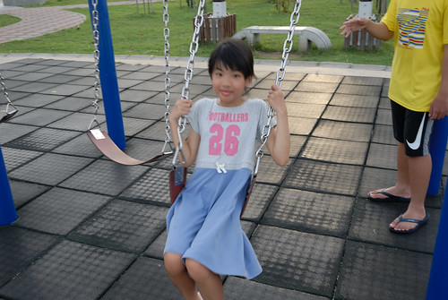 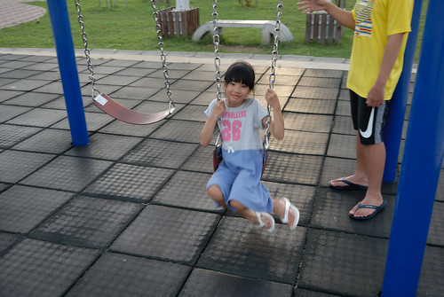

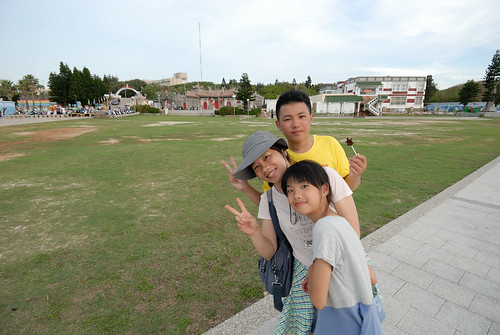

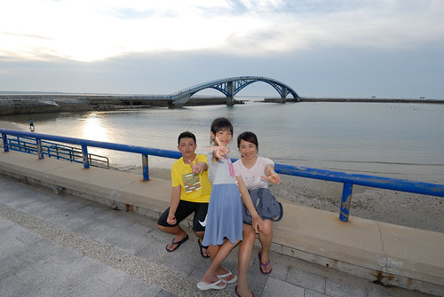

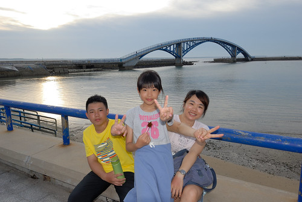

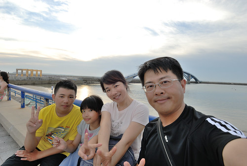

很開心這個夏天我們來了澎湖   媽媽一直思思念念的離島之旅

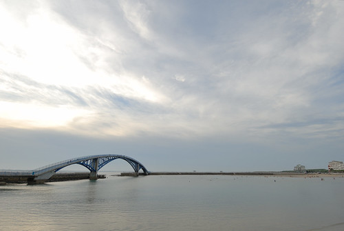

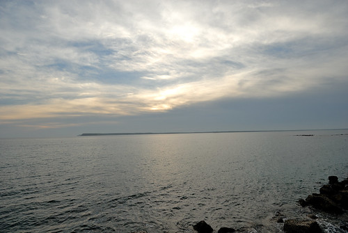

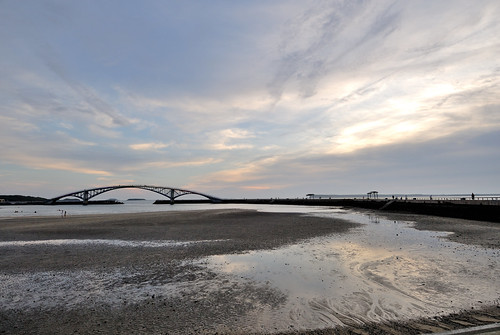

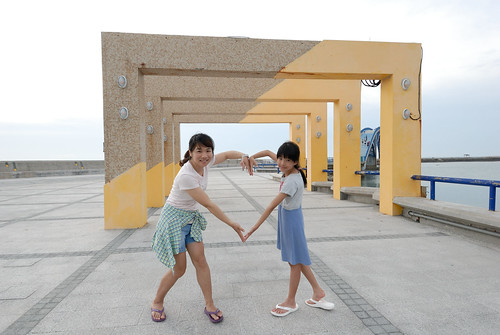

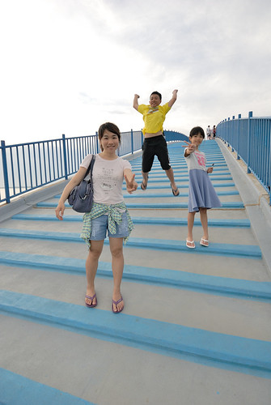

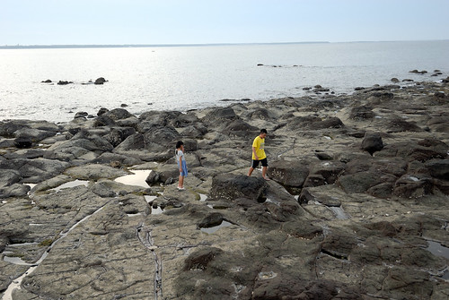

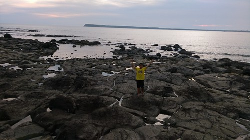

雖然青春期的徹愛 有時脾氣拗了點  懶了點  新鮮好奇少了點

但從小一起旅行這麼多  還是累積了一家子一起旅行的能力與自得其樂

常常在旅行中看見他們小時候的可愛身影

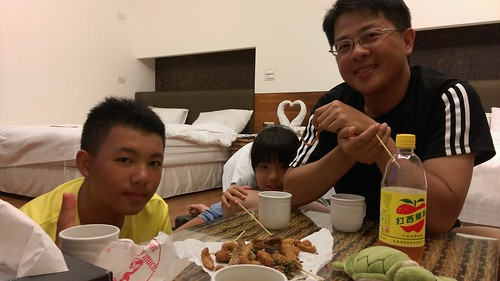

最後一天我們繼續走尋古蹟景點

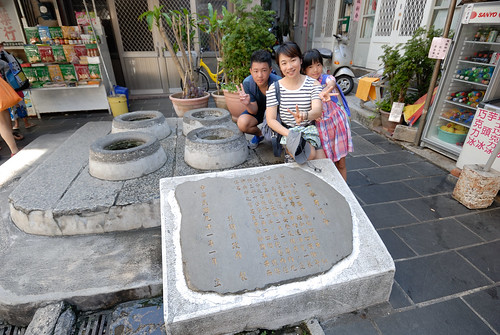

穿梭馬公巷弄之間

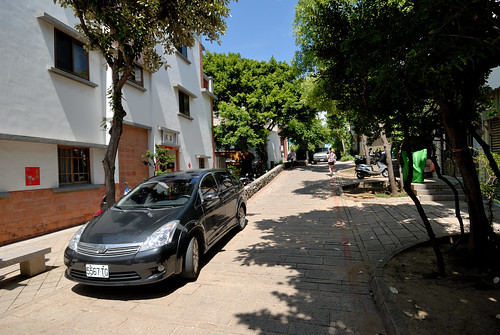

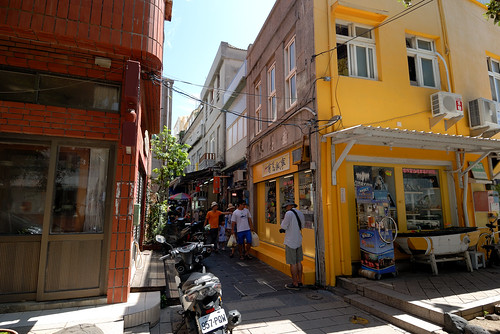

這個摸乳巷 其實有點寬了... 但母女倆很愛演啊

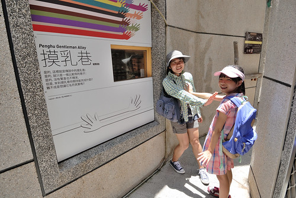

天后宮 我跟徹爸難得有印象的澎湖印象

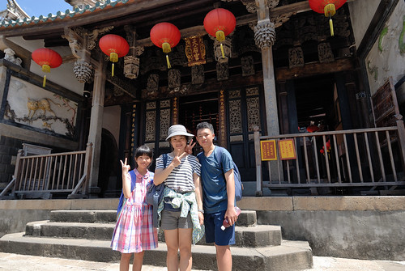

徹愛好玩的投幣抽籤(連求籤也機器化了) 沒想到卻準的讓我們嘖嘖稱奇

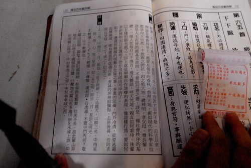

最後四個人都求了一支籤 個個都中肯受用

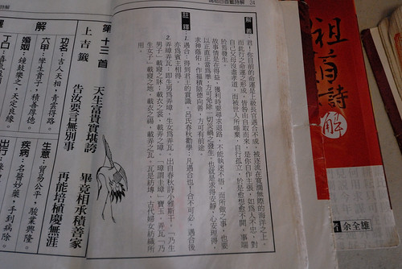

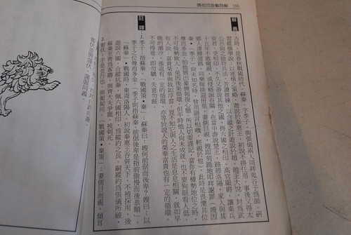

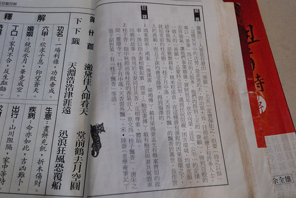

結果很是呼應媽媽我常說的"老天爺都有看在眼裡的"!.

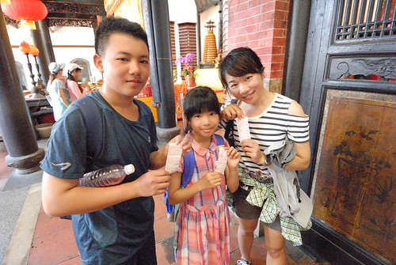

頂著烈陽我們走去眷村文化園區

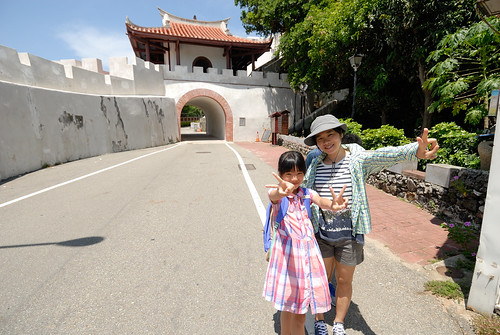

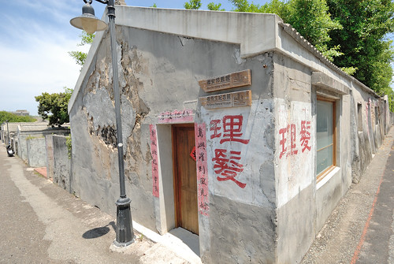

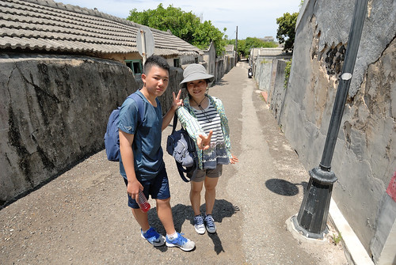

意外來到並不刻意要來的張雨生紀念館

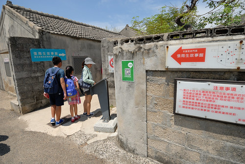

經過十幾年還是很常很愛聽張雨生歌的我 看著雨生的事蹟聽著雨生的歌 有些小傷感

以前徹愛問我最喜歡哪位歌手  我回答張雨生時  徹愛很是不懂這是哪號人物

這一天 徹愛陪我在這聽了好多雨生的歌 聽我說雨生的以前

徹愛說 張雨生的歌還蠻好聽的...

心裡很是高興 徹愛認識了我最喜歡的歌手

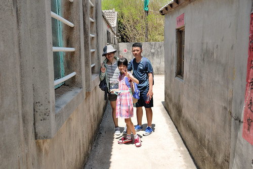

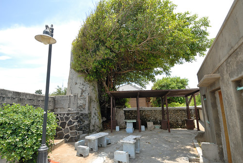

好久遠年代的四個字  毋忘在莒

這年頭孩子完全不能明白的時代故事  解釋好久....

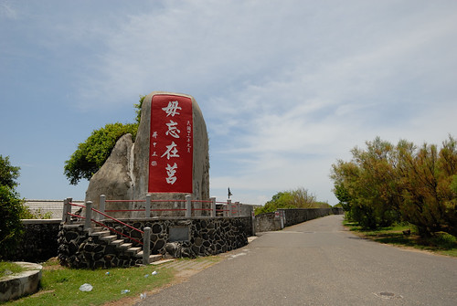

下午飛機離開馬公前  我們去吃民宿老闆娘推薦的牛肉麵臭豆腐 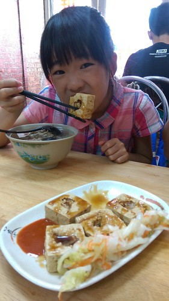

一家子明顯都曬黑了 阿!

在摩斯打發等候民宿送去機場的時間 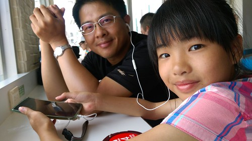

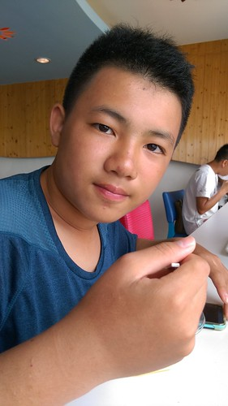

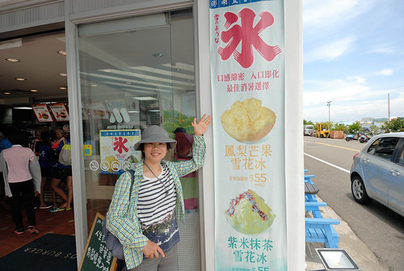

馬公的摩斯布只有這裡才限定的雪花冰 也有No.1的無敵美景

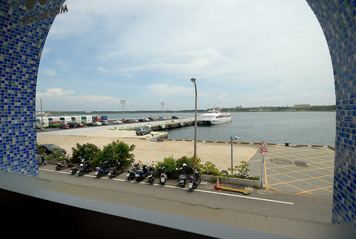

澎湖的旅遊費的確不輸去港澳的出國小旅行

但澎湖的美很是值得走一趟 且花些時間好好停留!

我很想很想繼續收集其他的離島  金門 馬祖還有蘭嶼

但愛愛超怕坐小飛機  又超容易暈車  很難辦阿

我只能繼續期待有一天....
