七月的台北天空好漂亮 乾淨的藍加上棉花糖般的白雲 總讓坐在辦公室內的我 心不小心就飛走了 同時 那一再創新的高溫更是讓人想往山裡走... 就如一進入步道後 阿徹驚喜的大喊"好涼的風喔 比冷氣還涼快舒服" 台北的夏天 果然該往山裡避暑去! 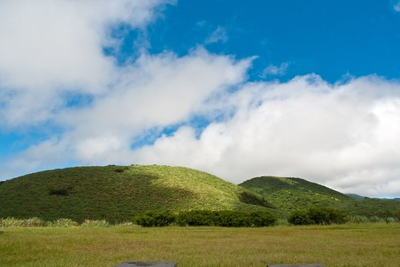 

台北最親近也最豐富的山系當然是陽明山國家公園 走過幾條不同的陽明山步道 每一回總更是加深對於陽明山的好印象與喜歡 這次選擇的路線是沿途有遮陰的涓絲瀑布步道 看到書上寫的四季皆宜 更是放心的前來 為避開仰德大道八點的上山管制 我們一早七點多從板橋出門 八點前順利上山 把車子停在菁山小鎮附近  我們從這裡開始今日的健行 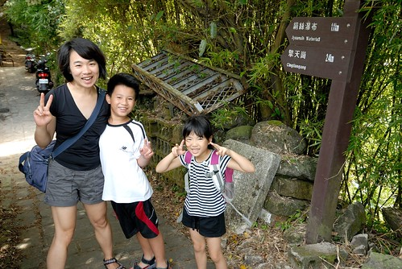 我今日目標是想要從菁山路 ->涓絲瀑布 -> 擎天崗 -> 冷水坑 -> 菁山路 剛好繞一個O 雖然我很心機的先準備好誘惑/提振/打發小人的飛壘與Pinky 加上事成後的M獎勵 但我也知道帶王子與公主出門存在太多的變數 尤其又是阿徹最不喜歡的爬山 所以心態上得一切隨緣 要不然搞得彼此一肚子氣那這暑也白消了 而洞悉媽媽手段的徹愛兄妹倆 一進入步道後竟也不客氣的開始討她們的"營養品" (下圖中的母子三人就是在忙這事) 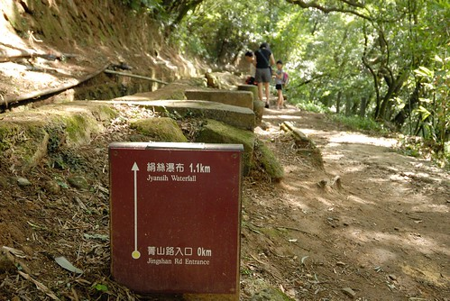 往絲涓瀑布的步道沿著小圳而行 而兩旁盡是竹林與樹林 帽子完全的不需要 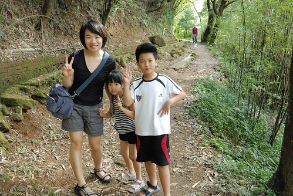 雖然不若徹爸原先想像的像二子坪步道那樣舒適完善(二子坪步道真的是五星級的阿) 但沿途平緩好走且乾淨清爽 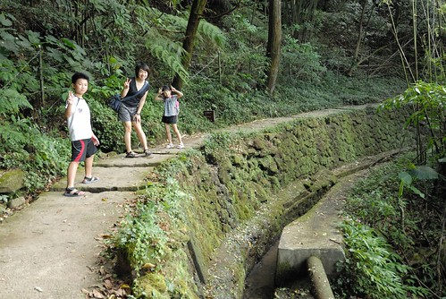 營養品的加持加上徐風真的很涼爽舒服  讓徹愛兄妹今日一開始走的心情愉悅 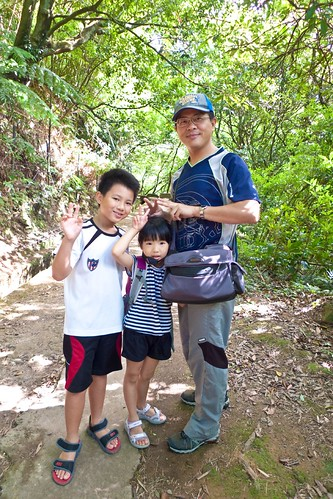 沿途阿徹努力的嚼飛壘 努力的想要吹出大泡泡 雖然徹爸也努力的分享 提醒技巧 但這種事就像運動 最終得靠當事人的開竅 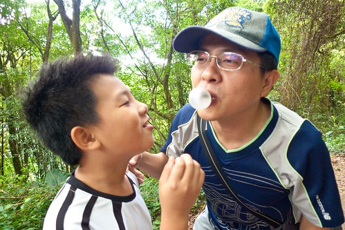 而徹爸除了要教王子吹泡泡 也要盡心的呵護公主免受蚊蟲的叮咬 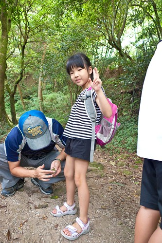 徹家果然爸爸好! 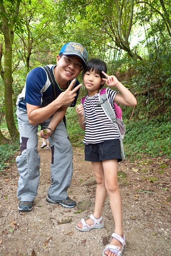 好心情加持下 很快的我們就走到了涓絲瀑布 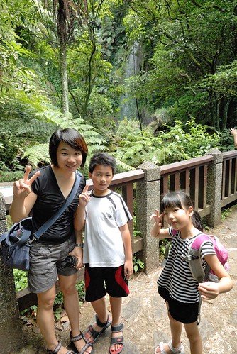 阿徹問瀑布怎麼這麼小 我說"所以叫涓絲阿" 然後徹爸每日一字的解釋起"涓"這個字 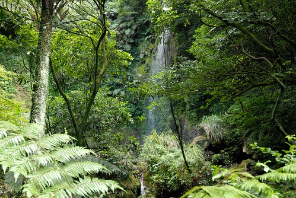 沒有在瀑布多做停留(因為只能遠觀) 我們一鼓作氣的繼續往擎天崗邁進 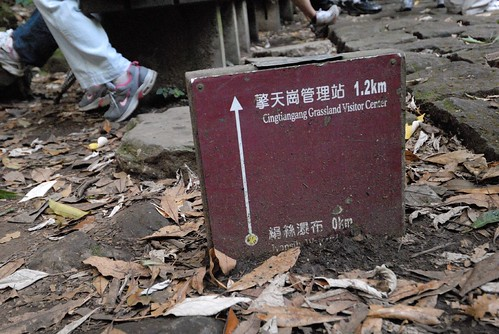 只是差不多的路程數 這段路卻難行許多 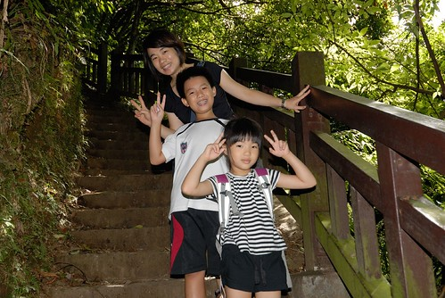 連續的上山階梯 讓一家子汗流浹背 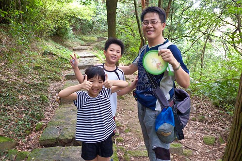 不過沿途嘻哈 (公主還很熱烈的幫爸爸搧風) 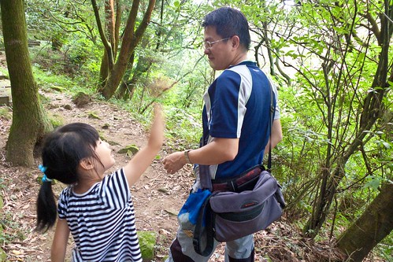 聽著蟲鳴鳥叫聲 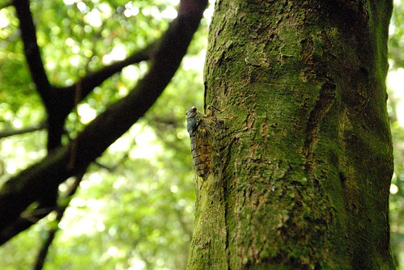 一家子還是走的很起勁 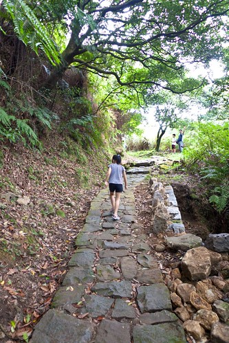 所以約莫一小時多些的時間 我們便從菁山路入口來到了擎天崗 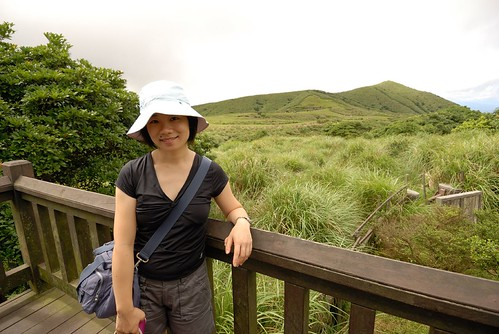 只是一抵達 我的熱頭都還沒過 阿徹便嚷著"好啦 我們可以回去啦"  一整個把阿母的心情往下推 雖說過程很重要 但爬山的最大樂趣應該在於流汗抵達終點後的納涼 所以我一整個氣結的不搭理王子 逕自與公主去遠處看山看雲吃點心 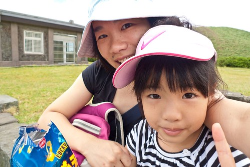 揹一路的點心 就是要這時候吃最好吃阿  愛愛吃的不亦樂乎 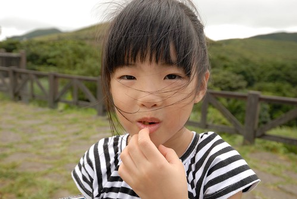 所幸後來王子有跟著爸爸來尋母 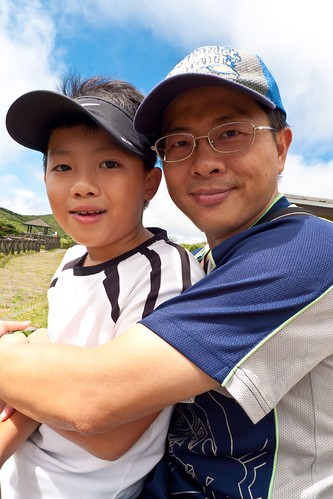 一家子一起曝曬在擎天崗的太陽下 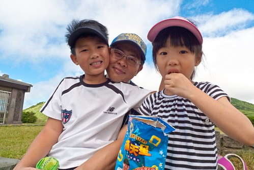 不知道是因為那一天的天特別的藍 還是在擎天崗的關係  天空真的好漂亮阿! 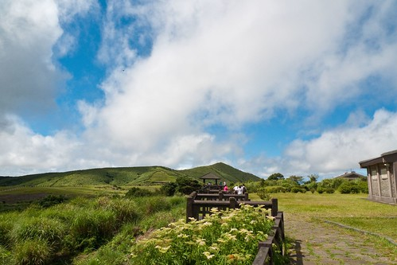 眼前就如一幅畫 構圖與顏色都如此之簡單 但讓人看的目不轉睛 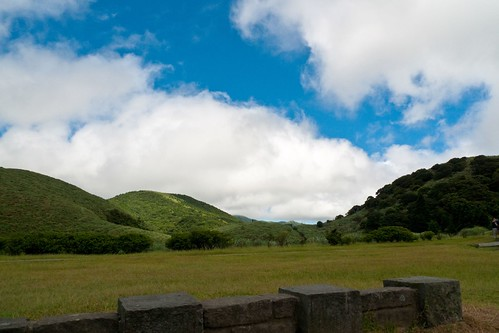 而隨著雲快速的流動 山影也跟著變化多端 饒富趣味 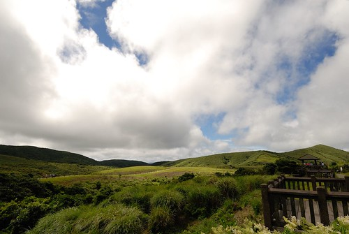 擎天崗上就跟月初在台東的長濱沙灘一樣 太陽是烈的 但風是涼的 人是舒服的 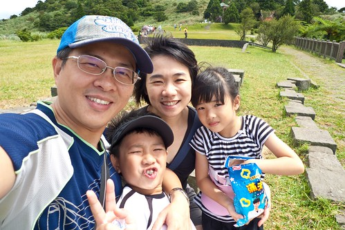 到此 我也心滿意足的願意下山了 沒有原路返回 我們接著冷擎步道 往下山的方向走 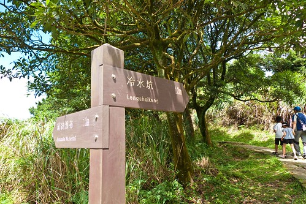 下山的好行 加上達振後的如釋重負  徹愛不需營養品便健步如飛 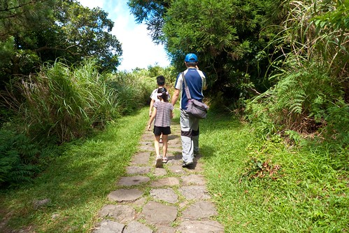 途中看到一排忙碌的螞蟻 還學徹爸惡作劇的畫線讓螞蟻們暈頭轉向 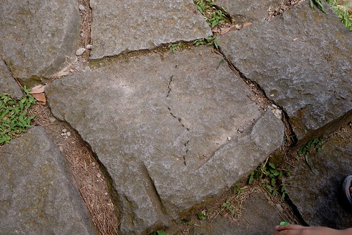 這樣的樂趣就是為什麼即使每次阿徹都會有狀況 但我還是一睹再賭的帶著他往山裡走 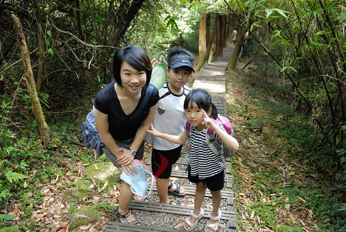 或許徹愛現在一直不懂媽媽為什麼這麼愛走 這麼愛在大自然裡 但沒關係 我相信總有一天他們會明白的 而現在就當作一種強迫儲蓄 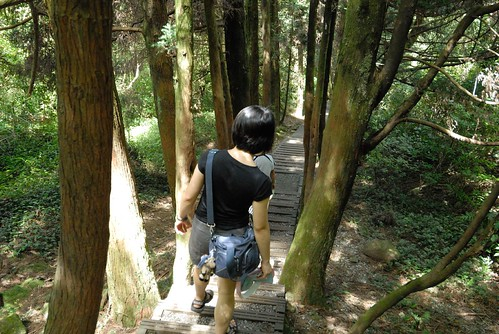 快到冷水坑前有座菁山吊橋 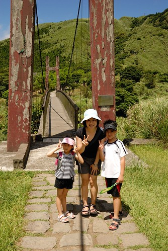 吊橋的紅柱斑駁的很有味道 尤其在今天的天空襯著下 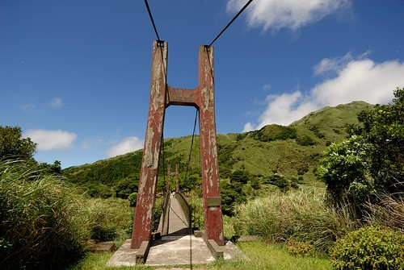 藍天 吊橋 小女生 讓我跟徹爸忍不住的多按好多快門 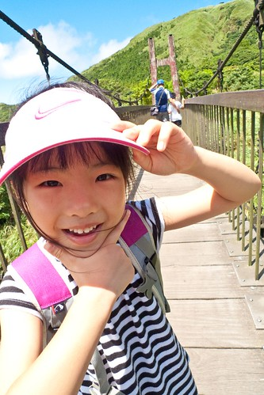 (鳳琴阿姨說愛愛這張超有戶外用品model的FU) 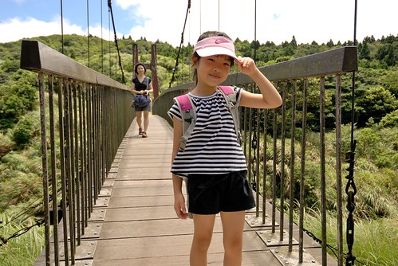 走過吊橋後 我們很自然的坐在一旁休憩了起來 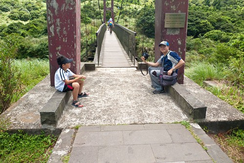 尤其媽媽決定今日的健行就到這裡結束  大家更是開心於完成了今日任務 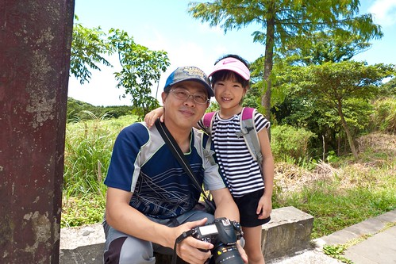 我跟徹爸看著兄妹倆神清氣爽的模樣 感覺真好 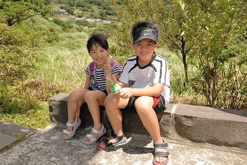 不過調皮的哥哥又手癢的作弄起妹妹了 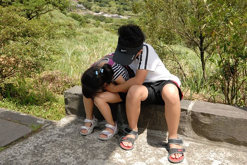 哈! 兄妹倆真的很有趣 感情真的其實還不錯 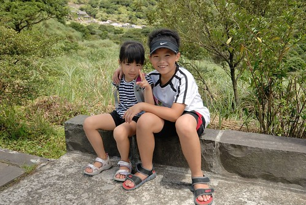 

最後往冷水坑遊客中心的路上   更是要好好把這藍天白雲綠山看往心裡放 真的很棒! 每次的上陽明山總有滿滿的獲得! 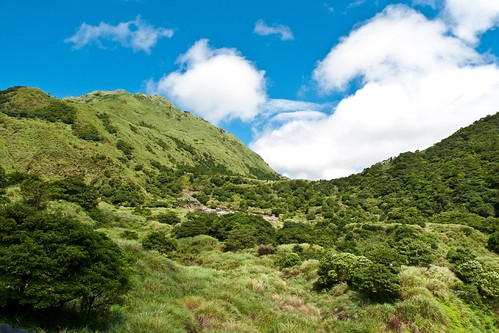 從冷水坑搭公車下山前 我們晃進遊客中心內蓋章 喝涼 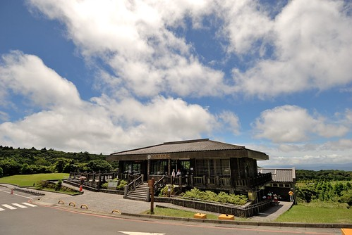 豆干加舒跑 謝謝兄妹倆 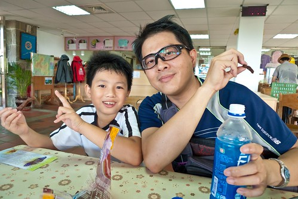 最後我們搭著小巴回到菁山小鎮 雖然短短5分鐘的車程 還是讓易暈車的小愛嘴唇發白 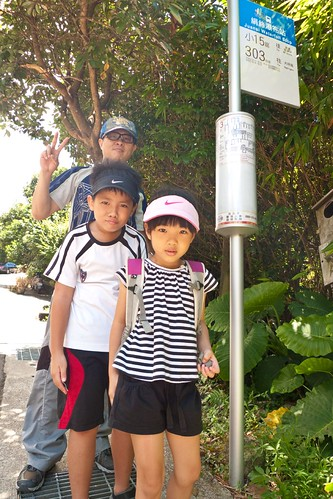 回到我們的起點 總經歷4個小時 完成了我的上山納涼小心願 再次感謝一家子對我的疼愛與配合 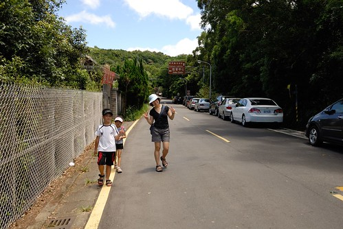 而回到板橋後 實踐行前的承諾  帶徹愛去M吃炸雞大餐 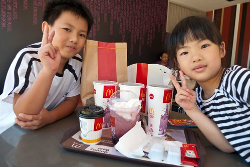 阿徹哀號著"我們好久沒來M了" 我們仔細回想家裡上速食店的紀錄 最近的一次是幾個月前的摩斯 然後元宵節燈會後的肯德雞爺爺 而M大概真的一年前了 嘖嘖嘖~ 給總是有乖乖聽媽媽話 吃媽媽飯的徹愛拍拍手! 不過偶而這樣墮落一次 還真是挺開心的 尤其在流汗健行之後............. 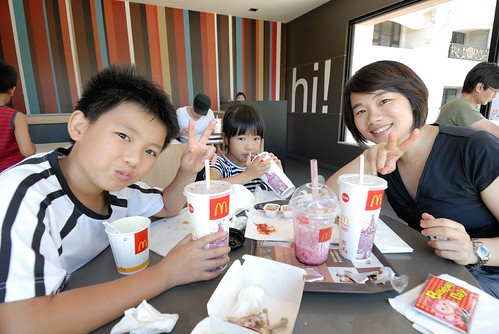
