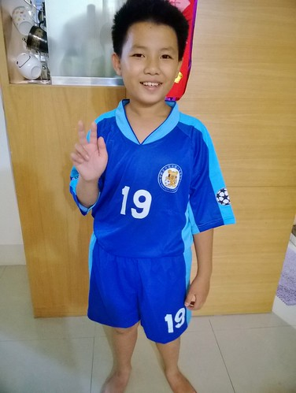

2月22日 徹滿11歲了! 11歲 即將邁入青春期前的蓄勢待發 老實講 娘的心情成實惶恐 尤其越來越常唱獨角戲似的忍不住嘮叨 但幸好兒子每晚還保留些時間想要膩在娘旁 一個擁抱或是一段陪伴!

阿徹的高級小學生分類已經建立大半年 為娘卻一篇都沒寫 是說小孩已經長到不再是一顰一笑都牽動娘的心 也是小孩大到讓養小孩的日子少了許多天真無邪與驚喜... 以致成長日記這樣久久半年才來一次看圖說故事 或許下一次再記錄已是少年的青春日記了   至目前為止 我們一直覺得阿徹小學生活是很幸運的 都能在不同階段遇到影響他甚多的"關鍵"老師 五年級除了遇到原住民男老師作為班導 迥異於以前女老師的帶班風格讓即將青春的他別有一番適應 還遇到了(總算有人)發現他很靈活的體育老師 邀他加入學校的足球隊 從一年級開始就總夢想加入合唱團 直笛團 科研社..等的阿徹 總因為不夠積極準備而連個一撇都沒有過 但這回體育老師的邀請加入足球隊 剛好讓惰性的阿徹有個努力與堅持的機會 每個上學日的早自習練習 加上週三與六下午3-4小時的練習 阿徹出乎我們意外的挺得住 而且漸得其樂 雖然練了一學期依然是上不了場的板凳球員 但可以在最需要運動的青春期成長階段這樣被訓練著  對我們來說就是最棒的收穫與期盼!  隊服發回來的那天 阿徹好開心  一回到家破不急待的就換穿給我看  穿隊服是種榮耀 同時上學可以不用穿超不喜歡的制服 這是支撐阿徹努力留在足球隊的最大動機  一個週六下午 一家子一起在外面吃完中餐後 看到阿徹急著去學校練球的模樣 徹爸說感覺好詭異 會不會其實練球只是個幌子 於是我們偷偷跟在他的後頭來到學校圍牆外偷看 看到烈陽下 阿徹跟著隊伍一圈一圈跑著操場 徹爸說感動的眼眶紅了 兒子真的是有在認真練球的乖小孩!  參加足球隊的另一個難能可貴是團體運動精神的學習 這是上任何課或營隊都無法代替的 所以我們說阿徹很幸運(或許是我們的幸運)  雖然不知道阿徹的能耐有多少 這個板凳要坐多久 但我們樂見他用著他的道努力堅持著! 只是練球後的阿徹又更顯黑了 不過有變精實喔(看起來沒那麼胖了)  學期初 有一天阿徹說在學校寫畢業時要打開的時空膠囊 裏頭寫了三個願望:  1LBX集滿10隻;2不要被踢出足球隊;3變成型男 很屌的第三個願望 我說阿母以後逛街一定會更用心的!  不過同時可見阿徹一如既往的純蠢  只希望長大後不要只是空有外表的型男就好  愛帥另一事證: 洗澡不再連頭洗3分鐘戰鬥澡 會好好的讓洗髮精在頭上多停留些然後沖水仔細點 吹頭髮時也會多些耐性順著髮性好好吹乾 所以阿徹的招牌恐龍頭漸漸服順不再亂爆衝  愛帥另二事證: 在乎起臉上的丁點小豆子 願意好好洗他的臉 或說洗的乾淨的阿徹皮膚真的很Q彈 雖然黑也是能黑中透紅的  愛帥另三事證: 看重起自己的穿著  逛街時越來越會挑可以顯帥的衣服  買到帥衣也會開心 過年時穿上新買紅色運動外套 拉鍊刻意拉一半 因為這樣才像王子 尤其愛妹閃亮著眼睛對哥哥說"哥好帥"時 嘴角上揚的徹哥真的像個小王子  升上五年級後 阿徹對於課業的付出並未隨著增加 每天依然寫完功課後就攸遊在他的漫畫與遊戲中 雖然成績當然是不甚好的堪接受 但能夠不用我們緊盯著寫功課與唸書 尤其數學與自然的學習 成績非優但邏輯理解能力備受老師肯定 我們也該略感欣慰了~  學習單常像這樣的可以少寫絕不多寫 圖畫也能精就簡 但如這圖中的搶匪 阿徹的小畫作常令人會心一笑  這也是他的"道"  有一天阿徹得意的讓我看他給鳴人做的家  我說這是數學教具吧?! 阿徹訝異我怎麼會知道 我笑說凡事都逃不過阿母的眼睛阿 真的 幸好阿徹的數學有學好 要不然我不知道我還能不能這樣讚賞他  除了天馬行空的手作時常發生外 阿徹的樂高遊戲也依然持續著 逼真的小步槍 讓我跟徹爸玩性大起的搞了個花椰菜喋血事件  我們拍不出但實在做的傳神的神獸系列  每隔一陣子就會重新來過的 大工程家之建造  每次兄妹倆總會興致勃勃的跟我介紹樂高家每個空間的特性與使用方式 我相信以後他們肯定也能打造出屬於他們的 真正的家  而除了樂高外 這半年阿徹多了蒐集LBX (紙箱戰機)小模型的收集 父子倆常結伴去西門町的模型店或是轉戰個大賣場比價與掃貨  老實講 阿母並不太能接受這麼多的機器人  但阿徹很喜歡小模型的組裝過程 同樣是男人的徹爸也很挺 阿母只能含著淚 看著昔日的斯文小生改走宅男路線  而最令阿母歡喜滿意的依然是阿徹吃的能力  每天早餐 來者不拒的吃光所有阿母傳上桌的食物  每天晚上幫忙晚餐上桌時 總是開心的喊著什麼菜是他愛吃的 然後邊端邊偷吃 開動後 當然也是很捧場的把飯菜吃光光 偶而還會誠懇認真的給予媽媽意見與想法  只是阿徹吃東西不只是看起來好好吃的模樣 也常狼吞虎嚥的得讓人時刻提醒 或是滿臉紀念品  好天氣時的放學後點心 阿徹最喜歡吃佳穀物脆片與香蕉的無糖優格 每回都好認真的準備好他自己的點心  然後滿足的大口大口吃  再配上本漫畫 是阿徹每天放學後的最棒放鬆方式  對於正要血氣方剛的兒子  阿母偶會有無奈與洩氣的時候  但每次總輕易被兒子抱著時的天真笑容給收買  所以阿母依然只能無怨無悔的當兒子背後那隻愛的小手  再不然 還有阿爸那隻更大的魔手阿~  (話說青出於藍勝於藍 兒子的放電功力遠勝於老子)  逢五生日才能吃蛋糕 這是徹家的傳統 不過讓壽星欽點生日夜的晚餐 青醬義大利麵而且還是焗烤的  一家子在家吃生日餐  加上飯後的大富翁遊戲  很令壽星開心的美好夜晚  小子~ 生日快樂! 
