每隔一段時間 徹爸就會挑選整理好前一陣子的照片送洗 這回相隔好久  只好一口氣從2011挑到2013年中 前後兩年半時間 共七百多張的照片裡 一家子去了幾次的花東 共同走過好多地方 經歷好多不同的小人成長階段 照片裡的徹愛 很多時候是歡樂的 精力旺盛的  當然也有哭泣的或被處罰的時候 徹愛與我一起看著這些照片做成的影片 既訝異 又開心喜歡的不得了 點點滴滴的回憶 在一起看照片(影片)時又一幕幕的美好再現 我們說以後徹愛結婚喜宴時 就把徹愛從小到大的影片放過一輪包準有趣又不重複 徹爸笑說 "只放我們家的照片 那對方怎麼辦?" 這的確是個問題阿...

上週轉著電視時 看到去年在台灣舉辦的Red Ball特輯  我想起那個讓人笑到流淚的下午 這也是徹家一起體驗過的美好~ 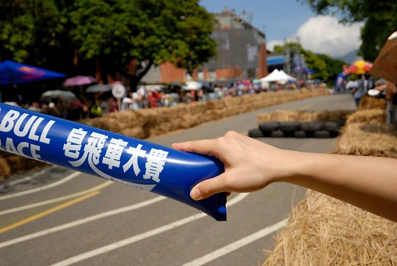

那陣子很久沒出門的我們 趁這機會順道安排了個淡水小半日旅行 一大早7點多出門後先是到真理街上的老牌阿給吃早餐 然後到附近的堤岸邊散散步 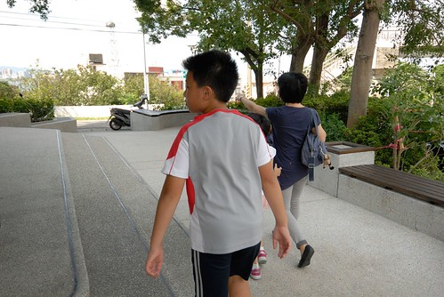 除了之前來吃過阿給外 這應該是徹愛第一次走訪淡水 穿梭在新舊房子交雜的小巷道裡別有一番發現與趣味 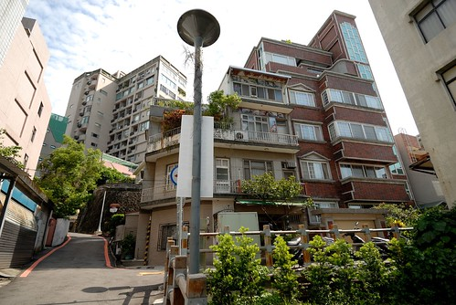 這天的雲好野 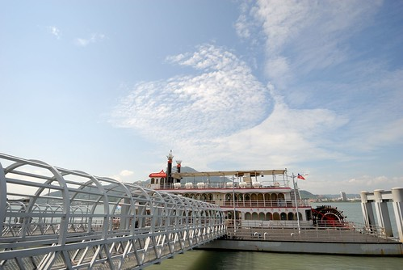 曬的我們好陽光 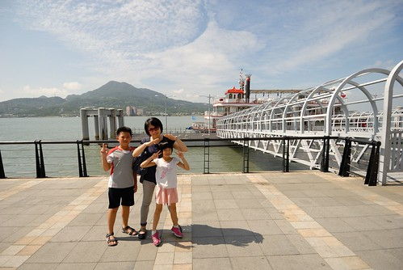 但也熱得讓我們盡走在樹蔭底下 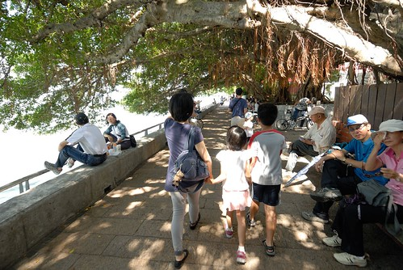 來淡水 我最喜歡的就是這榕樹下 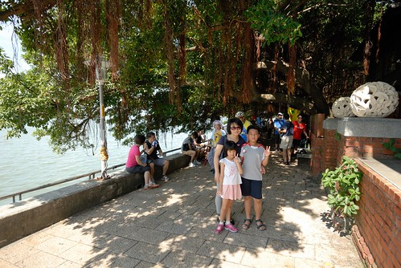 坐在這 風涼 心舒爽 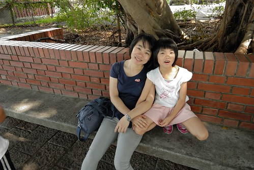 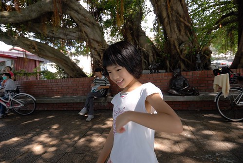 我們沿著堤散步著 走到開滿花的圍牆下 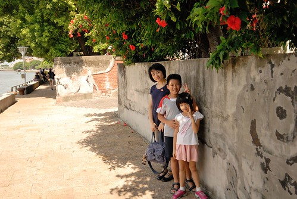 小時候上學的路上 常看見這花(這花叫什麼名阿) 每次看到這花 我就想摘一朵來玩玩 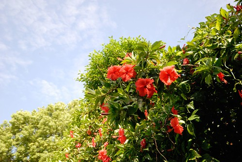 摘下花瓣 黏到鼻頭當小木偶 徹愛看的不可思議  離開堤岸邊 我們繞著遠路去停車場 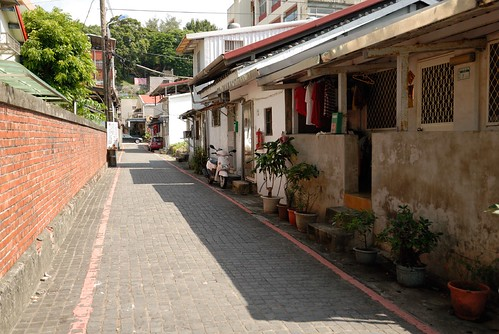 繼續穿梭在這新舊交雜的淡水小鎮 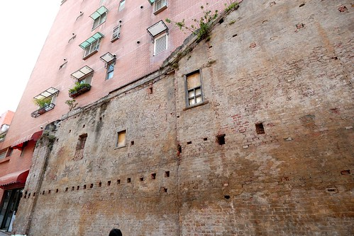 (馬偕紀念館的紅磚真的好漂亮) 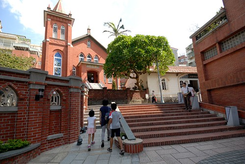 皂飛車是下午兩點才開始 怕找不到停車位的我們早早11點半就到山下 把車停在捷運忠義站 走北藝大的後門上山 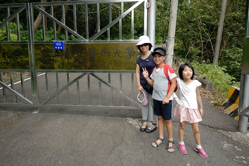 後山這段路還真不是兩三下就上的了  20分鐘的爬坡讓人氣喘如牛 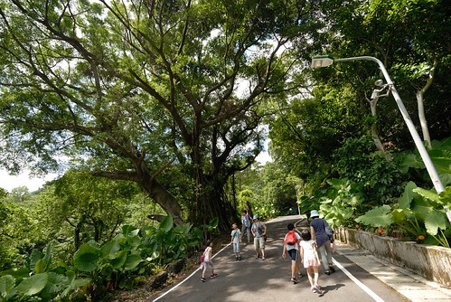 沒想到一抵達活動會場 就看見熱鬧滾滾阿 這組檳榔車最後獲得最佳造型還是藝術獎 可是我真的覺得很普說 是說這年頭只要夠台就可以嗎.. 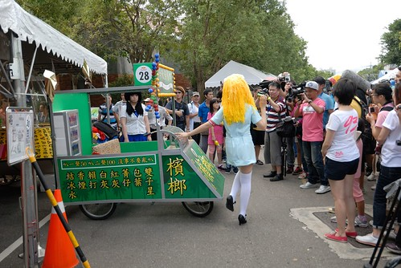 原先我跟徹爸心想台灣辦的RED BULL可能熱鬧有餘但創意(美感)有限 但沒想到各各來頭不小 創意與噱頭都很夠味阿! 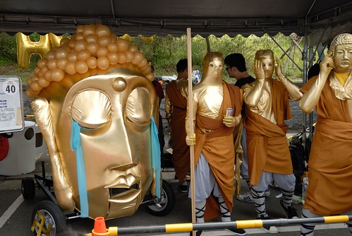 看的出來這是那當下最夯的半澤直樹嗎? 我覺得這傢伙帥多了 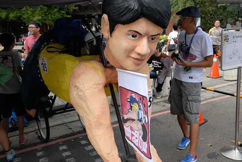 看完每組參賽者的動態作品展示後 我們先是去比賽場地探勘一下 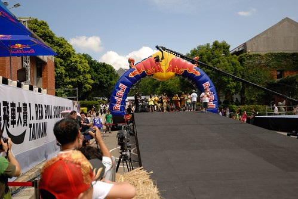 距離比賽開始前還有2個小時多些的中午12點不到  賽道兩旁還空蕩蕩 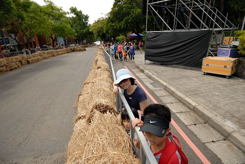 我們想活動應該顯為人知  不用急著卡位 於是先去校內唯一的便利商店打理中餐 沒想到越買越吃 那個人潮越來越多了ㄚ 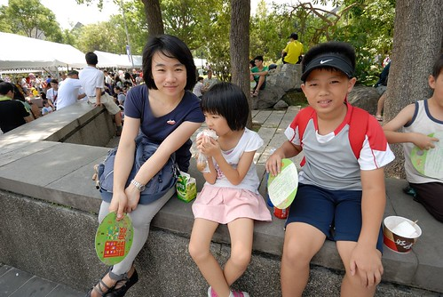 30分鐘後 當我們再去賽道兩側找位置時 哇~ 竟然滿滿滿 沒縫可插阿! 只剩僅存不多會曬太陽的小洞天 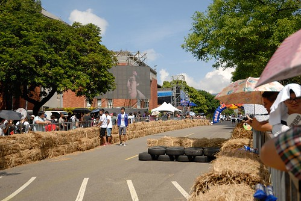 看到大家如此熱情 我們也只好撐著傘拼了 (幸好後頭就是活動中心 徹愛躲進書局裡吹冷氣) 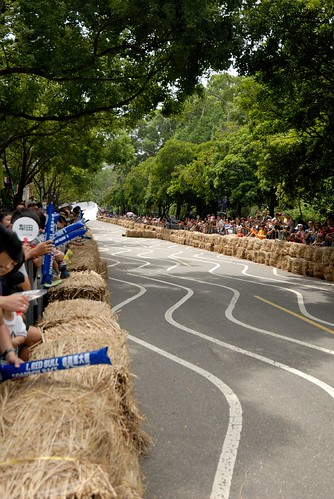 從賽道兩旁的稻草磚 免費放送的加油棒與扇子 到販售的飲料 一整個很RedBull 很令人亢奮~ 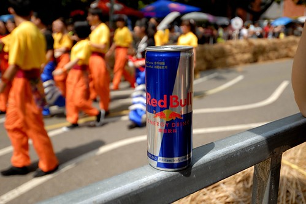 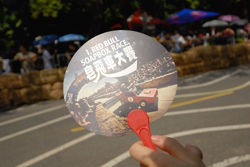 活動一開始由台灣第一位參加RedBull專業選手帶領的單車極限表演炒熱 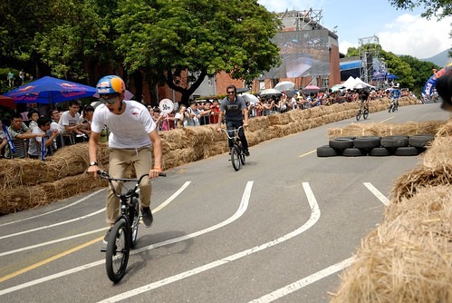 徹愛趴在稻草堆上看傻眼 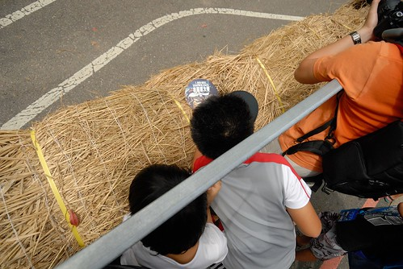 只是後來近小時的開幕表演 有些過長的讓人冷了下來 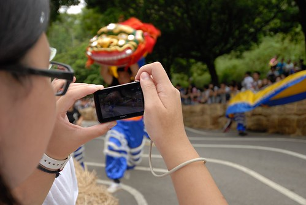 尤其沿著長長賽道的中國傳統舞蹈與舞龍舞獅 跟活動的主題還真有些不搭 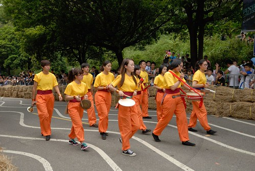 好多觀眾就像徹愛這樣等開賽等到都累了 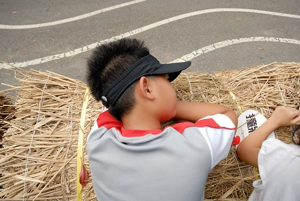 什麼時候才要開始阿............ 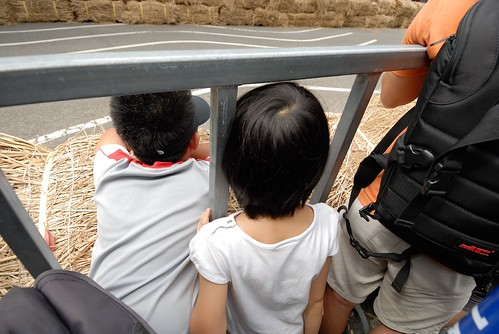 快要開始了! 要堅持下去阿............. 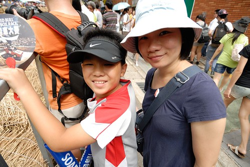 尤其滿山頭的人潮 加上藍天白雲這樣美麗的天氣   難得熱血的徹家一定要High一下 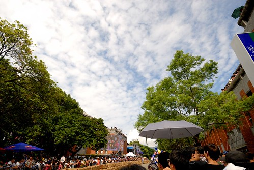 (清場的工作人員 大仗勢的一路巡下去還挺酷的) 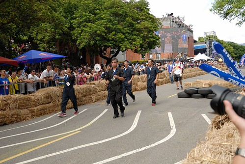 等了兩個小時 總算總算車開始要飛了.. 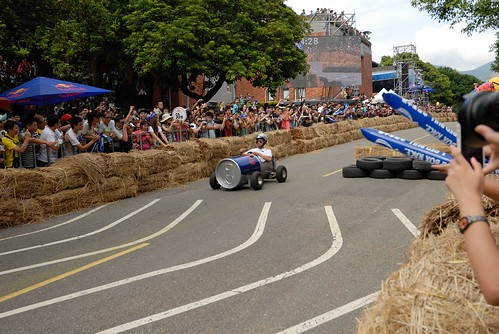 先是由台灣名手作示範駕駛 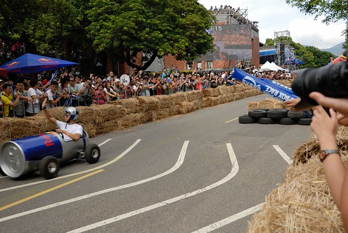 然後一號車揭開今天的比賽 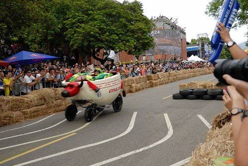 原先只是想難得一家子出門的跟著徹爸一起來湊熱鬧的我 真的沒想到RedBull比賽現場竟是如此緊張又爆笑 我笑到淚流不止 車飛的漂亮讓人振奮! 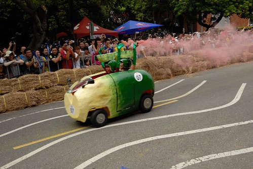 突如其來發生的意外摔車或撞車 更是讓觀眾high到不行 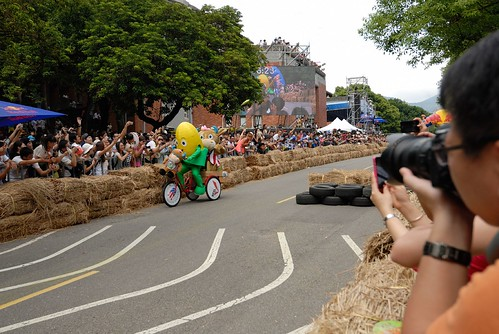 大家好想幫幫撞車的駕駛一把阿 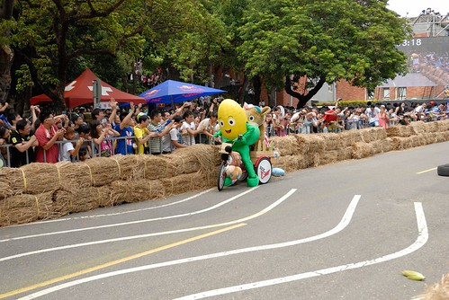 但很抱歉 撞車了  當場就出局 工作人員會請出場 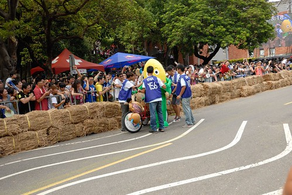 不能接受事實的選手 讓觀眾同情卻又大笑不已 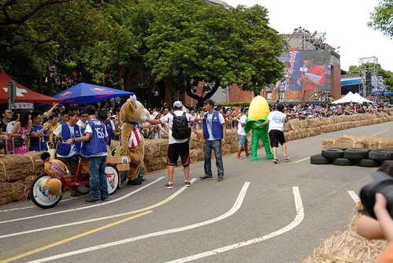 摔車的選手也一樣招來觀眾的大笑回報 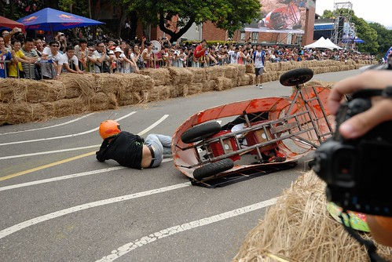 以及工作人員的無情請出場   話說工作人員清理現場的速度超快的 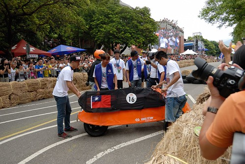 有些參賽選手會沿途刻意或是不小心的飛出東西 甚至整車身飛走只剩一台底座與人 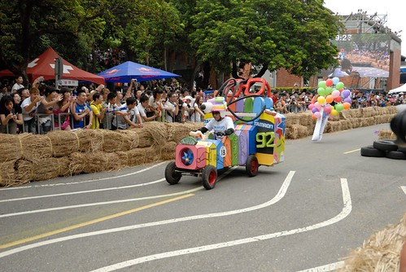 一幕幕的意外場景真的會讓人笑到嘴好酸 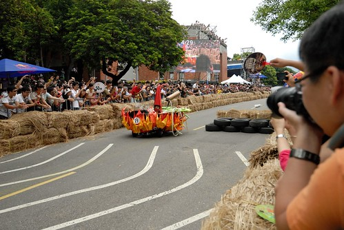 (這台只用拖板車簡單製作的飛車很讓人捏冷汗 果然下場也並不是太好) 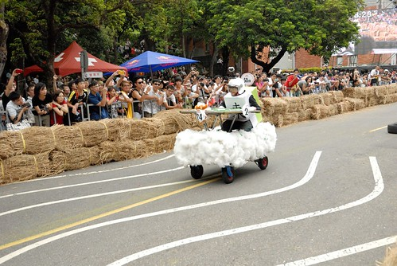 發現參賽選手的年齡層很廣 不只是青年學子熱血 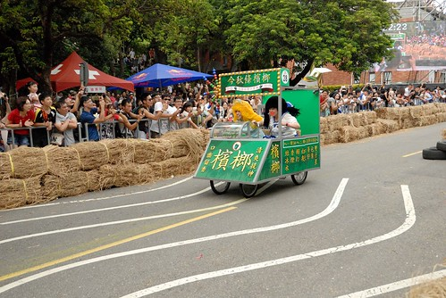 很多中年歐吉桑才真是超猛 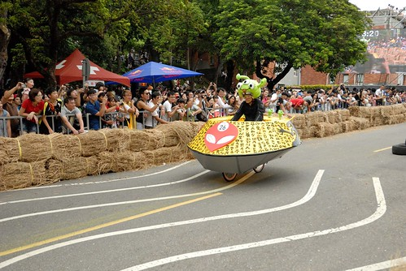 RedBull真的就像一場高潮迭起的肥皂劇一般  讓人看的好開心 難怪聽說有好幾萬人上山 但很多人擠不進會場 只能在校園的大草坪上看大螢幕 我們好幸運的親眼見證與體驗台灣的第一次RedBull!  回家後 我忍不住在FB獻寶: 卡位1小時+open show 1小時+不斷的摔車清理 等待=>公主快抓狂了 => 看到第28號(誰讓他又摔車了, 要不然說好到30號的), 雖然意猶未竟但還是一家子開開心心的回家吧... 到28號也開賽兩小時了! 真的蠻累人的... 總被我說成"造飛機"的皀飛車，果真熱血又爆笑!讚!! 
