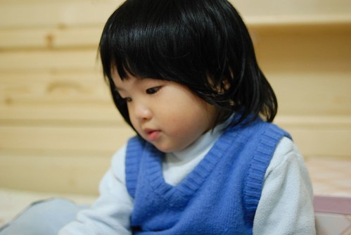

姑娘上週末滿兩歲了~~~  
兩歲的娃加上幼稚園的環境大刺激  這一個月來的姑娘每天都在轉變 在不一樣  
可是媽媽不才加上懶惰沒有好好逐一記錄下來 實在該打屁股...  
  
這一個月最大的進步就是語言發展  
從剛一個月前剛上學時的單字 偶而的兩個字的詞  
到現在的可以主詞+動詞+受詞   
再加上越來越運用自如的扁嘴及咕嚕轉的眼睛  
很難讓人不去注意到  不去明白姑娘的意見與想法  
  
而這一個月最大的退步則是食慾  
從以前保母說的不知飽為何物  一餐飯不消10來分鐘清潔溜溜  
現在卻吃沒幾口就要人家餵  餵沒幾口就又開始含飯   
常常一個飯吃個40-50分鐘  考驗大人的耐性跟她自己的磨功  
幸好媽媽已經做好長期抗戰的準備 準備好好跟她打吃飯戰  
總有一天要讓她跟哥哥一樣當個不挑食 愛吃飯的乖飯桶的  
  
(覺得這張的Fu很好)  
  

其實姑娘是個想法很簡單 個性很好捉摩的一個小孩  
希望她可以這麼一直單純 執著 自在快樂的下去  
只是個性上可以不要像媽媽那樣逞強會好一點  
  
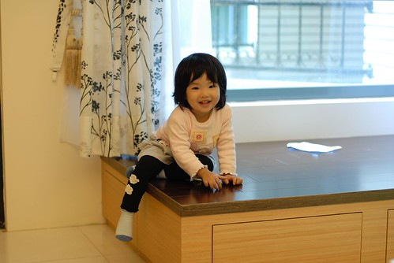  
  
其實姑娘出門在外很會做表面工夫  
真的不像大家初看的文靜 乖巧樣的  
  
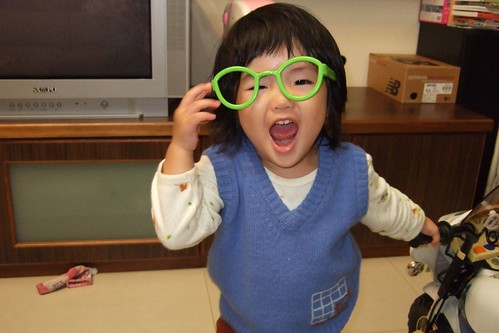  
  
看到這俏皮模樣的姑娘就會很想捏捏她的豬鼻一把  
  
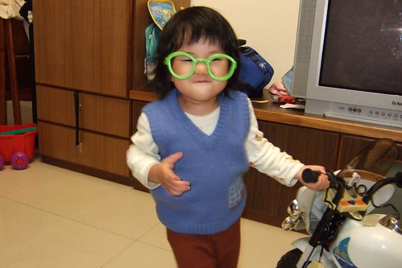  
  
小女生好像天生就是會愛漂亮  
穿上裙子就像是要飛上枝頭的鳳凰一樣  
  
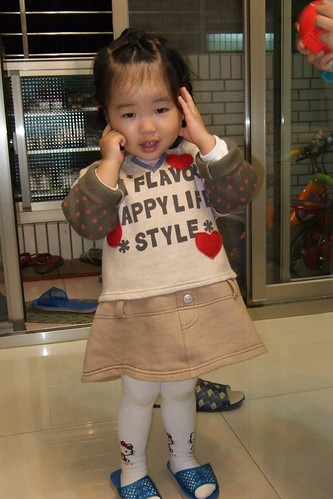  
  
在家裡在學校的很多時候 姑娘就是這麼靜靜的 認真的做著自己的事  
在上了一個月的學後總算聽老師說 課堂上比較會發表意見了  
不再都是用害羞的笑容代替回答了  
  
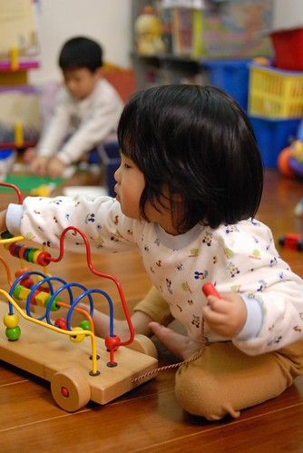  
  
真的別再逞強揹書包了  
我真的不希望讓人家以為我是狠心的媽媽  
  
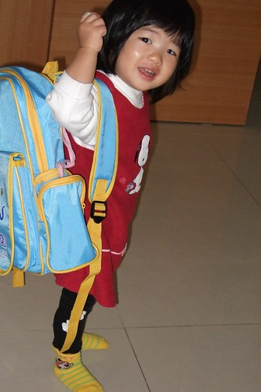  
  
上學的頭一個月就遇到了萬聖節遊行 營火晚會 戶外教學  
很精彩 很豐富的上學初體驗  
雖然尚未有因為適應不良而產生的反抗或焦躁不安  
但這一個月半夜睡覺哭醒"哈暝"的次數卻大幅增加中  
以前以為只有阿徹這樣膽小又敏感的小孩才會"哈暝" 才會半夜閉著眼瞎哭  
想不到上學後的小愛也常發生這樣的事  
莫非這真的是因為白天接受太多訊息刺激 夜晚大腦不停運轉 重複記憶所造成的  
  
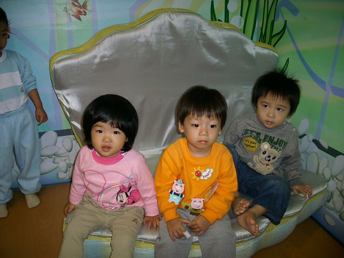  
  
班上目前5男1女 加上偶而一兩個寄讀的小朋友  
可是戶外教學時 幼幼班會參與的小朋友寥寥可數  
其實兩個老師只帶幾隻小貓可以讓人很放心的  
  
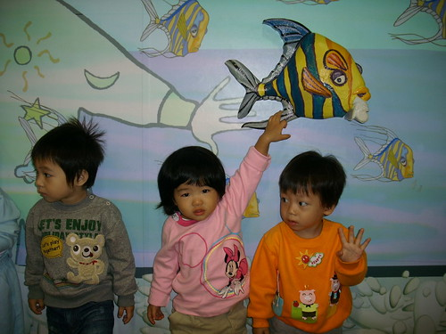  
  
這是學校裡最讓姑娘掛念 掛在嘴上的嵂嵂  
週日問姑娘"明天要上學了耶 可以見到誰ㄚ"  姑娘想也不想的就說"嵂嵂"  
再問她還有誰ㄚ  姑娘說"媽媽" ...ㄟ 這回答又讓人很三條線 懷疑她是不是懂上學的意思阿  
據嵂嵂的媽(就是園長)說  週末他們開車來學校時嵂嵂看到學校也直比著說"愛愛 愛愛"  
問他班上有誰 在回答"愛愛"後就是"沒有了"  
好像幼幼班就兩個人讀 只有嵂嵂跟愛愛而已  
  
某天放學要回家時 嵂嵂剛好也在門口  
我跟嵂嵂媽起鬨要他們互跟對方kiss bye時  
愛愛小姐突然就用她的小嘴往嵂嵂的小嘴上琢了下去  
嵂嵂呆住了 我跟嵂嵂媽也不可置信的睜大眼 忍住不要捧腹大笑  
想不到 姑娘就這麼奪走人家少男的初吻了   
唉呦~娘都有點不好意思了   
不過幸好應該不是落花有意流水無情  
據聞嵂嵂在家看到我們blog上的姑娘照片時 也會猛說"愛愛 愛愛" 然後對著螢幕又摸又親的  
看來愛苗似乎在兩小的心中慢慢滋長了~  
  
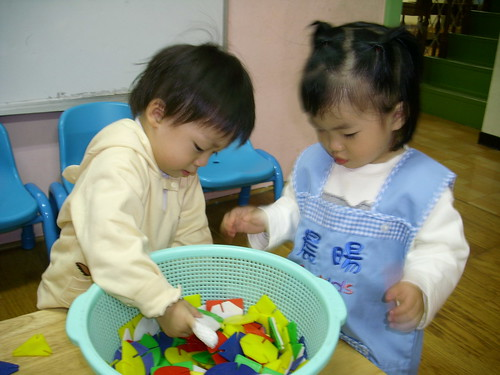  
  
跟哥哥一樣很期待剪頭髮哩  
剪個大瀏海妹妹頭 媽媽可以更偷懶不用綁頭髮了  
  
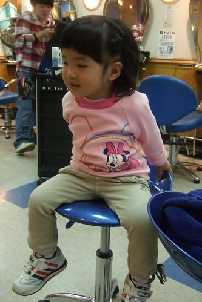  
  
姑娘對老人家很有一套 很有老人緣  
一聲聲的"嬤~" "公~" 叫的老人家個個茫酥酥  
聽說對學校的廚房阿嬤也很ㄋㄞ 常繞在身邊嬤長嬤短的  
  
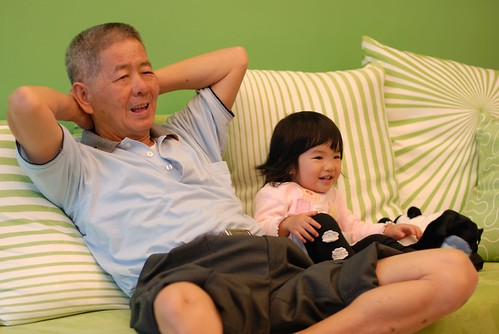  
  
越來越依賴阿徹哥哥 卻也越來越常跟哥哥搶東西  
過馬路不給牽的時候得要哥哥  
不乖乖吃飯也不給餵時也得要哥哥  
只是有時候固執的要哥哥手上的東西 氣得哥哥大喊"妹~我不要理你了啦"  
兄妹倆好像感情很好又很像感情很不好  
  
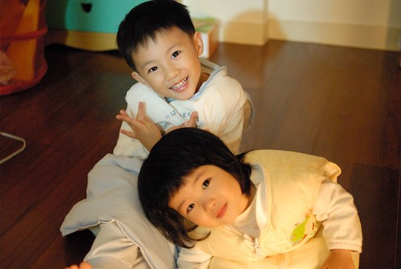  
  
兩歲的娃就是這麼的可愛 這麼的搞怪 這麼的快速改變  
爸媽要好好把握 珍藏這樣最可愛的階段  過了就真的沒了     
  
乖乖 睡個好覺~希望今晚不要再哈暝了~  
  

