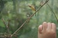
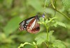
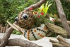

話說3/25的一大早  
阿徹起床後便嚷著要去"晚安 猩猩"(以動物園為背景的繪本)的那個動物園  
雖然我對於動物園實在沒啥高度興趣  
因為去年夏天的動物園行讓我從此對於動物園敬謝不敏  
那天人熱昏了 動物也熱的都躲起來 不見蹤影  
重點是覺得那些動物們接受不人道的待遇  
有的住在狹小且髒亂的空間裡  
有的住在人工假植物環境裡  
就連那企鵝也得拋棄"國王"身段住在水泥砌成的小游泳池裡  
看了只有心疼...  
當時還跟徹爸說 我以後再也不想來動物園了~

今早 寶貝徹竟然主動開口說要去動物園  
咦~實在不知該如何拒絕哩  
好吧!在下了一週多的雨後  
趁著難得的好天氣 出去走走曬曬太陽也好  
趁著妹妹剛喝完奶 半小時不到的車程便已到達動物園  
這次沒再坐遊園車去看可憐的企鵝  
反到從人少的昆蟲館逛起  
人少多了份悠閒  
加上阿徹向來對蟲蟲抱持高度興趣(算是對於獨角仙的愛屋及烏吧)  
一家四口竟在昆蟲館逛了1各多小時  
仔細的在每一窗口找尋蟲蟲蹤影  
感受蝴蝶在身旁飛舞的曼妙  
一家三口嘰嘰咂咂的討論個不停  
而妹妹倒也怡然自得的坐在第一次啟用的推車上  
時而玩奶嘴 時而睡覺

逛完昆蟲館 阿徹又興奮的拿著彩色玩具鑰拾要去找"晚安 猩猩"中的大象 猩猩  
找到猴子後還裝模作樣的幫猴子打開門鎖  
走完熱帶雨林區 看到了大象 猩猩 豹 老虎等  
爸爸媽媽已經給他小累  
但是阿徹卻依舊精力旺盛的跑個不停 說個不停  
還直喊著 還沒找到斑馬  還沒看到無尾熊  
嘿嘿~饒了爸媽吧 況且妹妹喝奶時間到了  
下次再來找斑馬 無尾熊吧~

往門口走的時候 阿徹突然沒了動力討要爸爸抱  
我跟徹爸剛好給他來了各機會教育  
之前問阿徹妹妹叫什麼名字 他會回答"張有愛"  
再問他什麼愛也會大聲的說"愛心的愛"  
我們便常鬧他 "那阿徹的徹是什麼徹阿 廁所的廁嗎"  
阿徹當然是大喊著"不是"  
可是對於我們跟他說的"貫徹始終"的徹 "徹底"的徹卻無法想像 明暸  
今日剛好跟他說"阿徹如果都自己走 走回到門口 那就是貫徹始終喔"  
"一件事情自己從頭做到完 那就是貫徹始終的意思"  
"因為你是貫徹始終的徹 所以你要自己走喔"...  
阿徹似乎有那麼點了解"貫徹始終"的意思了  
因為他很棒的自己走回到門口  
而且還再跟媽媽走一大段路去買犒賞他的薯條

今天天氣很好 阿徹很貫徹始終的全程自己走 妹妹很配合沒哭鬧  
今天是個很棒的郊遊~

