趁著上太平山前 我們順道一訪放入口袋名單已久的松羅步道 松羅步道位在宜蘭大同鄉 我的地圖裡則位處北橫的出口 太平山與武陵的山腳下 感覺好像有點遠.. 不過這天8點從板橋出發 9點半便抵達步道的停車場 快的讓我很吃驚 不得不再次讚嘆雪隧真是大大拉近台北與宜蘭的距離! 我喜歡松羅這片如原始雨林般的林相 尤其溪水清澈的讓人印象深刻 看著溪裡成群的苦花魚 步道兩旁的林木旺盛 真高興昔日泰雅的獵徑被完整的復育 保存且流傳著... 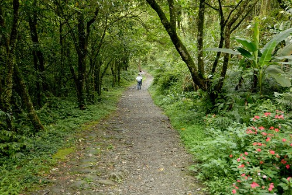

順著台七往大同的方向 過玉蘭村之後可看到顯著的"松羅國家步道"標示 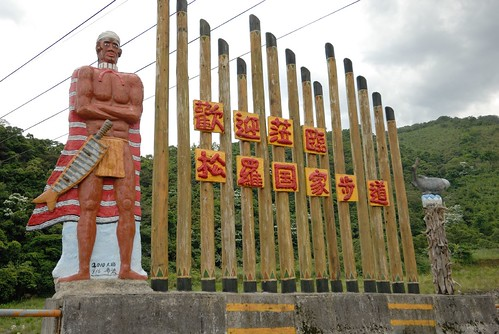 轉進林道再行駛一小段便抵達步道的停車場 停好車馬上開始今日的大步行 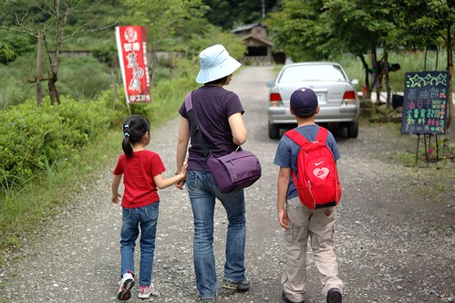 看到地圖 研究一下步道沿途的景點 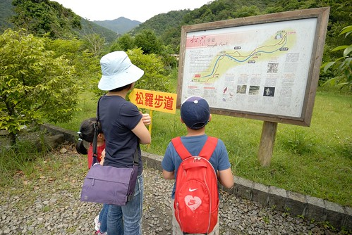 阿徹問要走多遠? 我們說跟著走就對了! 預計來回要3-4小時的路程 我想還是別太早告訴他 以免讓他一開始便崩潰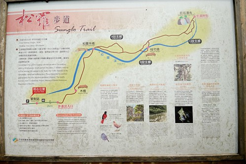 最近有點叛逆的阿徹 今日照相總想盡辦法在我頭上生角 我說生角沒關係 不要臭臉就好 好久沒出門踏青 可千萬不要壞了大家的好興致 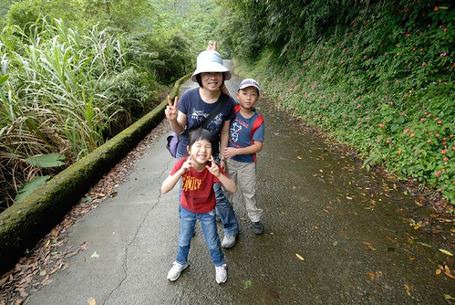 幸好家裡有個小女生可以潤滑一下 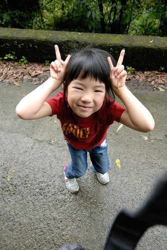 愛愛替爸爸媽媽與哥哥之間搭起友誼的橋樑.. ㄏㄏ 不過愛愛真的是很好的遊伴  脾氣好 體力好 腳力也好 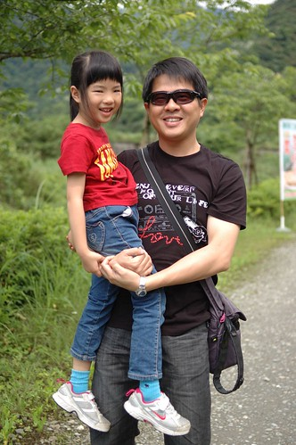 沒看過油桐花的阿徹 在台七路上看到山上一陀陀的白色問那是什麼 幸運的 在往步道口的路上有顆正在飄雪的油桐樹 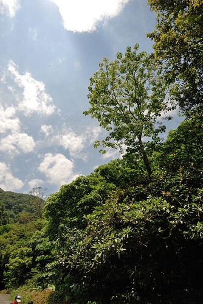 雖然只有一棵 雖然未有如地毯般的花況可賞 但已讓沒賞過桐花的我們滿心歡喜了 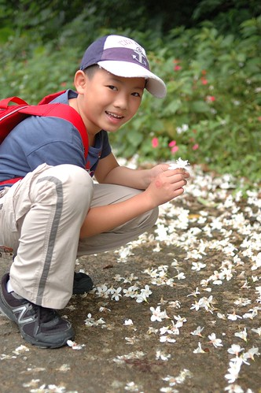 尤其那一朵朵隨風飄下的花朵 讓徹愛開心的直追猛抓 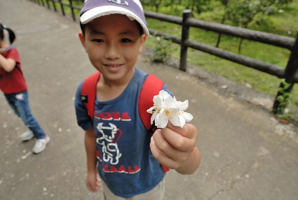 就這樣我們也賞到五月雪了! 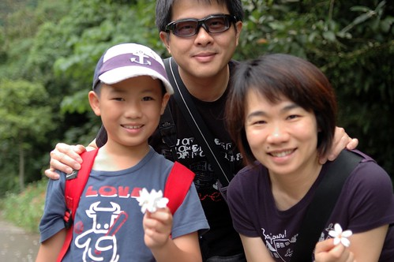 意外的五月雪讓我們今日的步道行有好開始 好心情 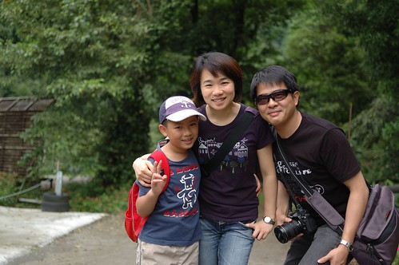 接下來就更要更精神抖擻 大步大步向前行嚕! 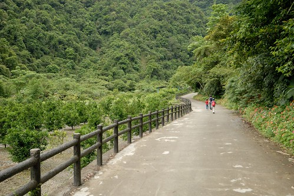 從停車場到步道的入口都是像這樣的水泥小徑  平緩好走 只是約莫兩公里的路程  也恐怕會讓不少人還沒到步道口便已精疲力竭 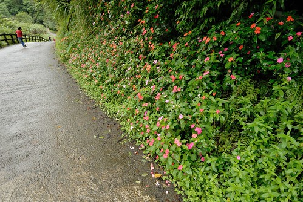 不過這是段山林中散步的好路 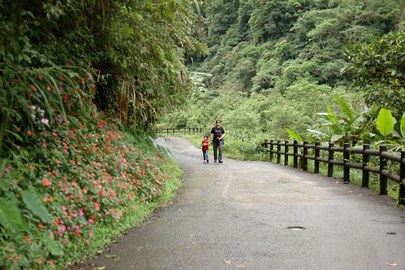 而身子熱了時也剛好接著進入步道中的挑戰 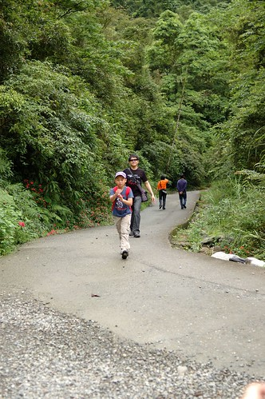 步道口 兩老來張紀念照 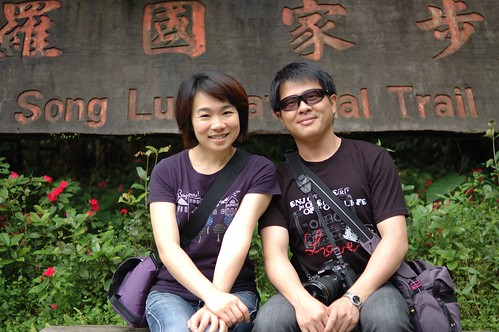 我說我的相機其實有一半是為了愛愛揹的  她照的得意 我們也被照的開心 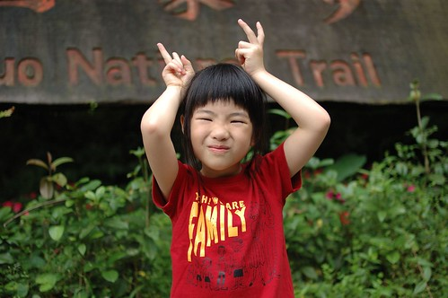 松羅步道總長約莫1.7公里左右  不難走但也不算是親子好走路線 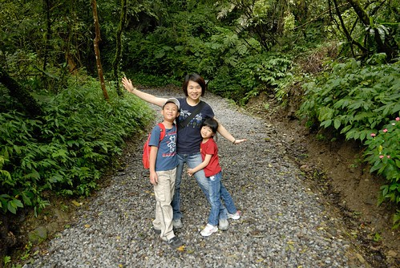 尤其雨季期間 道路濕滑要格外小心 (那天反倒是我多次打滑) 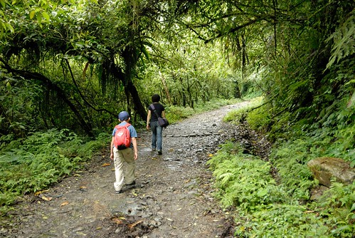 松羅溪的溫暖潮濕造就這裡如雨林般的植被景觀 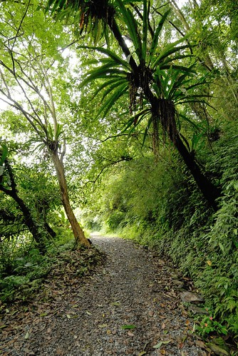 植物種類繁多且都長的超營養 漂亮的 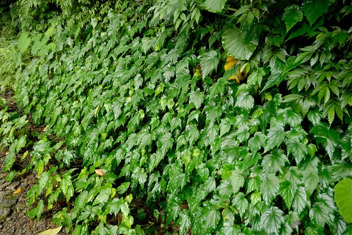 不同的葉子 不同的綠 不同的視覺感受 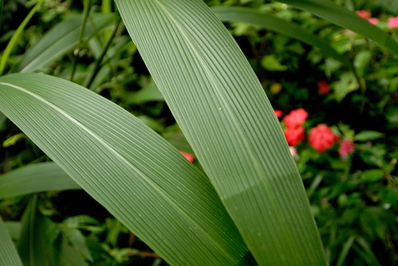 步道中有個松羅吊橋  看地圖時本以為只是步道旁的一個景點 但走到吊橋後才發現這是步道的必經之路 這下有點尷尬了 因為繩橋的距離雖然不長 但走起來搖搖晃晃加上下頭便是滾滾而流的溪水 如果徹愛真的不敢走 我們也不敢強求 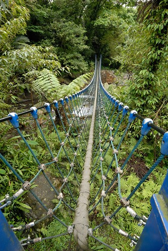 幸好徹愛怕歸怕 還有那麼點勇氣願意試試看 由媽媽領軍 愛愛與阿徹分別緊跟著 徹爸最後督軍 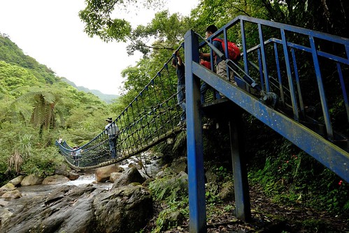 千交代萬叮嚀愛愛要走穩每一步  要一手接一手的抓著繩索前進 雖然繩橋穩固 兩旁也都有繩索護著 但心裡不免擔心嬌小的愛愛若是滑倒 從繩索空隙滑出去了 可怎麼辦好 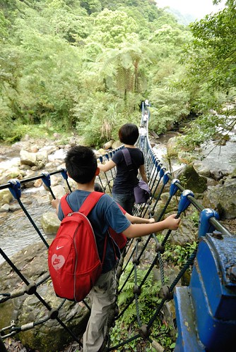 總算一家子平安過橋了 雖然緊張 雖然如阿徹說的腳發軟 但過橋後的兄妹倆得意的說"好好玩喔" (徹爸說我這張照片是對焦到哪去了 他跟阿徹都糊掉了 呵呵~ 我的焦都對到愛愛去了 因為當下就覺得愛愛好棒 要留下這紀念的一刻 愛愛是主角 徹爸跟阿徹都成了背景) 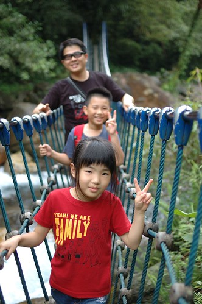 過橋後在一旁的小溪畔休憩著  發現這的水清澈的超乎想像  印象中只有在像武陵那樣高山又保育的地方才會看見這樣清澈的溪水 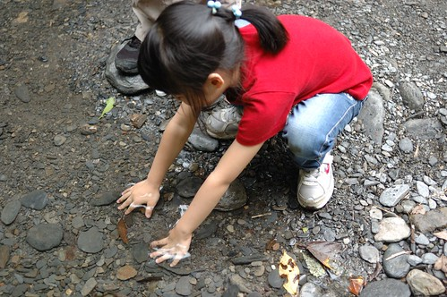 而且溪裡台灣鯝魚(苦花)成群 很是壯觀 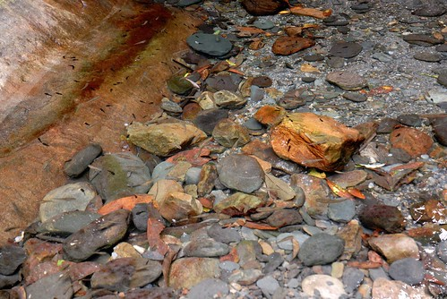 接著的路 相較是較不好走的 我們或是走著主線 或是走沿著溪流的三條支線  努力的走著  最後花了一個多小時走完步道 只是走到步道盡頭後  有點訝異是這樣的結束 因為步道與松羅溪的交會處即為步道的終點 沒看到一般預期的瀑布而是就像沿路一直看到的溪流景緻 真的有種"阿! 沒了阿!"的愕然 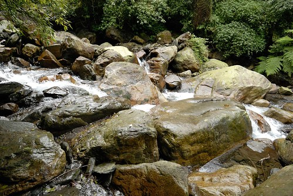 我們在終點吃點餅乾 喝口水 便起身返程了  因為肚子餓的咕嚕咕嚕叫~ 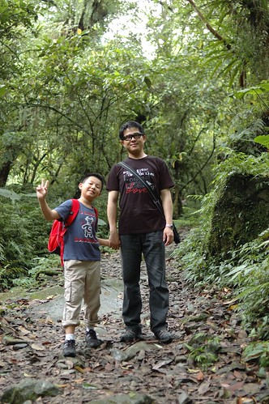 回程的繩橋 徹愛當然走的更快又更穩 我想這絕對會是他們最近口中了不得的挑戰 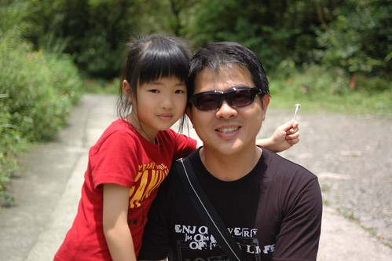 出步道口後 艷陽高照 (相較步道內真的是避暑) 但留著汗 吹著風 曬著太陽 是很幸福的享受~ 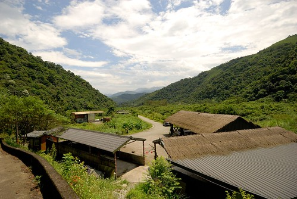 我們總共花了3小時完成我們的松羅步道行 12點半結束後 我們反方向的開往三星吃卜肉 這幾回上武陵都會來三星買蔥油餅吃 每每看著週一休息的卜肉店總讓我們很是好奇 趁著這回假日 肯定有開店來解解饞  只是人真的好多阿 (不過右半邊是在排隊買蔥油餅的) 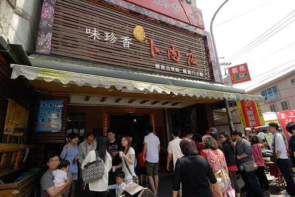 所幸用餐程序還蠻有制度的 入店先點餐 然後等候號碼登叫號 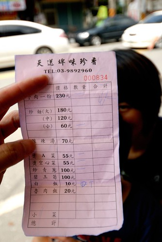 等候的空檔  先去買徹愛完成步道的獎品 - 飲料一罐 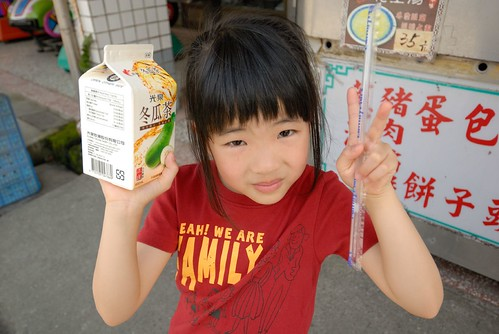 真的 平常嚴格控管這些垃圾食物 出門在外時很好用 尤其在流過汗之後 來一瓶 暢快清涼阿! 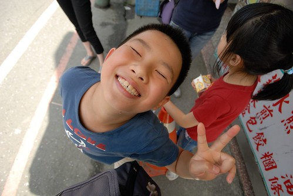 等候的同時 看著對面我們光顧過幾回的阿婆蔥油餅 好想吃阿! 尤其卜肉店的蔥油餅大排長龍 而阿婆蔥油餅卻門可羅雀 更是讓人很想去贊助一下 第二天回家時來買蔥油餅 買了張卜肉店的 兩張阿婆的 果然我們還是愛阿婆的厚餅與鮮蔥 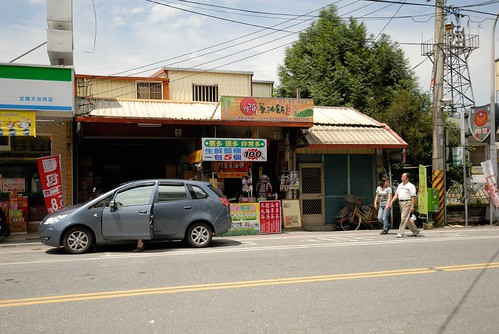 約莫等候10來多分鐘 很快的就輪到我們的號碼 卜肉 卜肉~ 到底有多好吃ㄋ~ 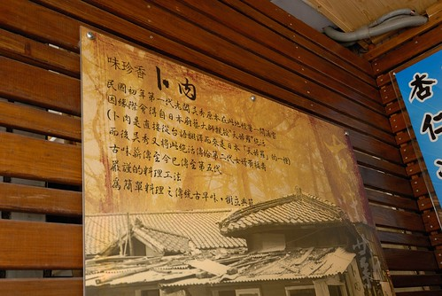 進店後 繼續等候我們的卜肉阿卜肉~~ (這張照片純粹是徹爸覺得這樣露牙的愛愛好可愛阿) 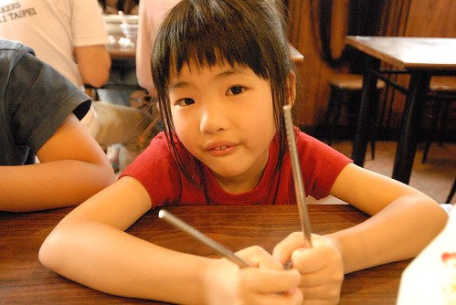 首先上桌的就是那一大盤的卜肉! 四雙筷子 咻的搶食著 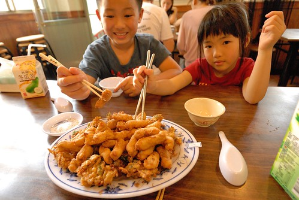 肚子餓 加上熱騰騰  還真是不錯吃 其他飯菜都還沒上桌 我們便嗑掉一大盤 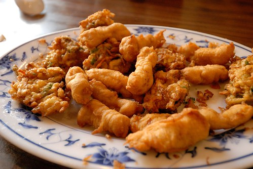 接著的A菜 空心菜 尤其那炒青蔥 鮮甜的讓阿徹直呼這是他吃過最好吃的蔥 甜甜的還會喀嗤 喀嗤 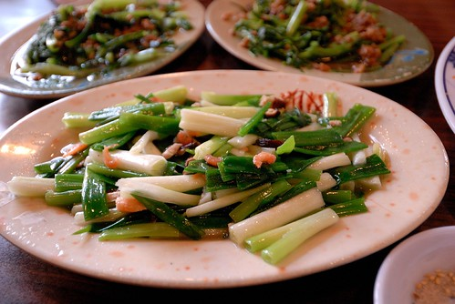 完成了松羅步道也飽食了一頓  是個旅行的好半日! 但也不知道是不是因為這半日太豐富 讓接下來的太平山顯得有點弱掉了....
