5月底去玩住在理想大地的那一晚  阿徹很認真的寫了一長串的騎車目標 20公里買單車手套 30公里買單車手電筒 40公里買輪胎風火輪 .... 甚至寫到80公里要買20吋變速腳踏車 100公里要太陽眼鏡 我們笑他明明只有20公里的能力竟也如此大言不慚 100KM勒..真是想太多

不過阿徹有很努力認真在騎車 在台北除了週末傍晚去大漢溪河岸騎車還嚷著要跟徹爸一起去夜騎 而回嘉義的時候頂著大太陽也堅持要騎著他的20吋單車去繞繞 只是享受過20吋的快感後 阿徹越是覺得16吋實在慢阿 就算他怎麼賣力踏 速度就還是慢  跟我們跟的有點辛苦 因此徹爸對他說如果你可以騎40公里 那麼就把嘉義的20吋單車載上來 於是這兩個男人約定了6/20 那個週六早上騎車去鶯歌 板橋到鶯歌來回接近40公里 是徹爸想了好久研究好久的40公里路線...

(有著共同目標的父子倆看起來更像一對"拍檔") 

(插播阿徹在嘉義騎著大車的樣子)

約定日的前一天晚上阿徹晚餐時喝了不少紅茶 鑒於他喝紅茶都會晚睡  臨睡前我警告他如果10點半前沒有睡著那麼隔天早上就不用去騎車了 因此阿徹那晚難得的很認真的 瞇著眼睛努力要入睡  也果然在時間內把自己弄睡 週六早上5點半徹爸打理好後 我們把阿徹喚醒問他真的要去騎車嗎 阿徹邊揉著眼睛邊點頭 然後完全沒賴床的起床更衣準備出門 早上六點鐘 阿徹父子倆著裝準備完畢要出門嚕~

(兩個人的眼睛都還腫腫的哩) 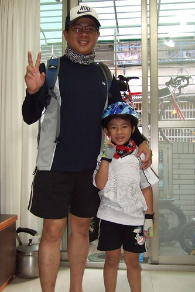

清晨六點鐘 向來車水馬龍的民生路還很冷清

從大漢橋的板橋端進入河岸車道 騎到新海橋後要過橋到新莊那一端的自行車道 徹爸說新海橋的自行車道算是做的很不錯的 只是對於小孩子來講還是太高 所以徹爸還是得辛苦的扛兩趟

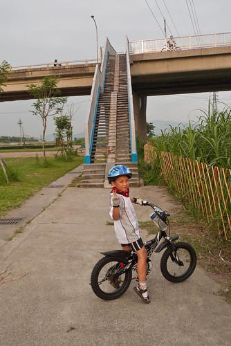

在新海橋的此時 遠方的天空還沒完全亮...真的是透早出門去騎車哩

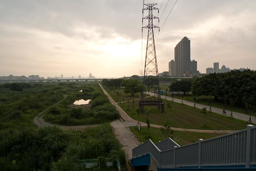

為什麼我跟小愛沒一起同行ㄋ? 因為考量要小愛在後座坐5-6個鐘頭實在太辛苦  就算她不抱怨也可能不知道會睡幾番去了 所以即使媽媽有點羨幕 還是欣慰阿徹可以跟爸爸來這趟"男人之騎"

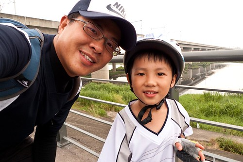

戴上前一晚買的多功能領巾  嘿嘿~像不像蒙面雙俠~

戴上領巾的阿徹竟讓人誤認為女生 直到看到徹爸扛著很MEN的阿徹小黑出現後才訝異的說"阿~是男生阿"

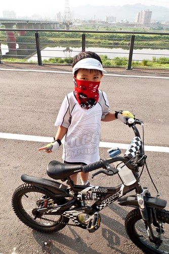

出發前阿徹只在家喝了杯鮮奶  沿路因為很熱父子兩也都沒什麼胃口 可是就在樹林休息啃了半片土司後小子竟然去"落賽" 幸好早上我在徹爸的背包放了包衛生紙  要不然真難想像徹爸該如何解決阿...

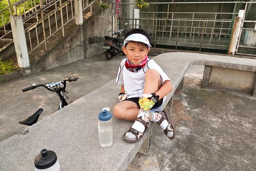

短暫的休息後繼續上路嚕 其實阿徹騎的有點辛苦 因為就算他怎麼賣力時速也只能有9公里左右 就像徹爸說的大人用跑的可能都比他騎的快 而板橋到鶯歌那接近20公里的路程到底有多遠  就像從板橋到八里 真的不是很近!!! 出發前跟阿徹叮嚀要考量騎多遠去就得再騎多遠回來 所以如果真不行就要說不要硬撐  我們並沒有他非得騎完不可

阿徹騎一騎會不會累? 有沒有唉?  當然有累有唉!!! 可是卡在半路 越騎是越沒有退路了

(徹爸說為了公平起見 所以他也騎16吋小摺跟阿徹一起奮戰) 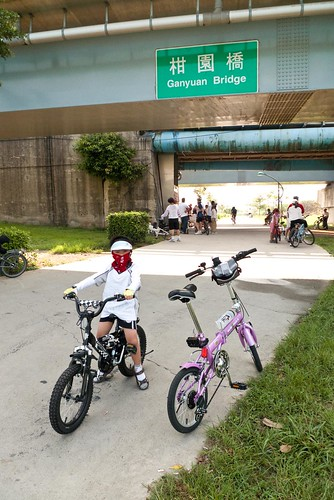

而且阿徹前一天在學校無聊找Freda聊天時竟已先告知他隔日將與爸爸騎車到鶯歌 聽的住在三峽的Freda覺得有點不可思議 既然阿徹的大話都已經放了 這下子不管怎麼樣好像都得堅持下去完成任務哩

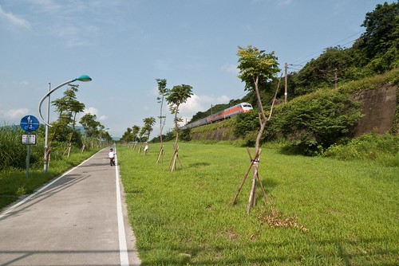

總算總算...只要再過個馬路過去就抵達今日的目的地"鶯歌陶瓷博物館"

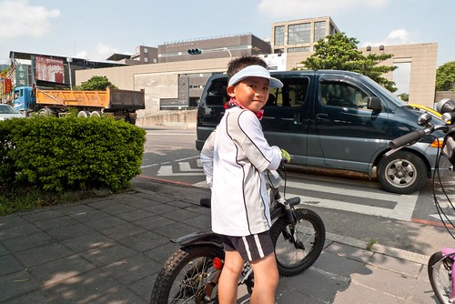

早上九點多 父子倆抵達鶯歌陶瓷博物館  啪!啪!!啪!!! 當他們父子倆開心的打電話回家報喜時 我跟小愛才剛起床買好早餐哩

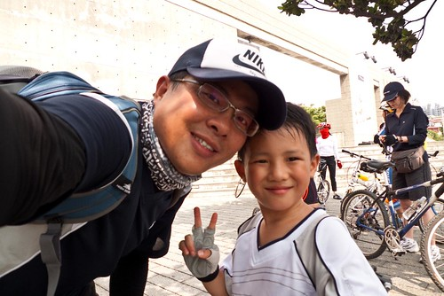

前一天父子倆開心的說著 到達鶯歌後一定要去7-11買思樂冰爽一下 只是臭小子在買了後竟然又改變心意改要喝果汁 獨剩徹爸嗑冰

父子倆在Seven短暫休息 喝涼共吃剩下的一片土司後便又啟程打道回府嚕 而回家的路一樣的迢遙~~~

騎了好久 ...又是兩小時過去  阿徹大喊"快到家了" 因為他總算看到大漢橋旁巨蛋那五根柱子了 在下面照片中路的盡頭  河的對岸那裏!  看不到是吧? 沒關係! 因為真的還好遠阿....

總算總算在徹爸的鼓勵加慫恿下(回來請他吃麥當勞) 阿徹完成了40KM的目標 在中午12點多抵達板橋家門 完成今日的挑戰 什麼? 中午12點? 沒錯阿徹從早上6點出門 足足騎了6個鐘頭之久 一般大人正常時速大約需要4個鐘頭的路程  阿徹的小16吋讓他得比別人多花兩個鐘頭 雖然徹爸已經答應要幫他的20吋運上台北 但想想騎著小16吋不也是好的毅力與耐力的考驗....

給花了六小時完成40公里目標的阿徹拍拍手!!!  只是回來後阿徹又開始幻想50公里了...ㄟ....

那天下午徹爸吃完中餐後早已體力不支睡午覺去 阿徹竟還是精力旺盛的跟一早沒見的愛愛一起玩耍 直到下午兩點才總算有睡意補眠去     真的只能說 小孩子的體力好阿~ 傍晚午覺醒來後一家子不知上哪打發時間 於是趁著要去吃M 順道去了阿徹以後要唸的莒光國小晃晃

(學校的川堂) 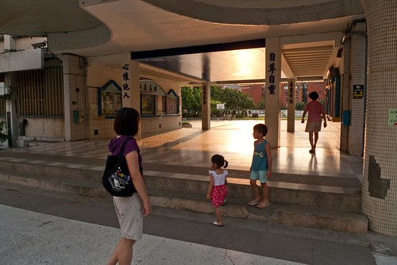

(教室走廊一隅) 

(操場一角) 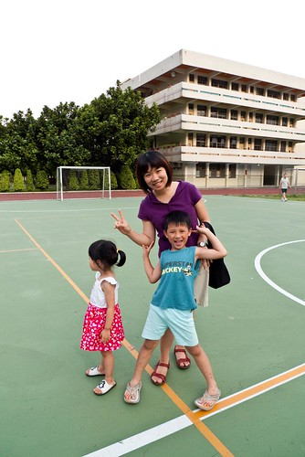

再過兩個月阿徹就即將是這的一份子了 還是忍不住想說 時間過的真的好快阿~

(徹爸)補放當天的路線圖 供有興趣的人參考 真的是一條蠻愜意的路線

[http://www.bikemap.net/route/219985/widget?width=640&height=480&extended=true&maptype=0&unit=km&redirect=no](http://www.bikemap.net/route/219985/widget?width=640&height=480&extended=true&maptype=0&unit=km&redirect=no) Bike route [219985](http://www.bikemap.net/route/219985) - powered by [Bikemap](http://www.bikemap.net)
