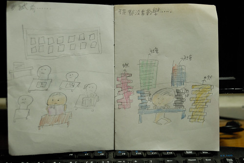
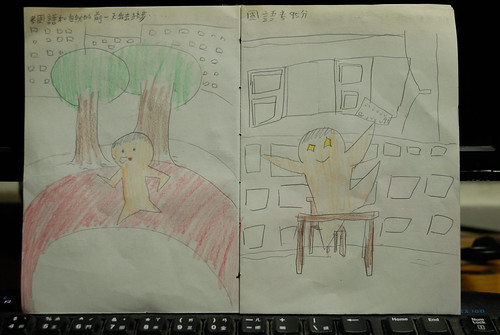
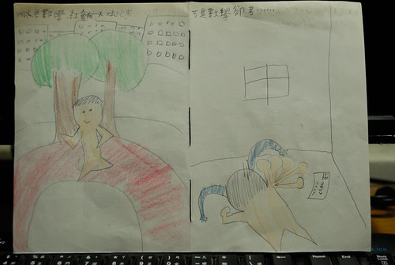
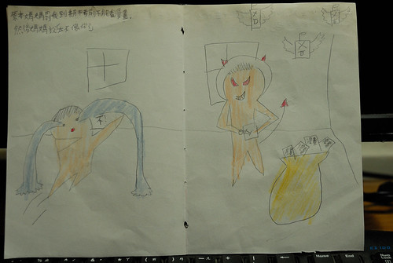
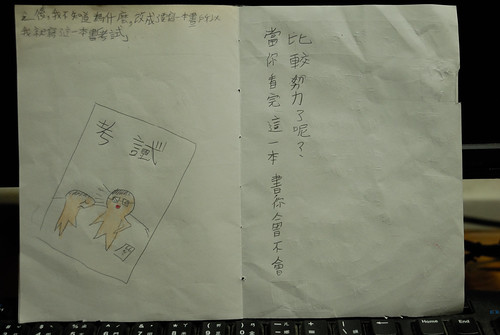
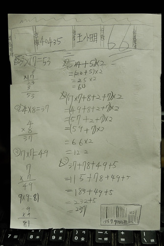
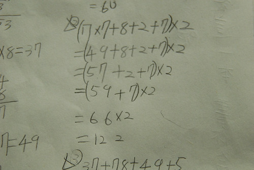
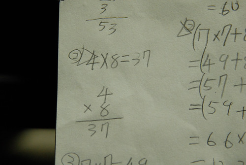
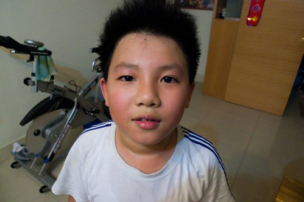

月考的66事件在上週五阿徹如期交出他的反省漫畫後算是暫時畫下個句點 只是句點之後 沒有換行與分段 一切已知與未知的還是繼續寫著中 已知是 阿徹依然維持他的天然呆 每天吃飽飽玩開開 課業能多做的絕對不會多做 阿母也落下狠話"意外一次就夠 期末考再考不好就不用跟我談暑假計劃了 要享福利前請先盡責任" 而未知的一樣永遠令我們提心吊膽的等著中... 不過不可否認阿徹是個令人憂心卻又令人開心的特殊物種 就如他的漫畫看不出他的反省面但一個個的笑梗讓人只能大笑著搖頭~

盛重其事地我用線裝方式做好12頁的書體 阿徹分幾回 且每回總是俐落又瀟灑的下筆疾書 完成了他的第一本總算有始有終的漫畫書 書的封面 (封面主角有爸爸 以為應該在書裡占有重要地位 )  內文一 (考前也只有稍微看國語 哪有像他畫的這樣認真看這麼多書)  內文二 (那個開心的模樣好雀躍阿)  內文三 (搥桌 大哭的背影真的太好笑)  內文四 (怎麼突然蹦出個有如母夜叉的媽媽ㄋ??? 還有那個文字說明實在很不邏輯)  內文五 (阿哩~ 怎麼這樣就ending???看的正精彩說 要給大家的"交代"呢? 而且最後那個結語實在太跳tone 應該是他本人要努力吧?!)  書的封底 (模擬的66分考卷有用心喔! 還有條碼哩 )  尤其那個錯誤的解答真是處處有伏筆  真的! 阿徹的數學就是常這樣錯 這點他自己倒是有清楚!  我承認我看完後真的哈哈大笑好多聲 對於66事件也真的有更釋懷些 因為可以安慰自己"起碼這小子還有點圖像幽默感"! 小學生 加油吧!!! 別每次這樣考驗爸媽與自己了!!! 
