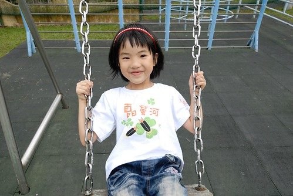
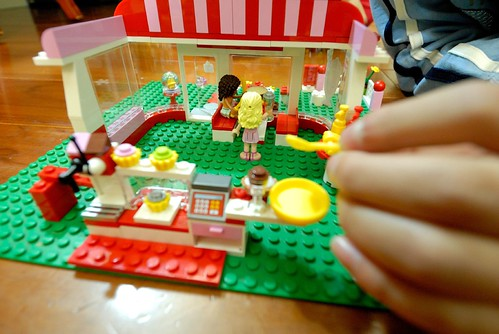
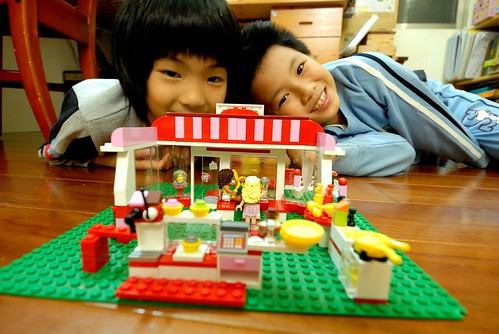
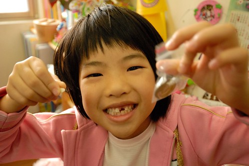
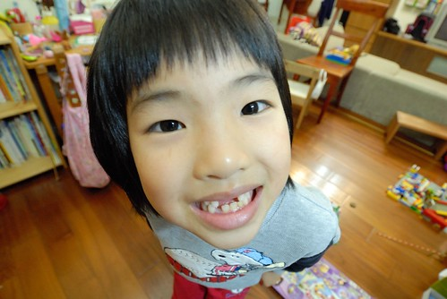
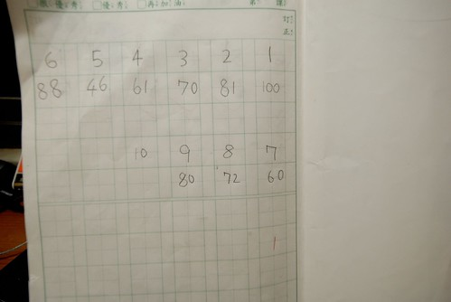
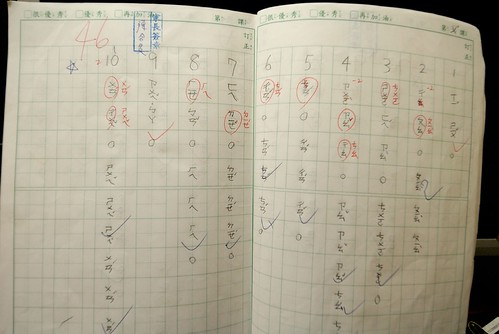
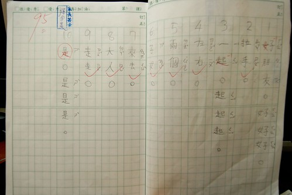
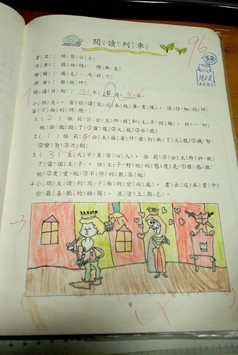

我們家的愛愛在上個月底滿七歲了 除了帶她去買她想了很久的禮物外 我們好像連生日快樂歌都忘了跟她唱... 愛愛竟然已經七歲了 直到現在我跟徹爸常常還是覺得不可思議 因為明明在我們腦海中還一直是個奶娃阿 不過每當看到愛愛幾近我們胸前的身高與亭亭玉立模樣 我們不得不承認她真的已經長大了 幸好愛愛有時仍會像娃兒時一樣的呆(說是天真好了) 讓我跟徹爸仍能像以前那樣玩著寵著 我想愛愛絕對不只是她老爸前輩子的情人 也肯定是我這老媽前前輩子的情人吧! 

好幾個月前 愛愛便在從百貨公司帶回的玩具型錄本里標示了她的生日要什麼 聖誕節要什麼 期盼了大半年 她總算得到讓她流口水很久的樂高Friends 好朋友系列玩具  禮物在生日四天前買的 我們硬是考驗愛愛 讓她到生日前一天才能拆 那天要回嘉義 兄妹倆早早不到七點便起床要拆生日禮物 大玩一番 (看到兄妹倆每天這樣的活力 真的只能說"莫非這就是青春阿")  這輩子很少收到禮物的我很是喜歡看到小孩子們這樣欣喜擁有禮物的模樣 尤其是徹愛兄妹倆從小到大永遠不膩似的辦著家家酒 真覺得這樣的天真真好  愛愛要努力的遊戲下去 讓自己一直這樣有活力 有開心喔~  

七歲的愛愛 外觀上最大的改變是變成了個無齒之徒 掉第一顆門牙時 愛愛好開心 因為羨慕(哥哥)了好些年 盼了好些年 總算她也可以拿到牙仙子的金幣(愛愛真的相信有牙仙子阿)  只是沒想到短短時間內陸續掉了三顆牙 雖然讓她擁有了生平最多的錢(50元) 但也讓她對自己的外表介意了起來  缺第三顆牙後的第一個上學日嚷著要戴口罩上學 我說"換牙代表你長大了 妳們這年紀小朋友都會經歷" 愛愛說"可是沒有人像我一次掉這麼多的" 看著愛愛那的確很漏風的小嘴 我忍不住笑了 但我們真的覺得這樣的愛愛還是好可愛 雖然多了點頑皮的猴樣...  缺牙後的愛愛 照相時更是注意自己嘴巴的閉合 而咪咪笑的模樣卻也更突顯她長大了的事實 

七歲的愛愛 也正面臨著她人生中嚴峻的學習考驗 愛愛果然如我們所預期的 是個勤奮 認真 努力的小學生  但現實卻也真的很殘酷 除了老師的標準與訓練真的很嚴苛外 愛愛的學習速度出乎我們意外的有些慢 慢的原因除了天份與我們後天給的訓練可能真的不夠外 最主要的原因是向來很有想法與堅持的愛愛 執著的照著自己能接受與做到的理解與方式 學習著吸收著(另一種說法是死腦筋) 就因為了解愛愛的個性 清楚她每一天的付出 看著愛愛在11月注音會考前小考分數的起伏變化 我們才能這樣的淡定  當愛愛的成績從100到80 70時 爸爸笑說"接下來不會是60 然後50吧" 所以當我們看到接下來的61時不禁莞爾笑了  還真有軌跡哩 而沒想到這還不是最低點 下一次再看到46時 徹爸笑說"ㄟ 這次應該要50才對阿" 中間除了考61那次 愛愛並未在家讓我們先考過複習外(因為愛愛說"沒有幫助") 其餘的考試前愛愛都會把課本的圈詞寫過 讓我們考過 而每次考完 愛愛都覺得自己不會的只有一些些 沒太糟 就如考46的這次 她考完後也只說蟬跟蠺讓她搞不清 徹爸聽到她這樣說 竟然就也跟她說"那你就兩個都寫一樣 看是都要ㄘ 還是ㄔ" 我臉冒三條線 唉喊"不是這樣吧?!"  徹爸說"這樣對一個 總比都錯好" 雖然徹爸不相信老師會這麼那個就考單音(起碼應該考"蠶寶寶" "蟬" 這樣好從語詞分辨) 但老師真的考單音阿!  看來愛愛的成績要提升真的得更費心了 所幸下一次考試前 我們趁著週末在家連考了三天  成績總算倍數成長而愛愛也恢復了點信心 只是考試若是熊熊被安排在週間的 單單只在家考一次還是很不夠力 成績就馬上落下來  為了迎接11月中的注音會考 我們可真是全家總動員 我 徹爸 還有阿徹 除了陪讀 還盡出些搜主意 例如愛愛的捲舌音常搞不清 徹爸就說"大部分都是捲舌音 那你就都寫捲舌音好了" 而過來人阿徹更是常擺出老大哥的模樣指導她妹 還教些有的沒的小聰明 其實就如徹爸學期一開始就說的"我根本不擔心注意學不會 注音一直都會用 久了一定都會" 我們並不在意愛愛的學習成績不好 擔心的只是她學習樂趣的喪失與信心的失去 而幸好愛愛的注音會考拿了個95分 讓她一掃之前的陰霾 是個讓人開心的好結果! 只是阿...我說接下來的國語學習之路才真是考驗的開始阿 也因此當我看到愛愛國字的第一次小考考了95分 忍不住觸她霉頭"會不會像注音那樣溜滑梯阿" 雖然國字沒有注音那樣惱人的捲不捲舌音 2/3聲混淆 愛愛的認字也上軌道般的大量吸收著 但寫不好看也是要扣分的哩.........................(第二次考國字91分 被扣的9分全都是因為寫不夠標準 Orz)  老實講 我很難認同愛愛老師對於作業與考試的要求 尤其是常聽到愛愛說他們今天只有幾節下課 因為要訂正作業 或是因為班級太吵 老師太生氣所以處罰大家隔天一整天不准下課 沒有快樂的下課時間 小學生還是小學生嗎?! 幸好縱使我怎樣不適應 愛愛對於她的老師還是很崇敬甚至是諒解 她常說"雖然我們老師很嚴格 但是她對我們很好 是為我們好" 而有次當她的國語作業第一次拿到乙上時 我擔心她是否會難過 沒想到愛愛卻跟我說"我習慣了" 我心裡大驚"不會吧! 已經喪志 習慣爛分數啦"的時候 愛愛又說"我已經習慣我們老師的嚴格要求了" 還真是好樣的愛愛~~~ 難怪是老師口中的模範生人選(雖然沒通過民選) 我想除了寫字跟課業表現外 愛愛老師應該是喜歡愛愛這個學生的 尤其當聽到愛愛說老師常在週一或是週五下課時間把她叫去聊天 問她些週末去哪玩...  我們真是訝異到差點掉下巴  雖然很多人都說遇到嚴格老師可以讓小孩養成好習慣 可以練得一手好字一輩子受用不盡 我絕對的相信阿! 只是真的很衝擊我們教養的原則與期望阿! 例如上圖是愛愛閱讀本的其中一頁作業 0寫的不圓扣分 畫圖超過線扣分(有次圖太空扣15分) 被扣分的地方一定要盯正 沒訂正到老師再用藍筆打勾確認 就一直會在之後單元的訂簽中被寫"X頁錯誤未盯正" 上頁就這樣一直被老師提醒著 後來徹爸索性要我用立可白帶貼住超出框的塗色 我也在征得愛愛同意下 留了張字條給老師  然後那天聯絡簿上老師也留言請我打電話給她 打那通電話我緊張不已 而在聽到老師說明"擦橡皮擦也是小肌肉訓練... 有示範給愛愛看怎樣擦是擦的掉的點點點... 家長會上一再強調要用色鉛筆...."  我更是只能如小學生般一再點頭說是 掛上電話後 我跟愛愛說"老師說認真擦就看的出來 不行就媽媽幫你擦吧"  我們一直相信也放心 愛愛有用她的方式接受與面對她的學校生活 但沒想到前天當她得再訂正已訂正兩三回的乙上國語作業時  愛愛生氣的大哭了起來 我問"你是生氣媽媽要你改 還是生氣老師?" 愛愛說"我有改了阿!"  沒有生氣媽媽也沒有生氣老師 只是真的很無奈... 然後愛愛越哭越烈 就像失戀當下沒哭的人卻在一次失意中一發不可收拾的大哭一場 愛愛邊哭邊說的她這陣子的委曲 不如意: 我都有改可是老師還是一直不打勾 (媽):老師覺得還不夠標準 你不是也都知道妳們老師很嚴格... 愛愛說了一堆點點點 (媽): 我們只能努力達到老師要求 要不然只有轉學阿 可是你現在有那麼多朋友了 在學校都沒有人跟我玩..  (媽)老師不是都會找你聊天 可是我不喜歡老師阿... (媽): 你不是說誰誰是你的好朋友 可是她常常不能下課(因為要訂正作業或罰抄課文) 要不然就是她可以下課時後 我不能下課.. (媽)那其他同學ㄋ 她們都跟XX玩(被選為模範生的同學) 只有有麻煩的時候(例如誰受傷 要照顧誰)才找我 .. (媽)可見同學覺得你很會照顧人 所以才會找你幫忙阿 老師之前說XX是模範生大家有事情可以找她 為什麼大家都找我... (媽)可能大家覺得你就像模範生阿 (大哭) 那為什麼她們都投票給XX 還有人兩票都給她(有五個候選人 每個同學兩票) 這下我真的無言了.......... 愛愛趴到我懷中放聲大哭.....而我只能抱緊她 不斷摸她的背... 我第一次真正感受到愛愛內心的難過與好多為什麼的不解與無奈 孩子~ 這都是人生的歷練與成長阿! 只是真的得這樣成長 人生才能比較豐盈嗎? 老實講媽媽真的很懷疑 只是我們還是會不斷的告訴妳們 要求你們認真做好每件事 問心無愧後才能自己開心就好..  好笑的是哭完那場後的晚上以及接下來幾天 愛愛在家還是都開心的一直玩 一直說... 爸爸笑問"你是強顏歡笑嗎?" 聽不懂的愛愛一臉疑惑 我補充說"還是回到家就很開心" 愛愛傻呼呼的答"對阿 回到家就很自然很開心" 真高興我們家是能給愛愛溫暖與開心的堡壘!
