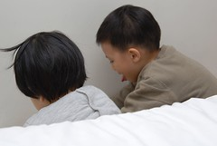
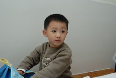
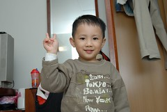
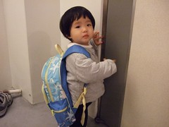

1/18 星期四 台北->宜蘭礁溪雀兒喜溫泉飯店

中午離開辦公室趕回家收拾行李還有5天不在家的一些收尾工作  
雖然徹爸臨時開會開到1點多才離開辦公室有點delay到一些行前準備工作  
但總算在3點滿載行囊與一家四口的小紅出發嚕  
有了北宜高速公路後真的很快速而且不需再飽受暈車之苦  
4點10分便已抵達宜蘭礁溪  
本來想要去金車生物科技中心的蘭花園晃晃的  
但是因為阿徹跟小愛睡的香甜加上我跟徹爸的噸ㄉㄟ(5點關園)  
最後只有開著車小晃了一下礁溪然後去今晚下榻的"雀而喜溫泉飯店"checkin

和室四人房有點小房內也沒有泡澡浴缸  
但空間卻也夠阿徹跟小愛遊玩了  
   
  
阿徹還規劃床邊一小縫為他的遊戲區  
迫不及待的把他前一晚準備的"行李"(資優數學教具+課本+7本故事書+彩色筆...)全倒出來把玩  
   
  
阿徹跟小愛玩的開心的同時沒吃中餐的徹爸卻快餓翻了  
來到飯店後方的礁溪火車站前街 本想去阿徹7個月大時來過的涮涮鍋店再回味一下  
但最後跟徹爸還是貪便宜的選擇另一家188吃到飽  
人真的很奇怪 明明每次去吃吃到飽的火鍋或烤肉  
一開始都會有種不知從何下手的苦惱 最後也會落得吃沒什麼卻又吃不下了的懊惱  
但就還是會想要去吃到飽的店貪一下便宜  
今天果然吃到最後我跟徹爸的結論又是  
"應該去吃另外一家的 不用自己辛苦的拿料 不用想要吃啥 既可以吃的均衡又可以優雅"  
真是好一對活該的夫妻阿...  
  
  

吃完涮涮鍋回到房間休息一下  
   
  
   
  
在阿徹的欽點下由我陪著少爺下樓泡湯  
這是阿徹有記憶後第一次洗溫泉 寬敞的個人湯池讓阿徹洗的不亦樂呼  
同時間小愛卻在房間唉唉叫要跟  
真是為難徹爸要想辦法找樂子打發小愛了  
  

待徹爸也泡好湯後 便早早打發阿徹小愛睡覺嚕  
  
(阿徹跟小愛第一次比鄰而睡)  
  
今晚大家要早早入睡 睡飽飽 精神好  
明天早上我們的花東行可正式要展開嚕~  
  
附註:  
更多更精采的Day0 & Day1照片請見   
[http://www.flickr.com/photos/hmchen0328/sets/72157594495004341/detail/](http://www.flickr.com/photos/hmchen0328/sets/72157594495004341/detail/)  
徹爸很詳細的加了很多註解喔 (讓我都有點偷懶不想寫遊記了)  
還可以點選slide show 自動播放 我們自個看是蠻有味道的啦~
