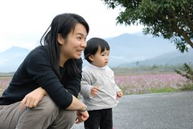

1/19 星期五 宜蘭礁溪 -> 花蓮市松園別館 -> 鳳林鎮林田山林場-> 瑞穗玉里間台193縣道 -> 台東關山鎮山水萱渡假村  
  
離開林田山已是下午四點   
得加速前往關山 今晚我們的下榻地嚕  
駛在花東縱谷公路上  讓人很難不去注意到那千變萬化的雲  
連阿徹都好奇且仔細的觀察雲朵的變化  
一下喊著"好像火山爆發喔"  一下喊著"好像恐龍喔"  
蹦出很多令人發噱的形容詞...  
還興致勃勃的拿起媽媽的小3拍車上的SNOOPY跟天上的雲  
  
  

 

天空很藍 白雲很白 很舒服 也更期待接下來的旅行  
(可憐的小愛只能利用坐車時間盡量補眠)  
  
   
  
車子經過瑞穗大橋 望見遠方天空露出的一道署光  
感覺真棒 忍不住拿起相機咖嚓下去(徹爸我是故意照太陽的)  
經過瑞穗大橋後轉入193縣道  
賞油菜花的重點地段  
網路上說會有接二連三黃澄澄的花田喔  
好期待喔~    
  
果然花田在我們的讚嘆聲下接二連三的出現  
藍天 白雲 遠山 再配上黃澄澄的花田   
心裡悸動的直告訴自己"這趟旅行真是值得了"  
朝思暮想的花東油菜花田真的美呆了~  
(可惜妹妹在車上睡覺 我沒能下車照相  
 只好拜託阿徹要讓爸爸在花田前面照相  
 小子照了一張後就說可以了 不给拍 ㄘㄟ~)  
  
   
  
193縣道上不止有黃色的油菜花  
還有顏色很均勻(紅色 白色 粉色相雜)的波斯菊花田  
又忍不住的停下車拍照 (照這速度下去 包準得摸黑到關山了)  
小愛也總算 剛好的醒來    
OHYA~我也可以下車了  
阿徹又盡責的讓爸爸在花田前拍了一張照(因為他在家裡答應爸爸出門要乖乖給拍照的)  
然後拿起小3拍起小紅花   
還幫爸爸媽媽妹妹拍了張合照ㄋ  
構圖還真不錯 只可惜媽媽太緊張阿徹把我們的頭卡掉 所以表情有醜  
  
   
  
    
  
看完一畦畦的花田 天也黑了  
更該好好趕路了  
阿徹開心的直唧唧咂咂的說東聊西  
徹爸也開心的放起他最愛的韋瓦地音樂欣賞著  
忍不住 我們請阿徹稍微閉起嘴巴  休息一下 享受一下音樂  
跟阿徹說"這是白雪公主的音樂喔"  
他竟然也相信了(哈哈 還真有點好騙  第三天還主動說要聽白雪公主的音樂ㄋ)  
總算6點30分 我們抵達台東關山 山水軒渡假村嚕  
  
因為是在旅遊展時上網買的旅遊卷  
所以附有晚餐(其實買旅遊卷就是在相同房價下 多些吃吃喝喝的優待)  
看到服務小姐送上第一道菜"人蔘雞"  
我跟徹爸忍不住哇了一聲 看來這餐吃的不賴喔  
果然~陸續又上了 燉豬腳 銀杏蝦仁 炒油菜花 山藥排骨湯  
而且還看因為有小孩 刻意多做了兩份好吃的蒸蛋  
真是讚讚讚~難得出門在外可以吃的這麼豐盛的   
   
  
   
  
吃完飯 等著全家去泡藥草浴  
於是在度假村的前庭跟阿徹玩起滑板車  
阿徹要我站上滑板車 他從後頭推著我(感覺怪恐怖的 可見我多不相信他)  
而小愛則是好奇的賞玩著各色燈泡  
  
  
  
泡完澡回到房間看一下電視  準備上床睡覺喔   
明天還有滿滿的行程喔~  
  
   
  

