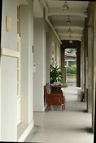

1/19 星期五 宜蘭礁溪 -> 花蓮市松園別館 -> 鳳林鎮林田山林場-> 瑞穗玉里間台193縣道 -> 台東關山鎮山水萱渡假村

前一晚按時入睡的阿徹與小愛 今早又準時的於八點起床叫人嚕  
收拾好東西也食完飯店準備的熱粥後  
早上九點半在不算小的雨勢中 從礁溪正式開始我們這趟的旅行  
車子駛入蘇花公路漸漸感受遠方天空露出的一絲絲光亮  
讓我們越來越有信心可以有個不下雨的花東假期 OHYA~

人家說生小孩會改變女人的體質好像真的有這麼一回事  
年輕時從不暈車的我 這幾年只要走山路必陣亡  
幸好有了北宜高之後 只剩蘇花公路是我唯一擔心的路程  
小愛在進蘇花前便已在她的汽座上沉睡補眠去  
而我在進蘇花20分鐘後果然腸胃就開始醞釀翻轉  
督促著阿徹趕緊睡覺 小子卻說他要陪爸爸開車  
好ㄅㄟ 等你暈了你就想睡了 娘要先睡了要不然包準會暈到需要下車抓兔子  
睡夢中感受到阿徹睡倒在我腿上了 徹爸出了和平車站了...  
醒來 哇~沒暈車也快到花蓮了  
尤其看到花蓮沒下雨的天氣更是開心

進到花蓮市開始看地圖尋找我們的第一站松園別館  
跟徹爸在這次旅途中第一次為了找路有一點小小小的爭執(其實沒大聲講話也不算吵架就是講話很冰)  
不過幸好噸ㄉㄟㄧ會後 不小心就讓徹爸看見進到松園別館的小路  
停好車看到園裡很多西裝筆挺的中年男子散步期間  
懷疑了一下是否是日本觀光客  
後來看到停在門口的黑色箱型車 我們猜應該是啥公務高官吧  
熊熊還有點擔心我們這一家四口會不會打擾到別館的清靜嚴肅  
不過既來之則安之 況且先進去找廁所尿尿紓解比較重要  
  
下車的時候阿徹發了旅途中第一次的脾氣  
小子說他不要下車 他不想來這裡 他覺得這裡的飯不好吃  
本跟徹爸都高唱著"出來玩 爸爸媽媽都不要跟阿徹生氣 隨便阿徹自己生氣"的我還是忍不住小吼了一下小孩  
"那你自己在車上 而且你沒來過 你怎麼可以就先說你不喜歡這裡 這裡的飯不好吃"  
阿徹只好嘟著小小嘴跟著我們屁股進到園裡  
進到園裡看到草坪就問著"這裡可以玩飛盤阿"  
ㄟ~玩飛盤恐怕不太適合這人文別館哩 可能會被趕出去喔  
跟阿徹說"這裡地濕濕的不能玩"幸好他認份的接受了   
很好~小子 這趟旅行中你最該學習的就是"認命"  
  
上廁所的時候徹爸開始拿出相機照下這日式建築的迴廊  
舊皮沙發別有一番思古幽情 只可惜走廊上正堆著一些內部整修的器具   
而外面的步道似乎也在施工整理中 有點煞風景  
  
 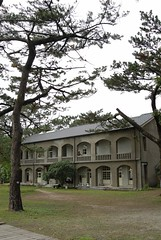  
  
旅遊書上說別館的一角有花蓮頗負盛名的莎莉人文經營這裡的coffee shop  
可是現場發現 不止一小角哩  
廚房跟吧檯就大剌剌在池塘旁而整個內部似乎也規劃為用餐區哩  
(因為服務人員說室內座位都被那些西裝人包場了 果然好像非簡單人物)  
媽媽很不客氣的安排在此享用旅行中的第一餐  
徹爸的縵魚飯250+我的匈牙利牛肉飯210   
餐點與價錢都還ok  純粹當做花錢買氣氛  
等餐的空檔 阿徹跟小愛開始東走西看  
阿徹開心且仔細的觀察池塘裡外的植物 小蟲 小魚 小蝌蚪  
我跟徹爸忍不住的嘮叨一下"你看 這裡有池塘很好玩吧 你剛剛還說不要來"  
阿徹裝做沒聽到的拼命跟我說"媽媽 你看這..." 好個裝傻  
一家四口仔仔細細的品嚐感受別館風情  
  
   
  
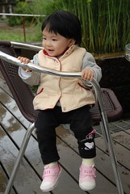 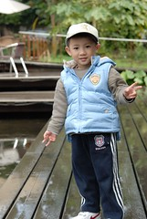 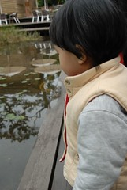  
  
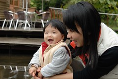 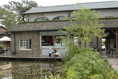  
  
小愛很開心也很勇敢(也許該說不怕死)的自己一個人逕自走來走去  
也不管爸爸媽媽是否在她身旁  
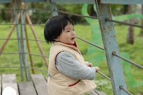   
  
餐點還算是美味 阿徹少爺吃的也還滿意  
我又忍不住跟他說"你看 這裡有池塘 飯飯也很好吃 你剛剛如果一直哭哭鬧鬧不要進來  
是不是就看不到池塘 吃不到好吃的飯"(很嘮叨的媽媽吧)  
  
享用完份量有點少的簡餐後  
一家四口最後好好巡視了別館一番  
日式建築物真的越看越有感覺  
尤其透過老松樹葉間望向灰濛的天空別有一番風味  
別館的view也很好可以看到海  
難怪書上說"遊客如熾"(雖然今天除了那些西裝人 還有我們四口人外只在看到2名遊客)  
  
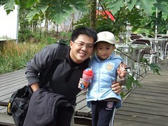 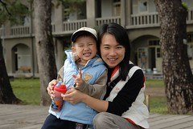  
  
  
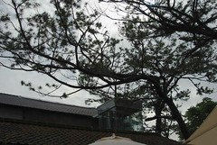 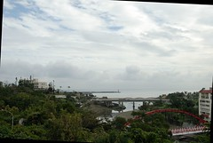
