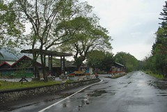

1/19 星期五 宜蘭礁溪 -> 花蓮市松園別館 -> 鳳林鎮林田山林場\-> 瑞穗玉里間台193縣道 -> 台東關山鎮山水萱渡假村  
  
離開松園別館 徹爸說大約再半小時就可以到達第二站林田山林場  
雖然我高度懷疑但我想事實會說明一切的  
果然我們花了一個小時才到達鳳林  
可見司機先生對於路程的掌控似乎有點太過於樂觀了...  
  
到達林田山映入眼簾的就是綿長 乾淨的小道   
就連道路兩旁的樹也讓人覺得像是清爽美麗的可人兒  
我跟徹爸第一眼就愛上這個地方...  
  
  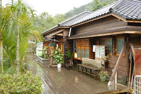  

天空飄著絲絲細雨更增添了幾份美感 朦朧的 淡淡哀愁的...  
阿徹很逞強的自己一個人拿著他最愛的紅色大雨傘  
如果風大一點恐怕都可以當飛行傘把他飄上空了  
  
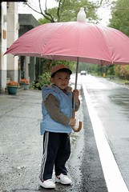  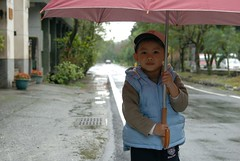  
  
走在低矮的老房子巷道間  
突然懷念起以前小時候回到嘉義阿嬤家的情景  
山中村落裏的矮房子 睡在不到一公尺高的小閣樓裡還可以聞到木材的味道  
然後一大早就會被阿嬤用灶煮飯的聲音給吵醒...  
  
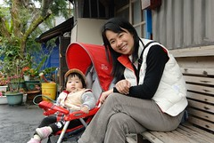  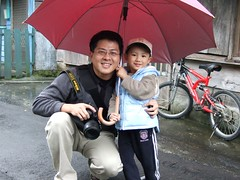  
  
小逛一陣後  .雨勢突大只好先轉進展覽館裡  
準備停推車跟脫鞋的當下  
一個替代役大男孩跑出來緊張的說"推車要放外面 要拖鞋子"  
ㄘㄟ~標牌那麼大 況且外頭已經一排鞋了 我們不會這麼沒水準啦  
進到屋內 他又謹慎的跟我們說"裡面東西不可以摸喔"  
放下小愛讓他在屋裡自己走  我想大男孩神經應該繃到最高點吧  
原本在看書的他不放心的常往裡頭望 望向我們...  
阿徹跟小愛偶而小碰撞或扶著柵欄往展示品仔細瞧  
終於...大男孩忍不住的來跟我說"可不可以請妳們再把小孩看緊一點"  
ㄟ~有種受辱的感覺哩~  
我們也是有在教小孩阿 可是連小柵欄稍微擦到一下都不行喔...  
小受委屈的我們 只好回到入口處 徹爸抱著小愛 我跟阿徹蓋起紀念章  
  
照片裡的老婆婆是這的志工  
跟我們說可以寫紙條留言喔 然後自己仔細的看了起來  
望著他的背影覺得台灣真美 風景美 人更美  
很多地方因為這些志工爺爺 志工奶奶 志工媽媽們 讓社區活了過來 重現生命力  
最近常在想愛台灣的人很多 方式很多  
有人做善事 做志工愛台灣   
而懶惰的我們用多去玩來愛台灣  
我想最不愛台灣的大概就是那些用嘴巴愛台灣的政治人物吧  
  
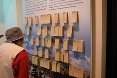  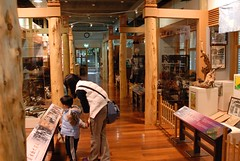  
  
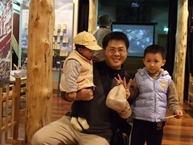  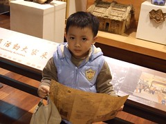  
  
林場裡泛著青苔的階梯很有味道 可惜錯過機會沒拍下小孩站在上面的帥照  
等徹爸拿傘的時間 帶著阿徹跟小愛躲在火災紀念館的屋簷下  
阿徹有點怕屋內的昏暗 倒是好奇的小愛想開門而入  
  
    
  
連廁所也很林田山林場的味道...   
從看到廁所起阿徹一直嚷著"獨角仙的是男生的對不對"  
我以為那只是愛獨角仙太深的阿徹的幻想童言  
不明就裡的敷衍他"可能是吧"  
好一會後徹爸才發現原來男廁的標誌是獨角仙  
阿徹還要爸爸幫他拍下跟獨角仙的合照...  
  
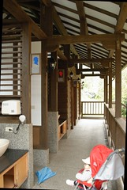 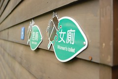 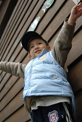  
  
誤打誤撞的逛到中山堂  
以前村民聚會看電影的場所  
坐在裏頭很有回到唸書時代在學校禮堂上週會的感覺  
  
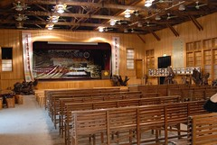 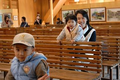  
  
 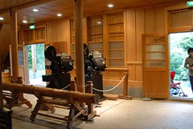  
  
中山堂前的階梯下來就是以前運材的舊鐵道  
有種驚為天人的感覺   
徹爸說比網路上看的照片還漂亮  
也許因為雨水剛洗淨樹葉與天空吧  
很乾淨很清爽  
  
嘗試讓小愛走在鐵軌上  
有石頭有枕木還帶著濕滑  
雖然皺著眉 小愛還是很認真的用他的短腿一步一步慢慢走  
  
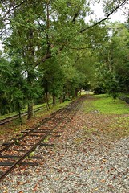 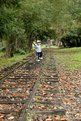 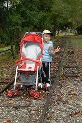  
  
   
  
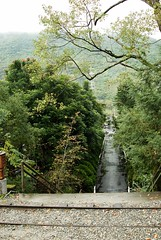 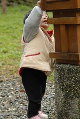 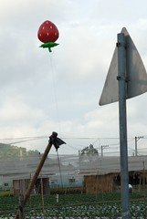  
  
離開林田山的路口 阿徹看到天空裏的草莓氣球超開心  
直嚷著要去採草莓  
ㄟ~還要趕路去關山哩 回程ㄅㄟ~  
  
後記:  
回程經過跟徹爸看到氣球時兩人還偷偷的喵了一眼然後靜默   
車子駛過還是讓阿徹從後窗望見那太明顯的草莓氣球  
阿徹一樣高興的驚呼"草莓椰"  
在他正開口要說接下來的話時  
媽媽"故意"用很開心的情緒說"跟草莓說bye bye"  
小子也很開心的說"Bye Bye" 然後才反應過來似的說"要採草莓"  
"ㄟ~可是草莓過去了哩"....
