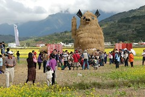

1/20 星期六 關山環鎮自行車道 -> 池上鄉油菜花季活動會場 -> 萬安國小 -> 關山親水公園 -> 卑南包子 -> 台東市原住民文化會館  
騎完關山環鎮自行車道  
理論上應該是要順道騎進關山親水公園裡晃個一圈的  
但是趕著12點前的退房加上正午太陽實在凶狠  
於是決定先去池上油菜花季會場晃晃 下午再回親水公園  
  
停好車遠遠的就看到網路上傳說中的稻草豬   
手還會像招財貓那樣"來來來" 害我以為他是貓  
不過英明的徹爸還是看出來那是豬 (雖然徹爸說怎麼耳朵有點像蝙蝠)  
會場上還聽到有人說"這是copy失敗的皮卡丘" 哈哈  
不過跟她照相的人還頂多的ㄋ  
而且因為他實在太高了  要把他全入鏡 人就得小小的  
  
這的油菜花很大片 看的出來是刻意播種的這麼旺盛與廣泛  
只是眾多的人潮加上田埂間兩排長長的吃喝玩樂帳棚  
少了份詩情畫意的感覺  
不過卻倒也提供了近距離賞玩(揉擰)油菜花的機會  
  
  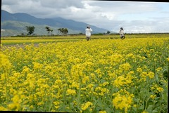  

準備停車時 阿徹少爺就在嚷著不要來這裡  
也許因為遠遠就看到舞龍舞獅的陣頭吧(他超怕這種東西的)  
好說歹說下車後就又看到有小朋友拿著卡通造型氣球然後開始吵要買  
其實氣球真的沒多少錢  
但為了表達出我們對於他嚷嚷行為的不甚滿意  
我們跟他說"看你表現再說"  
結果阿徹的筋就斷掉了 一直哭著要買  
越哭我跟徹爸當然越狠心  
小子問了10來次可以買汽球嗎 我一律回答"哭哭鬧鬧怎麼買 看你表現"  
總算他恢復了點理性 知道哭是真沒用的  閉上嘴巴賞賞花  
不過雖然玩著油菜花但心裡還是想著汽球 等著下次開口的時機吧   
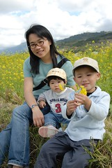    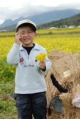  
  
    
  
小愛第一次近距離接觸這麼大片的花海  
也第一次自己走在田埂間  
臉完全的呆掉~  
  
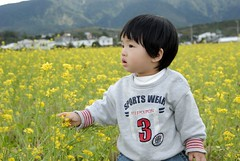  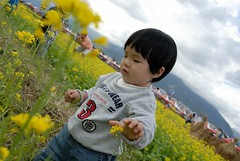  
  
阿徹又當起了採花賊  
還要我幫他綁成束 像是新娘子的捧花  
平常很愛跟我們玩結婚遊戲的阿徹拿著捧花跟妹妹求婚  
可是被妹妹拒絕了  只好轉而跟我這白雪老公主求婚  
 等待多時的我忍不住露出暗爽的竊笑 嘿嘿嘿...   
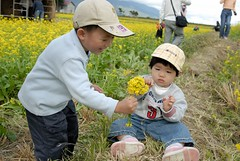  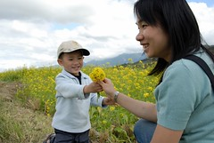  
  
忙著照相的我們 放著小愛讓他自己在田埂間或爬或坐  
小愛也靜靜的自己一個人玩著花 玩著稻草  
  
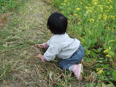  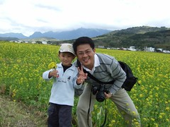  
  
油菜花田裡可見數量頗可觀的白色小蝶四處亂串飛舞  
尤其大太陽下 似乎所有的蝴蝶都出動了   
  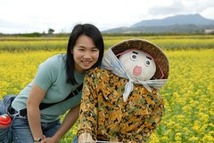  
  
假裝"正經"的玩了一會後  
阿徹總算開口說"我可以買汽球了嗎"  
我說問爸爸 爸爸說"我是不會買的啦"  
ㄟ~很嚴厲的口氣 讓原本想花錢了事的我都不敢吭聲了  
所以阿徹照全家福時 就這表情啦~  
真是枉費爸爸願意拉下臉請人家幫我們拍照 構圖也還不錯的說  
真是...............  
其實我們事後回想 覺得似乎對阿徹真的過於嚴厲了(徹爸懊惱不已)  
他願意這樣出門跟著我們體會田野風景已屬難能可貴  
難得開口說要買汽球 卻換來爸媽如此之絕情  
對一個四歲小孩來說 還真的有點殘忍  
爸媽下次改進 ~  
  
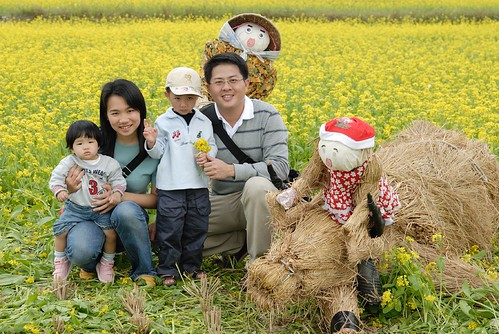  
  
回到熟悉的車上 小愛自在多了 還裝可愛  
  
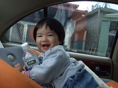  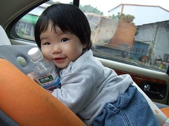  
  
下一站池上鄉萬安社區 有機米推廣種植社區  
原本的重點在於稻米原鄉館與磚窯廠  
但稻米原鄉館因為門前被借去辦桌不刻進入  
而因整修而加蓋了鐵皮屋頂的磚窯廠則讓人完全提不起興致拿出相機  
幸好還好萬安國小的操場不至讓此行空跑了  
  
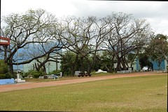  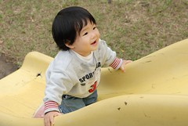  
  
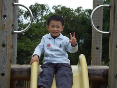  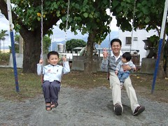  
  
稻米原鄉館吃不了大餐 只好回到池上吃有名的悟饕飯包  
點了徹爸的黃金炸排骨還有我跟阿徹的滷排骨  
望著小小的飯盒 我一直在猶豫掙扎是不是該再多叫一個飯包的  
但是又想要留點肚子晚點吃卑南包子  
可是望著分給阿徹後剩下的2/3飯包 后~真是超空虛  
然後看到徹爸打開的滿滿黃金炸排骨飯包 飯菜豐富多了  
肖想著徹爸的黃金排骨 可是主人家沒開口實在不好意思先下手  
於是趁著徹爸拿東西的時候吃了一片看起來不起眼的薑片  
徹爸吃了一會後突然用有點質詢的口氣跟我說"你吃了我的薑后"  
(徹爸事後說他是故意鬧我的 可是每次這種狀況後 他都說是故意鬧我的 讓我很難信服哩)  
后~吃個薑反應這麼大  
害正在吃不飽心情不好的我脾氣也來了  
"不過是個薑 我不敢吃你的排骨才挑一個沒什麼的薑吃  
 我的飯分給阿徹後才剩這些 吃個薑你也反映這麼大..."  
被我嚇到的徹爸 無辜的想要解釋什麼 分我吃他的排骨白飯  
哈哈~我很無聊后~可是沒吃飽心情真的會不好哩~  
早知道該多買一個便當的 下回真的寧可多花錢消災...
