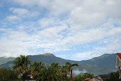

1/20 星期六 關山環鎮自行車道 ->  池上鄉油菜花季活動會場 -> 萬安國小 -> 關山親水公園 -> 卑南包子店 -> 原住民文化會館一大早就被房外洗車的熱鬧聲給吵醒 (徹爸的髒小紅一定很開心可以洗澡)  
隔著窗廉都可以感受到外頭大大溫暖的太陽  
真好~今天一定是個風和日麗 適合騎單車的日子阿  
伺候完阿徹少爺吃早餐(少爺最近啥早餐都不愛 只愛喝牛奶)  
一家四口(其實小愛那口不確定啦)開心騎腳踏車去嚕~  
阿徹少爺還戴上他刻意準備的太陽眼鏡   
粉藍色上衣 深藍色工作褲 小涼鞋 小墨鏡   
很休閒 很輕鬆 很自在 卻也有點屌的打扮  
  
  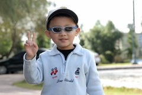  

大約8-9年前 媽媽曾經騎過一次關山自行車道  
就是因為那次跟玟姿小妹的台東行 讓媽媽從此愛上台東  
台東的山 台東的海 台東的天氣 台東的空氣   
一切一切都是那麼的讓人難忘 值得一來再來  
每次來總會懊惱還有好些地方沒法去  
沒關係 這樣每年就都有理由往台東跑了  
  
關山環鎮自行車道全長12公里   
沿途景觀多變 經過田野鄉間 小橋流水 也爬坡至山林間享受芬多精 遠眺關山鎮  
久沒騎車 一趟下來有真有點小累   
不過辛苦絕對是值得的   
騎著車載著阿徹 沿途說說唱唱  享受著這樣的美景 很平淡的一種幸福    
 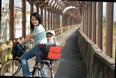  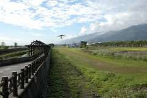  
  
小愛第一次坐腳踏車  表情有點緊張惶恐  
尤其甫坐定後 還被充氣機器的聲音給嚇哭了  
告訴徹爸"不要理她 哭一會就好了 趕快騎"  
要不然抱下車 秀秀不上車就完蛋了  
沿途景色太多變 對小愛來說都是新奇新鮮事  
所以眉頭皺個不停( 跟阿徹小時候很像) 很努力在適應體會變化的環境   
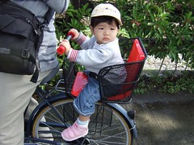    
  
阿徹墨鏡戴的很爽   
事後每次回想我還是忍不住想偷笑   
我竟然就這樣載著一個戴墨鏡的皮小子騎完全程  
  
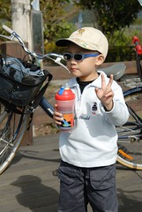  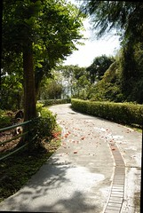  
  
途中還經過不少草莓田  
停在路邊就可以聞到空氣裡香香的草莓味喔  
誘的阿徹實在很想下田摘草莓...  
微風徐徐 小愛都忍不住睡著了  
雖然腳踏車很顛但是在太陽照射下 應該可以睡的很溫暖吧   
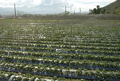  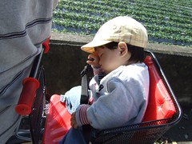  
  
騎在小道上 感覺像是通往遠方的天空裡  
偶而還有火車伴著我們  
"轟轟轟"阿徹說好像在打雷 我跟徹爸倒是覺得像是被大卡車追殺  
不過這麼近距離伴著火車 感覺很興奮  
  
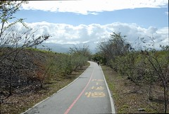  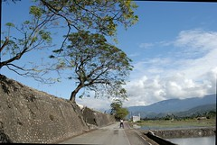  
  
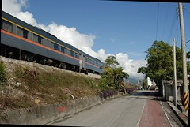    
  
青綠綠的秧苗 像是最柔軟最舒服的床  
好想成大字狀的仰躺下去  
如果可以躺在上面望著天空該有多好  
  
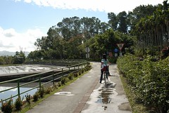  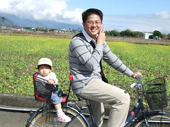  
  
總算 我們總算花了2個小時完成12公里的車道了  
沿途只看到不超過5輛的腳踏車  
覺得我們一家四口真是棒~  
一起完成了這項任務   
瞧阿徹笑的多開心 多屌阿~  
  
  
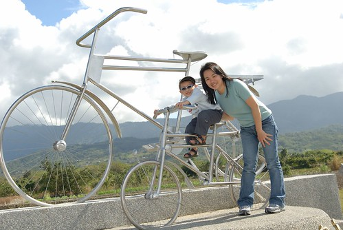  
  
趕著中午12點前退房   
媽媽進房整理行李 阿徹又在度假村裡的遊憩區玩起來了  
很好~好好享受你的旅行 你的假期哩  
  
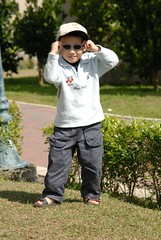 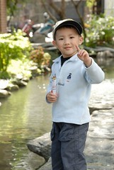 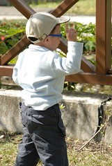
