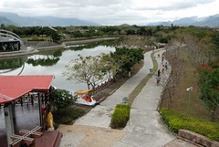
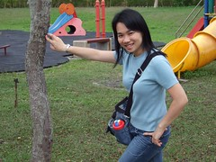

1/20 星期六 關山環鎮自行車道 -> 池上鄉油菜花季活動會場 -> 萬安國小 -> 關山親水公園 -> 卑南包子 -> 台東市原住民文化會館  
  
騎完關山環鎮自行車道  
最後其實 應該 真的得 繞進關山親水公園的  
停好腳踏車 坐在草地上 微風拂乾臉上的汗水  
哇~多麼享受愜意的ending阿  
可惜因為退房時間限制 只好在下午再補進親水公園  
(環鎮自行車道現在是要收費的 與親水公園門票一起50元)  
  
  
   

很想讓阿徹的腳踏車跟著我們一塊出門旅行的  
可是行李太多 實在很難在小紅後車廂裡再塞進那頗佔空間的腳踏車  
所以出發前的那個週末帶著阿徹去玩具反斗城敗了一架滑板車  
(還粉紅色的喔...為娘的我真是越來越開明了)  
只是說真的騎滑板車雙腳得不時的在那滑阿滑 還真有點勞力  
尤其是在不平滑的路面上  根本沒啥機會讓雙腳同時站在板子上休息  
阿徹滑個幾分鐘就累的寧可用走的了  
這玩意真的還是比較適合在家裡當玩具就好  
  
這趟旅行"玩"最多的就是"散步"  
慢慢走 看遠山 看稻田 感受好山好水好空氣  
早上剛騎上自行車時  
阿徹問我"要去哪裡ㄚ"  
我說"我們要騎著腳踏車 好好享受風景"  
在沿路大驚小怪的討論著"哇 天空好漂亮" "哇 紅色的花" "哇 好香的樹木味道下"  
阿徹似乎還真的有點享受起這樣的風景  
不過畢竟還只是4歲的小孩  
風景再美還是敵不過看到遊戲區時的開心興奮  
幸好這次到哪似乎都可見溜滑梯 盪鞦韆   
要不然還真不知道該怎麼鼓舞阿徹好好享受這趟旅行  
    
  
暨上回去日月潭沒能乘坐小船  
這次總算了了阿徹的心願乘小船遊湖(雖然湖小了很多)  
而且還是人工踩的天鵝船喔  
首先得穿上有點發霉有點髒又硬梆梆不合身的救生衣  
(坐在船上救生衣還會往上抬 像古代銬犯人般的銬住頭部 請見下右圖 有夠像吧)  
然後用騎了一上午腳踏車疲累不堪的雙腳努力的踏 奮力的踏...  
(一開始鼓勵阿徹去坐船時 一直以為這勞力是徹爸該做的  
 結果還是徹爸聰明打一開始就知道阿徹會欽點我還拼命鼓勵阿徹去)  
  
   
  
湖中晃了10來分鐘總算阿徹也覺得無趣就準備上岸嚕  
這時候妹妹又進入她的午睡時間 睡翻了...  
  
   
  
徹爸從觀景台上往下照的照片還蠻有一番感覺的  
  
  
  
阿徹的最愛 旅行中的精神支柱 公園般的遊戲區...  
徹爸都懶得再拿出相機拍阿徹玩溜滑梯的樣子了  
然後夫妻倆很無聊的用小3互拍 比看看誰的臉比較不腫  
(嘿嘿 每次旅行都會水腫的媽媽這回狀況不錯 略勝一籌 )  
  
   
  
真的很愛阿徹這樣笑開懷的笑容  
盡情的玩 開心的玩 沉溺於自己的玩樂...  
  
   
  
離開關山已是下午四點 加速前往今晚下榻地台東市原住民文化會館  
進到台東市不順道去買個卑南包子實在有點對不起自己  
一樣得大排長龍 等個10來多分鐘(不只觀光客來買 很多當地人也來排隊買說)  
但包子已經從12元漲價到15元  
肉餡似乎也略遜於記憶中的美味  
徹爸還很驚訝也很介意肉餡裡的紅蘿蔔  
不過整體來說 還是不錯吃的啦  
  
   
  
   
  
這時候的阿徹在後座睡番了  
到是小愛睡醒精神很好 跟徹爸在前座玩的很開心  
只是原本只是早晚稍咳及流鼻水的小愛  
今天白天流鼻水跟咳嗽的頻率增加很多   
打電話問了住在台東市的二嫂媽媽哪有診所  
介紹了小S婆家開的診所  ㄟ~徹爸對小S有點反感說  
繞去看了一下 ㄟ~看起來很古舊的診所哩  
改去各地都有的中山路上找了家看起來還蠻先進的診所  
看病的人也還不少 應該不會太兩光吧....  
結果...竟然遇到標榜不開鼻子藥的醫生  
(醫生說法 鼻子重點要吸鼻涕 他不相信小孩能醒出多少鼻涕)  
耳朵也沒看 喉嚨也沒看 聽診器也聽不到3秒...  
雖然滿心存疑 但也只好接受這只有針對咳嗽的藥方  
唉~起碼不要咳了吧  
只是這番折騰 讓媽媽原本到原生植物園吃晚餐的計畫被迫取消  
草草買了幾碗粥跟麵打發   
中午已經吃不飽池上飯包的我又忍不住小悶了起來  
還跟徹爸為了到底要不要吃這藥小小鬧了一下彆扭  
唉~今天真是"吃"事不順  
希望早早睡覺 明天醒來後一切重頭來過
