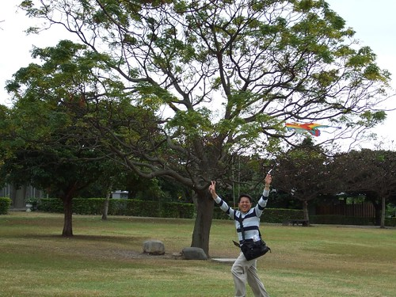
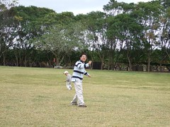
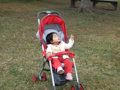
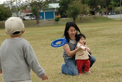
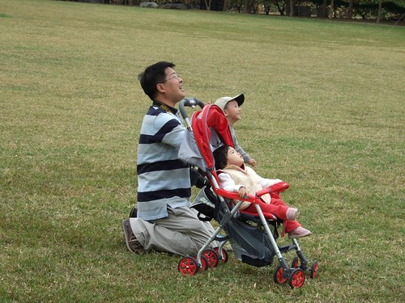
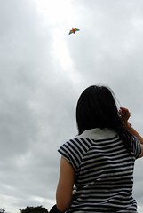
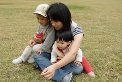
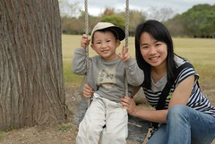

1/21 星期日 台東森林公園 -> 卑南文化公園 -> 萬安稻米原鄉館 -> 花蓮光復糖廠 -> 花蓮壽豐鄉葛莉絲莊園  
  
上回沒去成卑南文化公園  
這回怎說也要把它排入行程中  
尤其上網找資料時看到公園有個大大大草坪  
更是怎麼可以不來ㄋ  
出發前就跟阿徹說"我們去的地方有好大的草原可以玩飛盤 放風箏喔"  
徹爸還在玩具反斗城挑了一個價格不算便宜的風箏準備大顯身手  
旅行中每到達一個景點要下車時 阿徹就會問"是不是可以玩飛盤 放風箏了"  
等了3天總算可以跟阿徹說"拿著你的飛盤 風箏下車玩嚕"  
沒啥太陽加上不算小的風勢  
真是好個放風箏的好日子阿 (大太陽下仰著頭兩眼直視風箏應該會粉累吧)  
其實今天是我跟徹爸放風箏放的最開心  
好久好久沒有這樣盡情放風箏了~  
  

把風箏升上天空不是件容易的事  
這苦差事就先交給徹爸了   
等風箏飛高高再讓我跟阿徹坐享其成就好  
平常這時間都在睡覺補眠的小愛又睏睏累累的坐在推車上小憩  
不過還是好奇的望著天上的天空  
小鳥嗎? No No No...那是風箏  
  
  
  
美賢阿姨去年在去荷蘭吃速食送的飛盤又派上用場嚕  
媽媽技術其實只比阿徹好一些些 飛盤也是亂飛亂竄  
其實玩飛盤不累是撿飛盤比較累人些  
  
  
  
爸爸很厲害 把風箏放的好高好高  
不過一個不小心就卡到樹上了  
幸好爸爸又很厲害的把風箏給救了回來  
爸爸~你真是太太太棒了 ~  
  
  
  
發現原來坐享其成也不是輕鬆的事  
拉著被放高高的風箏線還挺累人的哩  
深怕一個不小心 風箏就這麼"ㄉㄨㄞ"下來敗在我手上(從我ㄧ臉認真的表情就可以看出來)  
阿徹用雙手放了好一回就累的就給我們  
  
爸爸下左邊兩張的意境拍的很好  
媽媽認真放風箏的背影以及爸爸自拍自己拉著風箏的手  
  
  
  
收完風箏線 拿出腳架拍全家福哩   
以媽媽為中心各自喬好位置擺出最迷人的pose吧  
第一張 頗正經八百不過妹妹的角卡的有點怪  
第二張 四人千手觀音  
第三張 咦~小愛發現蟋蟀 媽媽還得故作鎮定的拉著小愛看著鏡頭  
第四張 趁著徹爸用相機的空檔 三人戲弄起蟋蟀  
第五張 廣角效果還挺不賴的 只是媽媽一根頭髮就這麼直直的劃過阿徹臉上 可見離子燙的威力果然嚇人  
  
  
  
  
  
  
  
拍照時被棄置一旁 功成身退的風箏  
草原上有棵大樹  大樹下有個盪鞦韆 很電視裡夢幻的畫面  
爸爸還故意遠遠的拍著我們三人 他說我們三人點綴的真好ㄚ(設這張當桌面很讚)  
  
親愛的孩子阿 希望妳們心中能一直保有一塊空間給這片大草原  
別忘了 妳們曾經在這些草原上 開心的走著 跑著 翻著  
希望長大後你們還能依晰記得這些曾經有過的感動與快樂...    
  
  

