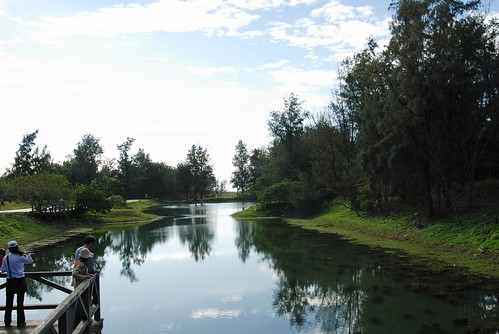

1/21 星期日 台東森林公園 -> 卑南文化公園 -> 萬安稻米原鄉館 -> 花蓮光復糖廠 -> 花蓮壽豐鄉葛莉絲莊園  
  
(快要過年放12天長假了 得加緊趕工把遊記寫完  
 雖然時間實在拖的有點久 但還是得寫完 這是種堅持......)  
  
台東原住民文化會館的對面就是台東森林公園與海濱公園  
都來住這了 沒順道騎腳踏車去公園裡晃晃實在很說不過去...  
於是又花了200元租了兩輛腳踏車  
一家四口踏著腳踏車享受著這樣的好天氣...  
  
第三次來琵琶湖 還是覺得她好美  
如果可以住在台東 每天早晨來這散步運動該有多幸福  
(每次來花東 跟徹爸都忍不住癡人說夢話)  
  

第二次(天)坐腳踏車 小愛鎮靜多了  
坐在後座任憑爸媽處置  
而阿徹則是身在車上心在公園入口處的遊戲區  
ㄘㄟˊ溜滑梯果然是小孩殺手  
要小孩一直只能用心享受大自然 欣賞風景 好像真的有點難...  
  
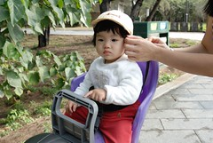    
  
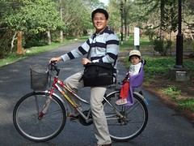  
  
這次突然很想看海  
幸好5分鐘不到的騎程就可以看到太平洋了  
雖然沙灘"溼氣"有點重而且冷風颼颼  不太適合玩耍  
但無論如何也要去踏踏沙子  
  
阿徹剛看到沙灘時 很開心  
但下一秒鐘卻生起氣來   
他說"沒有帶玩沙沙的工具怎麼玩阿"  
ㄘㄟˊ 沒有玩沙沙的玩具就不能玩喔 不是這樣吧...  
跟他勸說無效後 懶得理他 帶著小愛逕自走向沙灘  
很無聊的玩起在沙灘寫字的遊戲(其實有點故意要吸引阿徹的目光啦)  
Henry & Cherry (考慮了一下是兩個e還是兩個r 果然還是拼錯了)  
然後把小愛擺到中間 想盡辦法的用小3全入鏡  
嘿嘿~效果還不錯喔  
  
小愛力氣很大的玩起大石頭(很貪心)  
阿徹在爸爸也逕自走向沙灘後 總算願意走上沙灘上  
跟他說"沒有玩沙玩具還是可以玩沙阿 你可以用石頭用樹枝阿"  
阿徹試探性的用樹枝畫了畫沙  
然後恍然大悟般的開始玩漂流木 玩石頭 玩沙沙...  
我突然想 莫非這是現代小孩的悲哀  
太多現成的玩具讓他們沒了玩具就不知該怎麼玩起  
本能的玩耍能力就這樣被玩具給層層掩蓋了  
看來以後真的要少買點玩具了....  
  
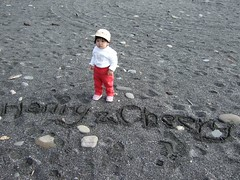  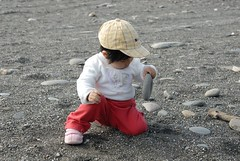  
  
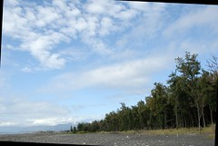  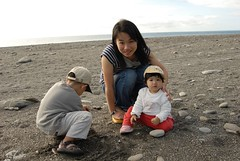  
  
離開沙灘便回到阿徹她們最愛的遊戲區  
小愛還是一古腦的拼命想要在溜滑梯爬山  
成功往上走個幾步她就很開心  
  
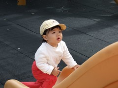  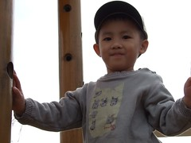  
  
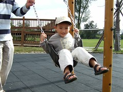  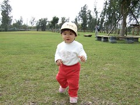  
  
遊戲區旁就是一大片的草坪  
很奢侈但是很舒服  
嗚...越寫越想去住台東了啦  
  
  
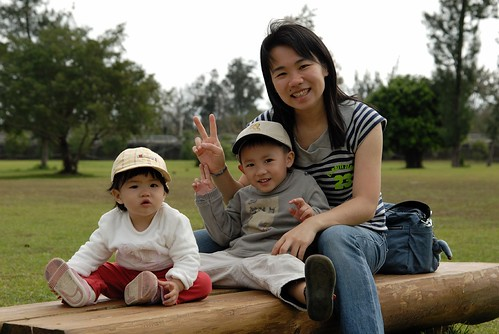  
  
附註: 台東市原住民文化會館的外觀  
          週六三人房只要1450  
          雖然沒有豪華的設備甚至室內木頭和室地板都有點吱吱作響了  
          但乾淨寬敞又便宜 而且離市區很近 而且就在台東森林公園對面  
          絕對是來台東旅遊時的超值選擇喔(尤其是想省點住宿費的時候)   

