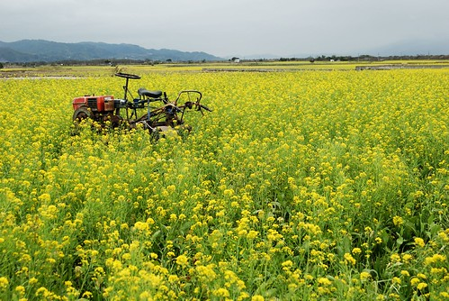
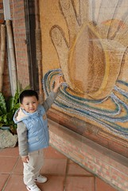
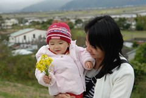
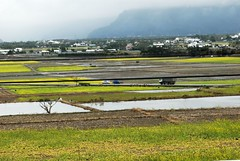
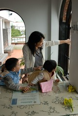
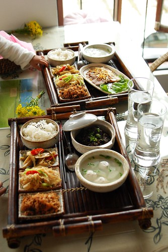
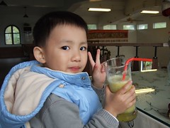
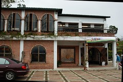
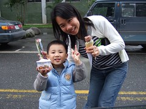
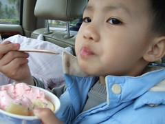

1/21 星期日 台東森林公園 -> 卑南文化公園 -> 萬安稻米原鄉館 -> 花蓮光復糖廠 -> 花蓮壽豐鄉葛莉絲莊園  
  
前一天到了萬安卻沒能進去稻米原鄉館 阿徹很介意  
直嚷著要去"飯飯的博物館"  
也許是因為媽媽給他太多的期待   
誘騙他"要去找稻米的博物館喔 那裡有介紹怎麼種稻米 怎麼變飯飯喔"  
其實這也是我當初對於稻米原鄉館的認知  
知道那有賣社區媽媽的好料理  
但想應該也有介紹耕種種種的介紹吧 我真的這麼想  
雖然後來才發現那沒有像博物館的介紹  
只是萬安社區有機米的推廣餐廳  
但好吃的餐點加上令人心曠神怡的田野風光  
這趟真的再來的很值得~  
謝謝阿徹的堅持讓我們沒錯過這麼樣的一個好地方  
(原本想去原生植物園用中餐的我們一直慫恿阿徹去原生植物園看他最喜歡的池塘  
 但小子就是堅持去我們前一天答應他要去的飯飯博物館)  
  

從台九線轉進往萬安的路口就被油菜花田裡的舊耕作機給吸引  
應該是被故意放在這增添詩情畫意的吧  
這一幕感覺很熟悉 不知道是在哪個網站還是哪個旅遊DM上看過  
這樣的景緻讓人有無限延伸的聯想空間 很棒~  
  
雖然前一天徹爸才在說"油菜花看的都有點麻痺了"  
但今天我們還是讚嘆於這沿路上的田野風光  
在這樣的好山好水好空氣中 難怪池上米為台灣米之冠  
萬安為池上米之源頭   
現在社區全力推廣認養有機稻米之耕作   
並且由社區媽媽聯合負責/經營稻米原鄉館之餐點服務  
坐在原鄉館中望著窗外的田野不禁感動於這些人愛鄉土的傻勁  
  
在原鄉館點完餐後 便先往館後的瞭望檯走走看看  
阿徹又採了一些油菜花要當新娘花  
爸爸拿出了昨天吃池上便當時收集的橡皮筋  
好好的幫阿徹綁好一束漂亮的油菜捧花  
  
  
  
阿徹很大方的送給了妹妹  
小愛笑的很開心 真的很開心  
是這趟旅行中最燦爛的一個笑容   
  
  
  
  
回到原鄉館的二樓靠著窗邊坐了下來  
跟著阿徹小愛看著窗外田裡的稻草人與遠方飛過的小鳥  
還撇見了小紅裡晾著的阿徹小內褲與小愛上衣(都是因為ㄍㄡˊ到恩恩只好下水了)  
很好笑但是很溫馨的對比  
  
  
  
餐點在我們的驚嘆聲中上來了  
食物的擺設與精緻度真的就像原鄉館網站介紹的那般  
感受到像是日本人的精緻/用心文化   
(因為台灣很多地方實物與用心度實在跟網路落差太大)  
請向來不愛拍食物的徹爸(因為徹爸說這樣很俗)  
一定要把這樣的餐點拍下來  
拍下社區媽媽的用心與我們的感動...  
  
  
  
也許因為已近下午2點過了用餐時間  
也也許這真是冷門的景點 (是媽媽在"你所不知道的台東"一書看到的社區介紹)  
同時間只有另一桌有三人用餐  
因此我們一家四口寧靜的自在的好好享用我們的餐  
一口一口慢慢咀嚼香甜的有機米....  
用畢社區媽媽送上餐的副餐 一大杯現打新鮮果汁時   
又驚喜的讓我忍不住哇了起來   
徹爸說 很濃稠喔 很像記憶中讓他有點怕的陳嬤現打果汁  
可見有多真材實料   
不知道是不好意思剩下還是真的好喝 徹爸有喝光光(隔天還恩了這顏色的大大)  
兩份這樣附上大果汁的餐點只要370元  
實在有夠感動 幸福 超值的~  
  
  
  
  
  
離開萬安要前往我們今晚的下榻地 花蓮壽豐葛莉絲莊園嚕  
早上玩的很瘋理應很累的阿徹  
在兩小時的車程中竟然還是清醒的 興奮的 唧唧聒聒的  
真的不得佩服他的超強體力  
途經花蓮光復糖廠當然得給他進去買個冰吃吃嚕  
買了阿徹的草莓冰淇淋 徹爸的紅豆冰棒 還有買錯(小姐聽錯的)的巧克力冰淇淋  
小愛因為還在睡覺加上感冒 無福享受這可口的冰淇淋  
原本想豁出去的讓阿徹吃完一球草莓冰淇淋  
但阿徹在吃了10來口後竟然就說"我吃這樣就好了 我感冒不可以吃太多"  
果然是個不愛甜食又認份的乖小孩阿~  
  

