吃完晚餐一家四口迫不及待的脫光衣服洗蚤 泡湯嚕  
這幾天泡湯泡上癮的阿徹最是開心(回來後還會說 我好久沒有泡湯了 我們去泡湯 ㄘㄟˊ)  
阿徹第一個洗好澡然後下水享受  接著跟徹爸合力幫小愛洗好澡  然後我陪著小愛讓徹爸先洗澡  
本來想要一家四口一起泡在這大浴缸裡的  
可是真的有點兵荒馬亂 待徹爸洗好澡時小愛也想起身了  
我只好在打理好他們之後再自己一個人淋浴洗澡  
嘿嘿~等阿徹小愛都睡著後 再跟徹爸好好享受泡湯的情趣   

用毛巾遮好徹爸的重點部位  三人賣肉演出啦  
泡湯泡的很爽喔  
阿徹ㄚ~等你以後蓋城堡記得要蓋間像這樣的浴室給爹娘享受ㄚ  
  
    
  
葛莉絲不只硬體設備讓人滿意  
冰箱裡的蘋果(還有匏刀喔) 櫃子上的泡麵 以及新鮮的蓮花茶更是讓人感受到Peter and Grace他們的貼心  
而且蓮花茶出乎我們意外的好喝   
小孩睡著後跟徹爸泡了個舒服的湯   
然後坐在和室椅上 喝著蓮花茶 看著這兩天的照片真的覺得好享受好感動   
謝謝一家四口帶給彼此這麼棒的旅行  
尤其四天四夜的旅行最後在葛莉絲莊園畫下完美的ending  
  
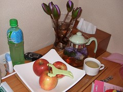  
  
在房間裏玩的很開心的小愛  
  
    
  
在家睡習慣嬰兒床的小愛 這幾天睡大空間翻個不停  
尤其是今晚的和室超大空間 翻的範圍達直徑2公尺  
逼的我只好睡到她旁邊把她卡在牆角 總算兩人才都能安穩入睡  
  
一早起床後 兄妹倆穿著睡袍又開始晃了起來  
阿徹把玩著他行程中第一個獲得的小玩具(雖然是7-11送的 小子就開心的不得了)  
小愛還是又開心的在和室椅上坐來坐去  
  
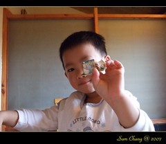  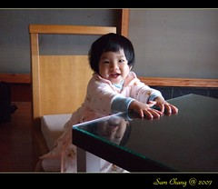  
  
然後兄妹倆又趴在窗邊看著窗外的蓮花池  
徹爸說阿徹跟他小時候一樣喜歡親著冰冰的窗戶 哈著水氣  
  
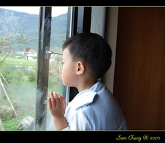    
  
白天滿池蓮花都開了(原來蓮花晚上也會閉起來休息)  
慵懶的坐在椅子上看著窗外的自然生態  
徹爸說"都不想起來刷牙洗臉了"  
聽到徹爸這句話很開心 我想徹爸應該也蠻享受這樣的美景吧  
(因為從一開始都是媽媽一古腦兒起勁要來   
 很擔心徹爸覺得這不過像是他平常嗤之以鼻的那些網路熱門住宿或是美食)  
  
    
  
再怎麼享受 捨不得起身  
還是得趕10點前的早餐用餐時間  
看到桌上準備好的紫山藥粥 手工蠻頭 炒高麗菜 故意連在一起的太陽荷包蛋 還有肉鬆 筍干等小菜  
哇~又跟網路上的早餐照片一模一樣  
  
今早阿徹一樣嚷著要吃白色的飯(ㄘㄟˊ 大清早只有他要吃白飯)  
雖然後來還是再我三催四請下吃了一碗紫山藥粥  
但吃了好久好久....  
同時間徹爸早就帶著小愛去外頭享受這美景  (臭阿徹)  
  
  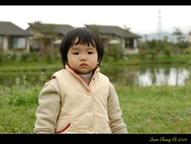  
  
早晨的葛莉絲 生態池裡都可見villa的倒影  
尤其這兩天的花蓮 一點點細雨一點點雲霧 更顯得詩情畫意  
  
  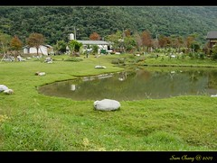  
  
很多年沒玩過含羞草的我  在池邊跟妹妹開心的玩了起來  
本來很虛張聲勢的跟阿徹說"這草會合起來喔"  
才發現原來阿徹早看過玩過了(張公張嬤帶去獨角仙農場時)  
ㄘㄟˊ 害我本來想要好好唬弄阿徹的說...  
  
    
  
阿徹的個性比較ㄍㄧㄥ 也比較怕死膽小點  
相較之下 小愛真的顯得大膽 不怕死多了  
  
  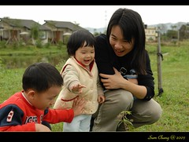  
  
四個人悠哉的散步在園外的小路上  
兩旁的落羽松更添這鄉野風情  
阿徹還撿了些像是羽毛的落羽松葉子要拿回去給同學們看看  
  
  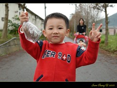  
  
小孩子好像真的很愛玩石頭  
阿徹小時候出門也很愛玩 還會夾帶當地的幾顆石頭回家  
這趟旅行中 發現小愛也愛玩 看到石頭就逕自的玩了起來  
(這是莊園入口 餐廳旁的走道)  
  
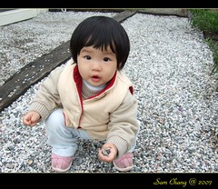  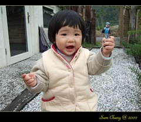  
  
(左)villa前不知名但是很特別的小白花  
(右)villa門口的鈴鐺 很清脆很響亮的聲音  
  
  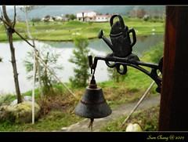  
  
趕著11點前的退房 沒有時間好好的坐在門前椅子上發呆有點可惜  
下次有機會一定要好好的坐在這冥想一下  
(徹爸看到有人坐在池邊看雜誌就說 在這不是應該連書都不要看 就是發呆嗎)  
  
  
  
回到房內 拍下紀念的全家福  
嗯~大家都笑的很開心 很好~  
  
  
  
其實本來雖然覺得這很美 設備也很好 但總覺似乎還少了點什麼東西   
若要給她打分數大概是85分吧  
推著行李要走時 阿徹看到了開始摘蓮花 洗蓮花的三個在這工作的阿姨  
阿姨問"阿徹要蓮花嗎"  
阿徹說"要紅色的"  
手上盡是紫色蓮花的阿姨說"好 我去摘"   
然後就快速的穿上雨衣下到蓮花池裡摘蓮花 摘了三朵粉紅色的蓮花給阿徹   
然後另一個阿姨再補上6朵紫色蓮花後還問"這樣夠嗎"  夠夠...真的夠了...  
第三個阿姨又幫忙的拿袋子裝蓮花  
當大家在苦惱怎麼讓蓮花不會倒在車上時  
摘蓮花的阿姨又熱情的貢獻出還沒吃完的洋芋片罐子(把剩下的洋芋片都倒掉了)  
吼~那缺少的東西不見了  95分的感覺出現了  
真棒~帶著漂亮的蓮花還有滿滿的回憶踏上我們旅行的歸途  
  
  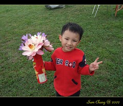  
  
(回到家還能看到美麗的蓮花感覺真的很好 謝謝Peter and Grace還有阿姨們)  
  
  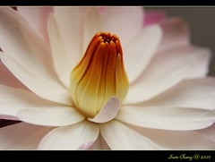  
  
總算....總算...遊記總算是寫完了  
超級....超級...疲累與感動的  
寫的過程腦海裡又清晰的閃過每個畫面  
也又細細品嚐了旅行中的大小事  
唉~寫完又想出去玩了~ 花東再等我ㄚ~
