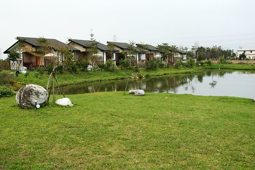

跟葛莉絲緣起於去年六月的花蓮行  
上網找民宿時無意間發現了葛莉絲 ([http://www.gracegarden.com.tw/](http://www.gracegarden.com.tw/))  
雖然早知道這麼美的villa一定很搶手但還是不死心的打電話去問  
想當然爾結果是訂不到 只好把她擱在心上了  
後來又陸續收到人家介紹她的email 更加深我要去住她一宿的決心  
就像幾年前的花蓮遠來飯店 被一堆email"ㄒㄧㄚˊ"的心好癢 花大錢住她個一晚後就可從此免疫啦  
大半年前就想著一月要去看花東的油菜花  
這次無論如何都要去葛莉絲住個一晚  
因此10月就早早規劃行程準備訂房 我想三個月前總該訂的到吧  
(後來聽說2-3個月前就得訂房而且還一堆人在排後補)  
果然沒讓我失望...讓我如願訂到了和式四人房 平日假$3900  
只是10月就訂好所有房間  然後等ㄚ等一月的到來 真的好折磨人  
跟徹爸兩人直嚷著 "好想出去玩ㄚ 怎麼還沒到"  "剩一個月了耶" "再10天耶"...  
期待的心情真是酸酸又甜甜ㄚ...  
  
總算那一天到了 來到了Peter and Grace的葛莉絲莊園  
真的 真的就像網路照片上那般的美麗 人間仙境  
可是住了一晚後沒有免疫  如果有機會我還想再去~  
  

接近台九線224公里   徹爸開始留意路旁是否有葛莉絲的招牌  
徹爸說"總有個招牌指引吧" 可是並沒有  
照著網站上的路線指引 "**台九線直行，在標示"223"公里處可遇見一所中油加油站，道路對面可見一鄉道  
即是"魚塘路"，轉進魚塘路後直行800公尺即可到達。**"  
  
彎進中油對面的小路 走了幾百公尺徹爸說"怎麼還沒到" "怎麼都沒看到招牌"  
突然間我看到了那深印在腦海裡的"池塘邊的五棟villa"畫面   
開心的喊著"到了啦 就是這裡"  
徹爸說"怎麼門口連個招牌都沒有"  
我說"五棟villa就這麼矗立在池塘邊 哪還需要什麼招牌 一看就知道是這裡啦"  
停好車拿好行李 走進我們肖想很久的莊園  
一進門小愛就被這的狗給吸引了 興份的直想要靠近  
Peter正忙著帶客人去villa裡  於是我們在餐廳旁一邊欣賞美景一邊等Peter  
  
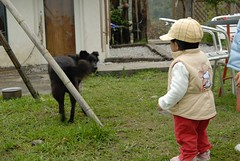  
  
等了10來分鐘 我也讚嘆了10來分  
Peter出現了  跟照片裡很像的卡其色休閒上衣 (哈哈 我很無聊連這都記得)  
Peter熱情的幫我們拿些行李   
還很剛好的拿到徹爸向來不假他人之手的攝影包 真不知道徹爸那時候有沒有很緊張  
進到最裡棟的villa後  Peter開始中台語夾雜詳細的介紹環境 房內設備  
介紹villa前後的生態池 蓮花池  
浴室蒸汽浴 草藥包 及自調沐浴乳洗髮精的使用  
還説明怎麼使用暖氣機 怎麼泡蓮花茶 如何使用淨水器熱水瓶等  
最後還一同分享 享受他們放在DVD裡的音樂   
介紹過程中 Peter最常講的一句話是"...這樣很棒喔"   
而且他的表情就讓人覺得很怡然自得 真的很享受的樣子  
從他巨細靡遺的介紹就可以感受到他們維護這個莊園的用心及想要讓我們放鬆心情 盡情享受的真心  
  
Peter介紹時 阿徹跟小愛就開始好奇的東摸西看  
徹爸趕緊把和室桌上的蓮花放到較高的梳妝台上  
我想Peter應該會有點緊張小孩子不知道會給莊園帶來什麼樣的災難吧  
不過看到Peter他們這樣的用心維護 說真的跟徹爸倆人壓力頗重  
不時叮嚀阿徹"阿伯他們好用心照顧房子 我們不可以破壞也要愛護喔"  
  
Peter前後介紹了10多分鐘 待他離去後  
跟徹爸再也迫不及待的拿出相機喀嚓照個不停   
要趁破壞前多忠實的記錄下這的好 這的美  
  
(左)房間後方的和室桌椅 窗外是蓮花池還有野鴨游ㄚ游   
(右)房間前方的生態池 偶見胖小鳥停在樹枝上  
  
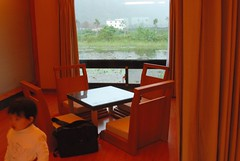  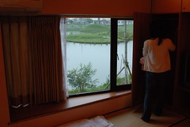  
  
隔著玻璃窗照的蓮花池以及生態池 不同的風味感受  
  
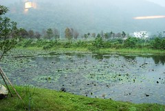  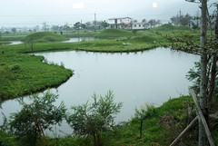  
  
小愛開心的在四張和室椅上輪流坐來坐去  
我忍不住矯情的把蓮花放回桌上 拍拍她本來的樣子  
在我跟徹爸努力的探索這房間時  
阿徹則正專心的在玩他早上去7-11買東西送的小月曆  
(附帶一提 這次有進步有吃的比較好 第三天才第一次且唯一一次的去買7-11御飯糰當早午餐  
 真的覺得7-11是我們出門在外的好朋友阿 不知道吃什麼或是胃口不佳的時候找他就對啦 )  
  
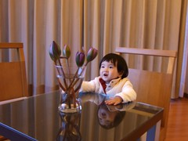  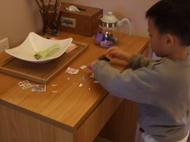  
  
接著來到佔了房間1/4大的浴室  
(左)面對蓮花池的大澡缸(這種大理石池讓人感覺很乾淨)  
(右)重金打造的西班牙蒸氣室  
  
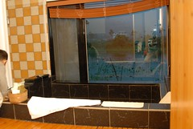  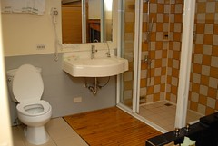  
  
忍不著坐在浴缸裡 想像著在這泡著香草浴望著窗外蓮花的幸福樣    
(小愛一臉"ㄚ...媽...你在幹麻"的樣子)  
右邊是Grace他們調配的泡澡包 檸檬草+...淡淡清香的草  
(蒸汽浴還有另外一包藥草)  
  
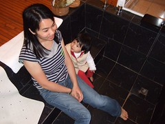  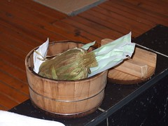  
  
這樣巡視了一番 天也暗了  
只好趕緊去外頭街上吃晚餐 好早點回來享受泡澡樂趣哩  
吃完飯回來又忍不住的再補照幾張  
玄關 房間前端 房間後端....  
很寬敞 很奢侈 很自在 很享受的villa   
唉 真不知該怎麼形容她了  
   
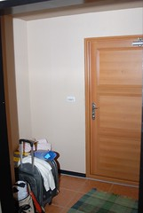 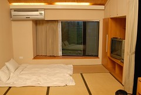 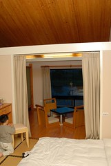
