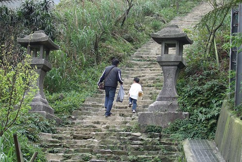

陰霾了好久... 三月的台北總算重回太陽的懷抱了  
才星期二就打著周末好天氣的歪主意 (我想我對於玩的積極度應該有超過100分吧)  
跟徹爸說去金瓜石吧~ 挺喜歡那的感覺的  
上一次去時小愛才剛學會走路 扛了台推車加上她的暴走實在沒啥好好逛到  
那天接阿徹放學時 阿徹也突然跟我說"好想去野餐喔"  
我說"好ㄚ 這樣的好天氣去野餐最舒服了"  
那麼就約定這個星期六去金瓜石野餐喔...  
  
雖然東北角的天空依舊有點灰暗  
但走累了 坐在階梯上 望著前方的山頭海洋 依舊一整個神清氣爽...  
春天就跟秋天一樣 沒出去走走會對不起自己 對不起老天爺的~~~  
  
  
 

剛好我是這個月的壽星 可以享受台北縣民生日月暢遊博物館免門票的優待  
雖然門票也才區區100元  但是憑著手上蓋的章就可以進出各展覽館 有種神氣的感覺  
  
等著進去參觀生活美學館的四連棟日式建築時  
排隊站的位子望過去剛好是這個view  很有FU所以請徹爸拍了下來  
  
  
  
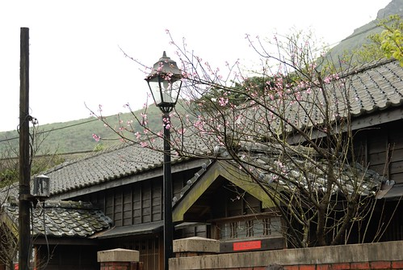  
  
雖然已經過大整修重建 但還是一整個古意  
  
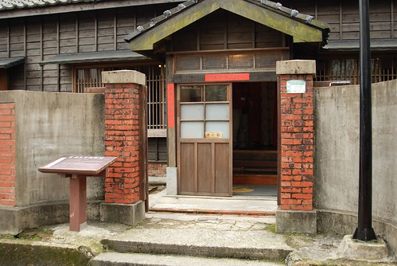  
  
長長的後廊~~~  
看太多日劇了 現在對後廊超著迷的  
甚至幻想著以後的家也要有個後廊  一家子坐在後廊上聊天嬉戲  
但幻想畢竟是幻想...說說就好 放在心裡深處就好....   
(寸土寸金的台灣 加上我跟徹爸又不是認真賺錢的人  這真的只能是非分之想)  
  
  
  
因為要野餐 阿徹堅持要把他最近最好的朋友也要帶出來  
小愛看到哥哥帶也學樣的帶了一隻小熊出門  
  
  
  
住不到這種房子 照個相留念一下也好  
  
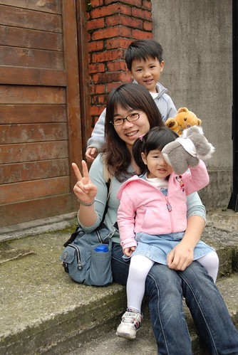  
  
金瓜石與十年前的模樣差很多  當時真的就像是個廢礦坑社區  
現在經文化人士與社區居民的重新營造與經營  一整個的煥然一新  
重點是我覺得清潔度維持的很好  整體環境也maintain很好 起碼跟我一年半前來看到的相差無幾  
而且整個園區就這條街上有零星幾家商店  沒有其他老街的髒亂以及販賣聲    
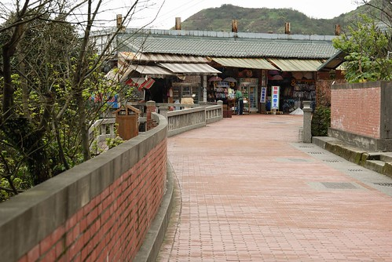  
  
至於人潮也算"稀疏"  (實在很怕人多的地方)  
算是個適合散步的好地方  
  
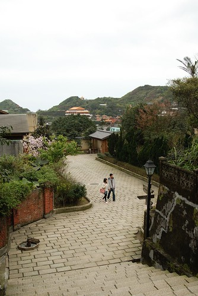  
  
山頭上坐落著大大小小 不同顏色的房子  
很奇怪的竟給了我一種難以言喻的幸福感 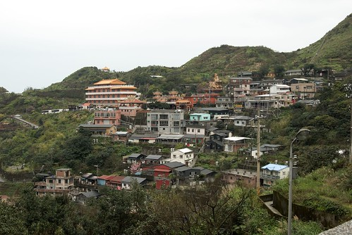  
  
小孩子似乎都很愛鐵軌 很愛走在上面像是火車ㄅㄨㄅㄨ  
  
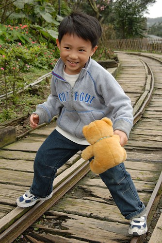  
  
四處尋找可以野餐的地方  
望著遠方山頭上的涼亭 我說"就走到那個涼亭去吧 一定超有感覺"  
幸好不得其入口而上  所以順其自然的走上通往黃金神社的步道上  
礦坑體驗區裏的路標顯示 距離黃金神社850M  
850M...聽起來 看起來似乎都有點太小咖了    
但真的往上走後才漸漸省悟 我們真是太遜啦   
850M的階梯都爬的喘呼呼了  還說要去登嘉明湖勒  去多練練後再說吧   
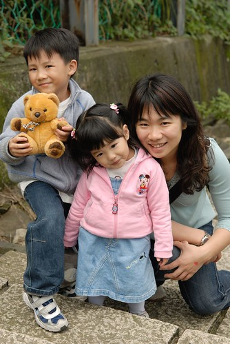  
  
小愛一樣秉持最近的原則與約定 走一點點抱一點點   
這樣換算下來應該走有1/3到1/2的路程吧  
  
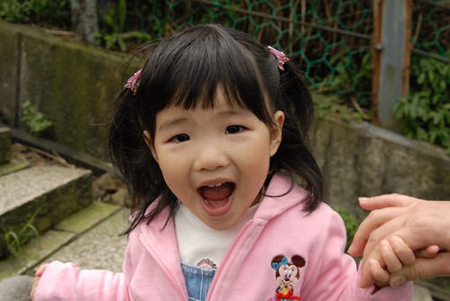  
  
阿徹邊走邊喊"好累喔" 可是他還是都衝第一個     
還直問著"可以野餐了嗎" "我們坐在這裡野餐就好啦"  
我說"要走好多路 流好多汗 很累的時候再野餐  才會覺得特別好吃 特別感動的"  
阿徹有點懂  有點願意等待這樣的感動  但還是邊走邊唸要席地野餐了  
幸好在聽了"樓梯上怎麼舖我們的野餐巾ㄋ"後  阿徹很認命的勇往直前了 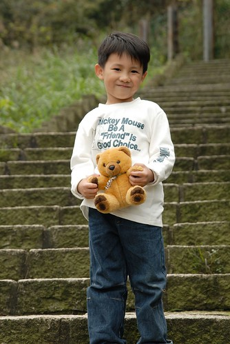  
  
如果要上我一開始鎖定的涼亭 肯定更是吃足苦頭  
我跟徹爸大概就陣亡在這陡峭的步道中了  
  
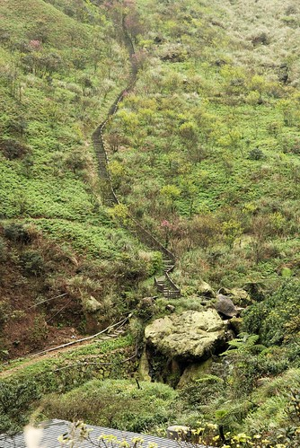  
  
不過我們走的這條路也不是太好走啦  
階梯不止充滿古意 還崎嶇不平  階梯陡峭(起碼對短腿的我們來說算是"高"階的樓梯)   
被賦予尋找野餐地點任務的阿徹 與爸爸一馬當先的往前衝  
  
  
  
舒服到讓人就想這麼一直坐下去 不過還是得起身努力往我們的目的地前進啦  
總算再差幾階就要到了...  
  
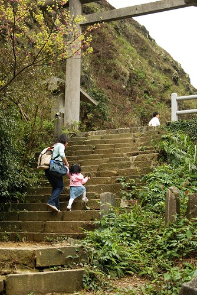  
  
帶著小毛頭走這麼辛苦就是為了這view阿...  
  
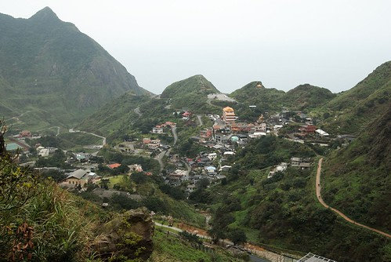  
  
到達後二話不說的就擇地鋪墊子嚕  
搬出所有辛苦揹上來的東西 爭鮮壽司 蔥花麵包 水果 果汁 梅子汁..  
心跳還快速蹦蹦跳著  汗也還留在額頭上 而每一入口的食物都是這麼的令人滿足  
這就是遠足野餐最大的樂趣與幸福了  
  
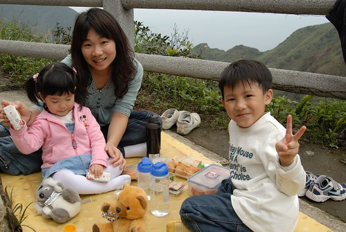  
  
雖然招來不少旁人異樣的遠光 但我想他們應該是羨慕的吧   
哈哈...因為金瓜石上賣吃的真的很少 尤其在這中午時分 在這山頭上...  
  
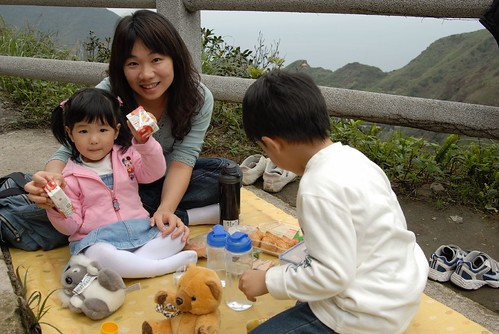  
  
就像阿嬤常說的"玩累了 肚子餓了 自然胃口就好"  
大口大口的給他咬下去 吞下肚...  
  
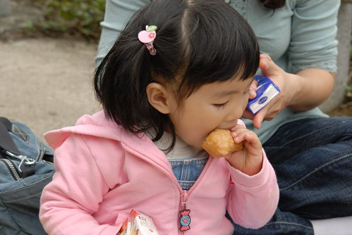  
  
這就是流過汗後 滿足與幸福的笑容...  
  
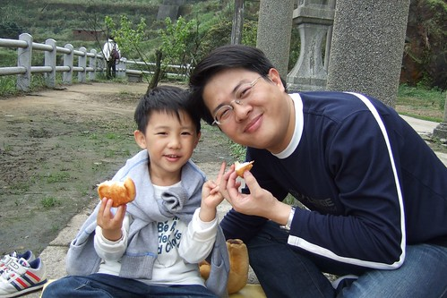  
  
小熊們的野餐比較可憐 只有一瓶奶共享  
  
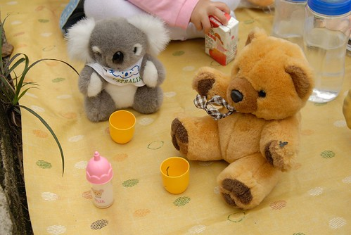  
  
吃飽後的阿徹開始頑皮 戲弄一旁沒犯著他的螞蟻們  對著螞蟻猛吹風  
  
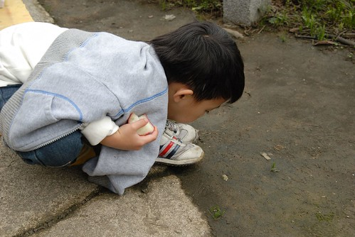  
  
還有飯後點心 海苔片喔  
  
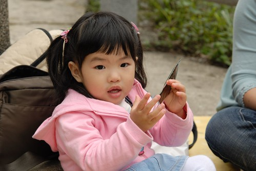  
  
這是我們的第一次野餐 很新鮮很愉快  
看來以後可以多多找些地方去野餐了  
  
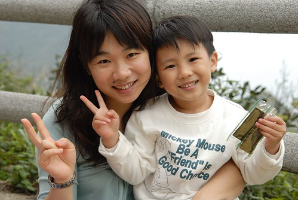  
  
這是阿徹拍的三人組  
  
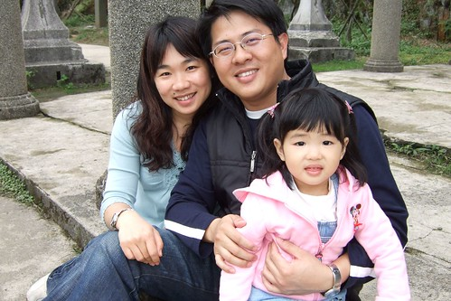  
  
徹爸搞的自拍  
  
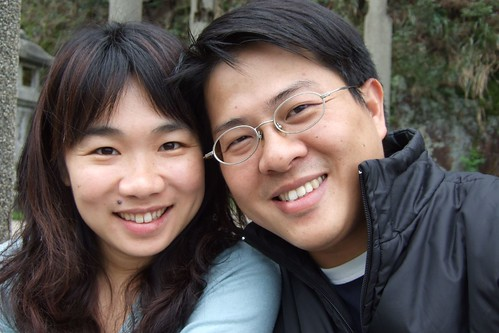  
  
這當然不可能是小愛拍的三人組 ( 一樣是徹爸的自拍)  
  
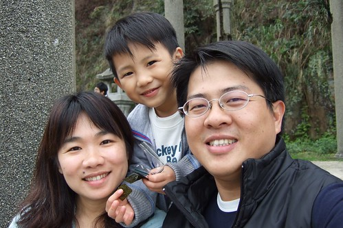  
  
春天果然是春暖花開  
走到哪都可以看到各色各樣美麗的花朵以及枝頭上點點嫩芽  
讓人感覺真是美好的世界 心情跟著輕盈 也對未來多了點信心...  
  
(花蕊超晶瑩剔透 像珍珠一般)  
  
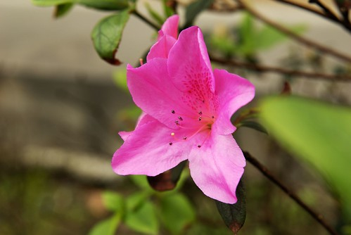  
  
很湊巧的恭逢金瓜石櫻花花開的時節 算是此行意外的收穫  
  
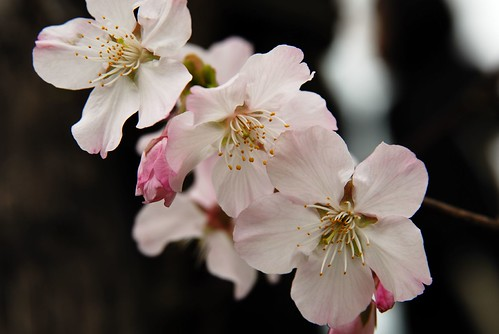  
  
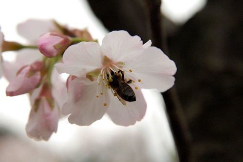  
  
其實金瓜石的櫻花沒多少株 (其實全台各地都一樣)  
也許因為乾淨 因為稀疏 倒別有一番味道 (那天看到不少背著單眼的攝影愛好者)  
  
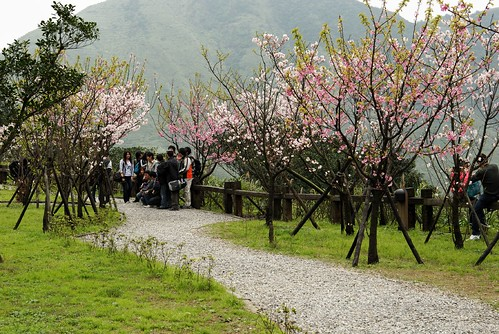  
  
櫻花再美 還是覺得我們的小愛人比花嬌啦...哇哈哈  
  
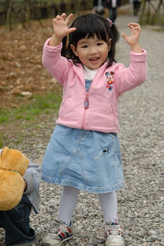  
  
出園區回下方停車場時  如願讓阿徹去去程就看到的某民宅旁的櫻花揀花朵  
徹爸說 真幸福 自家後院就有櫻花可以賞...  
  
  
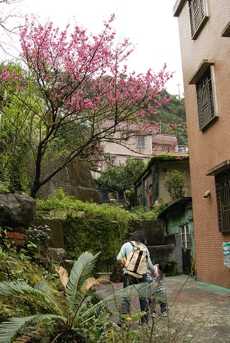  
  
這回小愛也跟哥哥一樣拿了個小塑膠袋拾花  
  
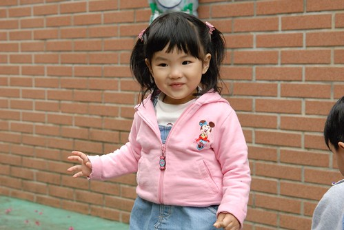  
  
滿地落花夠讓他們盡興而歸了  
  
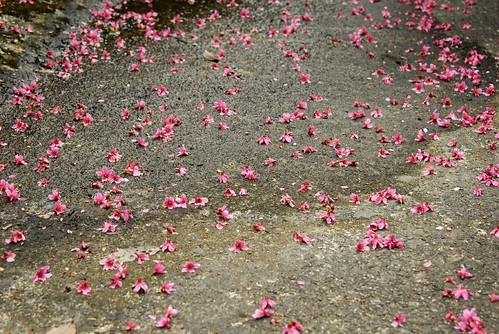  
  
哥哥好認真 揀了好多...   
(愛) 哥哥你還要揀多久阿 大家都在等你耶...  
  
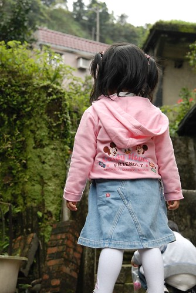  
  
等候一旁無聊的爸媽只好搞起小熊外拍  
青苔的台階 掉落的櫻花 ....哇 一整個的有feeling  
今天金瓜石遠足 出擊成功~~~  
  
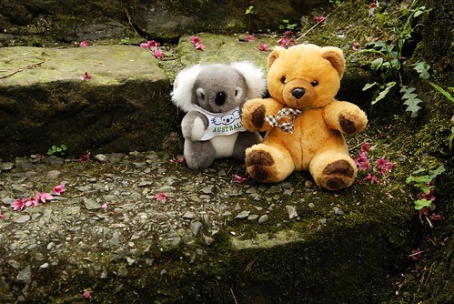
