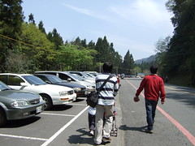
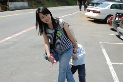
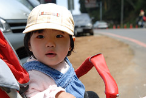
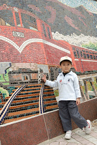
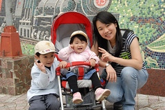
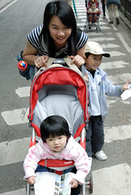
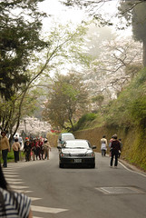
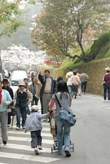
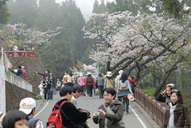

跟徹爸開始交往的那年八月   
趁著徹爸大學畢業準備當兵數蠻頭前 兩個人坐了小火車一起上阿里山  
那是兩人的第一次旅行  
也是媽媽第一次到徹爸家做客(交往不到半年就到人家家作客 想想臉皮還真厚哩)  
那次旅行 除了記得倆人在夫妻樹前 在鐵道旁的合影外  
其餘記億真的年代久遠已不可考(可見當時被新戀情的甜蜜沖昏頭啦)  
  
隔年媽媽因為工作開會的關係又上了一次阿里山  
這次是3月底吉野櫻正開的時候  
第一次深刻感受到阿里山的魅力 (難怪大陸人只知道台灣的日月潭跟阿里山)  
日後聽到阿里山便會想起那滿山頭的白色吉野櫻  
  
很想讓徹爸體會阿里山花海的魅力  
所以嚕...春暖花開...徹家賞花去嚕....  
  
徹爸輔以文字說明之照片集:  
[http://www.flickr.com/photos/hmchen0328/sets/72157600029906197/detail/](http://www.flickr.com/photos/hmchen0328/sets/72157600029906197/detail/)  
  
為了避免人潮刻意請了週五的假 還前一晚就回嘉義過夜好一大早就殺上阿里山  
可是人車還真的給他有點多多多...  
徹爸不死心的一直往入口開進 想要碰碰運氣找個近一點的停車位  
但最後還是得乖乖認命的往外開  停在大老遠的地方  
停好車後 感覺陽光很大很熱 於是只帶了小孩的薄外套預備(徹爸說帶小孩的就行了 大人不用啦)  
然後四口人開始走上坡路往阿里山入口前進...  
  
努力的往著看不到入口的入口前進 ( 沿路都停滿車 )  
  
  
陽光有夠大還擔心會把小愛給曬黑了    
所以媽媽真的不是逞勇穿短袖 誰知道吃過午餐後氣溫就遽降了  
    

  
9點半從嘉義阿公家出發 到達阿里山停好車11點半  
走路進到園區剛好12點整 (車子停的有夠遠吧) 越走越熱也越走越餓  
入園後找了家麵店填飽肚子後就正式開始我們的賞花健行  
賞花步道的路口就是招牌小火車壁磚畫(以前跟徹爸也有在這留影)  
阿徹最愛的"紅色"小火車 所以當然要擺個pose來一張   
舊地重遊真的覺得時光飛逝   
想我當年還青春洋溢正是即將盛開的花朵(人說女人25歲是最盛開的花朵)  
而如今卻已是生過兩個小孩的奶垂腰粗歐巴桑  
嗚~這就是所謂的青春不再嗎   
不過看著一雙活潑可愛的兒女 我想這犧牲應該還是值得的吧  
  
    
  
非假日的遊客有60%以上都是阿公阿嬤級的老人團  
要不然就是看起來像是自個當老闆的有錢人  
像我們這種一看就是翹班來玩的年輕人並不太多  
(連那些揹著攝影器材來照櫻花的也都是老人團)  
所以我們更該發揮我們年輕人的體力 衝衝衝阿~  
慢慢逼近著名賞花點  美麗的櫻花也漸漸映入眼簾  
  
    
  
阿里山賓館旁好幾株盛開的櫻花  
有株櫻花長很低可以讓臉被花團圍繞 所以一堆人等著排隊在樹下拍照  
徹爸問 "要不要來一張" 我說我不想頭頂開花 免了吧  
上到賓館前的廣場 徹爸又問要不要來張櫻花阿  
然後要我站到一個沒人理睬的台階上僑好角度 笑~   
完成今日賞花的招牌照  YA!   
  
  
