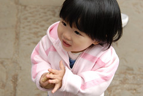

要寫新遊記了 才又想起這篇早已貼好照片等著加文字的阿里山遊記續篇  
其實不過就是賞花也沒啥好多寫的  
但念在徹爸照相很賣力 處理照片很辛苦  
所以還是得賣力的把這篇遊記完成  
  
阿徹沒有採花癖好 但是很愛拾花 也許小孩都這樣吧  
連櫻花那小小薄薄的花瓣也不放過  仔細小心拾起地上的一片片小花瓣  
小愛不愛花 倒是對小石頭很感興趣   
像阿徹小時候一樣  出去玩看到石頭就拼命撿  
那天兄妹倆在阿里山賓館前的賞花勝地就這麼自得其樂的拾花撿石  
  
  

雖然台灣的花海實在無法與日本相比  
但...小而美 小而挺嚕...  
  
    
  
  
  
最近照相小愛會用她的短手比出各式會遮住臉的"YA"  
雖然很賣力的在鏡頭前搔首弄姿  
但上相度真的大大不如阿徹哥哥   
難怪見到小愛本人的叔叔阿姨們都會有"本人比較嬌小可愛"之由衷感言  
  
    
  
ㄟ..小愛比YA也要看鏡頭啦  別太自得其樂了  
走了1-2小時路 喝喝水吃點方塊酥才有力氣繼續走  
  
    
  
阿里山賓館外的另一賞花重地 沼平車站  
派出所前果然花海如蔭 遊客如熾  
尤其這轉彎的鐵道旁 數以百計的鏡頭架好角度等著火車ㄅㄨㄅㄨㄅㄨ  
高山裡 白霧嬝嬝 雖然櫻花只有幾株 卻也構成一幅美麗的花景  
(難怪大家願意打老遠上山 還得把車停遠遠 走大段路入園)  
  
    
  
走了3個鐘頭 其實跟徹爸兩人早也腿痠  
更何況是阿徹 所以欽賜 "準"可以坐推車小憩一下  
雖然阿徹瘦巴巴 但是小推車要推16公斤也是挺吃力的  尤其在山裡小道上  
所以真的不得不誇讚一下這台小小紅 陪我們去過這麼多地方   
機動性強 輕薄短巧 堅固好推好坐 (愛玩的媽媽 強力推薦 不過只適合6個月大後寶寶 )      
  
火車ㄅㄨㄅㄨㄅㄨ 要來了 徹爸也花了數十分鐘去卡位拍照了  
無聊的母子三人只好在鐵道旁 吹泡泡 閒晃蕩  
放瓶泡泡在推車袋子裡 人到哪泡泡到哪 無聊就拿出吹吹打發時間     
    
  
  
  
一整個下午走下來 小愛最終還是不支睡著了  
買瓶多多犒賞阿徹  good guy 越來越能走了  
  
 
