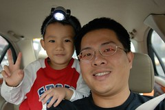

想了幾年的螢火蟲 總算也在今年看到了 (我童年記憶裡真的沒有成片螢火蟲的畫面)  
賞螢賞螢 當然要跑到原始的林場裡享受群蟲亂飛的震撼(是這樣預期的啦)  
所以選擇了南投的惠蓀林場  
惠蓀是中興大學的實驗林場  跟徹爸念大學時就去過幾趟  
雖然那時候只是班級旅遊 我跟徹爸也僅是點頭之交的學伴關係  
但倆人對惠蓀還是有種甜蜜卻青澀的回憶與嚮往  
  
賞螢應該算是惠蓀的年度大活動吧 一個月前的訂房率就頗高  
這麼多人選擇來此賞螢 更加深了我們的期待  
出發前一天 徹爸專程再買了兩隻手電筒 尤其是阿徹頭上的頭燈更是專為他而準備的  
阿徹在車上也戴 大白天也戴 路燈明亮時也戴 唯恐他的頭燈派不上用場似的  
而真的走在黑漆漆的賞營區時 頭燈過強的燈光卻又顯得不太適合  
只能好說歹說的請他關掉頭燈  循著路旁的小紅燈尋找享受四周飛舞的螢火蟲  
印象中從來沒有同時看過3隻以上的螢火蟲在身旁飛舞  
所以看到保護區的草叢裡 甚至步道邊偶而伸手可抓 難以計數的螢火蟲飛舞  
我內心的雀躍 感動應該不輸給阿徹吧  
真的與其說是我們帶阿徹去玩 不如說是我們假阿徹之名去實現滿足我們小時候未達成的夢想吧  
  
這次的旅行重點主題就是賞螢 但是所有照片中與這主題相關的照片就僅為下兩張  
頭燈以及完全照不起來的螢火蟲(黑摸摸一片的)  
不管徹爸怎麼努力嘗試就是拍不起來 所以只能把那一幕幕螢火蟲飛舞的景象烙印在自己的心上  
  
  

週六一早睡到自然醒(其實感冒中的小愛8點多就把大家嚕醒了)  
還帶了咳嗽加重的小愛先去看醫生 痰有點多但前天的發燒昨日已退 去曬曬太陽玩一玩應該就好了吧  
一家人10點多開開心心的從板橋出發往南投邁進嚕  
台北的陰霾天氣讓原本穿著兩件上衣的阿徹與小愛 在到達南投後脫的只剩一件內衣  
於是就這麼的 阿徹像是鄉間裡穿著白內衣的歐哩桑 快樂的享受屬於自己的遊樂

下了草屯交流道後 先去徹家出門在外的好朋友7-11報到   
尤其大熱天下 還是冰涼的御飯糰是午餐最佳的選擇  
愛吃御飯糰的阿徹快速的自己嗑完一個 而感冒胃口不佳的小愛則玩了幾口  
最近小7還有一樣東西徹家很愛 就是加了海洋深層鹽的海苔蘇打餅乾  
阿徹小愛吃飽飯後偶而來個幾片 肚子餓時更是塞嘴的好餅乾  
  
  
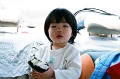    
  
2點多到達林場 checkin稍作休息 便到林場晃晃嚕  
原本跟徹爸還挑了個標示2.多公里 路平緩 來回2個鐘頭的步道要去享受森林浴  
但小愛看起來精神不佳 略顯焦躁不安   
所以還是走大馬路觀賞路旁森林就好 免得推車扛的太辛苦  
為了鼓舞阿徹帶勁點 於是把小3交給阿徹掌鏡  
小子認真的照起爸爸媽媽 自己的鞋子 天空 小花 道路  
  
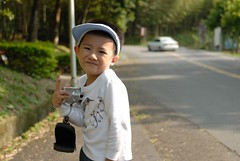    
  
看了上週也去惠蓀賞螢的玟姿 悠悠哉哉躺在吊床上望著天空的照片  
心裡癢了一個星期 總算...總算...我們也可以這樣幸福的躺在林間望著天空  
徹爸說如果沒有小孩需要照顧 就這樣躺著 望著群樹  那感覺真是無法形容的好...  
(大家該能體會我跟徹爸是多麼渴望小孩快快長大的)   
阿徹應該越來越能體會 享受這樣的樂趣  
但年紀尚小且感冒中的小愛就顯得好奇卻又害怕   
甚至由於個頭嬌小成為大家視線中的死角 不是不小心被哥哥撇到 就是被吊床搖撞到   
生病還這樣意外不斷 真的有點可憐...   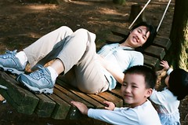  
  
  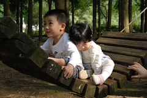  
  
  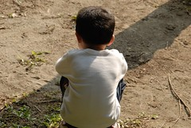  
  
阿徹最近照相越來越會擺POSE了 還會手插口袋裝瀟灑  
但笑起來的咪咪眼+魚尾紋 很憨 很有爸媽喜歡的鄉下味道  
  
 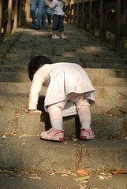  
  
為了賞螢 早早5點半就去餐廳吃晚餐 然後六點半集合等著志工解說帶隊賞螢  
由於遊客不少 為了分散人潮分了好幾小隊分地進行  
我們選擇了人最好的一隊 從路況不甚佳 蟲況也不多的區域開始  
由於路況實在太不佳 看了幾隻營火蟲後 阿徹便直嚷著"他看到了 要回家休息了" 搞的小孩哭 大人罵  
所幸後來脫隊 自行轉往別的賞螢地時  平緩路面加上數量頗豐的螢火蟲  
讓小子總算笑瞇瞇的追跑 勁抓螢火蟲的光影  
這趟賞螢行總算圓滿達成目標 沒有敗性而歸  
8點半賞完螢回到房間 9點便早早安頓阿徹小愛睡覺嚕  
  
賞螢過程中 一直安靜無力坐在推車上的小愛 體溫慢慢攀升到38度多  
半夜還高燒起來嚕了兩個多小時  
可憐的愛 生病沒能好好在家休息 還得這樣上山下海 難怪你要這樣逞罰你媽  
就這樣從這個晚上起的三天三夜 小愛來來回回的燒燒退退 後兩晚還燒到高達40度  
雖然知道發燒是不會燒壞腦子的 但還是會擔心燒笨了(怕病毒入侵腦部)   
第二天早上 雖然小愛體溫仍高但還算配合的繼續大家的行程  
而同時阿徹哥哥則是玩番了 (笑的多開心阿)  
玩飛盤 吹泡泡 吃冰淇淋 玩水  
龍心大悅的直呼"來森林走走蠻好的" "森林裏好好玩 以後要再來"  
爸爸媽媽說的沒錯吧...森林裡很好玩的吧....  
  
 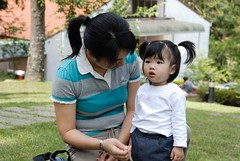  
  
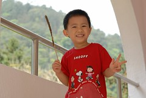  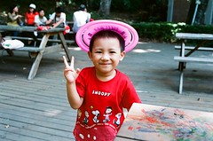  
  
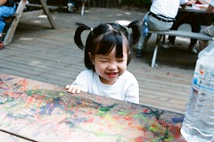  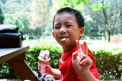  
  
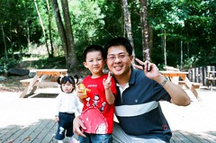 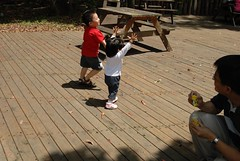  
  
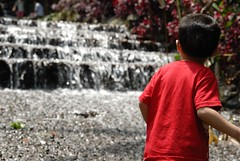 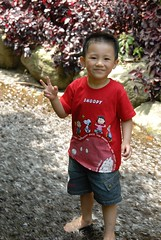    
  
11點多下山後 便驅車直奔嘉義阿公阿嬤家 該讓小愛好好回去休息休息了  
中途只在南投休息站簡單解決中餐  
我帶阿徹去買東西時 徹爸拿出相機拍著還算愉悅平靜的小愛  
突然間一隻蒼蠅停在小愛的右手背上 小愛望了幾秒鐘 然後哇的哭了出來  
徹爸就這麼寫實的記錄下這血淋淋的過程  
  
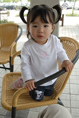  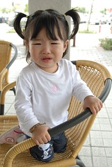  
  
所以媽媽買完東西回來 一臉訝異的看到小愛像無尾熊般的賴在爸爸身上  
只好搬出飲料 誘惑小女子   
徹爸說 媽媽好像對小愛比較好 以前管阿徹喝飲料管的嚴 現在好像啥都給小愛喝  
ㄟ...好像是這樣喔 不過小愛也比較不挑阿 不像哥哥現在要他喝汽水還不敢喝哩  
  
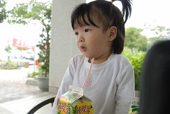 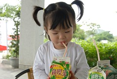  
  
林場裡看到顏色翠綠的蚱蜢 長的有點奇怪的蜜蜂  用葉子包裹起來的\*\*蟲  
放慢腳步 仔細找 用心看 大自然絕對是最好 最豐富的教室  
  
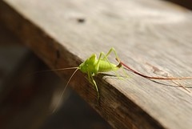 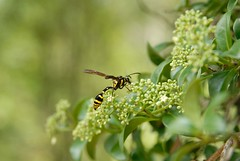  
  
 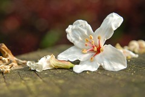
